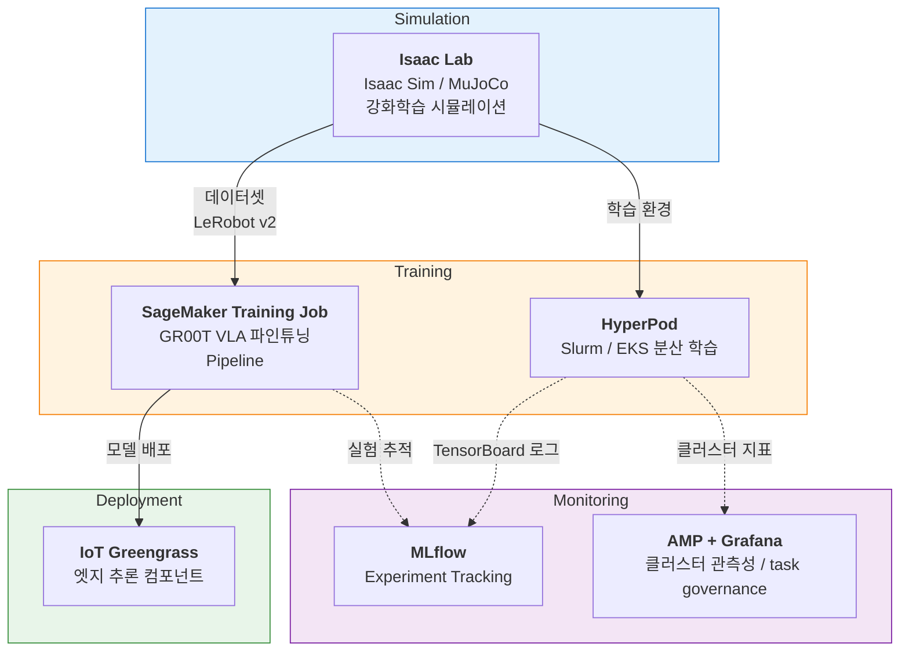

# AWS Physical AI Recipes

AWS 인프라를 활용한 Physical AI 워크로드(시뮬레이션, 학습, 배포)를 위한 실전 레시피 모음입니다.

로봇 시뮬레이션 환경 구축부터 VLA(Vision-Language-Action) 모델 파인튜닝, 엣지 추론 배포, 분산 학습 모니터링까지 — Physical AI 파이프라인의 각 단계를 AWS 서비스 위에서 실행하기 위한 가이드와 코드를 제공합니다.

> 이 문서는 [README.md](README.md)(영문)의 한국어 번역본입니다. 상세 원문은 영문 README를 기준으로 삼으세요.

## Recipes

| Category | Recipe | 설명 | 주요 AWS 서비스 | 상태 |
|----------|--------|------|-----------------|------|
| End-to-End Workshop | [e2e-workshop](./e2e-workshop/) | Isaac Lab 시뮬레이션 + GR00T 파인튜닝 + 추론 + Greengrass 엣지 배포 통합 워크숍 | EC2 (GPU), CDK, SageMaker, CodeBuild, ECR, IoT Greengrass | Available |
| Distributed Training | [hyperpod-training](./hyperpod-training/) | SageMaker HyperPod 기반 VLA/RL 분산 학습 인프라 — Slurm 경로(FSx, MLflow) 또는 EKS 경로(observability 애드온 + task governance) | SageMaker HyperPod, EKS, FSx for Lustre, S3, AMP, AMG | Available |
| Tools | [tools](./tools/) | 로컬 → EC2 SSH 접속, EC2 개발 환경 설정 (Bedrock, Claude Code, 플러그인/MCP) | EC2, Bedrock | Available |
| Docs | [docs](./docs/) | 워크숍 실행 전 서비스 쿼터 요청 가이드 및 자동화 스크립트 | Service Quotas | Available |

> NVIDIA OSMO 레시피(`osmo/`, `osmov2/`)는 `main` 브랜치에 있습니다. 이 브랜치(`feat/e2e-workshop`)에는 워크숍에 필요한 디렉터리만 남겨 두었습니다.

## Repository Structure

```
aws-physical-ai-recipes/
│
├── e2e-workshop/                      # End-to-End 워크숍 (시뮬레이션 → 학습 → 추론 → 엣지)
│   ├── infra/                         #   CDK 인프라 (배포 단위)
│   │   ├── isaaclab/                  #     GPU/CPU 워크스테이션 원클릭 배포 (DCV, code-server, AZ 자동 탐색, FSx 옵션)
│   │   └── groot/                     #     GR00T VLA fine-tuning (CodeBuild + ECR + SageMaker Studio + MLflow)
│   ├── groot/                         #   GR00T 학습/추론 워크스페이스 (uv 기반)
│   │   ├── notebooks/                 #     01 인프라 확인 · 02 SageMaker Pipeline · 03 closed-loop 평가
│   │   ├── pipeline/                  #     Pipeline 정의(build_pipeline.py) + SmokeEval
│   │   ├── training/                  #     학습 컨테이너 정의, 데이터 준비, 실행 스크립트
│   │   └── inference/                 #     Isaac Sim 연동 추론 실행 스크립트
│   ├── edge/                          #   AWS IoT Greengrass 엣지 배포
│   │   └── workshop-components/       #     GR00T 추론 컴포넌트 recipe (N1.6)
│   └── assets/                        #   README/가이드용 스크린샷
│
├── hyperpod-training/                 # SageMaker HyperPod 분산 학습 인프라
│   ├── infra/                         #   CDK 스택 (Slurm: HyperPod-<acct> / EKS: HyperPodEks-<acct>, -c orchestrator=eks)
│   ├── lifecycle-scripts/             #   클러스터 lifecycle (FSx, SLURM, SSH, DCV / EKS: on_create_eks.sh)
│   ├── slurm-templates/               #   SLURM job 템플릿 (RL, VLA, debug)
│   ├── k8s-templates/                 #   EKS Job 템플릿 (Isaac Lab GPU, MuJoCo CPU, FSx PVC, task governance 정책)
│   ├── eks/                           #   vendored HyperPodHelmChart, Grafana 대시보드
│   ├── isaac-lab-workshop/            #   SO-101 RL 태스크 패키지 (reach / lift, RSL-RL PPO)
│   ├── mujoco-workshop/               #   MuJoCo CPU RL 패키지 (GPU 쿼터 없는 계정용)
│   ├── examples/                      #   VLA/RL/MLflow 예시 코드
│   ├── mlflow/                        #   MLflow 트래킹 셋업 및 사용 예시
│   ├── configs/                       #   로봇 modality 설정 (so101)
│   ├── cluster-config/                #   클러스터/프로비저닝 JSON, 수동 셋업 절차
│   ├── scripts/                       #   환경 셋업 · 클러스터 스케일 · EKS 헬퍼 스크립트
│   ├── container/                     #   학습 컨테이너 정의
│   └── docs/                          #   아키텍처 / 워크숍 / 리서처 가이드
│
├── tools/                             # 개발 환경 설정
│   ├── ssh-client-setup/              #   로컬 → EC2 SSH 키·config 설정 (.sh / .ps1)
│   └── claude-code-setup/             #   Claude Code + Bedrock 환경변수, 플러그인/MCP 설치
│
└── docs/                              # 워크숍 준비 문서
    ├── request-quota.md               #   개인 계정 쿼터 요청 절차
    ├── request-quota-team.md          #   팀/이벤트 계정 쿼터 요청 절차
    └── scripts/quota-drip.sh          #   쿼터 요청 분할 제출 스크립트
```

## Architecture Overview



## Recipe Details

### End-to-End Workshop

Isaac Lab 시뮬레이션 환경 구축부터 GR00T VLA 모델 파인튜닝, 추론 검증, Greengrass 엣지 배포까지 전체 파이프라인을 한 워크스페이스에서 실습합니다.

Workshop Studio 이벤트 계정에서는 `-c profile=workshop-studio`(또는 프로비저너 `DeploymentProfile=workshop-studio`)로 배포합니다 — 자세한 내용은 `e2e-workshop/README.md`.

| 구성 요소 | 설명 |
|-----------|------|
| [infra/isaaclab](./e2e-workshop/infra/isaaclab/) | 워크스테이션 원클릭 CDK 배포 (DCV + code-server, AZ 자동 탐색, FSx 옵션) |
| [infra/groot](./e2e-workshop/infra/groot/) | SageMaker GR00T fine-tuning CDK 프로젝트 (ECR, CodeBuild, Studio, MLflow) |
| [groot](./e2e-workshop/groot/) | GR00T-N1.6-3B 학습 + SageMaker Pipeline (노트북 01/02/03) |
| [groot/inference](./e2e-workshop/groot/inference/) | Isaac Sim 연동 추론 서버 실행 스크립트 |
| [edge/workshop-components](./e2e-workshop/edge/workshop-components/) | GR00T 추론 서버 Greengrass 컴포넌트 recipe |

### Distributed Training (HyperPod)

SageMaker HyperPod 기반 VLA/RL 분산 학습 인프라입니다. Slurm 경로는 FSx for Lustre 스토리지와 MLflow 트래킹을 결합하고, EKS 경로는 observability 애드온과 Kueue task governance를 추가합니다.

- **Slurm 클러스터**: head (ml.m5.xlarge) + GPU 그룹 (gpu-g5-8x, ml.g5.8xlarge) + CPU 그룹 (cpu-c5-4x, MuJoCo) + debug (ml.g5.8xlarge, DCV 시각화). `-c gpuGroups=extended`로 g5-12x/g6e/g6/p4d/p5 그룹 추가
- **EKS 클러스터**: `-c orchestrator=eks`. 상시 시스템 노드 (cpu-c5-4x) + GPU 그룹, AMP/Grafana 관측성, Kueue task governance
- **스토리지**: FSx for Lustre (기본 1.2TiB) ↔ S3 자동 동기화(DRA)
- **트래킹**: SageMaker Managed MLflow, TensorBoard
- **비용**: 학습 그룹은 노드 0으로 생성되며 `scripts/scale-cluster.sh`로 필요할 때만 기동

```bash
cd hyperpod-training/
cat README.md
```

### Tools / 개발 환경

로컬에서 EC2 워크스테이션에 접속하고, 그 위에 Claude Code + Bedrock 개발 환경을 구성하는 스크립트 모음입니다.

```bash
cd tools/ssh-client-setup/
bash setup-ssh-client.sh <PUBLIC_IP>      # 로컬 → EC2 SSH 설정 (macOS/Linux)
# Windows 사용자는 setup-ssh-client.ps1 사용

cd ../claude-code-setup/
bash 00-install-claude-codex.sh           # Claude Code / Codex 설치
bash 01-setup-bedrock-env.sh              # Bedrock 환경변수 설정
bash 02-setup-plugins-and-mcp.sh          # 플러그인 + MCP 서버 설치
```

### Docs / 쿼터 준비

워크숍을 실행하기 전에 필요한 EC2 G 인스턴스와 SageMaker 쿼터를 요청하는 절차입니다. 개인 계정과 팀/이벤트 계정 절차가 나뉘어 있습니다.

```bash
cd docs/
cat request-quota.md          # 개인 계정
cat request-quota-team.md     # 팀 / 이벤트 계정
```

## Prerequisites

- AWS CLI v2+ (적절한 IAM 권한으로 구성)
- Python 3.10+
- Git, Git LFS
- Node.js 18+ (CDK 프로젝트 사용 시)
- kubectl, Helm (HyperPod EKS 경로 사용 시)

## License

See [LICENSE](./LICENSE).
