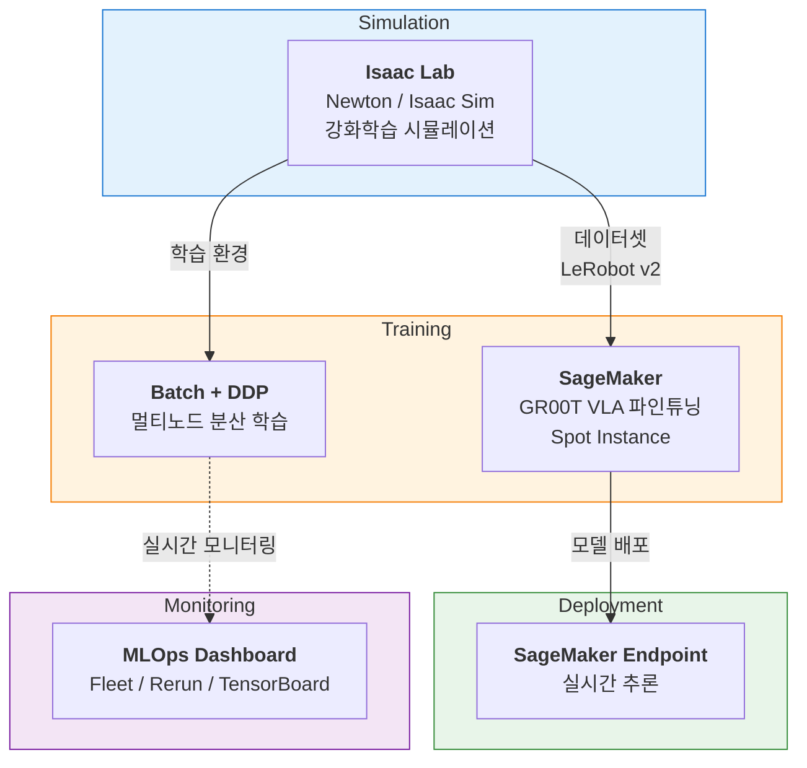

# AWS Physical AI Recipes

AWS 인프라를 활용한 Physical AI 워크로드(시뮬레이션, 학습, 배포)를 위한 실전 레시피 모음입니다.

로봇 시뮬레이션 환경 구축부터 VLA(Vision-Language-Action) 모델 파인튜닝, 실시간 추론 엔드포인트 배포, 분산 학습 모니터링까지 — Physical AI 파이프라인의 각 단계를 AWS 서비스 위에서 실행하기 위한 가이드와 코드를 제공합니다.

## Recipes

| Category | Recipe | 설명 | 주요 AWS 서비스 | 상태 |
|----------|--------|------|-----------------|------|
| Training | [groot-sagemaker](./training/groot-sagemaker/) | GR00T-N1.6-3B VLA 모델 SageMaker 파인튜닝 및 실시간 추론 배포 | SageMaker, ECR, CodeBuild, S3 | Available |
| Simulation | [isaac-lab-workshop](./isaac-lab-workshop/) | Isaac Lab 시뮬레이션 환경 구축, 멀티유저 인프라, 학습 모니터링 | EC2 (GPU), CDK, Batch, EFS | Available |
| Simulation | [workshop-groot-so101](./simulation/workshop-groot-so101/) | GR00T + SO-ARM 101 핸즈온 워크숍 (RL 학습 → 시연 수집 → VLA 파인튜닝) | EC2 (GPU) | Available |
| Tools | [ec2-vscode](./tools/ec2-vscode/) | CloudFront HTTPS 기반 EC2 VSCode Server (Claude Code 포함) | EC2, CloudFront, CloudFormation | Available |

## Repository Structure

```
aws-physical-ai-recipes/
│
├── training/                          # 모델 학습 & 배포 레시피
│   └── groot-sagemaker/               #   GR00T-N1.6-3B VLA 파인튜닝 (SageMaker)
│       ├── infra/                     #     CloudFormation 인프라 (S3, IAM, ECR, CodeBuild)
│       ├── container/                 #     학습/추론 Docker 컨테이너
│       ├── data/                      #     모델 다운로드, 데이터셋 업로드
│       ├── pipeline/                  #     SageMaker Pipeline (학습 + 모델 등록)
│       ├── scripts/                   #     빌드, 학습, 배포, 추론 스크립트
│       └── config.yaml                #     중앙 설정 파일
│
├── isaac-lab-workshop/                # Isaac Lab 시뮬레이션 환경 레시피
│   ├── newton-setup/                  #   Newton 물리엔진 수동 셋업 (가이드 + 스크립트)
│   ├── infra-multiuser-groot/         #   멀티유저 GPU 환경 CDK 프로젝트
│   ├── exp/mlops-dashboard/           #   분산 학습 모니터링 대시보드 (Next.js)
│   └── assets/                        #   시각화 스크린샷
│
├── simulation/                        # 시뮬레이션 워크숍
│   └── workshop-groot-so101/          #   GR00T + SO-ARM 101 핸즈온 워크숍
│
└── tools/                             # 개발 도구
    └── ec2-vscode/                    #   EC2 기반 VSCode Server 배포
        ├── cloudformation.yaml        #     CloudFront + EC2 인프라
        └── deploy.sh                  #     대화형 배포 스크립트
```

## Architecture Overview



## Recipe Details

### Training / GR00T SageMaker

NVIDIA GR00T-N1.6-3B VLA 모델을 SageMaker에서 파인튜닝하고 실시간 추론 엔드포인트로 배포하는 end-to-end 파이프라인입니다.

- **모델**: [GR00T-N1.6-3B](https://huggingface.co/nvidia/GR00T-N1.6-3B) — RGB + 자연어 + 고유수용감각 → 로봇 액션
- **데이터**: LeRobot v2 형식 (ALOHA, Spot 등 다양한 로봇 데이터셋 지원)
- **인프라**: CloudFormation 원클릭 배포 (S3, IAM, ECR, CodeBuild, SSM)
- **학습**: SageMaker Pipeline + Spot Instance (최대 90% 비용 절감)
- **배포**: SageMaker Endpoint (Model Registry 승인 → 배포)

```bash
cd training/groot-sagemaker/
cat README.md
```

### Simulation / Isaac Lab Workshop

NVIDIA Isaac Lab 시뮬레이션 환경 구축, 멀티유저 GPU 인프라 배포, 분산 학습 모니터링을 위한 통합 워크스페이스입니다. 두 가지 접근 방식을 제공합니다:

- **CDK 인프라 배포** — 멀티유저 워크숍/데모용. DCV 원격 데스크탑 + Batch 분산 학습
- **수동 셋업** — 기존 GPU 인스턴스에서 Newton 물리엔진으로 직접 학습

| 구성 요소 | 설명 |
|-----------|------|
| [Isaac Lab Workshop README](./isaac-lab-workshop/) | 전체 개요 및 접근 방식 비교 |
| [Newton Setup Guide](./isaac-lab-workshop/newton-setup/) | Newton 물리엔진 수동 셋업 가이드 |
| [Infra CDK](./isaac-lab-workshop/infra-multiuser-groot/) | 멀티유저 GPU 환경 원클릭 CDK 배포 (AZ 자동 탐색, DCV, Batch) |
| [MLOps Dashboard](./isaac-lab-workshop/exp/mlops-dashboard/) | RL 학습 Fleet 모니터링 대시보드 (Rerun + TensorBoard) |
| [Workshop GR00T SO101](./simulation/workshop-groot-so101/) | GR00T + SO-ARM 101 핸즈온 워크숍 |

### Tools / EC2 VSCode Server

CloudFront HTTPS를 통해 브라우저에서 접속하는 EC2 기반 개발 환경입니다. Claude Code CLI/Extension, Docker, Node.js, Python이 사전 설치됩니다.

```bash
cd tools/ec2-vscode/
bash deploy.sh
```

## Prerequisites

- AWS CLI v2+ (configured with appropriate IAM permissions)
- Python 3.10+
- Git, Git LFS
- Node.js 18+ (CDK 프로젝트 사용 시)

## License

See [LICENSE](./LICENSE).
