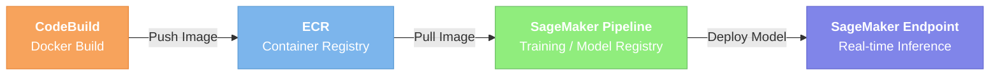

# SageMaker VLA

AWS SageMaker를 활용한 Vision-Language-Action (VLA) 모델 파인튜닝 및 배포 레시피 모음입니다.

VLA 모델은 카메라 이미지와 자연어 명령을 입력받아 로봇 제어 액션을 출력하는 멀티모달 모델로, 로봇 조작(manipulation) 태스크에 활용됩니다. 이 레포지토리는 다양한 VLA 모델을 SageMaker 인프라 위에서 학습하고 서빙하기 위한 실전 가이드와 코드를 제공합니다.

## Recipes

| Recipe | 모델 | SageMaker 리소스 | 상태 |
|--------|------|------------------|------|
| [groot-sm-training](./groot-sm-training/) | [NVIDIA GR00T-N1.6-3B](https://huggingface.co/nvidia/GR00T-N1.6-3B) | Training Job, Pipeline, Endpoint | Available |

### Planned

- **OpenPI** — OpenPI 모델의 SageMaker 파인튜닝 및 배포
- **HyperPod** — SageMaker HyperPod를 활용한 대규모 VLA 학습

## Architecture Overview

각 레시피는 독립적인 디렉토리로 구성되며, 공통적으로 다음과 같은 구조를 따릅니다.

```
<recipe>/
├── infra/          # CloudFormation 등 AWS 인프라 정의
├── container/      # 학습/추론 Docker 컨테이너
├── data/           # 모델 다운로드, 데이터셋 업로드 도구
├── pipeline/       # SageMaker Pipeline 정의
├── scripts/        # 빌드, 학습, 배포, 추론 스크립트
└── config.yaml     # 중앙 설정 파일
```



## Getting Started

각 레시피 디렉토리의 README를 참고하세요.

```bash
# 예: GR00T-N1.6 레시피
cd groot-sm-training/
cat README.md
```

## Prerequisites

- AWS CLI v2+ (configured with appropriate IAM permissions)
- Python 3.10+
- Git, Git LFS

## License

See [LICENSE](./LICENSE).
