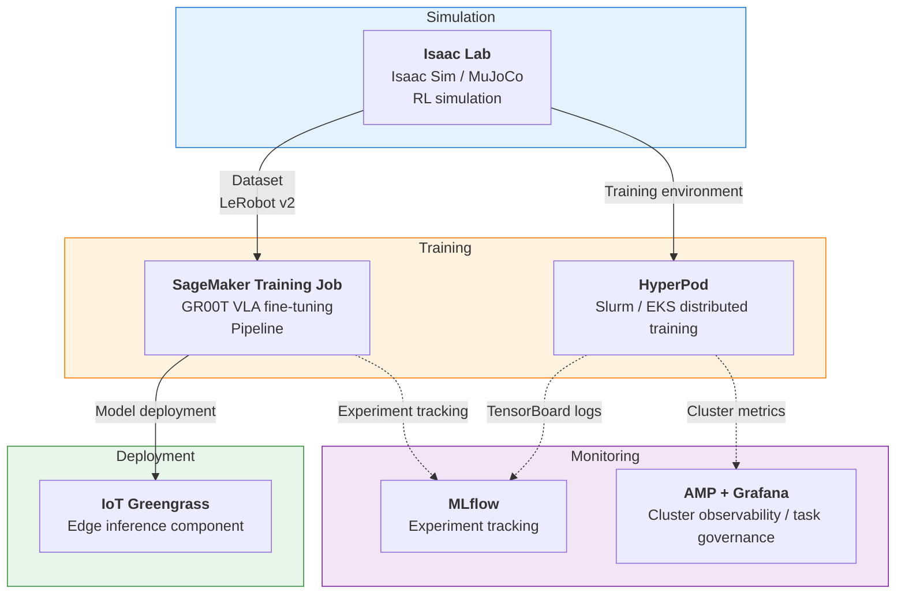

# AWS Physical AI Recipes

Practical recipes for running Physical AI workloads — simulation, training, and deployment — on AWS infrastructure.

From standing up a robot simulation environment to fine-tuning a Vision-Language-Action (VLA) model, deploying inference to the edge, and monitoring distributed training, this repository provides the guides and code to run each stage of a Physical AI pipeline on AWS services.

> 한국어 문서: [README.ko.md](README.ko.md)

## Recipes

| Category | Recipe | Description | Key AWS Services | Status |
|----------|--------|-------------|------------------|--------|
| End-to-End Workshop | [e2e-workshop](./e2e-workshop/) | Combined workshop: Isaac Lab simulation, GR00T fine-tuning, inference, and Greengrass edge deployment | EC2 (GPU), CDK, SageMaker, CodeBuild, ECR, IoT Greengrass | Available |
| Distributed Training | [hyperpod-training](./hyperpod-training/) | VLA/RL distributed training on SageMaker HyperPod — Slurm path (FSx, MLflow) or EKS path (observability add-ons + task governance) | SageMaker HyperPod, EKS, FSx for Lustre, S3, AMP, AMG | Available |
| Tools | [tools](./tools/) | SSH access from your laptop to EC2, plus development environment setup (Bedrock, Claude Code, plugins/MCP) | EC2, Bedrock | Available |
| Docs | [docs](./docs/) | Service quota request guides and automation to run before the workshop | Service Quotas | Available |

> The NVIDIA OSMO recipes (`osmo/`, `osmov2/`) live on the `main` branch. This branch (`feat/e2e-workshop`) keeps only the directories the workshop needs.

## Repository Structure

```
aws-physical-ai-recipes/
│
├── e2e-workshop/                      # End-to-end workshop (simulation → training → inference → edge)
│   ├── infra/                         #   CDK infrastructure (deployment units)
│   │   ├── isaaclab/                  #     One-click GPU/CPU workstation (DCV, code-server, AZ auto-selection, optional FSx)
│   │   └── groot/                     #     GR00T VLA fine-tuning (CodeBuild + ECR + SageMaker Studio + MLflow)
│   ├── groot/                         #   GR00T training/inference workspace (uv-based)
│   │   ├── notebooks/                 #     01 infra check · 02 SageMaker Pipeline · 03 closed-loop evaluation
│   │   ├── pipeline/                  #     Pipeline definition (build_pipeline.py) + SmokeEval
│   │   ├── training/                  #     Training container definition, data preparation, run scripts
│   │   └── inference/                 #     Inference server launcher wired to Isaac Sim
│   ├── edge/                          #   AWS IoT Greengrass edge deployment
│   │   └── workshop-components/       #     GR00T inference component recipes (N1.6)
│   └── assets/                        #   Screenshots for the README and guide
│
├── hyperpod-training/                 # SageMaker HyperPod distributed training infrastructure
│   ├── infra/                         #   CDK stacks (Slurm: HyperPod-<acct> / EKS: HyperPodEks-<acct>, -c orchestrator=eks)
│   ├── lifecycle-scripts/             #   Cluster lifecycle (FSx, SLURM, SSH, DCV / EKS: on_create_eks.sh)
│   ├── slurm-templates/               #   SLURM job templates (RL, VLA, debug)
│   ├── k8s-templates/                 #   EKS Job templates (Isaac Lab GPU, MuJoCo CPU, FSx PVC, task governance policies)
│   ├── eks/                           #   Vendored HyperPodHelmChart, Grafana dashboards
│   ├── isaac-lab-workshop/            #   SO-101 RL task package (reach / lift, RSL-RL PPO)
│   ├── mujoco-workshop/               #   MuJoCo CPU RL package (for accounts without GPU quota)
│   ├── examples/                      #   VLA/RL/MLflow example code
│   ├── mlflow/                        #   MLflow tracking setup and usage examples
│   ├── configs/                       #   Robot modality configuration (so101)
│   ├── cluster-config/                #   Cluster/provisioning JSON, manual setup steps
│   ├── scripts/                       #   Environment setup, cluster scaling, EKS helpers
│   ├── container/                     #   Training container definitions
│   └── docs/                          #   Architecture / workshop / researcher guides
│
├── tools/                             # Development environment setup
│   ├── ssh-client-setup/              #   SSH key and config setup for laptop → EC2 (.sh / .ps1)
│   └── claude-code-setup/             #   Claude Code + Bedrock env vars, plugin/MCP install
│
└── docs/                              # Workshop preparation
    ├── request-quota.md               #   Quota requests for a personal account
    ├── request-quota-team.md          #   Quota requests for a team/event account
    └── scripts/quota-drip.sh          #   Submit quota requests in batches
```

## Architecture Overview


```mermaid
graph TB
    subgraph SIM ["Simulation"]
        A["<b>Isaac Lab</b><br/>Isaac Sim / MuJoCo<br/>RL simulation"]
    end

    subgraph TRAIN ["Training"]
        B["<b>SageMaker Training Job</b><br/>GR00T VLA fine-tuning<br/>Pipeline"]
        C["<b>HyperPod</b><br/>Slurm / EKS distributed training"]
    end

    subgraph DEPLOY ["Deployment"]
        D["<b>IoT Greengrass</b><br/>Edge inference component"]
    end

    subgraph MONITOR ["Monitoring"]
        E["<b>MLflow</b><br/>Experiment tracking"]
        F["<b>AMP + Grafana</b><br/>Cluster observability / task governance"]
    end

    A -->|"Dataset<br/>LeRobot v2"| B
    A -->|"Training environment"| C
    B -->|"Model deployment"| D
    B -.->|"Experiment tracking"| E
    C -.->|"TensorBoard logs"| E
    C -.->|"Cluster metrics"| F

    style SIM fill:#e3f2fd,stroke:#1976d2,color:#333
    style TRAIN fill:#fff3e0,stroke:#f57c00,color:#333
    style DEPLOY fill:#e8f5e9,stroke:#388e3c,color:#333
    style MONITOR fill:#f3e5f5,stroke:#7b1fa2,color:#333
```

## Recipe Details

### End-to-End Workshop

Work through the whole pipeline in a single workspace: stand up the Isaac Lab simulation environment, fine-tune the GR00T VLA model, verify inference, and deploy to the edge with Greengrass.

In a Workshop Studio event account, deploy with `-c profile=workshop-studio` (or `DeploymentProfile=workshop-studio` on the provisioner) — see `e2e-workshop/README.md` for details.

| Component | Description |
|-----------|-------------|
| [infra/isaaclab](./e2e-workshop/infra/isaaclab/) | One-click CDK workstation deployment (DCV + code-server, AZ auto-selection, optional FSx) |
| [infra/groot](./e2e-workshop/infra/groot/) | SageMaker GR00T fine-tuning CDK project (ECR, CodeBuild, Studio, MLflow) |
| [groot](./e2e-workshop/groot/) | GR00T-N1.6-3B training + SageMaker Pipeline (notebooks 01/02/03) |
| [groot/inference](./e2e-workshop/groot/inference/) | Inference server launcher wired to Isaac Sim |
| [edge/workshop-components](./e2e-workshop/edge/workshop-components/) | Greengrass component recipes for the GR00T inference server |

### Distributed Training (HyperPod)

VLA/RL distributed training infrastructure on SageMaker HyperPod. The Slurm path pairs FSx for Lustre storage with MLflow tracking; the EKS path adds observability add-ons and Kueue task governance.

- **Slurm cluster**: head (ml.m5.xlarge) + GPU group (gpu-g5-8x, ml.g5.8xlarge) + CPU group (cpu-c5-4x, MuJoCo) + debug (ml.g5.8xlarge, DCV visualization). Add g5-12x/g6e/g6/p4d/p5 groups with `-c gpuGroups=extended`
- **EKS cluster**: `-c orchestrator=eks`. Always-on system node (cpu-c5-4x) + GPU groups, AMP/Grafana observability, Kueue task governance
- **Storage**: FSx for Lustre (1.2 TiB by default) with automatic S3 sync (DRA)
- **Tracking**: SageMaker Managed MLflow, TensorBoard
- **Cost**: training groups are created with zero nodes; bring them up only when needed with `scripts/scale-cluster.sh`

```bash
cd hyperpod-training/
cat README.md
```

### Tools / Development Environment

Scripts to reach the EC2 workstation from your laptop and set up a Claude Code + Bedrock development environment on it.

```bash
cd tools/ssh-client-setup/
bash setup-ssh-client.sh <PUBLIC_IP>      # laptop → EC2 SSH setup (macOS/Linux)
# On Windows, use setup-ssh-client.ps1

cd ../claude-code-setup/
bash 00-install-claude-codex.sh           # Install Claude Code / Codex
bash 01-setup-bedrock-env.sh              # Configure Bedrock environment variables
bash 02-setup-plugins-and-mcp.sh          # Install plugins + MCP servers
```

### Docs / Quota Preparation

How to request the EC2 G-instance and SageMaker quotas the workshop needs. Personal accounts and team/event accounts follow different procedures.

```bash
cd docs/
cat request-quota.md          # Personal account
cat request-quota-team.md     # Team / event account
```

## Prerequisites

- AWS CLI v2+ (configured with appropriate IAM permissions)
- Python 3.10+
- Git, Git LFS
- Node.js 18+ (for the CDK projects)
- kubectl, Helm (for the HyperPod EKS path)

## License

See [LICENSE](./LICENSE).
