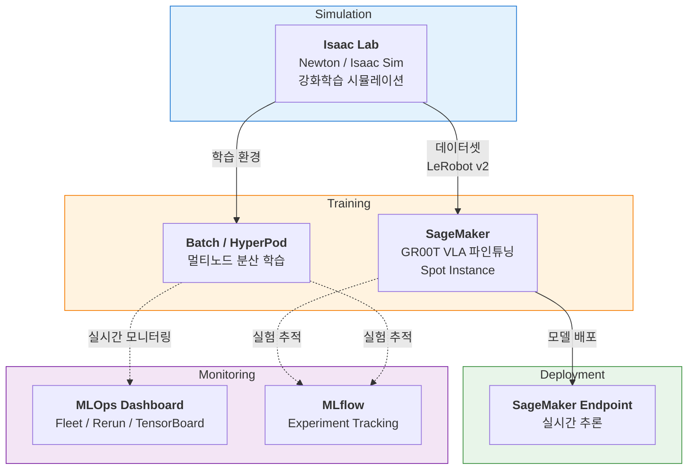

# AWS Physical AI Recipes

AWS 인프라를 활용한 Physical AI 워크로드(시뮬레이션, 학습, 배포)를 위한 실전 레시피 모음입니다.

로봇 시뮬레이션 환경 구축부터 VLA(Vision-Language-Action) 모델 파인튜닝, 실시간 추론 엔드포인트 배포, 분산 학습 모니터링까지 — Physical AI 파이프라인의 각 단계를 AWS 서비스 위에서 실행하기 위한 가이드와 코드를 제공합니다.

## Recipes

| Category | Recipe | 설명 | 주요 AWS 서비스 | 상태 |
|----------|--------|------|-----------------|------|
| End-to-End Workshop | [e2e-workshop](./e2e-workshop/) | Isaac Lab 시뮬레이션 + GR00T 파인튜닝 + 추론 + 모니터링 통합 워크숍 | EC2 (GPU), CDK, Batch, SageMaker, EFS | Available |
| Distributed Training | [hyperpod-training](./hyperpod-training/) | SageMaker HyperPod 기반 VLA/RL 분산 학습 인프라 (SLURM, FSx, MLflow) | SageMaker HyperPod, FSx for Lustre, S3 | Available |
| Orchestration | [osmo](./osmo/) | NVIDIA OSMO on EKS — CDK 기반 초기 레시피 | EKS, RDS, ElastiCache, S3 | Available |
| Orchestration | [osmov2](./osmov2/) | NVIDIA OSMO on EKS 레퍼런스 아키텍처 — Terraform + Karpenter GPU, 버전 pin, 검증된 워크플로 모음 | EKS, RDS, ElastiCache, S3, ECR, KMS, Cognito, AMP/AMG | Available |
| Tools | [tools](./tools/) | EC2 개발 환경 설정 (SSH, Bedrock, Claude Code, 플러그인) | EC2, CloudFront, CloudFormation | Available |

## Repository Structure

```
aws-physical-ai-recipes/
│
├── e2e-workshop/                      # End-to-End 워크숍 (시뮬레이션 → 학습 → 추론)
│   ├── infra/                         #   CDK 인프라 (배포 단위)
│   │   ├── isaaclab/                  #     멀티유저 GPU 환경 원클릭 배포 (DCV, EFS, Batch)
│   │   └── groot-finetune/            #     GR00T VLA fine-tuning (Batch + SageMaker 통합)
│   ├── apps/                          #   사용자가 실행하는 애플리케이션
│   │   └── mlops-dashboard/           #     RL 학습 Fleet 모니터링 대시보드 (Next.js)
│   ├── scripts/                       #   셋업/검증 스크립트
│   │   └── groot-inference/           #     GR00T N1 추론 서버 테스트 클라이언트 (ZMQ)
│   └── training/                      #   학습 레시피
│       └── groot-sagemaker/           #     GR00T-N1.6-3B SageMaker 파인튜닝 파이프라인
│
├── hyperpod-training/                 # SageMaker HyperPod 분산 학습 인프라
│   ├── infra/                         #   CDK 스택 (Networking, Storage, HyperPod, MLflow)
│   ├── lifecycle-scripts/             #   클러스터 lifecycle (FSx, SLURM, SSH, DCV)
│   ├── slurm-templates/               #   SLURM job 템플릿 (RL, VLA, debug)
│   ├── examples/                      #   VLA/RL/MLflow 예시 코드
│   ├── scripts/                       #   환경 셋업 스크립트
│   └── container/                     #   학습 컨테이너 정의
│
├── osmo/                              # NVIDIA OSMO on EKS (CDK 기반 초기 레시피)
│   ├── cdk/                           #   EKS + 인프라 CDK 프로젝트
│   ├── workflows/                     #   OSMO workflow YAML 예시
│   └── docs/                          #   설계 / 워크숍 가이드
│
├── osmov2/                            # NVIDIA OSMO 레퍼런스 아키텍처 (Terraform)
│   ├── infra/                         #   Terraform 루트 (배포 단위)
│   │   ├── core/                      #     EKS + RDS + ElastiCache + S3 + Karpenter GPU
│   │   ├── ingress/                   #     OSMO UI HTTPS 관리 ingress (옵션)
│   │   ├── cognito/                   #     Cognito SSO (옵션)
│   │   ├── cloudfront/                #     CloudFront 배포 (옵션)
│   │   └── observability/             #     AMP + AMG 관측성 (옵션)
│   ├── scripts/                       #   preflight / deploy / validate / smoke / destroy 래퍼
│   ├── examples/                      #   단일 목적 OSMO 워크플로 예시 (GR00T, OpenPI, Cosmos, Isaac Lab 등)
│   ├── e2e-pipeline-examples/         #   데이터 준비 → 학습 → closed-loop → edge 6단계 파이프라인
│   ├── docs/                          #   아키텍처 / GPU capacity / 재현성 / 보안 / 버전 매트릭스
│   └── versions.yaml                  #   외부 의존성 버전 pin
│
└── tools/                             # EC2 개발 환경 설정
    ├── 01-setup-ssh-client.sh         #   SSH 키 생성 + config 설정 (macOS/Linux)
    ├── 01-setup-ssh-client.ps1        #   SSH 키 생성 + config 설정 (Windows)
    ├── 02-setup-bedrock-env.sh        #   Node.js/Claude/Kiro 설치 + Bedrock 환경변수
    ├── 03-setup-plugins-and-mcp.sh    #   플러그인 + MCP 서버 설치
    ├── cloudformation.yaml            #   CloudFront + EC2 인프라
    └── deploy.sh                      #   대화형 배포 스크립트
```

## Architecture Overview


```mermaid
graph TB
    subgraph SIM ["Simulation"]
        A["<b>Isaac Lab</b><br/>Newton / Isaac Sim<br/>강화학습 시뮬레이션"]
    end

    subgraph TRAIN ["Training"]
        B["<b>SageMaker</b><br/>GR00T VLA 파인튜닝<br/>Spot Instance"]
        C["<b>Batch / HyperPod</b><br/>멀티노드 분산 학습"]
    end

    subgraph DEPLOY ["Deployment"]
        D["<b>SageMaker Endpoint</b><br/>실시간 추론"]
    end

    subgraph MONITOR ["Monitoring"]
        E["<b>MLOps Dashboard</b><br/>Fleet / Rerun / TensorBoard"]
        F["<b>MLflow</b><br/>Experiment Tracking"]
    end

    A -->|"데이터셋<br/>LeRobot v2"| B
    A -->|"학습 환경"| C
    B -->|"모델 배포"| D
    C -.->|"실시간 모니터링"| E
    B -.->|"실험 추적"| F
    C -.->|"실험 추적"| F

    style SIM fill:#e3f2fd,stroke:#1976d2,color:#333
    style TRAIN fill:#fff3e0,stroke:#f57c00,color:#333
    style DEPLOY fill:#e8f5e9,stroke:#388e3c,color:#333
    style MONITOR fill:#f3e5f5,stroke:#7b1fa2,color:#333
```

## Recipe Details

### End-to-End Workshop

Isaac Lab 시뮬레이션 환경 구축부터 GR00T VLA 모델 파인튜닝, 추론 검증, 모니터링까지 전체 파이프라인을 한 워크스페이스에서 실습합니다.

Workshop Studio 이벤트 계정에서는 `-c profile=workshop-studio`(또는 프로비저너 `DeploymentProfile=workshop-studio`)로 배포한다 — 자세한 내용은 `e2e-workshop/README.md`.

| 구성 요소 | 설명 |
|-----------|------|
| [infra/isaaclab](./e2e-workshop/infra/isaaclab/) | 멀티유저 GPU 환경 원클릭 CDK 배포 (DCV, EFS, AZ 자동 탐색) |
| [infra/groot](./e2e-workshop/infra/groot/) | SageMaker GR00T fine-tuning CDK 프로젝트 |
| [groot](./e2e-workshop/groot/) | GR00T-N1.6-3B 학습 + SageMaker Pipeline (노트북 05/07/08) |
| [apps/mlops-dashboard](./e2e-workshop/apps/mlops-dashboard/) | RL 학습 Fleet 모니터링 대시보드 (Rerun + TensorBoard) |
| [groot/inference/batch-zmq](./e2e-workshop/groot/inference/batch-zmq/) | GR00T N1 추론 서버 테스트 클라이언트 (ZMQ) |

### Distributed Training (HyperPod)

SageMaker HyperPod 기반 VLA/RL 분산 학습 인프라입니다. SLURM 관리 클러스터에 FSx for Lustre 스토리지와 MLflow 트래킹 서버를 결합해 데이터 준비부터 분산 학습, 실험 추적까지 통합 환경을 제공합니다.

- **클러스터**: head (m5.xlarge) + train (gpu-g5-12x, ml.g5.12xlarge) + debug (ml.g5.8xlarge); `-c gpuGroups=extended`로 g6e/g6/p4d/p5 그룹 추가
- **스토리지**: FSx for Lustre (1.2TB) ↔ S3 자동 동기화
- **트래킹**: SageMaker Managed MLflow

```bash
cd hyperpod-training/
cat README.md
```

### OSMO on EKS

NVIDIA OSMO를 EKS 위에서 운영하기 위한 CDK 레시피입니다. Kubernetes 기반으로 시뮬레이션 → 학습 → 추론 워크플로를 오케스트레이션합니다.

- **인프라**: VPC + EKS (system + GPU node groups) + RDS PostgreSQL + ElastiCache Redis + S3
- **워크플로 예시**: GR00T Train→Sim, Sim DataGen

```bash
cd osmo/
cat README.md
```

### OSMO 레퍼런스 아키텍처 (osmov2)

`osmo/`의 후속 레시피로, NVIDIA OSMO를 EKS에 배포하는 AWS 레퍼런스 아키텍처입니다. Terraform으로 프라이빗 서브넷 EKS 랜딩존을 구성하고, Karpenter로 GPU 용량을 관리하며, 외부 의존성 버전을 `versions.yaml`에 pin해 재현성을 확보합니다. NVIDIA OSMO 소스를 벤더링하지 않고 pin된 외부 의존성으로 다룹니다.

- **인프라**: EKS (프라이빗 서브넷) + RDS PostgreSQL + ElastiCache Redis + S3 + ECR + KMS + IRSA
- **GPU**: Karpenter NodePool (G7e / G6e / G6), NVIDIA GPU Operator, EFA device plugin, KAI Scheduler
- **옵션 스택**: HTTPS 관리 ingress, Cognito SSO, CloudFront, AMP + Amazon Managed Grafana 관측성
- **워크플로 예시**: GR00T 파인튜닝, OpenPI LIBERO LoRA, Cosmos Reason2 NIM, Isaac Lab RSL-RL, nut pouring 파이프라인 등 (`examples/`)
- **E2E 파이프라인**: 데이터 준비 → 시뮬레이션 → 학습 → closed-loop 평가 → edge, Cosmos 증강 옵션 6단계 (`e2e-pipeline-examples/`)

```bash
cd osmov2/
cat README.md        # 한국어: README.ko.md
```

### Tools / EC2 개발 환경

EC2 GPU 인스턴스에서 Claude Code + Bedrock 연동 개발 환경을 설정하는 스크립트 모음입니다. SSH 접속, 환경변수, 플러그인/MCP 서버를 단계별로 구성합니다.

```bash
cd tools/
bash 01-setup-ssh-client.sh <PUBLIC_IP>   # 로컬 → EC2 SSH 설정 (macOS/Linux)
# Windows 사용자는 01-setup-ssh-client.ps1 사용
bash 02-setup-bedrock-env.sh              # Node.js, Claude, Kiro 설치 + Bedrock 설정
bash 03-setup-plugins-and-mcp.sh          # 플러그인 + MCP 서버 설치
```

## Prerequisites

- AWS CLI v2+ (configured with appropriate IAM permissions)
- Python 3.10+
- Git, Git LFS
- Node.js 18+ (CDK 프로젝트 사용 시)
- Terraform, kubectl, Helm, jq (osmov2 사용 시)

## License

See [LICENSE](./LICENSE).
