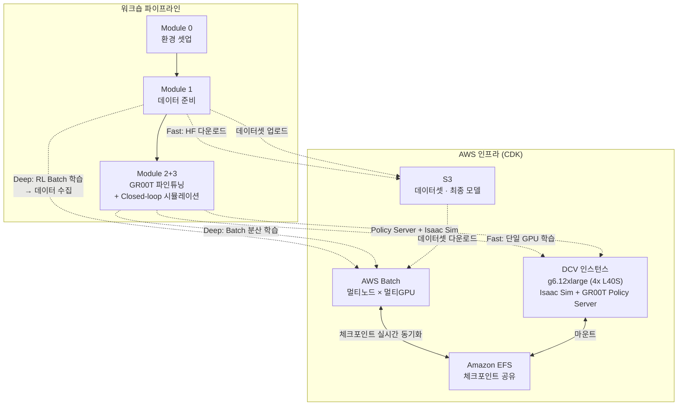
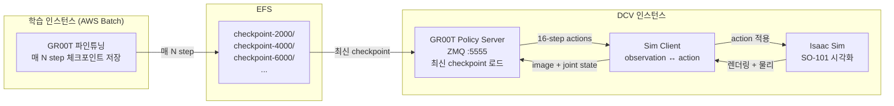

# GR00T + SO-ARM 101 워크숍 설계

## 개요

AWS 인프라 위에서 NVIDIA GR00T N1.7 VLA 모델을 파인튜닝하고, Isaac Sim 시뮬레이션 내 SO-ARM 101 로봇을 Closed-loop으로 제어하는 핸즈온 워크숍.

참가자에게 물리 로봇이 없으므로, 외부 공개 데이터셋 또는 Isaac Lab 시뮬레이션에서 수집한 데이터로 학습하고, 최종적으로 시뮬레이션 내 SO-101이 GR00T 모델에 의해 동작하는 것을 확인하는 것이 목표.

## 핵심 결정사항

| 항목 | 결정 |
|------|------|
| 기반 인프라 | `infra-multiuser-groot/` CDK 재사용 |
| 워크숍 코드 | 처음부터 새로 작성 (`workshop-groot-so101/` 참고 안 함) |
| 대상 | SA/개발자 또는 ML 엔지니어, 10~30명 |
| 시간 구조 | 모듈식 — Fast Track ~1.5시간, Full Deep Dive ~2.5시간 |
| 최종 목표 | 파인튜닝된 GR00T → Isaac Sim 내 SO-101 Closed-loop 제어 |
| 학습 인프라 | 단일 GPU (DCV) + AWS Batch 분산 학습 (EFS 체크포인트 공유) |
| 데이터셋 | HuggingFace SO-101 공개 데이터 OR Isaac Lab 시뮬레이션 데이터 수집 |
| 체크포인트 공유 | EFS — Batch 학습 Job ↔ DCV 인스턴스 실시간 공유 |
| SageMaker | 이번 버전에서는 제외 (향후 추가 예정) |

## 아키텍처

### 실시간 Closed-loop 아키텍처

학습 중간 체크포인트로 모델이 점점 나아지는 과정을 시각적으로 체험:

## 설계 원칙

1. **각 모듈은 독립적으로 스킵 가능** — 사전 준비물(체크포인트, 데이터셋)을 S3/EFS에 미리 제공
2. **Fast Track / Deep Dive 분기** — 각 모듈에서 시간에 따라 선택
3. **단일 인스턴스로 전체 Fast Track 완주 가능** — DCV 인스턴스 하나로 Module 0~2+3 Fast Track 수행
4. **Batch는 Deep Dive에서 사용** — RL 학습, GR00T 분산 학습 모두 Batch
5. **EFS가 체크포인트 허브** — 학습 Job과 DCV 인스턴스 간 실시간 공유
6. **최종 결과는 동일** — Fast든 Deep이든 GR00T Policy Server → Isaac Sim SO-101 Closed-loop

## 모듈 상세

### Module 0: 환경 셋업 (~10분)

**목표**: CDK로 배포된 DCV 인스턴스에 접속하여 Isaac-GR00T + 워크숍 코드 설치 완료

**단계**:
1. DCV 원격 데스크탑 접속 (`https://<IP>:8443`)
2. Isaac-GR00T 공식 레포 클론 + `uv sync --all-extras`
3. 워크숍 프로젝트 셋업 (SO-101 URDF 다운로드 + 의존성 + 환경 검증)
4. GPU 상태 확인 (`nvidia-smi`), EFS 마운트 확인

**사전 준비물 (워크숍 운영자)**:
- CDK 스택 배포 완료 (참가자 수만큼 인스턴스)
- S3에 사전 학습된 체크포인트/데이터셋 업로드 (Fast Track용)
- EFS에 Isaac-GR00T 캐시 (선택 — `uv sync` 시간 절약)

**산출물**: `list_envs` 실행하여 Isaac Lab 환경 등록 확인

---

### Module 1: 데이터 준비 (~20분 Fast / ~50분 Deep)

**목표**: GR00T 파인튜닝에 사용할 LeRobot v2.1 형식 SO-101 데이터셋 확보 → S3 업로드

#### Fast Track: HuggingFace 공개 데이터셋 (~20분)

1. SO-101 텔레오퍼레이션 데이터 다운로드 + v2.1 변환
2. `modality.json` 배치
3. 데이터셋 구조 검증 (meta/, data/, videos/)
4. S3 업로드

#### Deep Dive: Isaac Lab RL 학습 → 시연 데이터 수집 (~50분)

1. **RL 학습 (AWS Batch)** — Reach 또는 Lift 태스크 PPO 학습을 Batch Job으로 실행
   - 멀티노드 × 멀티GPU로 학습 가속
   - EFS에 체크포인트 자동 저장
   - 또는 **사전 체크포인트 스킵**: EFS/S3에서 `best_agent.pt` 다운로드
2. **학습 결과 시각화 (DCV)** — `play.py`로 학습된 정책 확인 (시각화 모드 기본, `--headless` 옵션)
3. **시연 데이터 수집 (DCV)** — `collect_demos.py`로 200 에피소드 수집
   - `--headless` 옵션으로 빠르게 수집 가능
4. **LeRobot 변환** — `convert_to_lerobot.py`로 v2.1 형식 변환
5. **통계량 생성** — `stats.py`로 정규화 통계 생성
6. **S3 업로드**

**산출물**: S3에 LeRobot v2.1 SO-101 데이터셋

---

### Module 2+3: GR00T 파인튜닝 + 실시간 Closed-loop 확인 (~40분 Fast / ~60분 Deep)

**목표**: SO-101 데이터셋으로 GR00T N1.7을 파인튜닝하면서, 학습 중간 체크포인트로 Isaac Sim 내 SO-101 Closed-loop 동작을 실시간 확인

#### Fast Track: 단일 GPU (DCV 인스턴스) (~40분)

1. S3에서 데이터셋 다운로드 (Module 1 산출물)
2. DCV 인스턴스에서 단일 GPU 파인튜닝 실행
   - `CUDA_VISIBLE_DEVICES=0 NUM_GPUS=1`
   - 축소 파라미터: `MAX_STEPS=2000`, `GLOBAL_BATCH_SIZE=16`
   - 체크포인트를 로컬 또는 EFS에 저장
3. 별도 터미널에서 Policy Server + Isaac Sim 기동
4. 중간 체크포인트 로드 → SO-101 Closed-loop 확인
5. 또는 **사전 체크포인트 스킵**: S3/EFS에서 파인튜닝 완료 모델로 바로 Closed-loop

#### Deep Dive: AWS Batch 분산 학습 (~60분)

1. S3 데이터셋 경로를 Batch Job 파라미터로 전달
2. 멀티노드 × 멀티GPU 분산 파인튜닝 실행
   - 본격 파라미터: `MAX_STEPS=10000`, `GLOBAL_BATCH_SIZE=32`
   - `SAVE_STEPS` 간격으로 EFS에 체크포인트 자동 저장
3. **학습과 동시에 DCV에서**:
   - EFS의 최신 체크포인트로 Policy Server 기동
   - Isaac Sim SO-101 Closed-loop 실행
   - 체크포인트 갱신 시 리로드 → 모델이 점점 개선되는 과정 시각적 체험
4. CloudWatch Logs로 학습 지표 모니터링
5. 최종 체크포인트로 완성된 동작 확인 + S3 백업

**산출물**: DCV 화면에서 GR00T이 제어하는 SO-101 동작 확인 + S3에 최종 체크포인트

## 시간 견적

| 조합 | Module 0 | Module 1 | Module 2+3 | 합계 |
|------|----------|----------|------------|------|
| All Fast Track | 10분 | 20분 | 40분 | **~1.5시간** |
| M1 Deep + M2+3 Fast | 10분 | 50분 | 40분 | **~2시간** |
| M1 Fast + M2+3 Deep | 10분 | 20분 | 60분 | **~1.5시간** (+ Batch 스케줄링 대기) |
| All Deep Dive | 10분 | 50분 | 60분 | **~2.5시간** |

## GPU 요구사항

| 작업 | 최소 VRAM | 인프라 |
|------|----------|--------|
| Isaac Lab RL 학습 | 12GB+ | AWS Batch |
| Isaac Sim 시각화 + Policy Server | 16GB+ | DCV 인스턴스 |
| GR00T 파인튜닝 (단일 GPU) | 40GB+ | DCV 인스턴스 (1x L40S) |
| GR00T 파인튜닝 (분산) | 4x 48GB | AWS Batch (멀티노드) |

## 구현해야 할 것

### 새로 작성

1. **워크숍 프로젝트 코드** — 로봇 정의, 태스크, 학습/시각화/데이터수집/변환 스크립트
2. **GR00T → Isaac Sim Closed-loop 연동** — Sim Client (Isaac Sim 내 카메라 + 관절 → ZMQ → Policy Server → 액션 적용)
3. **Batch Job Definition** — GR00T 파인튜닝용 (EFS 체크포인트 저장 설정 포함)
4. **워크숍 가이드 문서** — 모듈별 단계 설명, Fast Track / Deep Dive 분기 안내
5. **setup.sh** — 원클릭 환경 셋업 스크립트
6. **운영자 준비 스크립트** — 사전 체크포인트/데이터셋 S3 업로드 자동화

### 기존 재사용

1. **`infra-multiuser-groot/` CDK** — VPC, GPU EC2, DCV, EFS, Batch 인프라 그대로
