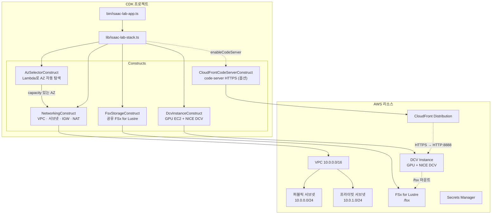

# Isaac Lab Golden Template

NVIDIA Isaac Lab 강화학습 환경을 AWS에서 원클릭 배포하기 위한 CDK TypeScript 프로젝트.

CDK 프로젝트 자체가 메인 결과물이며, CloudFormation 템플릿은 `cdk synth`로 생성되는 부산물이다.

## 원본 워크숍 템플릿 대비 개선 사항

| 항목 | 원본 워크숍 템플릿 | Golden Template |
|------|-------------------|-----------------|
| 리전 지원 | 3개 리전 하드코딩 | 12개 리전 DLAMI 매핑 + 멀티리전 배포 |
| 버전 관리 | 고정 | Version Profile 기반 (stable / latest) |
| AZ 선택 | 인덱스 0 고정 | Custom Resource Lambda로 capacity 자동 탐색 + 인스턴스 타입 fallback |
| 인스턴스 타입 | g6.12xlarge 고정 | g6e.4xlarge → g6.4xlarge → g6.12xlarge → g6e.12xlarge 자동 fallback |
| UserData | 모놀리식 | 독립 셸 스크립트 모듈 (cloudwatch-agent.sh, code-server.sh는 옵션). GR00T-N1.6-3B 모델 가중치는 models-download.sh가 인스턴스 로컬 디스크로 자동 다운로드하며, Docker 빌드/추론 서버 실행은 사용자가 수동 수행 |
| 보안 | 미흡 | allowedCidr, FSx SG VPC CIDR 제한, EBS 암호화, Secrets Manager ARN 제한 |
| 네트워크 안정성 | Route-IGW 의존성 미지정 | PublicRoute → VPCGatewayAttachment DependsOn 명시 |
| NVIDIA 드라이버 | UserData에서 직접 설치 | 구 DLAMI(550) + 570 자연 업그레이드 |
| DCV GL | 미설치 | DCV GL 자동 설치 + 단일 GPU xorg.conf 자동 생성 |
| IaC | CloudFormation YAML | CDK TypeScript (타입 안전성, 코드 재사용) |

## 아키텍처



## 사전 요구사항

- Node.js 18 이상
- AWS CDK CLI: `npm install -g aws-cdk`
- AWS 자격 증명: AdministratorAccess 또는 동등 권한
- GPU 인스턴스 서비스 할당량: 배포 리전에서 G6/G5 인스턴스 할당량 확인 → `./scripts/check-quotas.sh -n <인원수>` 로 사전 체크
- CDK Bootstrap: 배포 대상 리전에서 최초 1회 실행 필요

## 지원 리전

| 리전 | 코드 | DCV AMI | 비고 |
|------|------|:-------:|------|
| 버지니아 | us-east-1 | DLAMI 22.04/24.04 | 권장 (최대 규모) |
| 오레곤 | us-west-2 | DLAMI 22.04/24.04 | 권장 |
| 오하이오 | us-east-2 | DLAMI 22.04/24.04 | 권장 |
| 프랑크푸르트 | eu-central-1 | DLAMI 22.04/24.04 | EU 권장 |
| 뭄바이 | ap-south-1 | DLAMI 22.04/24.04 | |
| 런던 | eu-west-2 | DLAMI 22.04/24.04 | |
| 도쿄 | ap-northeast-1 | DLAMI 22.04/24.04 | |
| 캐나다 | ca-central-1 | DLAMI 22.04/24.04 | |
| 시드니 | ap-southeast-2 | DLAMI 22.04/24.04 | |
| 서울 | ap-northeast-2 | DLAMI 22.04/24.04 | |
| 스톡홀름 | eu-north-1 | DLAMI 22.04/24.04 | |
| 상파울루 | sa-east-1 | DLAMI 22.04/24.04 | |

> g6+g5 모두 지원하는 12개 리전. 파리(g6 only), 아일랜드(g5 only)는 제외.

### AMI 전략

DCV 인스턴스에는 **Deep Learning OSS Nvidia Driver AMI GPU PyTorch**를 사용한다. 이 AMI에는 AWS CLI, NVIDIA 드라이버, Docker, PyTorch가 사전 설치되어 있어 UserData 실행 시간이 단축되고 리전 간 동작이 일관된다.

- stable: `Deep Learning OSS Nvidia Driver AMI GPU PyTorch 2.4.1 (Ubuntu 22.04) 20250623`
  - NVIDIA 드라이버 550 사전 설치 → UserData에서 570으로 자연 업그레이드
  - DCV 2025.0과 호환성 검증 완료 (reference 스택과 동일 시리즈)
- latest: `Deep Learning OSS Nvidia Driver AMI GPU PyTorch 2.9 (Ubuntu 24.04) 20260226`
  - NVIDIA 드라이버 580 사전 설치 → nvidia-driver.sh에서 570으로 교체

> nvidia-driver.sh는 DLAMI에 어떤 드라이버가 사전 설치되어 있든 프로필 지정 버전(570)으로 자동 교체한다. xorg.conf 생성은 lspci 기반으로 커널 모듈 상태에 무관하게 동작한다.


## 할당량 사전 체크 (워크숍 관리자용)

멀티 사용자 배포 시 VPC, EIP, GPU vCPU 등 서비스 할당량이 부족할 수 있다. 배포 전 `check-quotas.sh`로 현재 사용량 대비 N명분 여유가 있는지 확인한다.

```bash
# 10명 배포 예정 — 체크만 (bash 서브셸로 실행하여 exit 1이 현재 셸에 영향 없도록)
bash ./scripts/check-quotas.sh -n 10 || true

# 부족 시 자동 증가 요청 (GPU vCPU 제외 — 별도 티켓 필요)
bash ./scripts/check-quotas.sh -n 10 --auto-request || true

# 리전 지정
bash ./scripts/check-quotas.sh -n 20 -r us-west-2 --auto-request || true
```

| 체크 항목 | 사용자당 | 비고 |
|-----------|----------|------|
| VPCs per Region | 1 | |
| Internet Gateways | 1 | |
| NAT Gateways per AZ | 1 | |
| Elastic IPs | 1 | NAT GW용 |
| G/VT On-Demand vCPU | 48 | g6.12xlarge 기준, **자동 증가 불가 — 별도 티켓** |
| CloudFront Distributions | 1 | code-server CDN |
| Secrets Manager Secrets | 1 | DCV 비밀번호 |
| CloudFormation Stacks | 1 | |
| Security Groups | 2 | DCV, FSx |

> GPU vCPU 할당량(`Running On-Demand G and VT instances`)은 Service Quotas 콘솔에서 수동 요청하거나 AWS Support 티켓을 통해 증가해야 한다.

## Quick Start

```bash
# 1. 의존성 설치
npm install

# 2. CDK Bootstrap (대상 리전에서 최초 1회, 관리자가 사전 실행)
cdk bootstrap

# 3. 기본 배포 (인스턴스 타입 자동 fallback)
cdk deploy

# 4. 사용자별 독립 배포 (멀티 사용자)
cdk deploy -c userId=alice -c vpcCidr=10.1.0.0/16

# 5. 다른 리전에 배포
cdk deploy -c userId=alice -c vpcCidr=10.1.0.0/16 -c region=us-west-2

# 6. 인스턴스 타입 직접 지정 (fallback 무시)
cdk deploy -c userId=alice -c inferenceInstanceType=g6e.4xlarge

# 7. CloudWatch Agent 활성화 (GPU/CPU/메모리/디스크 모니터링)
cdk deploy -c userId=alice -c enableCloudWatch=true

# 8. code-server (VSCode) 비활성화 (CloudFront + code-server 미설치)
cdk deploy -c userId=alice -c enableCodeServer=false

# 9. latest 프로필 (Ubuntu 24.04 + Isaac Sim 5.1.0)
cdk deploy -c userId=alice -c versionProfile=latest

# 10. Isaac Sim 버전만 오버라이드 (프로필의 Isaac Lab 태그 고정은 해제됨 → main 클론)
cdk deploy -c userId=alice -c vpcCidr=10.1.0.0/16 -c isaacSimVersion=5.1.0 -c region=us-east-1

# 11. CloudShell에서 배포 (세션 끊김 방지)
nohup npx cdk deploy -c userId=alice -c vpcCidr=10.1.0.0/16 --require-approval never > deploy.log 2>&1 &
tail -f deploy.log

# 12. 변경 사항 미리보기
cdk diff

# 13. CloudFormation 템플릿 생성 (배포 없이)
cdk synth

# 14. 스택 삭제
cdk destroy -c userId=alice
```

> 인스턴스 타입 미지정 시 자동 fallback 순서: `g6e.4xlarge → g6.4xlarge → g6.12xlarge → g6e.12xlarge`

## Props 설명

| Props | 타입 | 기본값 | 설명 |
|-------|------|--------|------|
| `versionProfile` | `stable` \| `latest` | `latest` | 소프트웨어 스택 프로필 선택 |
| `inferenceInstanceType` | `string` | (auto fallback) | DCV GPU 인스턴스 타입. 미지정 시 `g6e.4xlarge → g6.4xlarge → g6.12xlarge → g6e.12xlarge` 순서로 자동 탐색 |
| `preferredAZ` | `auto` \| `0`~`5` | `auto` | AZ 선택. auto는 Lambda로 capacity 자동 탐색 |
| `allowedCidr` | CIDR 문자열 | `0.0.0.0/0` | DCV 보안 그룹 인바운드 소스 CIDR |
| `region` | 리전 코드 | CDK 기본 리전 | 배포 대상 리전 (멀티리전 배포용) |
| `userId` | 영문소문자·숫자·하이픈 | (없음) | 멀티 사용자 배포 시 사용자 식별자 |
| `vpcCidr` | CIDR 문자열 | `10.0.0.0/16` | VPC 네트워크 대역. 멀티 사용자 시 참가자별 고유 CIDR 지정 |
| `enableCloudWatch` | `true` \| `false` | `false` | CloudWatch Agent 설치 여부 (GPU/CPU/메모리/디스크 모니터링) |
| `enableCodeServer` | `true` \| `false` | `true` | code-server (VSCode) 설치 여부. `false` 시 code-server, CloudFront, SG 포트 8888 모두 생략 |
| `grootWeightsUrl` | `s3://...` \| `https://....tar.gz` | (없음) | GR00T-N1.6-3B 가중치(약 6.1GiB) 사본 위치. 미지정 시 HuggingFace에서 받는다. 같은 리전의 S3 사본을 지정하면 다운로드가 빨라지고 HuggingFace 가용성에 의존하지 않는다 |
| `modelsDir` | 절대 경로 | `/home/ubuntu/environment/models` | 모델·가중치를 내려받는 인스턴스 로컬 경로. UserData의 `MODELS_DIR` 환경 변수로 전달되어 `models-download.sh`가 사용한다 |
| `isaacSimVersion` | `string` | (프로필 기본값) | Isaac Sim 버전 오버라이드. 지정 시 프로필의 `isaacLabVersion` 고정이 해제되어 IsaacLab `main`을 클론한다. 검증된 조합은 `versionProfile` 사용 |

Props는 CDK Context로 전달한다:

```bash
# 기본 리전에 latest 배포 (AZ 자동 선택)
cdk deploy

# us-west-2에 stable 배포
cdk deploy -c region=us-west-2 -c versionProfile=stable

# AZ 수동 지정 (Lambda 탐색 건너뜀)
cdk deploy -c preferredAZ=1

# 보안 그룹 소스 CIDR 제한
cdk deploy -c allowedCidr=10.0.0.0/8

# GR00T 가중치를 같은 리전의 S3 사본에서 받기
cdk deploy -c grootWeightsUrl=s3://my-assets/GR00T-N1.6-3B/

# 모델 다운로드 경로 변경
cdk deploy -c modelsDir=/data/models
```

## 멀티 사용자 배포

하나의 AWS 계정에서 여러 사용자가 동시에 독립된 환경을 배포할 수 있다. `-c userId=<이름>`을 지정하면 스택 이름과 리소스 태그가 사용자별로 분리된다.

### 사용법

```bash
# 사용자별 독립 배포
cdk deploy -c userId=alice
cdk deploy -c userId=bob
cdk deploy -c userId=charlie -c region=us-west-2

# 각자 스택 삭제
cdk destroy -c userId=alice
```

### 격리되는 항목

| 항목 | userId 미지정 | userId=alice |
|------|:------------:|:------------:|
| 스택 이름 | `IsaacLab-Stable` | `IsaacLab-Stable-alice` |
| 리소스 태그 | (없음) | `UserId: alice` (전체 리소스) |
| VPC / 서브넷 | 독립 생성 | 독립 생성 |
| 공유 FSx for Lustre | 독립 생성 | 독립 생성 |
| DCV 인스턴스 | 독립 생성 | 독립 생성 |

### 주의사항

- `userId`는 영문소문자, 숫자, 하이픈만 허용 (예: `alice`, `team-1`, `user01`)
- `userId`를 지정하지 않으면 기존과 완전히 동일하게 동작 (하위 호환)
- 같은 계정·리전에서 동일 `userId` 없이 여러 명이 배포하면 스택 이름이 충돌하므로, 멀티 사용자 환경에서는 반드시 `userId`를 지정할 것
- GPU 인스턴스 할당량(`Running On-Demand G and VT instances`)은 계정 레벨에서 공유되므로, 동시 사용자 수에 맞게 Service Quotas 증가 요청 필요
- VPC 기본 할당량은 리전당 5개이므로, 5명 이상 동시 배포 시 할당량 증가 필요

## CloudShell 배포 가이드

AWS CloudShell에는 AWS CLI, git, python3이 사전 설치되어 있지만, CDK 배포에 필요한 Node.js 버전이 낮거나 CDK CLI가 없을 수 있다. `setup-cloudshell.sh`로 환경을 자동 설정한다.

### 초기 설정 (최초 1회)

```bash
# 한 줄로 환경 설정 (클론 + Node.js + 의존성 + CDK 확인)
git clone --depth 1 https://github.com/hi-space/aws-physical-ai-recipes.git ~/aws-physical-ai-recipes
source ~/aws-physical-ai-recipes/e2e-workshop/infra/isaaclab/scripts/setup-cloudshell.sh
```

재접속 시에는 스크립트만 다시 실행하면 된다 (이미 클론된 경우 git pull 후 npm install):

```bash
source ~/aws-physical-ai-recipes/e2e-workshop/infra/isaaclab/scripts/setup-cloudshell.sh
```

`setup-cloudshell.sh`가 수행하는 작업:
- 리포지토리 클론 (이미 있으면 git pull)
- `~/aws-physical-ai-recipes/e2e-workshop/infra/isaaclab`로 cd
- Node.js 18+ 확인 (낮으면 nvm으로 자동 설치)
- `npm install` (프로젝트 의존성 + CDK CLI)
- CDK CLI 동작 확인

> CloudShell 세션이 종료되면 `$HOME` 외 파일이 삭제된다. `$HOME`에 클론하므로 소스는 유지되지만, `node_modules`는 재설치 필요하므로 재접속 시 `source` 명령을 다시 실행한다.

### 배포

```bash
# CDK Bootstrap (리전당 최초 1회, 관리자가 사전 실행)
npx cdk bootstrap

# 배포 (nohup으로 세션 끊김 방지 — CloudShell은 20분 비활성 시 종료)
nohup npx cdk deploy -c userId=alice -c vpcCidr=10.1.0.0/16 --require-approval never > deploy.log 2>&1 &

# 진행 상황 확인
tail -f deploy.log
```

### 배포 완료 확인

```bash
# Output 확인
cat deploy.log | grep -E 'Outputs|DcvUrl|CodeServerUrl|SecretArn'

# 또는 CloudFormation에서 직접 조회
aws cloudformation describe-stacks \
  --stack-name IsaacLab-Stable-alice \
  --query 'Stacks[0].Outputs' --output table
```

### DCV 접속

1. 브라우저에서 `DcvUrl` 열기 (예: `https://<PublicIP>:8443`)
2. 인증서 경고 → "고급" → "계속 진행"
3. 로그인: username `ubuntu`, password는 Secrets Manager에서 확인

```bash
# 비밀번호 조회 (deploy.log에서 SecretArn 추출)
aws secretsmanager get-secret-value \
  --secret-id $(cat deploy.log | grep SecretArn | awk -F= '{print $2}' | tr -d ' ') \
  --region us-east-1 \
  --query SecretString --output text | python3 -c "import sys,json; print(json.load(sys.stdin)['password'])"
```

또는 AWS 콘솔 → Secrets Manager에서 확인한다. 시크릿 이름은 CloudFormation이 자동 생성하므로(`IsaacLab-<프로필>-<userId>-DcvSecret-<임의문자열>`) 스택 출력의 `SecretArn`으로 찾는 것이 확실하다. 콘솔에서 찾을 때는 Name 태그가 `IsaacLab-<프로필>-<userId>-Secret`인 항목을 보면 된다.

### code-server (VSCode) 접속

`enableCodeServer=true` (기본값)로 배포한 경우, CloudFront를 통해 브라우저 VSCode에 접속할 수 있다.

- 브라우저에서 `CodeServerUrl` 열기 (CloudFront HTTPS URL)
- Password: DCV와 동일 (같은 Secrets Manager 시크릿)

### 환경 설치 확인

DCV 접속 후 터미널에서 아래 명령으로 정상 설치 여부를 확인한다:

```bash
# GPU 드라이버 확인 (L40S 또는 L4 출력)
nvidia-smi

# Isaac Lab Docker 이미지 확인
docker images | grep isaaclab

# FSx 마운트 확인
df -h | grep fsx

# code-server 상태 확인
systemctl status code-server

# GR00T 모델 가중치 확인 (models-download.sh가 로컬 디스크로 다운로드)
ls /home/ubuntu/environment/models/GR00T-N1.6-3B
```

문제가 있으면 UserData 로그를 확인한다:

```bash
sudo tail -100 /var/log/user-data.log
```

### 스택 삭제

```bash
npx cdk destroy -c userId=alice
```

## AZ 자동 선택

`preferredAZ=auto` (기본값)일 때, Custom Resource Lambda가 배포 시점에 GPU capacity가 있는 AZ와 인스턴스 타입을 자동으로 탐색한다.

동작 방식:
1. 인스턴스 타입 fallback 리스트를 순차 시도: `g6e.4xlarge → g6.4xlarge → g6.12xlarge → g6e.12xlarge`
2. 각 인스턴스 타입에 대해 `describe-instance-type-offerings`로 지원 AZ 목록 조회
3. AZ 목록을 셔플하여 특정 AZ 집중 방지
4. 각 AZ에서 `RunInstances` (MinCount=1) 시도
5. 성공하면 즉시 terminate하고 해당 AZ + 인스턴스 타입을 EC2 Instance에 전달
6. `InsufficientInstanceCapacity`이면 다음 AZ 시도, 모든 AZ 실패 시 다음 인스턴스 타입으로 fallback
7. 모든 타입/AZ 실패 시 스택 생성 실패

이 방식으로 GPU capacity 부족으로 인한 배포 실패를 크게 줄일 수 있다. probe 인스턴스는 수 초 내에 terminate되므로 비용은 무시할 수 있는 수준이다.

`inferenceInstanceType`을 명시적으로 지정하면 해당 타입만 시도한다. `preferredAZ`를 인덱스('0'~'5')로 지정하면 Lambda 탐색을 건너뛰고 해당 인덱스의 AZ를 직접 사용한다.

## 버전 프로필 상세

### stable

Isaac Sim 4.5.0 + Isaac Lab 2.1.1 기반의 이전 조합. 4.5.0 전용 자산이 필요할 때 `-c versionProfile=stable`로 선택한다.

| 항목 | 값 |
|------|---|
| Ubuntu | 22.04 LTS |
| AMI | Deep Learning OSS Nvidia Driver AMI GPU PyTorch 2.4.1 (Ubuntu 22.04) 20250623 |
| ROS2 | Humble Hawksbill |
| NVIDIA 드라이버 | 570 (DLAMI 550 → apt 업그레이드) |
| Isaac Sim | 4.5.0 (`nvcr.io/nvidia/isaac-sim:4.5.0`) |
| Isaac Lab | 2.1.1 (태그 `v2.1.1` 고정) |
| CUDA | 12.8 (드라이버 570 기준) |

### latest (기본값)

워크숍 기본 조합. Isaac Sim 5.1.0 + Isaac Lab 2.3.2, Ubuntu 24.04 Deep Learning AMI를 사용한다.

| 항목 | 값 |
|------|---|
| Ubuntu | 24.04 LTS |
| AMI | Deep Learning OSS Nvidia Driver AMI GPU PyTorch 2.9 (Ubuntu 24.04) 20260226 |
| ROS2 | Jazzy Jalisco |
| NVIDIA 드라이버 | 570 (DLAMI 580 → 570 교체) |
| Isaac Sim | 5.1.0 (`nvcr.io/nvidia/isaac-sim:5.1.0`) |
| Isaac Lab | 2.3.2 (태그 `v2.3.2` 고정) |
| CUDA | 12.8 (드라이버 570 기준) |

Ubuntu 24.04 고유 처리 사항 (`common.sh`, `isaac-lab.sh`에서 자동 적용):
- DCV 설치: `install-dcv.sh`가 24.04를 미지원하므로 `nice-dcv-ubuntu2404-x86_64.tgz`를 직접 다운로드하여 설치 (DCV GL 포함)
- Wayland 비활성화: `/etc/gdm3/custom.conf`에 `WaylandEnable=false` 추가 (DCV는 X11 기반)
- nvidia-xconfig 스킵: Ubuntu 24.04에서 `nvidia-xconfig`이 생성하는 xorg.conf가 X server 시작을 실패시키므로 GDM 자동 검출에 위임
- `systemd-networkd-wait-online` 비활성화: GNOME 데스크톱의 NetworkManager와 충돌 방지
- Isaac Sim 5.1.0 EULA: Dockerfile에 `ENV ACCEPT_EULA=Y` + `USER root` 자동 추가 (4.x에서는 불필요했으나 5.x부터 필수)


## CfnOutput 설명

배포 완료 후 CloudFormation Outputs에 다음 값이 출력된다:

| Output Key | 설명 | 용도 |
|------------|------|------|
| `InstanceId` | DCV 인스턴스 ID | EC2 콘솔에서 인스턴스 확인 |
| `DcvUrl` | DCV 접속 URL (`https://<PublicIP>:8443`) | 브라우저에서 DCV 접속 |
| `CodeServerUrl` | code-server 접속 URL (`https://<CloudFront>`) | 브라우저에서 VSCode 접속 (`enableCodeServer=true` 시) |
| `LogGroupName` | VPC Flow Log 로그 그룹 이름 | CloudWatch Logs에서 네트워크 로그 확인 |
| `LogGroupArn` | VPC Flow Log 로그 그룹 ARN | IAM 정책 등에서 참조 |
| `SecretArn` | DCV 비밀번호 Secret ARN | `aws secretsmanager get-secret-value`로 비밀번호 조회 |
| `VersionProfile` | 선택된 버전 프로필 | 배포된 프로필 확인 |
| `PrivateSubnetId` | 프라이빗 서브넷 ID | groot·HyperPod 스택에서 참조 |
| `FsxFileSystemId` | 공유 FSx for Lustre ID | groot SageMaker DRA·HyperPod에서 참조 |
| `FsxMountName` | FSx Lustre mount name | 수동 마운트 시 참조 |
| `FsxSecurityGroupId` | FSx 보안 그룹 ID | Lustre 접근 허용 시 참조 |

DCV 비밀번호 조회:

```bash
aws secretsmanager get-secret-value \
  --secret-id <SecretArn 값> \
  --query SecretString \
  --output text
```

## 배포 후 주요 작업 흐름

배포 완료 후 DCV에 접속하여 아래 순서로 작업을 진행한다. 각 단계의 상세 가이드는 별도 문서를 참고한다.

### Isaac Lab 강화학습 실행

DCV 터미널에서 Docker 컨테이너를 실행하고 Isaac Lab 학습을 수행한다:

```bash
# 컨테이너 실행
cd ~/environment/IsaacLab && xhost +
docker run --shm-size=60g --name isaac-lab \
  --entrypoint bash -it --gpus all --rm --network=host \
  -e "ACCEPT_EULA=Y" -e "PRIVACY_CONSENT=Y" -e DISPLAY \
  isaaclab-batch:latest
```

```bash
# 컨테이너 내부에서 headless 학습 (렌더링 없이 빠름, 워크숍 권장)
cd /workspace/IsaacLab && \
./isaaclab.sh -p scripts/reinforcement_learning/skrl/train.py \
  --task Isaac-Velocity-Rough-H1-v0 \
  --num_envs 2048 \
  --headless
```

| 모드 | 명령 | 특징 |
|------|------|------|
| GUI | `torch.distributed.run` + `train.py` (headless 미지정) | DCV에서 시뮬레이션 시각화 가능. 렌더링 오버헤드로 학습 느림 |
| Headless | `isaaclab.sh -p train.py --headless` | 렌더링 없이 학습에 집중. 워크숍에서 권장 |

학습 로그와 체크포인트는 컨테이너 내부 `/workspace/IsaacLab/logs/skrl/h1_rough/`에 저장된다.

### 모델 추론 (IsaacSim에서 시각화)

학습된 체크포인트를 로드하여 로봇 동작을 시각적으로 확인한다:

```bash
# 모델 디렉터리를 마운트한 컨테이너에서 실행
docker run --shm-size=60g --name isaac-lab \
  --entrypoint bash -it --gpus all --rm --network=host \
  -v /home/ubuntu/environment/models:/workspace/IsaacLab/TrainedModel \
  -e "ACCEPT_EULA=Y" -e "PRIVACY_CONSENT=Y" -e DISPLAY \
  isaaclab-batch:latest
```

```bash
# 컨테이너 내부에서 추론 실행
cd /workspace/IsaacLab && \
./isaaclab.sh -p scripts/reinforcement_learning/skrl/play.py \
  --task=Isaac-Velocity-Rough-H1-v0 \
  --num_envs 25 \
  --checkpoint=/workspace/IsaacLab/TrainedModel/agent_72000.pt
```

| 체크포인트 | 경로 | 설명 |
|------------|------|------|
| 사전 학습 완료 | `/workspace/IsaacLab/TrainedModel/agent_72000.pt` | 부팅 시 로컬 디스크에 자동 배치 (72,000 iteration) |
| RL 학습 결과 | `/workspace/IsaacLab/TrainedModel/models/h1_rough/{timestamp}_ppo_torch/checkpoints/best_agent.pt` | 학습 최고 성능 시점 |

### GR00T N1 추론 테스트

GR00T Docker 이미지 빌드와 추론 서버 실행은 더 이상 부팅 시 자동 수행되지 않는다. 모델 가중치(`/home/ubuntu/environment/models/GR00T-N1.6-3B`)는 인스턴스 로컬 디스크에 미리 다운로드되어 있으므로, 사용자가 직접 빌드·실행한다.

```bash
# 1) GR00T 리포지토리 clone + Dockerfile 작성
mkdir -p /home/ubuntu/environment/groot_docker
cd /home/ubuntu/environment/groot_docker
git clone --branch n1.6-release https://github.com/NVIDIA/Isaac-GR00T.git gr00t

cat > Dockerfile <<'EOF'
FROM nvcr.io/nvidia/pytorch:25.04-py3
ENV DEBIAN_FRONTEND=noninteractive
ENV PIP_CONSTRAINT=""
COPY gr00t/ /workspace/gr00t/
WORKDIR /workspace/gr00t
RUN pip install --no-cache-dir -e .
EXPOSE 5555
ENTRYPOINT ["python"]
CMD ["gr00t/eval/run_gr00t_server.py"]
EOF

# 2) Docker 빌드 (수십 분 소요)
docker build -t groot-n1:latest .

# 3) 추론 서버 실행 (모델 가중치 디렉터리 마운트)
docker run --rm --gpus all --name groot-inference --network=host \
  -v /home/ubuntu/environment/models:/workspace/weights \
  groot-n1:latest \
  gr00t/eval/run_gr00t_server.py \
  --model_path /workspace/weights/GR00T-N1.6-3B \
  --embodiment_tag GR1 \
  --host 0.0.0.0 --port 5555

# 4) 포트 확인
ss -tlnp | grep 5555
```

Ping 테스트:

```bash
cd /home/ubuntu/environment/groot_docker/gr00t
PYTHONPATH=$(pwd) python3 -c "
from gr00t.policy.server_client import PolicyClient
policy = PolicyClient(host='localhost', port=5555)
print('SUCCESS' if policy.ping() else 'FAILED')
"
```

정상 응답: `SUCCESS`

외부에서 접속 시 EC2 퍼블릭 IP의 TCP 5555 포트를 사용한다 (Security Group에서 자동 허용). 상세 테스트 방법은 `documents/groot-zmq-test-guide.md`를 참고한다.

## 커스터마이징 가이드

### Dockerfile 수정

`assets/workshop/Dockerfile`을 직접 수정하여 Docker 이미지를 커스터마이징할 수 있다. Isaac Sim 버전은 `isaac-lab.sh`에서 자동 패치(sed)된다.

### 인스턴스 타입 변경

```bash
cdk deploy -c inferenceInstanceType=g6.xlarge
# 멀티 GPU: g6.12xlarge, g5.12xlarge — 12개 리전 모두 지원
# DCV 워크숍 (단일 GPU): g6.xlarge, g5.xlarge — capacity 확보 용이
# g6e/g7e는 일부 리전에만 존재하므로 기본 타입으로 부적합
```

### 새 버전 프로필 추가

`lib/config/version-profiles.ts`의 `VERSION_PROFILES` 객체에 항목을 추가한다. `VersionProfileName` 타입이 자동으로 확장되므로 추가 타입 수정이 필요 없다. 새 프로필에 대응하는 AMI가 `lib/config/ami-mappings.ts`에 있는지 확인한다.

## 트러블슈팅 가이드

### GPU Capacity 부족

`preferredAZ=auto` (기본값)를 사용하면 Custom Resource Lambda가 capacity 있는 AZ를 자동 탐색하므로, 대부분의 경우 이 문제가 자동으로 해결된다.

모든 AZ에서 capacity가 부족한 경우:

```bash
# 단일 GPU 인스턴스로 시도 (DCV 워크숍용, capacity 확보 용이)
cdk deploy -c inferenceInstanceType=g6.xlarge

# g5로 대체 (g6 capacity 부족 시)
cdk deploy -c inferenceInstanceType=g5.12xlarge

# 다른 리전으로 배포
cdk deploy -c region=us-west-2
```

### 특정 AZ에 Default Subnet이 없어서 AZ 탐색 실패

`preferredAZ=auto`(기본값) 사용 시 아래와 같은 에러가 발생하면 특정 AZ에 Default Subnet이 없는 것이다:

```
Received response status [FAILED] from custom resource.
Message returned: An error occurred (InvalidInput) when calling the RunInstances operation:
No default subnet for availability zone: 'us-east-1b'
```

원인: AZ 탐색 Lambda가 probe용 `run_instances`를 호출할 때 subnet을 지정하지 않으므로, Default Subnet이 없으면 실패한다. 다음 두 가지 경우에 발생할 수 있다:

1. 계정에 Default VPC 자체가 없는 경우 (모든 AZ에서 실패)
2. Default VPC는 있지만 특정 AZ에 Default Subnet이 없는 경우 (리전에 새로운 AZ가 추가되었거나 누군가 삭제한 경우)

현재 상태 확인:

```bash
# Default VPC 존재 여부 확인
aws ec2 describe-vpcs --filters "Name=isDefault,Values=true" \
  --region us-east-1 --query 'Vpcs[].VpcId' --output text

# 리전의 전체 AZ 목록
aws ec2 describe-availability-zones --region us-east-1 \
  --query 'AvailabilityZones[].ZoneName' --output text

# Default Subnet이 존재하는 AZ 목록 (위와 비교)
aws ec2 describe-subnets --filters "Name=default-for-az,Values=true" \
  --region us-east-1 --query 'Subnets[].AvailabilityZone' --output text
```

해결 방법:

```bash
# Default VPC가 없는 경우: Default VPC 생성 (모든 AZ에 Default Subnet도 함께 생성됨)
aws ec2 create-default-vpc --region us-east-1

# 특정 AZ에만 Default Subnet이 없는 경우: 해당 AZ에 생성
aws ec2 create-default-subnet --availability-zone us-east-1b

# 또는 AZ를 직접 지정 (Lambda 탐색 건너뜀)
cdk deploy -c preferredAZ=0                # 리전 첫 번째 AZ 사용
cdk deploy -c preferredAZ=us-east-1a       # AZ 이름 직접 지정
```

> `preferredAZ`에 인덱스(`0`~`5`) 또는 AZ 이름을 지정하면 `AzSelectorConstruct` Lambda를 건너뛰므로 Default Subnet 유무와 무관하게 배포된다. 다만, 해당 AZ에 GPU capacity가 없을 수 있으므로 사전에 확인하는 것을 권장한다.

### 실패한 스택 정리

```bash
# 실패한 스택 삭제
aws cloudformation delete-stack --stack-name IsaacLabStack --region us-east-1
aws cloudformation wait stack-delete-complete --stack-name IsaacLabStack --region us-east-1

# 재배포
cdk deploy
```

### 배포가 오래 걸릴 때 (UserData 진행 상황 확인)

`cdk deploy`가 오래 걸리는 것은 정상이다. EC2 인스턴스가 UserData를 통해 패키지 설치, NVIDIA 드라이버 업그레이드, Isaac Lab Docker 빌드 등을 수행하며, CreationPolicy가 cfn-signal을 받을 때까지 (최대 90분) 대기한다.

진행 상황을 실시간으로 확인하려면:

1. EC2 콘솔 → 인스턴스 선택 → **Connect** → **Session Manager** 탭 → **Connect**
2. 로그 확인:

```bash
sudo tail -f /var/log/user-data.log
```

각 모듈의 `START`/`END` 마커로 현재 진행 단계를 파악할 수 있다:

```
===== [날짜] START: common.sh =====        ← 시스템 업데이트, DCV, ROS, Docker 설치
===== [날짜] END: common.sh =====
===== [날짜] START: nvidia-driver.sh =====  ← NVIDIA 드라이버 업그레이드
===== [날짜] END: nvidia-driver.sh =====
===== [날짜] START: isaac-lab.sh =====      ← Isaac Lab Docker 빌드 (가장 오래 걸림)
===== [날짜] END: isaac-lab.sh =====
===== [날짜] START: models-download.sh ===== ← 모델 가중치 다운로드
===== [날짜] END: models-download.sh =====
===== [날짜] START: fsx-mount.sh =====      ← 공유 FSx for Lustre 마운트 (/fsx)
===== [날짜] END: fsx-mount.sh =====
```

> 일반적으로 `common.sh`의 dpkg lock 대기와 `isaac-lab.sh`의 Docker 빌드가 가장 오래 걸린다.

### UserData 실패 디버깅

UserData 실행 중 에러가 발생하면 `trap ERR`에 의해 자동 감지되며, cfn-signal이 실패 상태(`-e 1`)를 CloudFormation에 보고하여 CreationPolicy가 즉시 실패 처리한다. `|| true`로 가드된 명령은 에러로 간주하지 않는다.

스택이 CREATE_FAILED인 경우:

1. SSM Session Manager로 인스턴스에 접속
2. `/var/log/user-data.log`에서 각 모듈의 시작/완료 마커로 실패 지점 확인:

```
===== [날짜] START: common.sh =====
===== [날짜] END: common.sh =====
===== [날짜] START: nvidia-driver.sh =====
# 여기서 멈추면 nvidia-driver.sh에서 실패
```

### FSx 마운트

공유 FSx for Lustre는 UserData에서 `/fsx`에 마운트되며, `/etc/fstab`에 자동 등록되어 reboot 후에도 자동 재마운트된다. Lustre 커널 모듈 설치가 실패하면 배포는 계속 진행되고 `[WARN]` 마커만 남으므로, 이 경우 수동 마운트한다:

```bash
sudo mount -t lustre -o relatime,flock \
  <FSX_DNS_NAME>@tcp:/<FSX_MOUNT_NAME> /fsx
```

`FsxFileSystemId`·`FsxMountName` 스택 Output에서 필요한 값을 확인할 수 있다.

### Docker 빌드 실패

`isaac-lab.sh`에서 Docker 빌드 실패 시:

```bash
# Isaac Sim Docker 이미지 풀 확인
docker pull nvcr.io/nvidia/isaac-sim:4.5.0
```

### 알려진 제한 사항

- UserData 크기 제한: EC2 UserData는 Base64 인코딩 후 16KB 제한. 셸 스크립트의 주석과 빈 줄을 자동 제거하여 대응 (14KB → 8.5KB). heredoc 블록 내의 주석은 보존됨
- UserData 에러 추적: `trap 'USERDATA_EXIT=1' ERR` + `set -o pipefail`로 에러 발생 시 cfn-signal이 실패 상태를 보고. `|| true`로 가드된 명령은 에러 트랩이 발생하지 않음
- NVIDIA 드라이버: nvidia-driver.sh가 DLAMI에 사전 설치된 드라이버 버전을 자동 감지하여 프로필 지정 버전(570)으로 교체. stable(DLAMI 550→570 업그레이드), latest(DLAMI 580→570 교체) 모두 자동 처리. xorg.conf는 lspci 기반으로 생성하여 커널 모듈 상태에 무관
- DCV GL: DLAMI에 DCV GL(`nice-dcv-gl`)이 포함되지 않음. `common.sh`에서 DCV 설치 시 DCV GL도 함께 설치하고 `dcvgladmin enable` 실행 필요
- xorg.conf: `nvidia-xconfig --enable-all-gpus`가 멀티 GPU 환경에서 4개 Screen을 생성하여 DCV와 충돌. 단일 GPU + `Virtual 4096 2160` + `HardDPMS false` 설정의 xorg.conf를 직접 생성해야 함. `nvidia-xconfig` 사용 금지
- FSx 마운트: `/etc/fstab`에 자동 등록되어 reboot 후에도 자동 재마운트됨
- 단일 AZ 구조: AZ Selector가 선택한 단일 AZ에 프라이빗 서브넷과 FSx 파일시스템이 1개씩만 생성된다. DCV 인스턴스는 배포 시점에 capacity를 확인하므로 문제없다. 여러 AZ에 걸치도록 만들 수도 있으나, 현재는 원클릭 배포 단순성을 우선하여 단일 AZ 구조를 유지한다.
- CreationPolicy 타임아웃: 90분으로 설정. DLAMI 사용으로 드라이버/Docker 사전 설치되어 UserData 실행 시간 단축. 에러 발생 시 cfn-signal이 즉시 실패 보고
- latest (Ubuntu 24.04) CDK 배포: DLAMI 전환으로 AWS CLI 미설치 이슈 해결됨
- Ubuntu 24.04 (latest) 고유 제한:
  - External Script `install-dcv.sh`, `install-desktop.sh`가 24.04를 완전히 지원하지 않아 자체 로직으로 대체
  - `install-desktop.sh`에서 `python`/`python-dev` 패키지 미발견 경고 발생 (기능 영향 없음)
  - Isaac Sim 5.1.0 Docker 이미지가 non-root 사용자로 실행되어 `USER root` 추가 필요 (자동 적용됨)
  - Isaac Sim 5.1.0부터 EULA 동의(`ACCEPT_EULA=Y`) 필수 (자동 적용됨)

## 프로젝트 구조

```
isaac-lab-golden-template/
├── bin/
│   └── isaac-lab-app.ts            # CDK App 엔트리포인트 (멀티리전 env 설정)
├── lib/
│   ├── isaac-lab-stack.ts          # 메인 스택 (Construct 조합)
│   ├── constructs/
│   │   ├── az-selector.ts          # AZ 자동 탐색 (Custom Resource Lambda)
│   │   ├── networking.ts           # VPC, 서브넷, IGW, NAT, S3 Endpoint, Flow Log
│   │   ├── fsx-storage.ts          # 공유 FSx for Lustre + 보안 그룹
│   │   ├── dcv-instance.ts         # DCV EC2 인스턴스 + IAM + Secrets Manager
│   │   ├── cloudfront-code-server.ts # CloudFront → code-server HTTPS (옵션)
│   └── config/
│       ├── version-profiles.ts     # 버전 프로필 매핑 (stable/latest)
│       └── ami-mappings.ts         # 리전별 AMI ID 매핑 (12개 리전)
├── assets/
│   ├── userdata/
│   │   ├── common.sh              # 시스템 업데이트, DCV, ROS, Docker 설치
│   │   ├── nvidia-driver.sh       # NVIDIA 드라이버 + container-toolkit (DLAMI 스킵)
│   │   ├── cloudwatch-agent.sh    # CloudWatch Agent 설치 (옵션, enableCloudWatch=true 시)
│   │   ├── isaac-lab.sh           # Isaac Lab Docker 빌드
│   │   ├── models-download.sh     # 모델 가중치 로컬 디스크 다운로드
│   │   ├── fsx-mount.sh           # 공유 FSx for Lustre 마운트 (/fsx)
│   │   └── code-server.sh         # code-server + Claude Code 설치 (옵션)
│   └── workshop/
│       ├── Dockerfile             # Isaac Lab Docker 이미지 빌드용
│       └── distributed_run.bash   # 멀티 GPU 학습 실행 래퍼
├── reference/
│   ├── IsaacLabEnvSetup.yml              # 원본 워크숍 템플릿 (보존)
│   ├── IsaacLabEnvSetupHumble.yaml       # Humble 버전 원본 템플릿
│   └── IsaacLabEnvSetupHumble-AZSelect.yaml  # AZ 선택 기능 포함 원본 템플릿
├── cdk.json                       # CDK 설정
├── tsconfig.json                  # TypeScript 설정
├── package.json                   # 의존성 관리
└── README.md                      # 이 문서
```

