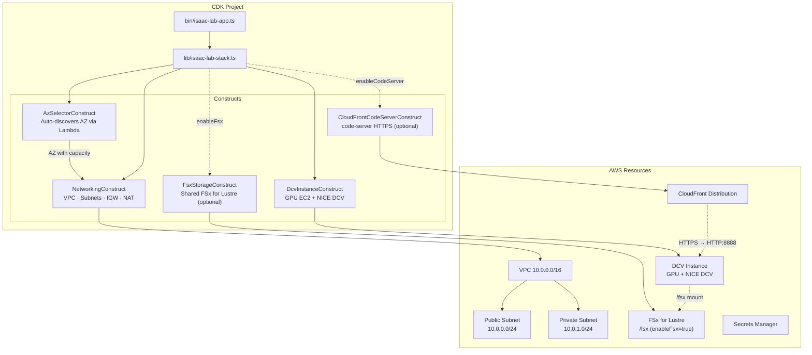

# Isaac Lab Golden Template

A CDK TypeScript project for one-click deployment of an NVIDIA Isaac Lab reinforcement learning environment on AWS.

The CDK project itself is the main deliverable; the CloudFormation template is a byproduct generated by `cdk synth`.

> 한국어 문서: [README.ko.md](README.ko.md)

## Improvements Over the Original Workshop Template

| Item | Original Workshop Template | Golden Template |
|------|-------------------|-----------------|
| Region support | 3 regions hardcoded | 12-region DLAMI mapping + multi-region deployment |
| Version management | Fixed | Version Profile based (stable / latest) |
| AZ selection | Index 0 fixed | Custom Resource Lambda auto-discovers capacity + instance type fallback |
| Instance type | g6.12xlarge fixed | Automatic fallback g6e.4xlarge → g6.4xlarge → g6e.8xlarge → g6.8xlarge → g6.12xlarge → g6e.12xlarge → g6e.2xlarge |
| UserData | Monolithic | Independent shell script modules (cloudwatch-agent.sh, code-server.sh are optional). GR00T-N1.6-3B model weights are automatically downloaded to the instance local disk by models-download.sh, while the Docker build and running the inference server are performed manually by the user |
| Security | Insufficient | allowedCidr, FSx SG restricted to VPC CIDR, EBS encryption, Secrets Manager ARN restriction |
| Network stability | Route-IGW dependency not specified | Explicit PublicRoute → VPCGatewayAttachment DependsOn |
| NVIDIA driver | Installed directly in UserData | Old DLAMI (550) + natural upgrade to 570 |
| DCV GL | Not installed | DCV GL auto-installed + automatic single-GPU xorg.conf generation |
| IaC | CloudFormation YAML | CDK TypeScript (type safety, code reuse) |

## Architecture



## Prerequisites

- Node.js 18 or higher
- AWS CDK CLI: `npm install -g aws-cdk`
- AWS credentials: AdministratorAccess or equivalent permissions
- GPU instance service quota: check the G6/G5 instance quota in the deployment region → pre-check with `./scripts/check-quotas.sh -n <headcount>`
- CDK Bootstrap: must be run once in the target deployment region

## Supported Regions

| Region | Code | DCV AMI | Notes |
|------|------|:-------:|------|
| N. Virginia | us-east-1 | DLAMI 22.04/24.04 | Recommended (largest scale) |
| Oregon | us-west-2 | DLAMI 22.04/24.04 | Recommended |
| Ohio | us-east-2 | DLAMI 22.04/24.04 | Recommended |
| Frankfurt | eu-central-1 | DLAMI 22.04/24.04 | Recommended for EU |
| Mumbai | ap-south-1 | DLAMI 22.04/24.04 | |
| London | eu-west-2 | DLAMI 22.04/24.04 | |
| Tokyo | ap-northeast-1 | DLAMI 22.04/24.04 | |
| Canada | ca-central-1 | DLAMI 22.04/24.04 | |
| Sydney | ap-southeast-2 | DLAMI 22.04/24.04 | |
| Seoul | ap-northeast-2 | DLAMI 22.04/24.04 | |
| Stockholm | eu-north-1 | DLAMI 22.04/24.04 | |
| Sao Paulo | sa-east-1 | DLAMI 22.04/24.04 | |

> 12 regions that support both g6 and g5. Paris (g6 only) and Ireland (g5 only) are excluded.

### AMI Strategy

The DCV instance uses the **Deep Learning OSS Nvidia Driver AMI GPU PyTorch**. This AMI comes with AWS CLI, the NVIDIA driver, Docker, and PyTorch pre-installed, which shortens UserData execution time and makes behavior consistent across regions.

- stable: `Deep Learning OSS Nvidia Driver AMI GPU PyTorch 2.4.1 (Ubuntu 22.04) 20250623`
  - NVIDIA driver 550 pre-installed → naturally upgraded to 570 in UserData
  - Verified compatibility with DCV 2025.0 (same series as the reference stack)
- latest: `Deep Learning OSS Nvidia Driver AMI GPU PyTorch 2.9 (Ubuntu 24.04) 20260226`
  - NVIDIA driver 580 pre-installed → replaced with 570 by nvidia-driver.sh

> nvidia-driver.sh automatically replaces whatever driver is pre-installed on the DLAMI with the profile-specified version (570). xorg.conf generation is based on lspci, so it works regardless of kernel module state.


## Quota Pre-check (for Workshop Administrators)

If service quotas such as VPC, EIP, and GPU vCPU are insufficient, the deployment will fail. Before deploying, use `check-quotas.sh` to check whether there is headroom relative to current usage.

```bash
# Planning to deploy for 10 people — check only (run in a bash subshell so exit 1 doesn't affect the current shell)
bash ./scripts/check-quotas.sh -n 10 || true

# Automatically request an increase if insufficient (excluding GPU vCPU — requires a separate ticket)
bash ./scripts/check-quotas.sh -n 10 --auto-request || true

# Specify a region
bash ./scripts/check-quotas.sh -n 20 -r us-west-2 --auto-request || true
```

| Check Item | Per User | Notes |
|-----------|----------|------|
| VPCs per Region | 1 | |
| Internet Gateways | 1 | |
| NAT Gateways per AZ | 1 | |
| Elastic IPs | 1 | For NAT GW |
| G/VT On-Demand vCPU | 48 | Based on g6.12xlarge, **cannot be auto-increased — requires a separate ticket** |
| CloudFront Distributions | 1 | code-server CDN |
| Secrets Manager Secrets | 1 | DCV password |
| CloudFormation Stacks | 1 | |
| Security Groups | 1 | DCV (2 if `enableFsx=true`, including the FSx SG) |

> The GPU vCPU quota (`Running On-Demand G and VT instances`) must be increased manually via the Service Quotas console or an AWS Support ticket.

## Quick Start

```bash
# 1. Install dependencies
npm install

# 2. CDK Bootstrap (once per target region, run in advance by an administrator)
cdk bootstrap

# 3. Basic deployment (automatic instance type fallback)
cdk deploy

# 4. Deploy to a different region
cdk deploy -c region=us-west-2

# 5. Specify an instance type directly (ignores fallback)
cdk deploy -c inferenceInstanceType=g6e.4xlarge

# 6. Enable CloudWatch Agent (GPU/CPU/memory/disk monitoring)
cdk deploy -c enableCloudWatch=true

# 7. Disable code-server (VSCode) (skips CloudFront + code-server installation)
cdk deploy -c enableCodeServer=false

# 8. latest profile (Ubuntu 24.04 + Isaac Sim 5.1.0)
cdk deploy -c versionProfile=latest

# 9. Override only the Isaac Sim version (unpins the profile's Isaac Lab tag → clones main)
cdk deploy -c isaacSimVersion=5.1.0 -c region=us-east-1

# 10. Deploy from a remote shell (prevent session disconnects)
nohup npx cdk deploy --require-approval never > deploy.log 2>&1 &
tail -f deploy.log

# 11. Preview changes
cdk diff

# 12. Generate the CloudFormation template (without deploying)
cdk synth

# 13. Delete the stack
cdk destroy

cdk deploy -c profile=workshop-studio   # Workshop Studio account (CPU workstation)
```

> Automatic fallback order when the instance type is not specified: `g6e.4xlarge → g6.4xlarge → g6e.8xlarge → g6.8xlarge → g6.12xlarge → g6e.12xlarge → g6e.2xlarge`

## Props

| Props | Type | Default | Description |
|-------|------|--------|------|
| `profile` | `personal` \| `workshop-studio` | `personal` | Deployment profile. `workshop-studio` is for Workshop Studio event accounts — since the EC2 G/P family vCPU limit is 0, it uses a CPU workstation (`m6i.4xlarge → m5.4xlarge → m6a.4xlarge`) and only skips `nvidia-driver.sh` in UserData (the AMI, Docker image build, model download, and code-server are otherwise the same). The Isaac Sim module cannot proceed |
| `versionProfile` | `stable` \| `latest` | `latest` | Selects the software stack profile |
| `inferenceInstanceType` | `string` | (auto fallback) | DCV GPU instance type. If unspecified, auto-discovers in the order `g6e.4xlarge → g6.4xlarge → g6e.8xlarge → g6.8xlarge → g6.12xlarge → g6e.12xlarge → g6e.2xlarge` (`m6i.4xlarge → m5.4xlarge → m6a.4xlarge` if `profile=workshop-studio`) |
| `preferredAZ` | `auto` \| `0`~`5` | `auto` | AZ selection. auto lets a Lambda auto-discover capacity |
| `allowedCidr` | CIDR string | `0.0.0.0/0` | Inbound source CIDR for the DCV security group |
| `region` | Region code | CDK default region | Target deployment region (for multi-region deployment) |
| `vpcCidr` | CIDR string | `10.0.0.0/16` | VPC network range |
| `enableCloudWatch` | `true` \| `false` | `false` | Whether to install the CloudWatch Agent (GPU/CPU/memory/disk monitoring) |
| `enableCodeServer` | `true` \| `false` | `true` | Whether to install code-server (VSCode). If `false`, code-server, CloudFront, and SG port 8888 are all skipped |
| `grootWeightsUrl` | `s3://...` \| `https://....tar.gz` | (none) | Location of a copy of the GR00T-N1.6-3B weights (about 6.1GiB). If unspecified, they are fetched from HuggingFace. Pointing to an S3 copy in the same region speeds up the download and removes the dependency on HuggingFace availability |
| `modelsDir` | Absolute path | `/home/ubuntu/environment/models` | Instance-local path where models/weights are downloaded. Passed as the `MODELS_DIR` environment variable in UserData and used by `models-download.sh` |
| `enableFsx` | `true` \| `false` | `false` | Whether to create a shared FSx for Lustre (PERSISTENT_2). Not needed for the default workflow, since the DCV instance pulls the checkpoint that SageMaker exported to S3 via `aws s3 sync`. Turn this on only if you want to join a HyperPod stack to this VPC with `-c createVpc=false -c fsxFileSystemId=...` to consolidate storage into one. Turning it on also creates the `/fsx` mount, `Fsx*` Outputs, and the groot stack's DRA, and the filesystem is billed for as long as it exists. To turn off FSx on an existing stack, you must first remove the groot stack's DRA (delete `fsxFileSystemId` from `infra/groot/cdk.context.json`, then redeploy groot → redeploy IsaacLab) |
| `fsxCapacityGiB` | multiple of 1200 | `1200` | FSx capacity (GiB) when `enableFsx=true` |
| `isaacSimVersion` | `string` | (profile default) | Isaac Sim version override. When specified, the profile's `isaacLabVersion` pin is released and IsaacLab `main` is cloned. Use `versionProfile` for verified combinations |

Props are passed via CDK Context:

```bash
# Deploy latest to the default region (automatic AZ selection)
cdk deploy

# Deploy stable to us-west-2
cdk deploy -c region=us-west-2 -c versionProfile=stable

# Specify the AZ manually (skips Lambda discovery)
cdk deploy -c preferredAZ=1

# Restrict the security group source CIDR
cdk deploy -c allowedCidr=10.0.0.0/8

# Fetch GR00T weights from an S3 copy in the same region
cdk deploy -c grootWeightsUrl=s3://my-assets/GR00T-N1.6-3B/

# Change the model download path
cdk deploy -c modelsDir=/data/models
```

## Deployment Identifier (One Account per Person)

This infrastructure assumes one account per person. The account ID of the target deployment account is automatically used as the identifier in the stack name and resource tags.

| Item | Value |
|------|----|
| Stack name | `IsaacLab-Latest-<ACCOUNT_ID>` (`-Stable-` depending on versionProfile) |
| Resource tag | `UserId: <ACCOUNT_ID>` (all resources — used by the HyperPod stack's VPC lookup) |

- If the GPU instance quota (`Running On-Demand G and VT instances`) is insufficient, deployment fails, so check Service Quotas beforehand.
- The default VPC quota is 5 per region. In accounts with many existing VPCs, clean up before deploying.

## CloudShell Deployment Guide

AWS CloudShell comes with AWS CLI, git, and python3 pre-installed, but the Node.js version may be too low or the CDK CLI may be missing for CDK deployment. `setup-cloudshell.sh` automatically sets up the environment.

### Initial Setup (once)

```bash
# One-line environment setup (clone + Node.js + dependencies + CDK check)
git clone --depth 1 https://github.com/hi-space/aws-physical-ai-recipes.git ~/aws-physical-ai-recipes
source ~/aws-physical-ai-recipes/e2e-workshop/infra/isaaclab/scripts/setup-cloudshell.sh
```

On reconnect, just re-run the script (if already cloned, it does a git pull followed by npm install):

```bash
source ~/aws-physical-ai-recipes/e2e-workshop/infra/isaaclab/scripts/setup-cloudshell.sh
```

What `setup-cloudshell.sh` does:
- Clones the repository (git pull if already present)
- cd's into `~/aws-physical-ai-recipes/e2e-workshop/infra/isaaclab`
- Checks for Node.js 18+ (auto-installs via nvm if lower)
- Runs `npm install` (project dependencies + CDK CLI)
- Verifies the CDK CLI works

> When a CloudShell session ends, files outside `$HOME` are deleted. Since it's cloned into `$HOME`, the source is preserved, but `node_modules` needs reinstalling, so re-run the `source` command on reconnect.

### Deployment

```bash
# CDK Bootstrap (once per region, run in advance by an administrator)
npx cdk bootstrap

# Deploy (use nohup to prevent session disconnects — CloudShell terminates after 20 minutes of inactivity)
nohup npx cdk deploy --require-approval never > deploy.log 2>&1 &

# Check progress
tail -f deploy.log
```

### Verifying Deployment Completion

```bash
# Check Outputs
cat deploy.log | grep -E 'Outputs|DcvUrl|CodeServerUrl|SecretArn'

# Or query directly in CloudFormation
aws cloudformation describe-stacks \
  --stack-name IsaacLab-Stable-alice \
  --query 'Stacks[0].Outputs' --output table
```

### DCV Access

1. Open `DcvUrl` in a browser (e.g., `https://<PublicIP>:8443`)
2. Certificate warning → "Advanced" → "Proceed"
3. Log in: username `ubuntu`, password from Secrets Manager

```bash
# Look up the password (extract SecretArn from deploy.log)
aws secretsmanager get-secret-value \
  --secret-id $(cat deploy.log | grep SecretArn | awk -F= '{print $2}' | tr -d ' ') \
  --region us-east-1 \
  --query SecretString --output text | python3 -c "import sys,json; print(json.load(sys.stdin)['password'])"
```

Or check it in the AWS Console → Secrets Manager. Since CloudFormation auto-generates the secret name (`IsaacLab-<Profile>-<ACCOUNT_ID>-DcvSecret-<random string>`), it's most reliable to find it via the stack output's `SecretArn`. When looking in the console, look for an entry whose Name tag is `IsaacLab-<Profile>-<ACCOUNT_ID>-Secret`.

### code-server (VSCode) Access

If deployed with `enableCodeServer=true` (default), you can access browser-based VSCode via CloudFront.

- Open `CodeServerUrl` in a browser (CloudFront HTTPS URL)
- Password: same as DCV (same Secrets Manager secret)

### Verifying the Environment Setup

After connecting to DCV, use the following commands in a terminal to verify the installation is correct:

```bash
# Check the GPU driver (should show L40S or L4)
nvidia-smi

# Check the Isaac Lab Docker image
docker images | grep isaaclab

# Check the FSx mount
df -h | grep fsx

# Check code-server status
systemctl status code-server

# Check the GR00T model weights (downloaded to the local disk by models-download.sh)
ls /home/ubuntu/environment/models/GR00T-N1.6-3B
```

If there is a problem, check the UserData log:

```bash
sudo tail -100 /var/log/user-data.log
```

### Deleting the Stack

```bash
npx cdk destroy
```

## Automatic AZ Selection

When `preferredAZ=auto` (default), a Custom Resource Lambda automatically discovers, at deployment time, an AZ and instance type with GPU capacity.

How it works:
1. Tries the instance type fallback list in order: `g6e.4xlarge → g6.4xlarge → g6e.8xlarge → g6.8xlarge → g6.12xlarge → g6e.12xlarge → g6e.2xlarge`. For the workshop-studio profile: `m6i.4xlarge → m5.4xlarge → m6a.4xlarge`.
2. For each instance type, queries the list of supported AZs via `describe-instance-type-offerings`
3. Shuffles the AZ list to avoid concentrating on a particular AZ
4. Attempts `RunInstances` (MinCount=1) in each AZ
5. On success, immediately terminates it and passes that AZ + instance type to the EC2 Instance
6. On `InsufficientInstanceCapacity`, tries the next AZ; if all AZs fail, falls back to the next instance type
7. If all types/AZs fail, stack creation fails

This approach greatly reduces deployment failures caused by insufficient GPU capacity. The probe instances are terminated within seconds, so the cost is negligible.

If `inferenceInstanceType` is explicitly specified, only that type is tried. If `preferredAZ` is specified as an index (`'0'`~`'5'`), the Lambda discovery is skipped and the AZ at that index is used directly.

## Version Profile Details

### stable

An earlier combination based on Isaac Sim 4.5.0 + Isaac Lab 2.1.1. Choose it with `-c versionProfile=stable` when you need assets specific to 4.5.0.

| Item | Value |
|------|---|
| Ubuntu | 22.04 LTS |
| AMI | Deep Learning OSS Nvidia Driver AMI GPU PyTorch 2.4.1 (Ubuntu 22.04) 20250623 |
| ROS2 | Humble Hawksbill |
| NVIDIA driver | 570 (DLAMI 550 → apt upgrade) |
| Isaac Sim | 4.5.0 (`nvcr.io/nvidia/isaac-sim:4.5.0`) |
| Isaac Lab | 2.1.1 (pinned to tag `v2.1.1`) |
| CUDA | 12.8 (based on driver 570) |

### latest (default)

The default workshop combination. Uses Isaac Sim 5.1.0 + Isaac Lab 2.3.2 on the Ubuntu 24.04 Deep Learning AMI.

| Item | Value |
|------|---|
| Ubuntu | 24.04 LTS |
| AMI | Deep Learning OSS Nvidia Driver AMI GPU PyTorch 2.9 (Ubuntu 24.04) 20260226 |
| ROS2 | Jazzy Jalisco |
| NVIDIA driver | 570 (DLAMI 580 → replaced with 570) |
| Isaac Sim | 5.1.0 (`nvcr.io/nvidia/isaac-sim:5.1.0`) |
| Isaac Lab | 2.3.2 (pinned to tag `v2.3.2`) |
| CUDA | 12.8 (based on driver 570) |

Ubuntu 24.04-specific handling (applied automatically in `common.sh`, `isaac-lab.sh`):
- DCV installation: since `install-dcv.sh` doesn't support 24.04, `nice-dcv-ubuntu2404-x86_64.tgz` is downloaded and installed directly (including DCV GL)
- Wayland disabled: adds `WaylandEnable=false` to `/etc/gdm3/custom.conf` (DCV is X11-based)
- nvidia-xconfig skipped: on Ubuntu 24.04, the xorg.conf generated by `nvidia-xconfig` causes the X server to fail to start, so this is left to GDM auto-detection
- `systemd-networkd-wait-online` disabled: avoids conflicts with NetworkManager on the GNOME desktop
- Isaac Sim 5.1.0 EULA: `ENV ACCEPT_EULA=Y` + `USER root` are automatically added to the Dockerfile (not needed for 4.x, but required from 5.x)


## CfnOutput Reference

After deployment completes, the following values are output as CloudFormation Outputs:

| Output Key | Description | Use |
|------------|------|------|
| `InstanceId` | DCV instance ID | Check the instance in the EC2 console |
| `DcvUrl` | DCV access URL (`https://<PublicIP>:8443`) | Access DCV in a browser |
| `CodeServerUrl` | code-server access URL (`https://<CloudFront>`) | Access VSCode in a browser (when `enableCodeServer=true`) |
| `LogGroupName` | VPC Flow Log log group name | Check network logs in CloudWatch Logs |
| `LogGroupArn` | VPC Flow Log log group ARN | Reference in IAM policies, etc. |
| `SecretArn` | DCV password Secret ARN | Look up the password with `aws secretsmanager get-secret-value` |
| `VersionProfile` | Selected version profile | Check the deployed profile |
| `DeploymentProfile` | Deployment profile (`personal` \| `workshop-studio`) | Check whether it's a CPU or GPU workstation |
| `PrivateSubnetId` | Private subnet ID | Referenced by the groot/HyperPod stacks |
| `FsxFileSystemId` | Shared FSx for Lustre ID (when `enableFsx=true`) | Referenced by the groot SageMaker DRA/HyperPod |
| `FsxMountName` | FSx Lustre mount name (when `enableFsx=true`) | Referenced for manual mounting |
| `FsxSecurityGroupId` | FSx security group ID (when `enableFsx=true`) | Referenced when allowing Lustre access |

Looking up the DCV password:

```bash
aws secretsmanager get-secret-value \
  --secret-id <SecretArn value> \
  --query SecretString \
  --output text
```

## Post-Deployment Workflow

After deployment completes, connect to DCV and proceed in the order below. See the separate guides for details on each step.

### Running Isaac Lab Reinforcement Learning

Run a Docker container in the DCV terminal and perform Isaac Lab training:

```bash
# Run the container
cd ~/environment/IsaacLab && xhost +
docker run --shm-size=60g --name isaac-lab \
  --entrypoint bash -it --gpus all --rm --network=host \
  -e "ACCEPT_EULA=Y" -e "PRIVACY_CONSENT=Y" -e DISPLAY \
  isaaclab-batch:latest
```

```bash
# Headless training inside the container (no rendering, fast, recommended for the workshop)
cd /workspace/IsaacLab && \
./isaaclab.sh -p scripts/reinforcement_learning/skrl/train.py \
  --task Isaac-Velocity-Rough-H1-v0 \
  --num_envs 2048 \
  --headless
```

| Mode | Command | Characteristics |
|------|------|------|
| GUI | `torch.distributed.run` + `train.py` (headless not specified) | Simulation can be visualized in DCV. Training is slow due to rendering overhead |
| Headless | `isaaclab.sh -p train.py --headless` | Focuses on training with no rendering. Recommended for the workshop |

Training logs and checkpoints are stored inside the container at `/workspace/IsaacLab/logs/skrl/h1_rough/`.

### Model Inference (Visualizing in IsaacSim)

Load a trained checkpoint to visually verify the robot's behavior:

```bash
# Run in a container with the model directory mounted
docker run --shm-size=60g --name isaac-lab \
  --entrypoint bash -it --gpus all --rm --network=host \
  -v /home/ubuntu/environment/models:/workspace/IsaacLab/TrainedModel \
  -e "ACCEPT_EULA=Y" -e "PRIVACY_CONSENT=Y" -e DISPLAY \
  isaaclab-batch:latest
```

```bash
# Run inference inside the container
cd /workspace/IsaacLab && \
./isaaclab.sh -p scripts/reinforcement_learning/skrl/play.py \
  --task=Isaac-Velocity-Rough-H1-v0 \
  --num_envs 25 \
  --checkpoint=/workspace/IsaacLab/TrainedModel/agent_72000.pt
```

| Checkpoint | Path | Description |
|------------|------|------|
| Pre-trained | `/workspace/IsaacLab/TrainedModel/agent_72000.pt` | Automatically placed on the local disk at boot (72,000 iterations) |
| RL training result | `/workspace/IsaacLab/TrainedModel/models/h1_rough/{timestamp}_ppo_torch/checkpoints/best_agent.pt` | Best-performing checkpoint from training |

### GR00T N1 Inference Test

Building the GR00T Docker image and running the inference server are no longer performed automatically at boot. The model weights (`/home/ubuntu/environment/models/GR00T-N1.6-3B`) are pre-downloaded to the instance local disk, so the user builds and runs them manually.

```bash
# 1) Clone the GR00T repository + write the Dockerfile
mkdir -p /home/ubuntu/environment/groot_docker
cd /home/ubuntu/environment/groot_docker
git clone --branch n1.6-release https://github.com/NVIDIA/Isaac-GR00T.git gr00t

cat > Dockerfile <<'EOF'
FROM nvcr.io/nvidia/pytorch:25.04-py3
ENV DEBIAN_FRONTEND=noninteractive
ENV PIP_CONSTRAINT=""
COPY gr00t/ /workspace/gr00t/
WORKDIR /workspace/gr00t
RUN pip install --no-cache-dir -e .
EXPOSE 5555
ENTRYPOINT ["python"]
CMD ["gr00t/eval/run_gr00t_server.py"]
EOF

# 2) Build the Docker image (takes several tens of minutes)
docker build -t groot-n1:latest .

# 3) Run the inference server (mount the model weights directory)
docker run --rm --gpus all --name groot-inference --network=host \
  -v /home/ubuntu/environment/models:/workspace/weights \
  groot-n1:latest \
  gr00t/eval/run_gr00t_server.py \
  --model_path /workspace/weights/GR00T-N1.6-3B \
  --embodiment_tag GR1 \
  --host 0.0.0.0 --port 5555

# 4) Check the port
ss -tlnp | grep 5555
```

Ping test:

```bash
cd /home/ubuntu/environment/groot_docker/gr00t
PYTHONPATH=$(pwd) python3 -c "
from gr00t.policy.server_client import PolicyClient
policy = PolicyClient(host='localhost', port=5555)
print('SUCCESS' if policy.ping() else 'FAILED')
"
```

Expected response: `SUCCESS`

For access from outside, use TCP port 5555 on the EC2 public IP (automatically allowed in the Security Group). See `documents/groot-zmq-test-guide.md` for detailed testing instructions.

## Customization Guide

### Modifying the Dockerfile

You can customize the Docker image by directly editing `assets/workshop/Dockerfile`. The Isaac Sim version is automatically patched (via sed) in `isaac-lab.sh`.

### Changing the Instance Type

```bash
cdk deploy -c inferenceInstanceType=g6.xlarge
# Multi-GPU: g6.12xlarge, g5.12xlarge — supported in all 12 regions
# DCV workshop (single GPU): g6.xlarge, g5.xlarge — easier to secure capacity
# g6e/g7e exist only in some regions, so they are not suitable as the default type
```

### Adding a New Version Profile

Add an entry to the `VERSION_PROFILES` object in `lib/config/version-profiles.ts`. The `VersionProfileName` type expands automatically, so no additional type changes are needed. Make sure a corresponding AMI for the new profile exists in `lib/config/ami-mappings.ts`.

## Troubleshooting Guide

### Insufficient GPU Capacity

With `preferredAZ=auto` (default), a Custom Resource Lambda automatically discovers an AZ with capacity, so this issue is usually resolved automatically.

If capacity is insufficient in all AZs:

```bash
# Try a single-GPU instance (for the DCV workshop, easier to secure capacity)
cdk deploy -c inferenceInstanceType=g6.xlarge

# Fall back to g5 (if g6 capacity is insufficient)
cdk deploy -c inferenceInstanceType=g5.12xlarge

# Deploy to a different region
cdk deploy -c region=us-west-2
```

### AZ Discovery Fails Because a Specific AZ Has No Default Subnet

When using `preferredAZ=auto` (default), an error like the following means a specific AZ has no Default Subnet:

```
Received response status [FAILED] from custom resource.
Message returned: An error occurred (InvalidInput) when calling the RunInstances operation:
No default subnet for availability zone: 'us-east-1b'
```

Cause: since the AZ discovery Lambda doesn't specify a subnet when calling `run_instances` for the probe, it fails if there is no Default Subnet. This can happen in two cases:

1. The account has no Default VPC at all (fails in every AZ)
2. There is a Default VPC, but a specific AZ has no Default Subnet (a new AZ was added to the region, or someone deleted it)

Checking the current state:

```bash
# Check whether a Default VPC exists
aws ec2 describe-vpcs --filters "Name=isDefault,Values=true" \
  --region us-east-1 --query 'Vpcs[].VpcId' --output text

# Full list of AZs in the region
aws ec2 describe-availability-zones --region us-east-1 \
  --query 'AvailabilityZones[].ZoneName' --output text

# List of AZs that have a Default Subnet (compare with the above)
aws ec2 describe-subnets --filters "Name=default-for-az,Values=true" \
  --region us-east-1 --query 'Subnets[].AvailabilityZone' --output text
```

How to fix it:

```bash
# If there is no Default VPC: create one (Default Subnets are created in all AZs together)
aws ec2 create-default-vpc --region us-east-1

# If only a specific AZ lacks a Default Subnet: create one for that AZ
aws ec2 create-default-subnet --availability-zone us-east-1b

# Or specify the AZ directly (skips Lambda discovery)
cdk deploy -c preferredAZ=0                # Use the region's first AZ
cdk deploy -c preferredAZ=us-east-1a       # Specify the AZ name directly
```

> Specifying `preferredAZ` as an index (`0`~`5`) or an AZ name skips the `AzSelectorConstruct` Lambda, so deployment proceeds regardless of Default Subnet availability. However, that AZ may lack GPU capacity, so it's recommended to check beforehand.

### Cleaning Up a Failed Stack

```bash
# Delete the failed stack
aws cloudformation delete-stack --stack-name IsaacLabStack --region us-east-1
aws cloudformation wait stack-delete-complete --stack-name IsaacLabStack --region us-east-1

# Redeploy
cdk deploy
```

### When Deployment Takes a Long Time (Checking UserData Progress)

It's normal for `cdk deploy` to take a while. The EC2 instance performs package installation, an NVIDIA driver upgrade, an Isaac Lab Docker build, and more via UserData, and the CreationPolicy waits (up to 120 minutes) for a cfn-signal. UserData takes about 25 minutes, and the whole stack takes about 35 minutes.

To check progress in real time:

1. EC2 console → select the instance → **Connect** → **Session Manager** tab → **Connect**
2. Check the log:

```bash
sudo tail -f /var/log/user-data.log
```

Each module's `START`/`END` markers let you identify the current stage:

```
===== [date] START: common.sh =====        ← System updates, DCV, ROS, Docker installation
===== [date] END: common.sh =====
===== [date] START: nvidia-driver.sh =====  ← NVIDIA driver upgrade
===== [date] END: nvidia-driver.sh =====
===== [date] STAGE: isaac-lab.sh (background) =====      ← Isaac Lab Docker build (background, takes the longest)
===== [date] STAGE: models-download.sh (background) ===== ← Model weight download (background)
===== [date] STAGE: fsx-mount.sh =====      ← Shared FSx mount (/fsx). SKIPPED if enableFsx=false (default)
===== [date] STAGE: s3files-client.sh ===== ← S3 Files client (amazon-efs-utils) + s3files-mount helper install
===== [date] STAGE: waiting for background jobs ... ===== ← Waiting for background jobs to finish
```

> `isaac-lab.sh` (Docker build) and `models-download.sh` (weight download) run in parallel in the background,
> and their progress logs are recorded in `/var/log/isaac-lab.log` and `/var/log/models-download.log` respectively
> (merged into user-data.log on completion). To check progress in real time, use `sudo tail -f /var/log/isaac-lab.log`.
> In general, the dpkg lock wait in `common.sh` and the Docker build in `isaac-lab.sh` take the longest.

### Debugging UserData Failures

If an error occurs during UserData execution, it is automatically detected by `trap ERR`, and cfn-signal reports a failure status (`-e 1`) to CloudFormation, causing the CreationPolicy to fail immediately. Commands guarded with `|| true` are not treated as errors.

If the stack is in CREATE_FAILED:

1. Connect to the instance via SSM Session Manager
2. Check `/var/log/user-data.log` for the failure point using each module's start/end markers:

```
===== [date] START: common.sh =====
===== [date] END: common.sh =====
===== [date] START: nvidia-driver.sh =====
# If it stops here, the failure is in nvidia-driver.sh
```

### S3 Files Mount (artifacts bucket, default path)

`s3files-client.sh` installs the Amazon S3 Files client (`amazon-efs-utils` >= 3.0, `mount.s3files`) and the mount helper `/usr/local/bin/s3files-mount`. The file system itself is created over the artifacts bucket by the [`infra/groot/`](../groot/) stack (on by default), so after the GrootFinetune stack is deployed you mount it on the DCV instance with one line:

```bash
sudo s3files-mount GrootFinetune-<ACCOUNT_ID> /mnt/s3/groot     # reads the S3FilesFileSystemId stack Output and mounts it
ls /mnt/s3/groot/models/groot-sm/                               # SageMaker-exported checkpoints appear directly
```

The helper registers the mount in `/etc/fstab` with `_netdev,nofail`, so it remounts after a reboot (verified 2026-09-13, us-west-2, g6.4xlarge). S3 objects appear as root-owned `644/755`, so the `ubuntu` user can read but writing needs `sudo`. Reads of 1 MiB or more stream straight from S3 (about 140 MB/s single stream, about 760 MB/s with 8 parallel readers); the Policy Server loads the 6.5 GB GR00T checkpoint in about 35 s. Files written through the mount show up in S3 after roughly 60 s. If the client install fails, only a `[WARN]` is logged and the deployment continues; checkpoints can still be pulled with `aws s3 sync`.

### FSx Mount (when `enableFsx=true`)

The default deployment (`enableFsx=false`) has no FSx, and `fsx-mount.sh` finishes as `SKIPPED` — checkpoints are received via `aws s3 sync`. If deployed with `enableFsx=true`, the shared FSx for Lustre is mounted at `/fsx` in UserData, and it is automatically registered in `/etc/fstab` so it remounts automatically after a reboot. If Lustre kernel module installation fails, the deployment still proceeds and only a `[WARN]` marker is left, so in that case mount it manually:

```bash
sudo mount -t lustre -o relatime,flock \
  <FSX_DNS_NAME>@tcp:/<FSX_MOUNT_NAME> /fsx
```

You can find the values you need in the `FsxFileSystemId`/`FsxMountName` stack Outputs.

### Docker Build Failure

If the Docker build fails in `isaac-lab.sh`:

```bash
# Check that the Isaac Sim Docker image can be pulled
docker pull nvcr.io/nvidia/isaac-sim:4.5.0
```

### Known Limitations

- UserData size limit: EC2 UserData is limited to 16KB after Base64 encoding. Comments and blank lines in shell scripts are automatically stripped to work around this (14KB → 8.5KB). Comments inside heredoc blocks are preserved
- UserData error tracking: `trap 'USERDATA_EXIT=1' ERR` + `set -o pipefail` report a failure status via cfn-signal when an error occurs. Commands guarded with `|| true` do not trigger the error trap
- NVIDIA driver: nvidia-driver.sh automatically detects the driver version pre-installed on the DLAMI and replaces it with the profile-specified version (570). Both stable (DLAMI 550→570 upgrade) and latest (DLAMI 580→570 replacement) are handled automatically. xorg.conf is generated based on lspci, independent of kernel module state
- DCV GL: DCV GL (`nice-dcv-gl`) is not included on the DLAMI. `common.sh` installs DCV GL together when installing DCV and runs `dcvgladmin enable`
- xorg.conf: `nvidia-xconfig --enable-all-gpus` creates 4 Screens in a multi-GPU environment, which conflicts with DCV. An xorg.conf must be generated directly with a single-GPU + `Virtual 4096 2160` + `HardDPMS false` configuration. Do not use `nvidia-xconfig`
- S3 Files (default): the `s3files-mount` helper registers the mount in `/etc/fstab` so it remounts after a reboot. It is NFS, so the `ubuntu` user is read-only (write with `sudo`)
- FSx (optional, `enableFsx=true`): automatically registered in `/etc/fstab` so it remounts automatically after a reboot. The default has no FSx: S3 Files mount (or `aws s3 sync`)
- Single-AZ structure: only one private subnet (and, if `enableFsx=true`, one FSx filesystem) is created in the single AZ chosen by the AZ Selector. This is not a problem because the DCV instance checks capacity at deployment time. It could be made to span multiple AZs, but the current design prioritizes the simplicity of one-click deployment and keeps a single-AZ structure.
- CreationPolicy timeout: set to 120 minutes. Using the DLAMI, with the driver/Docker pre-installed, shortens UserData execution time. On error, cfn-signal reports failure immediately
- latest (Ubuntu 24.04) CDK deployment: the AWS CLI missing issue has been resolved by switching to the DLAMI
- Ubuntu 24.04 (latest) specific limitations:
  - The external scripts `install-dcv.sh` and `install-desktop.sh` don't fully support 24.04, so custom logic is substituted
  - `install-desktop.sh` produces a warning about the `python`/`python-dev` packages not being found (no functional impact)
  - The Isaac Sim 5.1.0 Docker image runs as a non-root user, requiring `USER root` to be added (applied automatically)
  - From Isaac Sim 5.1.0 onward, EULA agreement (`ACCEPT_EULA=Y`) is required (applied automatically)

## Project Structure

```
isaac-lab-golden-template/
├── bin/
│   └── isaac-lab-app.ts            # CDK App entry point (multi-region env configuration)
├── lib/
│   ├── isaac-lab-stack.ts          # Main stack (Construct composition)
│   ├── constructs/
│   │   ├── az-selector.ts          # Automatic AZ discovery (Custom Resource Lambda)
│   │   ├── networking.ts           # VPC, subnets, IGW, NAT, S3 Endpoint, Flow Log
│   │   ├── fsx-storage.ts          # Shared FSx for Lustre + security group (optional, when enableFsx=true)
│   │   ├── dcv-instance.ts         # DCV EC2 instance + IAM + Secrets Manager
│   │   ├── cloudfront-code-server.ts # CloudFront → code-server HTTPS (optional)
│   └── config/
│       ├── version-profiles.ts     # Version profile mapping (stable/latest)
│       └── ami-mappings.ts         # Per-region AMI ID mapping (12 regions)
├── assets/
│   ├── userdata/
│   │   ├── common.sh              # System updates, DCV, ROS, Docker installation
│   │   ├── nvidia-driver.sh       # NVIDIA driver + container-toolkit (skipped on DLAMI)
│   │   ├── cloudwatch-agent.sh    # CloudWatch Agent installation (optional, when enableCloudWatch=true)
│   │   ├── isaac-lab.sh           # Isaac Lab Docker build
│   │   ├── models-download.sh     # Model weight download to local disk
│   │   ├── fsx-mount.sh           # Shared FSx for Lustre mount (/fsx, when enableFsx=true)
│   │   ├── s3files-client.sh      # S3 Files client + s3files-mount helper install (mount happens after GrootFinetune deploy)
│   │   └── code-server.sh         # code-server + Claude Code installation (optional)
│   └── workshop/
│       ├── Dockerfile             # For building the Isaac Lab Docker image
│       └── distributed_run.bash   # Multi-GPU training execution wrapper
├── reference/
│   ├── IsaacLabEnvSetup.yml              # Original workshop template (preserved)
│   ├── IsaacLabEnvSetupHumble.yaml       # Original template, Humble version
│   └── IsaacLabEnvSetupHumble-AZSelect.yaml  # Original template with AZ selection feature
├── cdk.json                       # CDK configuration
├── tsconfig.json                  # TypeScript configuration
├── package.json                   # Dependency management
└── README.md                      # This document
```

