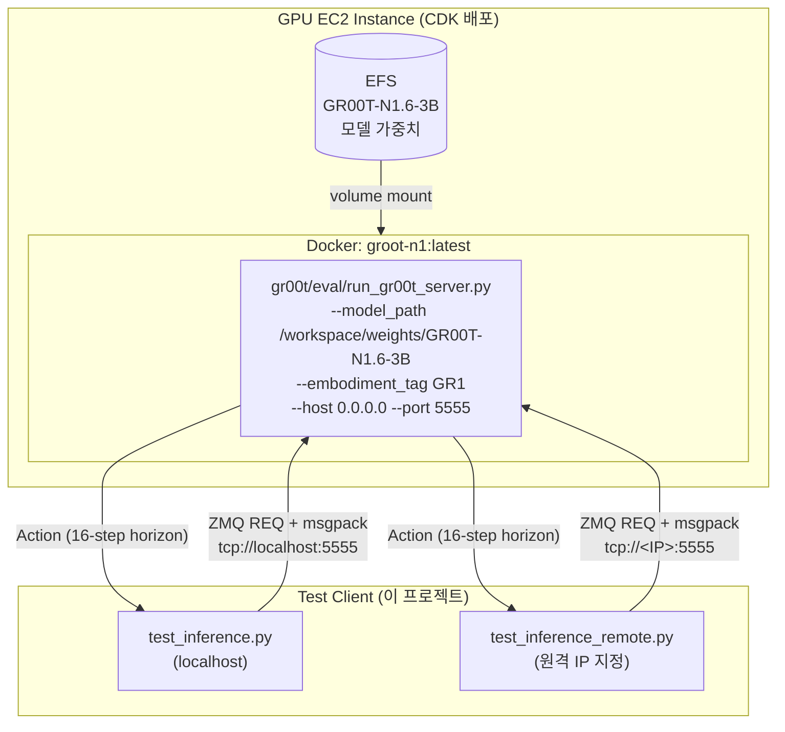
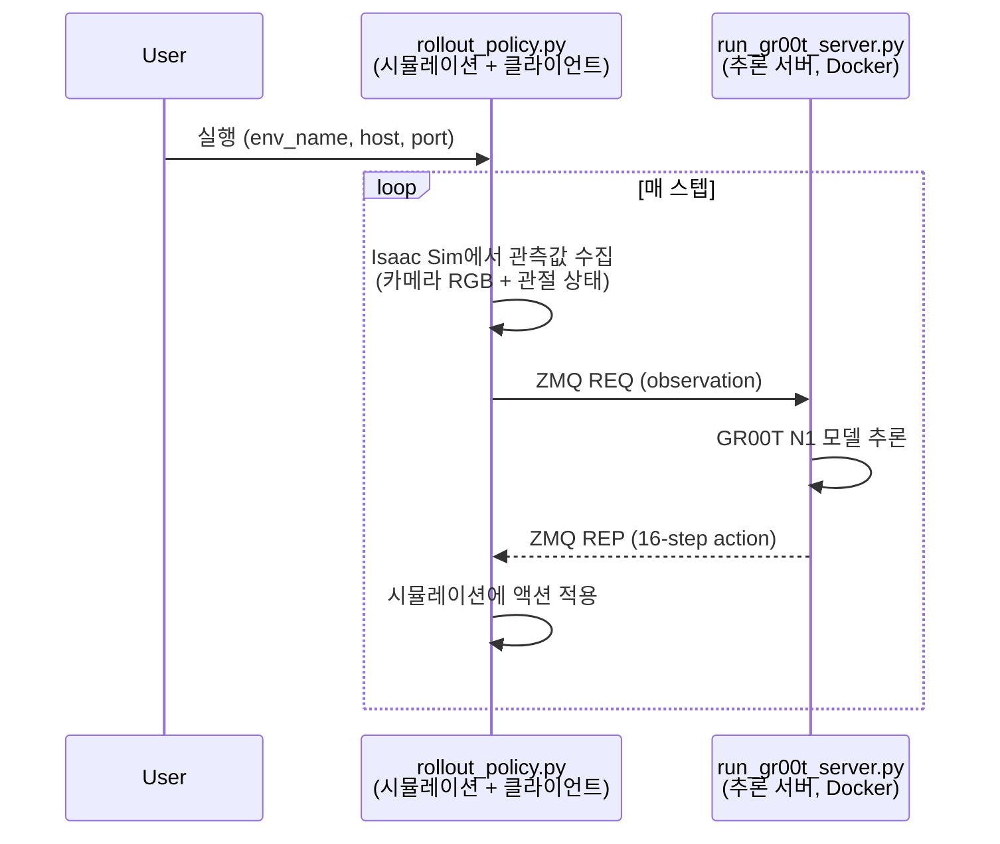

# GR00T N1 Inference Test Client

NVIDIA GR00T N1 추론 서버에 ZMQ를 통해 요청을 보내고 결과를 확인하는 경량 테스트 클라이언트입니다.
NVIDIA 공식 `PolicyClient` 없이 순수 ZMQ + msgpack으로 직접 통신합니다.

## 아키텍처



### 서버 배포 흐름 (CDK)

CDK(`infra-multiuser-groot/`)로 배포하면 `groot.sh` userdata가 자동으로:

1. HuggingFace에서 `nvidia/GR00T-N1.6-3B` 모델 가중치를 EFS에 다운로드
2. NVIDIA gr00t 리포지토리를 클론하고 Docker 이미지 빌드
3. systemd 서비스로 등록하여 부팅 시 자동 실행

| 항목 | 값 |
|------|-----|
| 모델 | GR00T-N1.6-3B (NVIDIA Foundation Model) |
| 서버 스크립트 | `gr00t/eval/run_gr00t_server.py` |
| 프로토콜 | ZMQ REQ/REP + msgpack (tcp:5555) |
| Embodiment | GR1 (NVIDIA 휴머노이드 로봇) |
| Action Horizon | 16 스텝 (한 번 추론에 16 프레임 미래 관절 명령 예측) |
| Docker Base | `nvcr.io/nvidia/pytorch:25.04-py3` |

## 시뮬레이션 연동 (Isaac Sim + GR00T)

실제 사용 시에는 Isaac Sim 시뮬레이션 환경과 GR00T 추론 서버를 연결해서 로봇을 제어합니다.
연결은 NVIDIA의 [Isaac-GR00T](https://github.com/NVIDIA/Isaac-GR00T) 리포에 있는 `rollout_policy.py`가 담당합니다.



| 프로세스 | 역할 | 실행 방식 |
|---------|------|----------|
| `run_gr00t_server.py` | 모델 추론 (ZMQ 서버) | systemd 자동 실행 (Docker) |
| `rollout_policy.py` | 시뮬레이션 루프 + 서버 호출 | 사용자가 직접 실행 |

`rollout_policy.py`가 하나의 스크립트 안에서 **Isaac Sim 환경 생성 + 매 스텝 추론 서버 호출**을 모두 처리합니다.
Isaac Lab을 별도로 띄울 필요 없이, 이 스크립트가 시뮬레이션의 진입점입니다.

```bash
# Isaac-GR00T eval 리포 클론 및 설치
cd /home/ubuntu/environment
git clone --recurse-submodules https://github.com/NVIDIA/Isaac-GR00T.git gr00t_eval
cd gr00t_eval
bash scripts/deployment/dgpu/install_deps.sh
source .venv/bin/activate
bash examples/robocasa-gr1-tabletop-tasks/setup_env.sh

# 시뮬레이션 실행 (추론 서버는 이미 systemd로 실행 중)
uv run python gr00t/eval/rollout_policy.py \
  --policy_client_host 127.0.0.1 \
  --policy_client_port 5555 \
  --env_name robocasa_gr1/PnPCounterToCab \
  --n_episodes 5 \
  --n_action_steps 8
```

### 사용 가능한 벤치마크

| 벤치마크 | 로봇 | 파인튜닝 | 난이도 |
|----------|------|:--------:|:------:|
| RoboCasa GR1 Tabletop | GR1 | Zero-shot | 쉬움 |
| RoboCasa | Franka Panda | Zero-shot | 쉬움 |
| BEHAVIOR (50개 가정 태스크) | Galaxea R1 Pro | 체크포인트 제공 | 중간 |
| G1 WholeBodyControl | Unitree G1 | 체크포인트 제공 | 중간 |

> 상세 가이드: [`infra-multiuser-groot/documents/groot-isaac-sim-integration-test.md`](../infra-multiuser-groot/documents/groot-isaac-sim-integration-test.md)

### 이 클라이언트의 위치

이 프로젝트(`gr00t-inference/`)는 `rollout_policy.py` 없이 **추론 서버만 단독 테스트**하기 위한 경량 클라이언트입니다.
시뮬레이션 환경 설치 없이 서버가 정상 동작하는지 빠르게 확인할 수 있습니다.

## 구조

```
gr00t-inference/
├── pyproject.toml            # 프로젝트 의존성 (uv 기반)
├── test_inference.py         # 로컬 추론 테스트 (localhost:5555)
└── test_inference_remote.py  # 원격 추론 테스트 (IP 지정)
```

## 사전 요구사항

- Python 3.10+
- [uv](https://docs.astral.sh/uv/) 패키지 매니저
- GR00T N1 추론 서버가 ZMQ(포트 5555)로 실행 중이어야 합니다

## 설치

```bash
uv sync
```

## 사용법

### 로컬 테스트

추론 서버가 같은 머신에서 실행 중일 때:

```bash
uv run python test_inference.py
```

### 원격 테스트

추론 서버가 원격 GPU 인스턴스에서 실행 중일 때:

```bash
uv run python test_inference_remote.py <INSTANCE_IP>
```

원격 테스트는 먼저 `ping`으로 서버 연결을 확인한 후 추론을 요청합니다. 응답 타임아웃은 10초입니다.

## 통신 프로토콜

| 항목 | 설명 |
|------|------|
| Transport | ZMQ REQ/REP (tcp://\<host\>:5555) |
| Serialization | msgpack |
| NDArray 인코딩 | numpy `.npy` 바이너리를 msgpack custom object로 래핑 |

### 요청 형식

```python
{
    "endpoint": "get_action",
    "data": {
        "observation": {
            "video": {
                "ego_view_bg_crop_pad_res256_freq20": np.ndarray  # (1, 1, 256, 256, 3) uint8
            },
            "state": {
                "left_arm":  np.ndarray,   # (1, 1, 7) float32
                "right_arm": np.ndarray,   # (1, 1, 7) float32
                "left_hand": np.ndarray,   # (1, 1, 6) float32
                "right_hand": np.ndarray,  # (1, 1, 6) float32
                "waist":     np.ndarray,   # (1, 1, 3) float32
            },
            "language": {
                "task": [["pick up the cup"]]
            }
        }
    }
}
```

### 응답 형식

성공 시 action 리스트가 반환됩니다:

```python
[
    {
        "left_arm":  np.ndarray,   # (1, 16, 7) — 16 스텝 관절 목표 위치
        "right_arm": np.ndarray,   # (1, 16, 7)
        "left_hand": np.ndarray,   # (1, 16, 6)
        "right_hand": np.ndarray,  # (1, 16, 6)
        "waist":     np.ndarray,   # (1, 16, 3)
    }
]
```

## Observation 구성 (GR1 Embodiment)

| 모달리티 | 키 | Shape | 설명 |
|----------|-----|-------|------|
| Video | `ego_view_bg_crop_pad_res256_freq20` | (B, T, 256, 256, 3) | 에고뷰 카메라 RGB 영상 |
| State | `left_arm` | (B, T, 7) | 왼팔 관절 위치 |
| State | `right_arm` | (B, T, 7) | 오른팔 관절 위치 |
| State | `left_hand` | (B, T, 6) | 왼손 관절 위치 |
| State | `right_hand` | (B, T, 6) | 오른손 관절 위치 |
| State | `waist` | (B, T, 3) | 허리 관절 위치 |
| Language | `task` | nested list | 자연어 태스크 명령 |

- `B` = batch size, `T` = temporal length (현재 테스트에서는 모두 1)

## 서버 상태 확인

CDK로 배포된 인스턴스에 SSH 접속 후:

```bash
# 서비스 상태
systemctl is-active groot-inference.service

# 포트 확인
ss -tlnp | grep 5555

# 컨테이너 확인
docker ps | grep groot

# GPU 사용량
nvidia-smi
```
