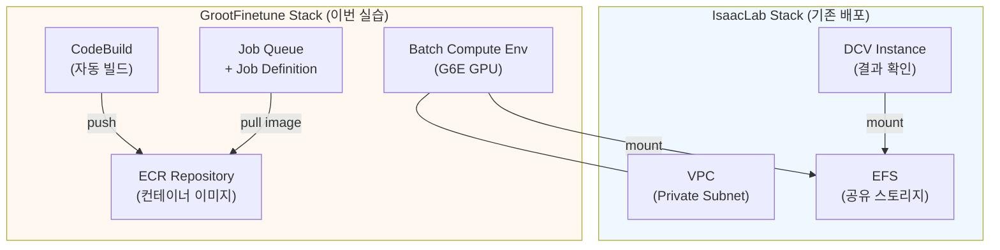
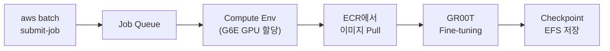

# 5. GR00T VLA Fine-tuning on AWS Batch

이 모듈에서는 AWS Batch를 사용하여 NVIDIA GR00T N1.7 VLA(Vision-Language-Action) 모델을 fine-tuning합니다. 이전 모듈에서 배포한 DCV 인스턴스와 EFS를 공유하므로, 학습 결과를 DCV에서 바로 확인할 수 있습니다.

| 서비스 | 쉬운 비유 |
|--------|-----------|
| [AWS Batch](https://docs.aws.amazon.com/batch/latest/userguide/what-is-batch.html) | 작업을 넣으면 알아서 GPU 서버를 켜고, 끝나면 꺼주는 자동 실행기 |
| [Amazon ECR](https://docs.aws.amazon.com/AmazonECR/latest/userguide/what-is-ecr.html) | Private Docker Hub — 컨테이너 이미지 저장소 |
| [AWS CodeBuild](https://docs.aws.amazon.com/codebuild/latest/userguide/welcome.html) | 클라우드에서 Docker 이미지를 자동으로 빌드해주는 서비스 |
| [Amazon EFS](https://docs.aws.amazon.com/efs/latest/ug/whatisefs.html) | 여러 인스턴스가 함께 쓰는 네트워크 공유 디스크 |

전체 배포 아키텍처:



Batch Job이 `/mnt/efs/gr00t/checkpoints`에 학습 결과를 저장하면, DCV 인스턴스에서 `/home/ubuntu/environment/efs/gr00t/checkpoints`로 동일한 파일에 접근할 수 있습니다.

***

### 5.1 사전 조건 확인

이 모듈을 시작하기 전에 아래 조건이 충족되어야 합니다:

- **IsaacLab Stack**이 이미 배포된 상태 (모듈 1~2 완료)
- AWS CLI 설치 및 인증 완료
- Node.js 18+ 설치
- CDK CLI 설치 (`npm install -g aws-cdk`)

이전 모듈의 Stack Outputs에서 아래 값을 확인합니다:

```bash
aws cloudformation describe-stacks \
  --stack-name IsaacLab-Latest-<userId> \
  --region ap-northeast-2 \
  --query "Stacks[0].Outputs" \
  --output table
```

필요한 값:

| 파라미터 | Stack Output Key | 설명 |
|----------|-----------------|------|
| `vpcId` | (직접 조회) | VPC ID |
| `efsFileSystemId` | `EfsFileSystemId` | EFS 파일 시스템 ID |
| `efsSecurityGroupId` | (직접 조회) | EFS 보안 그룹 ID |
| `privateSubnetId` | `PrivateSubnetId` | Private Subnet ID |


`vpcId`와 `efsSecurityGroupId`가 Stack Outputs에 없는 경우, 아래 명령으로 조회합니다:


```bash
# VPC ID 조회 (Subnet에서 추출)
aws ec2 describe-subnets \
  --subnet-ids <PrivateSubnetId> \
  --query "Subnets[0].VpcId" --output text

# EFS Security Group 조회
aws ec2 describe-security-groups \
  --filters "Name=vpc-id,Values=<VpcId>" "Name=description,Values=*EFS*" \
  --query "SecurityGroups[0].GroupId" --output text
```

***

### 5.2 CDK 배포 (~5분)

GR00T Fine-tuning 인프라를 배포합니다. 이 스택은 ECR 리포지토리, CodeBuild 프로젝트, Batch Compute Environment, Job Queue, Job Definition을 생성합니다.

```bash
cd infra-groot-finetune
npm install
```

배포 명령 — `userId`만 지정하면 나머지 파라미터는 부모 스택에서 자동 조회됩니다:

```bash
# 1. 부모 스택(IsaacLab-Latest-<userId>)에서 파라미터 자동 조회
npx ts-node bin/resolve-parent-stack.ts <userId>

# 2. 배포
CDK_DEFAULT_REGION=ap-northeast-2 npx cdk deploy
```

<details>
<summary>파라미터를 수동으로 지정하는 방법</summary>

```bash
CDK_DEFAULT_REGION=ap-northeast-2 npx cdk deploy \
  -c vpcId=<VpcId> \
  -c efsFileSystemId=<EfsFileSystemId> \
  -c efsSecurityGroupId=<EfsSecurityGroupId> \
  -c privateSubnetId=<PrivateSubnetId> \
  -c availabilityZone=ap-northeast-2a \
  -c userId=<userId> \
  -c useStableGroot=true
```

</details>


`resolve-parent-stack.ts`는 부모 스택 이름을 `IsaacLab-Latest-<userId>` 패턴으로 조회합니다. 부모 스택에서 VPC, EFS, Subnet, Security Group 정보를 자동으로 가져옵니다.


정상 출력:

```
 ✅  GrootFinetune-<userId>

Outputs:
GrootFinetune-<userId>.EcrRepositoryUri = 123456789012.dkr.ecr.ap-northeast-2.amazonaws.com/gr00t-finetune-<userId>
GrootFinetune-<userId>.CodeBuildProjectName = GrootFinetuneContainerBuild
GrootFinetune-<userId>.JobQueueName = GrootFinetune-<userId>-GrootFinetuneQueue
GrootFinetune-<userId>.JobDefinitionName = GrootFinetune-<userId>-GrootFinetuneJob
GrootFinetune-<userId>.CheckpointPath = /mnt/efs/gr00t/checkpoints (Batch) = /home/ubuntu/environment/efs/gr00t/checkpoints (DCV)
```

***

### 5.3 컨테이너 이미지 빌드 확인 (~30분)

CDK 배포와 동시에 CodeBuild가 자동으로 GR00T fine-tuning 컨테이너 이미지를 빌드합니다. NVIDIA CUDA, GR00T 라이브러리, Flash Attention 등을 포함하는 약 10GB 크기의 이미지를 생성하므로 25~35분이 소요됩니다.

```bash
# 빌드 상태 확인
aws codebuild list-builds-for-project \
  --project-name GrootFinetuneContainerBuild \
  --region ap-northeast-2 \
  --query "ids[0]" --output text | \
xargs -I{} aws codebuild batch-get-builds --ids {} \
  --region ap-northeast-2 \
  --query "builds[0].{Status:buildStatus,Phase:currentPhase}" \
  --output table
```

정상 출력 (완료 시):

```
--------------------------
|     BatchGetBuilds     |
+--------+---------------+
|  Phase |    Status     |
+--------+---------------+
|  COMPLETED |  SUCCEEDED  |
+--------+---------------+
```

빌드가 완료되면 ECR에 이미지가 있는지 확인합니다:

```bash
aws ecr describe-images \
  --repository-name gr00t-finetune-<userId> \
  --region ap-northeast-2 \
  --query "imageDetails[0].imageTags" \
  --output text
```

정상 출력: `1  latest`


빌드가 완료될 때까지 다음 단계로 진행할 수 없습니다. `Status: SUCCEEDED`가 될 때까지 주기적으로 확인합니다.


***

### 5.4 Fine-tuning Job 제출 (~15분)

샘플 데이터셋으로 짧은 테스트 학습을 실행하여 전체 파이프라인이 정상 동작하는지 확인합니다.



테스트 잡 제출 (100 steps, 약 10~15분):

```bash
aws batch submit-job \
  --job-name groot-finetune-test \
  --job-queue GrootFinetune-<userId>-GrootFinetuneQueue \
  --job-definition GrootFinetune-<userId>-GrootFinetuneJob \
  --region ap-northeast-2 \
  --container-overrides '{
    "environment": [
      {"name": "MAX_STEPS", "value": "100"},
      {"name": "SAVE_STEPS", "value": "50"},
      {"name": "HF_TOKEN", "value": "<your-huggingface-token>"}
    ]
  }'
```

정상 출력:

```json
{
    "jobArn": "arn:aws:batch:ap-northeast-2:123456789012:job/xxxxxxxx-xxxx-xxxx-xxxx-xxxxxxxxxxxx",
    "jobName": "groot-finetune-test",
    "jobId": "xxxxxxxx-xxxx-xxxx-xxxx-xxxxxxxxxxxx"
}
```


`HF_TOKEN`은 필수입니다. GR00T N1.7은 `nvidia/Cosmos-Reason2-2B`를 VLM backbone으로 사용하며, 이 모델은 [HuggingFace gated repo](https://huggingface.co/nvidia/Cosmos-Reason2-2B)입니다. 사전에 접근 승인을 받고 토큰을 발급받아야 합니다.


반환된 `jobId`를 메모합니다.

<details>
<summary>본격 학습 잡 제출 예시 (6000 steps, ~2시간)</summary>

```bash
aws batch submit-job \
  --job-name groot-finetune-full \
  --job-queue GrootFinetune-<userId>-GrootFinetuneQueue \
  --job-definition GrootFinetune-<userId>-GrootFinetuneJob \
  --region ap-northeast-2 \
  --container-overrides '{
    "environment": [
      {"name": "MAX_STEPS", "value": "6000"},
      {"name": "SAVE_STEPS", "value": "2000"},
      {"name": "BATCH_SIZE", "value": "32"}
    ]
  }'
```

</details>

<details>
<summary>주요 학습 파라미터 설명</summary>

| 파라미터 | 기본값 | 설명 |
|----------|--------|------|
| `MAX_STEPS` | 6000 | 총 학습 스텝 수 |
| `SAVE_STEPS` | 2000 | 체크포인트 저장 간격 |
| `BATCH_SIZE` | 32 | 배치 크기 |
| `LEARNING_RATE` | 1e-4 | 학습률 |
| `NUM_GPUS` | 1 | GPU 수 |
| `TUNE_PROJECTOR` | true | Projector 학습 여부 |
| `TUNE_DIFFUSION_MODEL` | true | Diffusion 모델 학습 여부 |
| `DATA_CONFIG` | so100_dualcam | 로봇/카메라 구성 |
| `HF_DATASET_ID` | (없음) | HuggingFace 데이터셋 ID |

</details>

***

### 5.5 학습 모니터링 (~10분)

Job 상태 확인:

```bash
JOB_ID=<submit-job에서 반환된 jobId>

aws batch describe-jobs \
  --jobs $JOB_ID \
  --region ap-northeast-2 \
  --query "jobs[0].{Status:status,Reason:statusReason}" \
  --output table
```

Job은 아래 순서로 상태가 전이됩니다:


| 상태 | 의미 | 예상 소요 |
|------|------|-----------|
| SUBMITTED → RUNNABLE | Job 등록 및 스케줄링 | 수초 |
| RUNNABLE → STARTING | GPU 인스턴스 프로비저닝 | 3~5분 |
| STARTING → RUNNING | 컨테이너 이미지 Pull + 시작 | 5~8분 (10GB 이미지) |
| RUNNING → SUCCEEDED | 학습 실행 | 10~15분 (100 steps) |

CloudWatch 로그로 학습 진행 상황을 실시간 확인합니다:

```bash
aws logs tail /aws/batch/job \
  --region ap-northeast-2 \
  --follow
```

학습이 정상 시작되면 아래와 같은 로그가 출력됩니다:

```
Loading pretrained dual brain from nvidia/GR00T-N1.7-3B
Tune backbone vision tower: False
Tune backbone LLM: False
Tune action head projector: True
Tune action head DiT: True
train dataloader length: 258
train dataset length: 8240
GPU memory before training: 7.07 GB
TensorBoard logs will be saved to: /mnt/efs/gr00t/checkpoints/runs
```


Job이 RUNNABLE 상태에서 오래 멈추는 경우, 해당 AZ에서 G6E 인스턴스 용량이 부족할 수 있습니다. 잠시 대기하면 보통 해결됩니다.


***

### 5.6 DCV에서 Checkpoint 확인

학습이 완료되면 DCV 인스턴스에 접속하여 결과를 확인합니다.

DCV 접속 URL은 IsaacLab Stack의 `DcvUrl` Output에서 확인합니다 (예: `https://<IP>:8443`).

DCV 터미널에서:

```bash
# Checkpoint 디렉토리 확인
ls -la /home/ubuntu/environment/efs/gr00t/checkpoints/

# 최신 checkpoint 내용 확인
ls /home/ubuntu/environment/efs/gr00t/checkpoints/checkpoint-*/

# TensorBoard 로그 확인
ls /home/ubuntu/environment/efs/gr00t/checkpoints/runs/
```

정상적으로 학습이 완료되었다면 아래와 같은 구조가 보입니다:

```
/home/ubuntu/environment/efs/gr00t/checkpoints/
├── checkpoint-50/
│   ├── config.json
│   ├── model.safetensors
│   └── training_args.bin
├── checkpoint-100/
│   ├── config.json
│   ├── model.safetensors
│   └── training_args.bin
└── runs/
    └── (TensorBoard 로그 파일)
```

<details>
<summary>TensorBoard로 학습 곡선 시각화</summary>

DCV 인스턴스에서 TensorBoard를 실행하여 학습 loss를 시각화할 수 있습니다:

```bash
pip install tensorboard
tensorboard --logdir /home/ubuntu/environment/efs/gr00t/checkpoints/runs --port 6006 --bind_all
```

브라우저에서 `http://localhost:6006`으로 접속합니다.

</details>

***

### 5.7 정리 (선택)

실습이 끝난 후 리소스를 삭제하여 비용을 방지합니다:

```bash
CDK_DEFAULT_REGION=ap-northeast-2 npx cdk destroy \
  -c vpcId=<VpcId> \
  -c efsFileSystemId=<EfsFileSystemId> \
  -c efsSecurityGroupId=<EfsSecurityGroupId> \
  -c privateSubnetId=<PrivateSubnetId> \
  -c availabilityZone=ap-northeast-2a \
  -c userId=<userId> \
  -c region=ap-northeast-2
```


ECR Repository는 `RETAIN` 정책으로 자동 삭제되지 않습니다. 수동 삭제가 필요합니다:
```bash
aws ecr delete-repository \
  --repository-name gr00t-finetune-<userId> \
  --region ap-northeast-2 --force
```


***

### References

- [AWS Batch User Guide - Managed Compute Environments](https://docs.aws.amazon.com/batch/latest/userguide/managed_compute_environments.html)
- [AWS Batch - EFS Volume Configuration](https://docs.aws.amazon.com/batch/latest/APIReference/API_EFSVolumeConfiguration.html)
- [Amazon ECR User Guide](https://docs.aws.amazon.com/AmazonECR/latest/userguide/what-is-ecr.html)
- [AWS CodeBuild User Guide](https://docs.aws.amazon.com/codebuild/latest/userguide/welcome.html)
- [NVIDIA GR00T - Isaac-GR00T Repository](https://github.com/NVIDIA/Isaac-GR00T)
