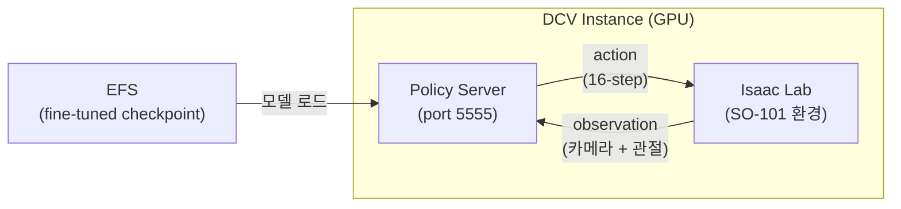
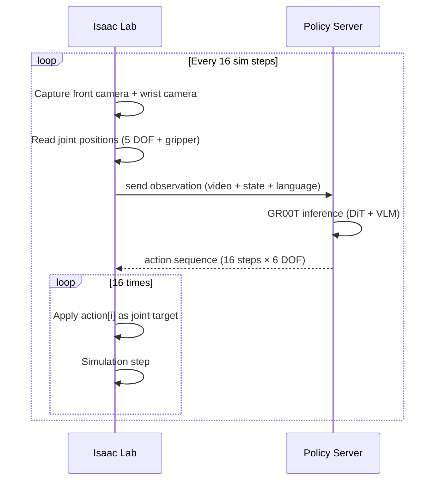
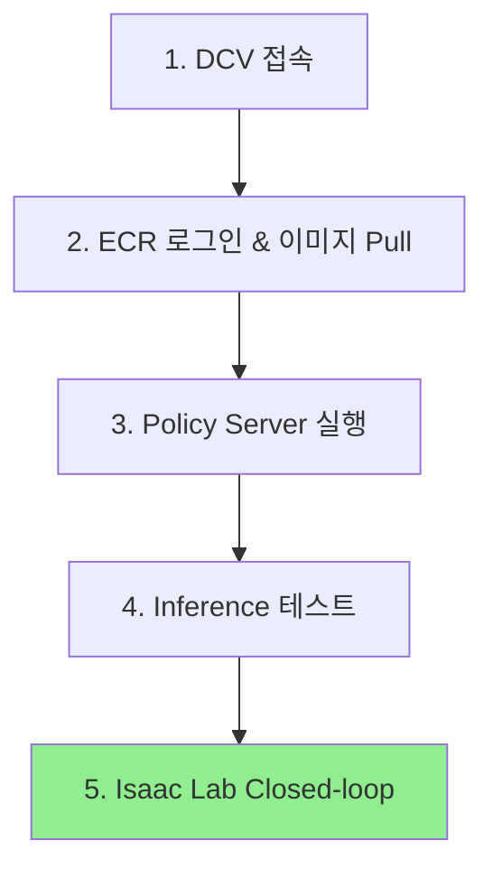

# 6. GR00T Inference 검증 및 Isaac Lab Closed-loop

이전 모듈에서 AWS Batch로 fine-tuning한 GR00T N1.7 checkpoint를 DCV 인스턴스에서 직접 로드하여, 모델이 정상적으로 action을 생성하는지 검증합니다. 이후 Isaac Lab 시뮬레이션과 연결하여 로봇이 policy에 따라 움직이는 Closed-loop 테스트를 실행합니다.

| 구성 요소 | 역할 |
|-----------|------|
| GR00T Policy Server | ZMQ 기반 추론 서버 — observation을 받아 action을 반환 |
| PolicyClient | ZMQ 클라이언트 — Isaac Lab에서 Policy Server로 요청 전송 |
| Isaac Lab | NVIDIA 로봇 시뮬레이션 환경 (GPU 렌더링) |

전체 흐름:



Policy Server는 ZMQ REP 소켓으로 observation을 수신하고, GR00T 모델이 생성한 16-step action sequence를 반환합니다. Isaac Lab은 이 action을 순차 적용하여 로봇을 제어합니다.

***

### 6.1 사전 조건 확인

- 모듈 5 완료 (Batch Job `SUCCEEDED`, checkpoint가 EFS에 저장됨)
- DCV 인스턴스 접속 가능
- Docker 이미지 `gr00t-finetune-<userId>:latest`가 ECR에 존재

DCV 터미널에서 checkpoint를 확인합니다:

```bash
ls /home/ubuntu/environment/efs/gr00t/checkpoints/checkpoint-100/
```

정상 출력:

```
config.json  model-00001-of-00003.safetensors  model-00002-of-00003.safetensors
model-00003-of-00003.safetensors  model.safetensors.index.json  processor/
experiment_cfg/  training_args.bin
```

***

### 6.2 ECR 이미지 Pull (~5분)

Policy Server를 실행하기 위해 GR00T 컨테이너 이미지를 ECR에서 가져옵니다:

```bash
# ECR 로그인
aws ecr get-login-password --region ap-northeast-2 | \
  docker login --username AWS --password-stdin \
  <AccountId>.dkr.ecr.ap-northeast-2.amazonaws.com

# 이미지 Pull
docker pull <AccountId>.dkr.ecr.ap-northeast-2.amazonaws.com/gr00t-finetune-<userId>:latest
```


`<AccountId>`는 AWS 계정 ID (12자리 숫자), `<userId>`는 배포 시 사용한 사용자 ID입니다.


***

### 6.3 Policy Server 실행 (~2분)

Fine-tuning된 checkpoint를 로드하는 추론 서버를 Docker 컨테이너로 실행합니다:

```bash
docker run -d --gpus all \
  --name groot-policy-server \
  -v /home/ubuntu/environment/efs:/mnt/efs:ro \
  -e HF_TOKEN=<your-huggingface-token> \
  -p 5555:5555 \
  <AccountId>.dkr.ecr.ap-northeast-2.amazonaws.com/gr00t-finetune-<userId>:latest \
  python -m gr00t.eval.run_gr00t_server \
    --model-path /mnt/efs/gr00t/checkpoints \
    --embodiment-tag new_embodiment
```


`HF_TOKEN`이 필요한 이유: GR00T N1.7은 `nvidia/Cosmos-Reason2-2B`를 VLM backbone으로 사용하며, 이 모델은 HuggingFace gated repo입니다. [모델 접근 신청](https://huggingface.co/nvidia/Cosmos-Reason2-2B) 후 발급받은 토큰을 사용합니다.


서버가 준비되었는지 확인합니다:

```bash
# 로그 확인 — "Server ready" 메시지가 나올 때까지 대기
docker logs -f groot-policy-server
```

정상 출력:

```
Starting GR00T inference server...
  Embodiment tag: EmbodimentTag.NEW_EMBODIMENT
  Model path: /mnt/efs/gr00t/checkpoints
  Device: cuda
  Host: 0.0.0.0
  Port: 5555
Total number of DiT parameters:  1091722240
Loading checkpoint shards: 100%|██████████| 3/3 [00:03<00:00,  1.01s/it]

✓ Server ready — listening on tcp://0.0.0.0:5555
```

`Ctrl+C`로 로그 출력을 종료합니다 (서버는 백그라운드에서 계속 실행됩니다).

***

### 6.4 Inference 테스트 (~1분)

서버가 올바르게 동작하는지 간단한 추론 요청으로 확인합니다:

```bash
pip3 install --break-system-packages pyzmq msgpack numpy
```

```python
# test_inference.py
import zmq
import msgpack
import numpy as np
import io
import time

def encode_custom(obj):
    if isinstance(obj, np.ndarray):
        output = io.BytesIO()
        np.save(output, obj, allow_pickle=False)
        return {"__ndarray_class__": True, "as_npy": output.getvalue()}
    return obj

def decode_custom(obj):
    if not isinstance(obj, dict):
        return obj
    if "__ndarray_class__" in obj:
        return np.load(io.BytesIO(obj["as_npy"]), allow_pickle=False)
    return obj

def to_bytes(data):
    return msgpack.packb(data, default=encode_custom)

def from_bytes(data):
    return msgpack.unpackb(data, object_hook=decode_custom)

ctx = zmq.Context()
sock = ctx.socket(zmq.REQ)
sock.setsockopt(zmq.RCVTIMEO, 60000)
sock.connect("tcp://localhost:5555")

# Step 1: Ping
sock.send(to_bytes({"endpoint": "ping"}))
response = from_bytes(sock.recv())
print("Ping:", response)

# Step 2: Get action with dummy observation
observation = {
    "video": {
        "front": np.random.randint(0, 255, (1, 1, 224, 224, 3), dtype=np.uint8),
        "wrist": np.random.randint(0, 255, (1, 1, 224, 224, 3), dtype=np.uint8),
    },
    "state": {
        "single_arm": np.zeros((1, 1, 5), dtype=np.float32),
        "gripper": np.array([[[30.0]]], dtype=np.float32),
    },
    "language": {
        "annotation.human.task_description": [["pick up the cube"]],
    },
}

print("\nSending inference request...")
t0 = time.time()
sock.send(to_bytes({"endpoint": "get_action", "data": {"observation": observation}}))
response = from_bytes(sock.recv())
elapsed = time.time() - t0

action, info = response[0], response[1]
print(f"Response time: {elapsed:.2f}s")
print(f"Action - single_arm: shape={action['single_arm'].shape}")
print(f"Action - gripper:    shape={action['gripper'].shape}")
print(f"\nSUCCESS: Policy Server is working correctly!")
```

```bash
python3 test_inference.py
```

정상 출력:

```
Ping: {'status': 'ok', 'message': 'Server is running'}

Sending inference request...
Response time: 1.02s
Action - single_arm: shape=(1, 16, 5)
Action - gripper:    shape=(1, 16, 1)

SUCCESS: Policy Server is working correctly!
```

Action shape 해석:
- `(1, 16, 5)` = batch 1, **16-step horizon**, 5 DOF (joint positions)
- `(1, 16, 1)` = batch 1, **16-step horizon**, 1 DOF (gripper)

모델이 한 번의 observation으로부터 향후 16 timestep의 action을 예측합니다.

***

### 6.5 Closed-loop 동작 원리

Isaac Lab 시뮬레이션에서 SO-101 로봇을 GR00T Policy Server에 연결하여 실시간 제어 루프를 실행합니다:



GR00T 모델은 한 번의 inference로 향후 16 timestep의 action을 예측합니다. Isaac Lab은 이 action을 순차적으로 적용한 후, 새로운 observation으로 다시 요청합니다. `pyzmq`가 컨테이너에 없는 경우 스크립트가 자동으로 설치합니다.

***

### 6.6 DCV에서 전체 검증 실행

DCV 인스턴스에 접속하여 위 단계를 순서대로 실행합니다. DCV URL은 IsaacLab Stack의 Output에서 확인합니다 (예: `https://<IP>:8443`).


사전 조건: `workshop` 패키지(SO-101 로봇 에셋 + 스크립트)가 DCV 인스턴스에 존재해야 합니다. IsaacLab Stack을 배포하면 `/home/ubuntu/aws-physical-ai-recipes/` 리포지토리가 이미 clone되어 있습니다.




#### Step 1: DCV 터미널 열기

DCV 웹 브라우저에서 접속 후, 상단 메뉴에서 **Activities → Terminal**을 실행합니다.

#### Step 2: ECR 로그인 및 이미지 확인

```bash
# ECR 로그인
ACCOUNT_ID=$(aws sts get-caller-identity --query Account --output text)
REGION=ap-northeast-2

aws ecr get-login-password --region $REGION | \
  docker login --username AWS --password-stdin $ACCOUNT_ID.dkr.ecr.$REGION.amazonaws.com

# GR00T 이미지 Pull (CDK 배포 시 이미 빌드된 이미지)
docker pull $ACCOUNT_ID.dkr.ecr.$REGION.amazonaws.com/gr00t-finetune-<userId>:latest
```

#### Step 3: Policy Server 시작

```bash
# 기존 컨테이너가 있으면 제거
docker rm -f groot-policy-server 2>/dev/null

# Fine-tuned 모델로 Policy Server 실행
docker run -d --gpus all \
  --name groot-policy-server \
  -v /home/ubuntu/environment/efs:/mnt/efs:ro \
  -e HF_TOKEN=<your-huggingface-token> \
  -p 5555:5555 \
  $ACCOUNT_ID.dkr.ecr.$REGION.amazonaws.com/gr00t-finetune-<userId>:latest \
  python -m gr00t.eval.run_gr00t_server \
    --model-path /mnt/efs/gr00t/checkpoints \
    --embodiment-tag new_embodiment

# "Server ready" 메시지 대기 (약 30초~1분)
docker logs -f groot-policy-server
# Ctrl+C로 종료 (서버는 계속 실행)
```

#### Step 4: Inference 동작 확인

```bash
# 필요 패키지 설치 (한 번만)
pip3 install --break-system-packages pyzmq msgpack numpy

# 테스트 스크립트 실행
python3 /home/ubuntu/aws-physical-ai-recipes/isaac-lab-workshop/exp/workshop/test_inference.py
```

정상 출력:

```
Ping: {'status': 'ok', 'message': 'Server is running'}
Inference time: 0.17s
Action - single_arm: shape=(1, 16, 5)
Action - gripper:    shape=(1, 16, 1)
SUCCESS: Policy Server is working correctly!
```

#### Step 5: Isaac Lab Closed-loop 실행

```bash
WORKSHOP_DIR=/home/ubuntu/aws-physical-ai-recipes/isaac-lab-workshop/exp/workshop

docker run --gpus all --rm \
  --network host \
  -v /home/ubuntu/environment/efs:/mnt/efs:ro \
  -v $WORKSHOP_DIR:/workspace/workshop \
  -e PYTHONPATH="/workspace/workshop/src" \
  -e PYTHONUNBUFFERED=1 \
  --entrypoint /bin/bash \
  isaaclab-batch-<userId>:latest \
  -c '/isaac-sim/python.sh /workspace/workshop/src/workshop/scripts/run_closed_loop.py \
    --policy_host localhost \
    --policy_port 5555 \
    --instruction "pick up the cube" \
    --num_steps 500 \
    --headless \
    --enable_cameras'
```


Isaac Sim 초기화에 약 3~5분이 소요됩니다. `--enable_cameras`는 렌더링 파이프라인을 활성화하며, `PYTHONUNBUFFERED=1`은 로그가 즉시 출력되게 합니다.


정상 출력:

```
Connected to GR00T Policy Server at localhost:5555
Step 0/500 — policy calls: 1, queued: 15
Closed-loop simulation complete.
```


Isaac Lab 실행에는 GPU 메모리 약 6GB + Policy Server GPU 메모리 약 8GB = 총 14GB 이상의 GPU가 필요합니다. G6E 인스턴스(L40S 48GB)에서 여유롭게 동작합니다.


#### Step 6: 정리

```bash
docker stop groot-policy-server
docker rm groot-policy-server
```

***

### 6.7 Observation/Action 형식 정리

GR00T `new_embodiment` 모델이 기대하는 입출력 형식입니다:

**입력 (observation):**

| Modality | Key | Shape | Type | 설명 |
|----------|-----|-------|------|------|
| video | `front` | (B, 1, H, W, 3) | uint8 | 전방 카메라 RGB |
| video | `wrist` | (B, 1, H, W, 3) | uint8 | 손목 카메라 RGB |
| state | `single_arm` | (B, 1, 5) | float32 | 관절 위치 (5 DOF) |
| state | `gripper` | (B, 1, 1) | float32 | 그리퍼 위치 |
| language | `annotation.human.task_description` | [[str]] | string | 작업 지시문 |

**출력 (action):**

| Key | Shape | Type | 설명 |
|-----|-------|------|------|
| `single_arm` | (1, 16, 5) | float32 | 16-step 관절 위치 예측 |
| `gripper` | (1, 16, 1) | float32 | 16-step 그리퍼 위치 예측 |

***

### 6.8 트러블슈팅

| 증상 | 원인 | 해결 |
|------|------|------|
| `Cosmos-Reason2-2B` 401 에러 | HF_TOKEN 미설정 또는 모델 접근 미승인 | [모델 페이지](https://huggingface.co/nvidia/Cosmos-Reason2-2B)에서 접근 신청 후 토큰 재설정 |
| Port 5555 already in use | 이전 컨테이너 미종료 | `docker stop groot-policy-server && docker rm groot-policy-server` |
| Action shape mismatch | 이전 학습의 stale checkpoint resume | `--model-path`에 올바른 checkpoint 경로 지정, 또는 `RESUME=false`로 재학습 |
| ZMQ timeout | 모델 로딩 중 (첫 inference ~30초) | 서버 로그에서 "Server ready" 확인 후 재시도 |
| OOM (GPU 메모리 부족) | 다른 GPU 프로세스 실행 중 | `nvidia-smi`로 확인 후 불필요한 프로세스 종료 |

***

### 6.9 정리

테스트가 끝난 후 Policy Server를 종료합니다:

```bash
docker stop groot-policy-server
docker rm groot-policy-server
```

***

### References

- [NVIDIA GR00T - Policy Server/Client](https://github.com/NVIDIA/Isaac-GR00T)
- [Isaac Lab - Closed-loop Evaluation](https://isaac-sim.github.io/IsaacLab/)
- [ZeroMQ REQ-REP Pattern](https://zguide.zeromq.org/docs/chapter1/)
