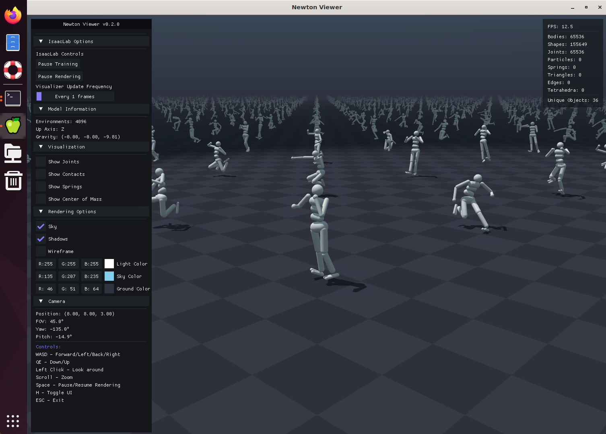

# Newton 물리엔진 셋업 가이드

Isaac Lab `feature/newton` 브랜치를 기존 GPU EC2 인스턴스에 직접 설치하는 가이드입니다.

> CDK 기반 멀티유저 환경이 필요하다면 → [infra-multiuser-groot/](../infra-multiuser-groot/)

## 환경 정보

| 항목 | 값 |
|------|-----|
| OS | Ubuntu 22.04 LTS |
| Python | 3.11 (deadsnakes PPA, venv: `~/venv311`) |
| GPU | NVIDIA L4 x 4 (Driver 570.133.20) |
| Isaac Sim | 5.1.0 |
| 물리 엔진 | Newton beta-0.2.1 |
| 작업 디렉토리 | `~/environment/IsaacLab` (`feature/newton` 브랜치) |

## 빠른 시작

```bash
cd ~/docs
bash setup.sh
source ~/.bashrc
cd ~/environment/IsaacLab
python scripts/reinforcement_learning/skrl/train.py --task=Isaac-Ant-v0
```

`setup.sh`가 수행하는 작업:

1. `feature/newton` 브랜치로 전환
2. `requirements.txt`를 IsaacLab 디렉토리에 복사
3. Python 3.11 설치 (deadsnakes PPA)
4. venv 생성 (`~/venv311`) 및 활성화
5. `~/.bashrc` 환경변수 설정 (`ACCEPT_EULA`, `LAUNCH_OV_APP=1` 등)
6. `requirements.txt` 기반 의존성 설치
7. IsaacLab 패키지 설치 (`./isaaclab.sh --install` + `--no-deps` 패키지)
8. 설치 검증

## 수동 설치

스크립트 없이 단계별로 진행하는 경우.

### 1. Python 3.11 + venv

```bash
# Python 3.11 설치
sudo add-apt-repository ppa:deadsnakes/ppa -y
sudo apt-get update
sudo apt-get install -y python3.11 python3.11-venv python3.11-dev
sudo ln -sf /usr/bin/python3 /usr/bin/python

# venv 생성 및 활성화
python3.11 -m venv ~/venv311
source ~/venv311/bin/activate
```

### 2. 환경변수 설정

`~/.bashrc`에 추가:

```bash
export ACCEPT_EULA=Y
export OMNI_KIT_ACCEPT_EULA=YES
export LAUNCH_OV_APP=1
source ~/venv311/bin/activate
```

### 3. IsaacLab 클론 및 브랜치 전환

```bash
cd ~/environment/IsaacLab
git fetch origin feature/newton
git checkout feature/newton
git pull origin feature/newton
```

### 4. 의존성 설치

```bash
pip install --upgrade pip
pip install --no-build-isolation flatdict==4.0.1
pip install -r requirements.txt --extra-index-url https://pypi.nvidia.com
```

### 5. IsaacLab 패키지 설치

```bash
# 자동 설치 가능한 패키지
TERM=${TERM:-xterm} ./isaaclab.sh --install

# 핵심 패키지 (omniverseclient 의존성 우회)
pip install --no-deps -e source/isaaclab
pip install --no-deps -e source/isaaclab_experimental
pip install --no-deps -e source/isaaclab_newton
```

### 6. 설치 확인

```bash
source ~/.bashrc
python scripts/reinforcement_learning/skrl/train.py --task=Isaac-Ant-v0
```

## 시각화

`--visualizer` 옵션으로 시각화 백엔드를 선택할 수 있습니다.

```bash
python scripts/reinforcement_learning/rsl_rl/train.py \
  --task Isaac-Humanoid-v0 \
  --visualizer newton    # newton | rerun | omniverse
```

### Newton Visualizer

OpenGL 기반 경량 뷰어. DCV 등 원격 데스크탑 환경에서 확인합니다.



### Rerun Visualizer (원격 브라우저)

DCV 없이 브라우저만으로 학습 상태를 실시간 확인할 수 있습니다.

**사전 준비**: EC2 보안 그룹에서 포트 **9090** (웹 뷰어), **9876** (gRPC 데이터) TCP 인바운드를 열어야 합니다.

```bash
pip install rerun-sdk    # 최초 1회

python scripts/reinforcement_learning/rsl_rl/train.py \
  --task Isaac-Velocity-Flat-Anymal-D-v0 \
  --visualizer rerun
```

브라우저 접속:

```
http://<EC2_PUBLIC_IP>:9090/?url=rerun%2Bhttp%3A%2F%2F<EC2_PUBLIC_IP>%3A9876%2Fproxy
```

`<EC2_PUBLIC_IP>`를 실제 퍼블릭 IP로 치환합니다.


**Rerun 뷰어 기능:**
- 실시간 3D 시각화 (로봇 자세, 관절 각도)
- 타임라인 스크러빙으로 과거 상태 확인
- `.rrd` 파일 녹화 및 재생
- 메모리 효율적 (`keep_historical_data=False` 기본값)

---

## 설치 패키지 버전

| 패키지 | 버전 | 소스 |
|--------|------|------|
| isaacsim | 5.1.0 | pip (NVIDIA index) |
| isaaclab | 0.42.25 | editable (`--no-deps`) |
| isaaclab_assets | 0.2.2 | `./isaaclab.sh --install` |
| isaaclab_experimental | 0.0.1 | editable (`--no-deps`) |
| isaaclab_newton | 0.0.1 | editable (`--no-deps`) |
| isaaclab_rl | 0.2.3 | `./isaaclab.sh --install` |
| isaaclab_tasks | 0.10.41 | `./isaaclab.sh --install` |
| isaaclab_tasks_experimental | 0.0.1 | `./isaaclab.sh --install` |
| newton | 0.2.0 | GitHub `beta-0.2.1` |
| mujoco_warp | 0.0.1 | GitHub 특정 커밋 |
| warp-lang | 1.11.0.dev20251205 | NVIDIA dev index |
| skrl | 1.4.3 | pip (`<2.0`) |
| torch | 2.7.0+cu128 | pip |

---

## 의존성 상세 노트

이 섹션은 설치 중 만날 수 있는 함정과 그 이유를 설명합니다.

### Python 3.11이 필요한 이유

`isaacsim`은 PyPI에서 Python minor 버전을 **exact pin**합니다. 다른 버전에서는 `pip install` 자체가 거부됩니다.

| isaacsim | `Requires-Python` | Python |
|----------|-------------------|--------|
| 4.5.0 | `==3.10.*` | 3.10 |
| 5.0.0 ~ 5.1.0 | `==3.11.*` | 3.11 |
| 6.0.0 | `==3.12.*` | 3.12 |

> PyPI에서 확인: [isaacsim 5.1.0.0](https://pypi.org/project/isaacsim/5.1.0.0/), [isaacsim 6.0.0.0](https://pypi.org/project/isaacsim/6.0.0.0/)

IsaacLab `feature/newton` 브랜치도 전체적으로 3.11을 전제합니다:

- **`environment.yml`**: `python=3.11`
- **`isaaclab.sh`**: Isaac Sim >= 5.0이면 `python=3.11` 하드코딩
- **`source/isaaclab/setup.py`**: `python_requires=">=3.10"` (느슨하지만 isaacsim이 강제)

Python 3.12로 올리려면 isaacsim 6.0.0 + 관련 의존성(newton, warp-lang, mujoco_warp 등) 전체 호환성 확인이 필요합니다.

### `./isaaclab.sh --install`이 완전하지 않은 이유

`isaaclab` 핵심 패키지의 의존성 중 pip으로 해결되지 않는 것이 있습니다.

| 원인 | 설명 |
|------|------|
| `warp-lang==1.11.0.dev20251205` | NVIDIA dev index에서만 제공. 기본 PyPI에 없음 |
| `omniverseclient` | isaaclab의 의존성이지만 pip에 없음 (isaacsim 런타임 내장) |

따라서 `requirements.txt`로 의존성을 먼저 설치한 뒤, `--no-deps`로 핵심 패키지를 설치해야 합니다.

### Newton 물리 엔진 의존성

특정 버전을 사용해야 합니다. 설치 순서도 중요합니다.

| 패키지 | 올바른 소스 | 주의사항 |
|--------|------------|----------|
| `newton` | `git+...@beta-0.2.1` (v0.2.0) | PyPI `newton==1.0.0`은 warp 1.12+ 요구하여 호환 안 됨 |
| `mujoco_warp` | GitHub 특정 커밋 | `isaaclab_newton/setup.py`에 명시된 커밋 해시 사용 |
| `warp-lang` | `1.11.0.dev20251205` | NVIDIA index 필요. newton이 warp을 업그레이드할 수 있으므로 순서 주의 |

**설치 순서**: warp-lang → newton → mujoco_warp. newton이 warp을 자동 업그레이드하면 warp-lang을 재설치해야 합니다. `requirements.txt`를 사용하면 pip이 순서를 자동으로 해결합니다.

### skrl 버전

`skrl>=2.0.0`은 Newton 환경에서 `LazyLinear` 초기화 시 에러가 발생합니다. `skrl>=1.4.2,<2.0`으로 고정해야 합니다.

### `LAUNCH_OV_APP=1`이 필요한 이유

`feature/newton` 브랜치의 AppLauncher는 기본적으로 Standalone 모드(SimulationApp 없이)로 진입합니다. 그러나 `isaaclab.envs` 등이 `pxr` (USD) 모듈을 무조건 import하므로, SimulationApp이 초기화되지 않으면 `No module named 'pxr'` 에러가 발생합니다. `LAUNCH_OV_APP=1`로 SimulationApp 모드를 강제 활성화하면 해결됩니다.

---

## Troubleshooting

| 문제 | 해결 |
|------|------|
| isaacsim 5.1.0이 Python 3.10에서 설치 불가 | Python 3.11 venv로 전환 |
| `python` command not found | `sudo ln -sf /usr/bin/python3 /usr/bin/python` |
| NVIDIA EULA 미동의 | `ACCEPT_EULA=Y` + `OMNI_KIT_ACCEPT_EULA=YES` 둘 다 필요 |
| `xterm-ghostty` unknown terminal type | `TERM=xterm-256color` fallback |
| `isaaclab` 패키지 설치 실패 | warp-lang을 NVIDIA index에서 설치 후 `--no-deps`로 우회 |
| `No module named 'pxr'` | `LAUNCH_OV_APP=1` 환경변수 설정 |
| PyPI `newton==1.0.0`이 warp 1.12+ 요구 | GitHub `beta-0.2.1` 태그로 설치 |
| `No module named 'mujoco_warp'` | GitHub 특정 커밋에서 설치 |
| skrl 2.0.0 `LazyLinear` 에러 | `skrl<2.0`으로 다운그레이드 |
