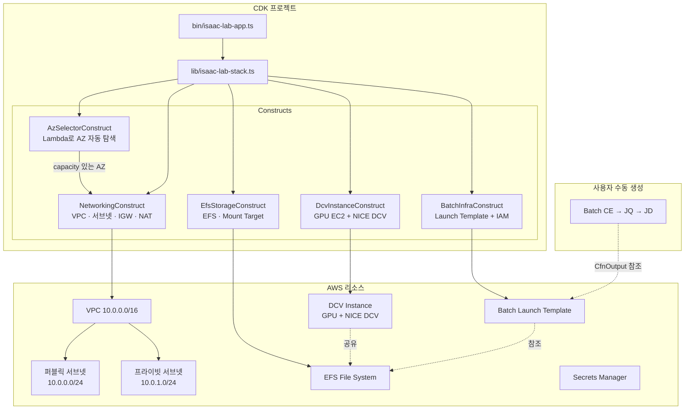

# Isaac Lab Golden Template

NVIDIA Isaac Lab 강화학습 환경을 AWS에서 원클릭 배포하기 위한 CDK TypeScript 프로젝트.

CDK 프로젝트 자체가 메인 결과물이며, CloudFormation 템플릿은 `cdk synth`로 생성되는 부산물이다.

## 원본 워크숍 템플릿 대비 개선 사항

| 항목 | 원본 워크숍 템플릿 | Golden Template |
|------|-------------------|-----------------|
| 리전 지원 | 3개 리전 하드코딩 | 12개 리전 DLAMI 매핑 + 멀티리전 배포 |
| 버전 관리 | 고정 | Version Profile 기반 (stable / latest) |
| AZ 선택 | 인덱스 0 고정 | Custom Resource Lambda로 capacity 자동 탐색 + 인스턴스 타입 fallback |
| 인스턴스 타입 | g6.12xlarge 고정 | g6.12xlarge → g5.12xlarge → g6.xlarge → g5.xlarge 자동 fallback |
| UserData | 모놀리식 | 4개 독립 셸 스크립트 모듈 |
| Batch 지원 | 미포함 | Launch Template + IAM 자동화 |
| 보안 | 미흡 | allowedCidr, EFS SG VPC CIDR 제한, EBS 암호화, Secrets Manager ARN 제한 |
| 네트워크 안정성 | Route-IGW 의존성 미지정 | PublicRoute → VPCGatewayAttachment DependsOn 명시 |
| NVIDIA 드라이버 | UserData에서 직접 설치 | 구 DLAMI(550) + 570 자연 업그레이드 |
| DCV GL | 미설치 | DCV GL 자동 설치 + 단일 GPU xorg.conf 자동 생성 |
| IaC | CloudFormation YAML | CDK TypeScript (타입 안전성, 코드 재사용) |

## 아키텍처



## 사전 요구사항

- Node.js 18 이상
- AWS CDK CLI: `npm install -g aws-cdk`
- AWS 자격 증명: AdministratorAccess 또는 동등 권한
- GPU 인스턴스 서비스 할당량: 배포 리전에서 G6/G5 인스턴스 할당량 확인
  - EC2 콘솔 → Service Quotas → `Running On-Demand G and VT instances`
- CDK Bootstrap: 배포 대상 리전에서 최초 1회 실행 필요

## 지원 리전

| 리전 | 코드 | DCV AMI | 비고 |
|------|------|:-------:|------|
| 버지니아 | us-east-1 | DLAMI 22.04/24.04 | 권장 (최대 규모) |
| 오레곤 | us-west-2 | DLAMI 22.04/24.04 | 권장 |
| 오하이오 | us-east-2 | DLAMI 22.04/24.04 | 권장 |
| 프랑크푸르트 | eu-central-1 | DLAMI 22.04/24.04 | EU 권장 |
| 뭄바이 | ap-south-1 | DLAMI 22.04/24.04 | |
| 런던 | eu-west-2 | DLAMI 22.04/24.04 | |
| 도쿄 | ap-northeast-1 | DLAMI 22.04/24.04 | |
| 캐나다 | ca-central-1 | DLAMI 22.04/24.04 | |
| 시드니 | ap-southeast-2 | DLAMI 22.04/24.04 | |
| 서울 | ap-northeast-2 | DLAMI 22.04/24.04 | |
| 스톡홀름 | eu-north-1 | DLAMI 22.04/24.04 | |
| 상파울루 | sa-east-1 | DLAMI 22.04/24.04 | |

> g6+g5 모두 지원하는 12개 리전. 파리(g6 only), 아일랜드(g5 only)는 제외.

### AMI 전략

DCV 인스턴스에는 **Deep Learning OSS Nvidia Driver AMI GPU PyTorch**를 사용한다. 이 AMI에는 AWS CLI, NVIDIA 드라이버, Docker, PyTorch가 사전 설치되어 있어 UserData 실행 시간이 단축되고 리전 간 동작이 일관된다.

- stable: `Deep Learning OSS Nvidia Driver AMI GPU PyTorch 2.4.1 (Ubuntu 22.04) 20250623`
  - NVIDIA 드라이버 550 사전 설치 → UserData에서 570으로 자연 업그레이드
  - DCV 2025.0과 호환성 검증 완료 (reference 스택과 동일 시리즈)
- latest: `Deep Learning OSS Nvidia Driver AMI GPU PyTorch 2.9 (Ubuntu 24.04) 20260226`
  - NVIDIA 드라이버 580 사전 설치 → nvidia-driver.sh에서 570으로 교체

> nvidia-driver.sh는 DLAMI에 어떤 드라이버가 사전 설치되어 있든 프로필 지정 버전(570)으로 자동 교체한다. xorg.conf 생성은 lspci 기반으로 커널 모듈 상태에 무관하게 동작한다.


## Quick Start

```bash
# 1. 의존성 설치
npm install

# 2. CDK Bootstrap (대상 리전에서 최초 1회, 관리자가 사전 실행)
cdk bootstrap

# 3. 기본 배포 (GR00T 포함, 인스턴스 타입 자동 fallback)
cdk deploy

# 4. 사용자별 독립 배포 (멀티 사용자)
cdk deploy -c userId=alice -c vpcCidr=10.1.0.0/16

# 5. 다른 리전에 배포
cdk deploy -c userId=alice -c vpcCidr=10.1.0.0/16 -c region=us-west-2

# 6. GR00T 비활성화
cdk deploy -c userId=alice -c grootRepoUrl=""

# 7. 인스턴스 타입 직접 지정 (fallback 무시)
cdk deploy -c userId=alice -c inferenceInstanceType=g6e.4xlarge

# 8. latest 프로필 (Ubuntu 24.04 + Isaac Sim 5.1.0)
cdk deploy -c userId=alice -c versionProfile=latest

# 9. CloudShell에서 배포 (세션 끊김 방지)
nohup npx cdk deploy -c userId=alice -c vpcCidr=10.1.0.0/16 --require-approval never > deploy.log 2>&1 &
tail -f deploy.log

# 10. 변경 사항 미리보기
cdk diff

# 11. CloudFormation 템플릿 생성 (배포 없이)
cdk synth

# 12. 스택 삭제
cdk destroy -c userId=alice
```

> 인스턴스 타입 미지정 시 자동 fallback 순서: `g6e.4xlarge → g6.4xlarge → g6.12xlarge → g6e.12xlarge`

## Props 설명

| Props | 타입 | 기본값 | 설명 |
|-------|------|--------|------|
| `versionProfile` | `stable` \| `latest` | `stable` | 소프트웨어 스택 프로필 선택 |
| `inferenceInstanceType` | `string` | `g6.12xlarge` | DCV GPU 인스턴스 타입 |
| `preferredAZ` | `auto` \| `0`~`5` | `auto` | AZ 선택. auto는 Lambda로 capacity 자동 탐색 |
| `allowedCidr` | CIDR 문자열 | `0.0.0.0/0` | DCV 보안 그룹 인바운드 소스 CIDR |
| `region` | 리전 코드 | CDK 기본 리전 | 배포 대상 리전 (멀티리전 배포용) |
| `userId` | 영문소문자·숫자·하이픈 | (없음) | 멀티 사용자 배포 시 사용자 식별자 |

Props는 CDK Context로 전달한다:

```bash
# 기본 리전에 stable 배포 (AZ 자동 선택)
cdk deploy

# us-west-2에 latest 배포
cdk deploy -c region=us-west-2 -c versionProfile=latest

# AZ 수동 지정 (Lambda 탐색 건너뜀)
cdk deploy -c preferredAZ=1

# 보안 그룹 소스 CIDR 제한
cdk deploy -c allowedCidr=10.0.0.0/8
```

## 멀티 사용자 배포

하나의 AWS 계정에서 여러 사용자가 동시에 독립된 환경을 배포할 수 있다. `-c userId=<이름>`을 지정하면 스택 이름, ECR 리포지토리, 리소스 태그가 사용자별로 분리된다.

### 사용법

```bash
# 사용자별 독립 배포
cdk deploy -c userId=alice
cdk deploy -c userId=bob
cdk deploy -c userId=charlie -c region=us-west-2

# 각자 스택 삭제
cdk destroy -c userId=alice
```

### 격리되는 항목

| 항목 | userId 미지정 | userId=alice |
|------|:------------:|:------------:|
| 스택 이름 | `IsaacLab-Stable` | `IsaacLab-Stable-alice` |
| ECR 리포지토리 | `isaaclab-batch` | `isaaclab-batch-alice` |
| 리소스 태그 | (없음) | `UserId: alice` (전체 리소스) |
| VPC / 서브넷 | 독립 생성 | 독립 생성 |
| EFS | 독립 생성 | 독립 생성 |
| DCV 인스턴스 | 독립 생성 | 독립 생성 |

### 주의사항

- `userId`는 영문소문자, 숫자, 하이픈만 허용 (예: `alice`, `team-1`, `user01`)
- `userId`를 지정하지 않으면 기존과 완전히 동일하게 동작 (하위 호환)
- 같은 계정·리전에서 동일 `userId` 없이 여러 명이 배포하면 스택 이름이 충돌하므로, 멀티 사용자 환경에서는 반드시 `userId`를 지정할 것
- GPU 인스턴스 할당량(`Running On-Demand G and VT instances`)은 계정 레벨에서 공유되므로, 동시 사용자 수에 맞게 Service Quotas 증가 요청 필요
- VPC 기본 할당량은 리전당 5개이므로, 5명 이상 동시 배포 시 할당량 증가 필요

## AZ 자동 선택

`preferredAZ=auto` (기본값)일 때, Custom Resource Lambda가 배포 시점에 GPU capacity가 있는 AZ와 인스턴스 타입을 자동으로 탐색한다.

동작 방식:
1. 인스턴스 타입 fallback 리스트를 순차 시도: `g6.12xlarge → g5.12xlarge → g6.xlarge → g5.xlarge`
2. 각 인스턴스 타입에 대해 `describe-instance-type-offerings`로 지원 AZ 목록 조회
3. AZ 목록을 셔플하여 특정 AZ 집중 방지
4. 각 AZ에서 `RunInstances` (MinCount=1) 시도
5. 성공하면 즉시 terminate하고 해당 AZ + 인스턴스 타입을 EC2 Instance에 전달
6. `InsufficientInstanceCapacity`이면 다음 AZ 시도, 모든 AZ 실패 시 다음 인스턴스 타입으로 fallback
7. 모든 타입/AZ 실패 시 스택 생성 실패

이 방식으로 GPU capacity 부족으로 인한 배포 실패를 크게 줄일 수 있다. probe 인스턴스는 수 초 내에 terminate되므로 비용은 무시할 수 있는 수준이다.

`inferenceInstanceType`을 명시적으로 지정하면 해당 타입만 시도한다. `preferredAZ`를 인덱스('0'~'5')로 지정하면 Lambda 탐색을 건너뛰고 해당 인덱스의 AZ를 직접 사용한다.

## 버전 프로필 상세

### stable (기본값)

워크숍에서 검증 완료된 안정 조합. Isaac Sim 4.5.0 + Isaac Lab 2.3.2 기반.

| 항목 | 값 |
|------|---|
| Ubuntu | 22.04 LTS |
| AMI | Deep Learning OSS Nvidia Driver AMI GPU PyTorch 2.4.1 (Ubuntu 22.04) 20250623 |
| ROS2 | Humble Hawksbill |
| NVIDIA 드라이버 | 570 (DLAMI 550 → apt 업그레이드) |
| Isaac Sim | 4.5.0 (`nvcr.io/nvidia/isaac-sim:4.5.0`) |
| Isaac Lab | 2.3.2 |
| CUDA | 12.8 (드라이버 570 기준) |

### latest (실험적)

최신 Isaac Sim 5.1.0 기반 조합. Ubuntu 24.04 Deep Learning AMI를 사용한다.

| 항목 | 값 |
|------|---|
| Ubuntu | 24.04 LTS |
| AMI | Deep Learning OSS Nvidia Driver AMI GPU PyTorch 2.9 (Ubuntu 24.04) 20260226 |
| ROS2 | Jazzy Jalisco |
| NVIDIA 드라이버 | 570 (DLAMI 580 → 570 교체) |
| Isaac Sim | 5.1.0 (`nvcr.io/nvidia/isaac-sim:5.1.0`) |
| Isaac Lab | 2.3.2 |
| CUDA | 12.8 (드라이버 570 기준) |

Ubuntu 24.04 고유 처리 사항 (`common.sh`, `isaac-lab.sh`에서 자동 적용):
- DCV 설치: `install-dcv.sh`가 24.04를 미지원하므로 `nice-dcv-ubuntu2404-x86_64.tgz`를 직접 다운로드하여 설치 (DCV GL 포함)
- Wayland 비활성화: `/etc/gdm3/custom.conf`에 `WaylandEnable=false` 추가 (DCV는 X11 기반)
- nvidia-xconfig 스킵: Ubuntu 24.04에서 `nvidia-xconfig`이 생성하는 xorg.conf가 X server 시작을 실패시키므로 GDM 자동 검출에 위임
- `systemd-networkd-wait-online` 비활성화: GNOME 데스크톱의 NetworkManager와 충돌 방지
- Isaac Sim 5.1.0 EULA: Dockerfile에 `ENV ACCEPT_EULA=Y` + `USER root` 자동 추가 (4.x에서는 불필요했으나 5.x부터 필수)

### legacy (제거됨)

Ubuntu 20.04(2025-04 EOL)와 ROS2 Foxy(2023-06 EOL)를 사용하며 Isaac Sim/Lab이 미포함되어 워크숍 실행이 불가능하므로 제거되었다. 원본 reference 템플릿은 `reference/IsaacLabEnvSetup.yml`에 보존되어 있다.

### 향후 계획: Isaac Sim 6.0 + Isaac Lab 3.0

Isaac Sim 6.0.0 Early Developer Release(2026-01)가 공개되었으나, 현 시점에서 프로필로 추가하지 않는다:

- NGC Docker 이미지(`nvcr.io/nvidia/isaac-sim:6.0.0`)가 아직 제공되지 않아 워크숍 Docker 빌드 불가
- Isaac Lab 2.3.2와의 호환성이 검증되지 않음 (Isaac Lab 3.0 develop 브랜치에서 지원 예정)
- Early Developer Preview로 API가 GA 전에 변경될 수 있음

Isaac Sim 6.0 GA + NGC Docker 이미지 제공 + Isaac Lab 3.0 릴리즈 시점에 `preview` 프로필을 추가할 예정이다.

> Isaac Sim 6.0.0은 Early Developer Release(2026-01)로, 시스템 요구사항 미확정이며 RT Core 없는 GPU(A100/H100)를 미지원하여 프로필에 포함하지 않았다.

## Isaac Sim ↔ Isaac Lab 버전 호환성

| Isaac Lab | Isaac Sim | 비고 |
|-----------|-----------|------|
| 2.0.x | 4.5 전용 | |
| 2.1.x | 4.5 전용 | |
| 2.2.x | 5.0 (4.5 하위 호환) | |
| 2.3.x | 5.1 | 2.3.0 릴리즈 노트에 "built on Isaac Sim 5.1" 명시 |
| 2.3.2 | 4.5.0 | 워크숍에서 sed로 Dockerfile 패치하여 동작 확인 |

> 워크숍 원본 Dockerfile은 Isaac Sim 5.0.0을 사용하지만, Isaac Lab이 `isaacsim.asset.importer.urdf 2.4.31`을 요구하여 호환성 에러 발생 → Isaac Sim 4.5.0으로 패치 필요.

### Isaac Sim 5.0.0 + Isaac Lab 2.3.2 URDF 호환성 문제

Isaac Lab 2.3.2는 `isaacsim.asset.importer.urdf` 확장의 버전 `2.4.31`을 요구한다. 그러나 Isaac Sim 5.0.0에는 `2.4.19` 버전만 포함되어 있어 다음과 같은 에러가 발생한다:

```
[Error] [omni.ext.plugin] Failed to resolve extension dependencies. Failure hints:
  [isaaclab.python-2.3.2] dependency: 'isaacsim.asset.importer.urdf' = { version='=2.4.31' }
  can't be satisfied. Available versions:
   - [isaacsim.asset.importer.urdf-2.4.19+107.3.1.lx64.r.cp311]
```

이 문제는 Isaac Sim **5.0.0**에서만 발생하며, **5.1.0에서는 해결**되었다:

- Isaac Lab v2.3.0 릴리즈 노트에 "built on Isaac Sim 5.1"이 명시됨
- Isaac Lab v2.3.1에서 Isaac Sim 5.1의 URDF importer merge_joints 변경에 대한 패치가 적용되어 `isaacsim.asset.importer.urdf`가 2.4.31로 업데이트됨
- Isaac Lab v2.3.2는 이 패치를 포함

따라서 이 프로젝트에서는:
- **stable**: Isaac Sim 4.5.0 + Isaac Lab 2.3.2 (워크숍 검증 완료, 안정)
- **latest**: Isaac Sim 5.1.0 + Isaac Lab 2.3.2 (공식 호환, URDF 패치 포함)

| 조합 | 호환성 | 비고 |
|------|:------:|------|
| Isaac Lab 2.3.2 + Isaac Sim 4.5.0 | ✅ | stable에서 사용, 워크숍 검증 완료 |
| Isaac Lab 2.3.2 + Isaac Sim 5.0.0 | ❌ | URDF 2.4.31 미포함 → 에러 발생 |
| Isaac Lab 2.3.2 + Isaac Sim 5.1.0 | ✅ | latest에서 사용, v2.3.0이 5.1 기반으로 개발 |

## CfnOutput 설명

배포 완료 후 CloudFormation Outputs에 다음 값이 출력된다:

| Output Key | 설명 | 용도 |
|------------|------|------|
| `InstanceId` | DCV 인스턴스 ID | EC2 콘솔에서 인스턴스 확인 |
| `DcvUrl` | DCV 접속 URL (`https://<PublicIP>:8443`) | 브라우저에서 DCV 접속 |
| `LogGroupName` | VPC Flow Log 로그 그룹 이름 | CloudWatch Logs에서 네트워크 로그 확인 |
| `LogGroupArn` | VPC Flow Log 로그 그룹 ARN | IAM 정책 등에서 참조 |
| `SecretArn` | DCV 비밀번호 Secret ARN | `aws secretsmanager get-secret-value`로 비밀번호 조회 |
| `VersionProfile` | 선택된 버전 프로필 | 배포된 프로필 확인 |
| `BatchLaunchTemplateId` | Batch Launch Template ID | Batch CE 생성 시 참조 |
| `BatchInstanceProfileArn` | Batch Instance Profile ARN | Batch CE 생성 시 참조 |
| `EfsFileSystemId` | EFS 파일 시스템 ID | Batch JD에서 EFS 마운트 설정 |
| `PrivateSubnetId` | 프라이빗 서브넷 ID | Batch CE 생성 시 참조 |
| `BatchSecurityGroupId` | Batch 보안 그룹 ID | Batch CE 생성 시 참조 |

DCV 비밀번호 조회:

```bash
aws secretsmanager get-secret-value \
  --secret-id <SecretArn 값> \
  --query SecretString \
  --output text
```

## AWS Batch CE/JQ/JD 콘솔 수동 생성 가이드

AWS Batch의 Compute Environment, Job Queue, Job Definition은 자동화 범위 밖이며, CfnOutput 값을 참조하여 AWS 콘솔에서 수동 생성한다.

### 필요한 CfnOutput 값

- `BatchLaunchTemplateId` — Launch Template ID
- `BatchInstanceProfileArn` — Instance Profile ARN
- `PrivateSubnetId` — 프라이빗 서브넷 ID
- `BatchSecurityGroupId` — Batch 보안 그룹 ID
- `EfsFileSystemId` — EFS 파일 시스템 ID

### 1단계: Compute Environment 생성

1. AWS Batch 콘솔 → Compute environments → Create
2. Type: Managed, Provisioning model: On-Demand
3. Instance types: `g6.12xlarge`, Launch template: `BatchLaunchTemplateId`
4. Instance role: `BatchInstanceProfileArn`
5. VPC subnets: `PrivateSubnetId`, Security groups: `BatchSecurityGroupId`

### 2단계: Job Queue 생성

1. AWS Batch 콘솔 → Job queues → Create
2. Name: `isaac-lab-jq`, Priority: 1
3. Connected compute environments: 1단계에서 생성한 CE

### 3단계: Job Definition 생성

1. Platform type: EC2, Container image: ECR의 Isaac Lab Docker 이미지 URI
2. EFS 마운트: Volume name `efs-volume`, EFS file system ID: `EfsFileSystemId`
3. Mount point: Container path `/home/ubuntu/environment/efs`

## 커스터마이징 가이드

### Dockerfile 수정

`assets/workshop/Dockerfile`을 직접 수정하여 Docker 이미지를 커스터마이징할 수 있다. Isaac Sim 버전은 `isaac-lab.sh`에서 자동 패치(sed)된다.

### 인스턴스 타입 변경

```bash
cdk deploy -c inferenceInstanceType=g6.xlarge
# Batch 분산 학습: g6.12xlarge (기본), g5.12xlarge (대안) — 12개 리전 모두 지원
# DCV 워크숍 (단일 GPU): g6.xlarge, g5.xlarge — capacity 확보 용이
# g6e/g7e는 일부 리전에만 존재하므로 기본 타입으로 부적합
```

### 새 버전 프로필 추가

`lib/config/version-profiles.ts`의 `VERSION_PROFILES` 객체에 항목을 추가한다. `VersionProfileName` 타입이 자동으로 확장되므로 추가 타입 수정이 필요 없다. 새 프로필에 대응하는 AMI가 `lib/config/ami-mappings.ts`에 있는지 확인한다.

## 트러블슈팅 가이드

### GPU Capacity 부족

`preferredAZ=auto` (기본값)를 사용하면 Custom Resource Lambda가 capacity 있는 AZ를 자동 탐색하므로, 대부분의 경우 이 문제가 자동으로 해결된다.

모든 AZ에서 capacity가 부족한 경우:

```bash
# 단일 GPU 인스턴스로 시도 (DCV 워크숍용, capacity 확보 용이)
cdk deploy -c inferenceInstanceType=g6.xlarge

# g5로 대체 (g6 capacity 부족 시)
cdk deploy -c inferenceInstanceType=g5.12xlarge

# 다른 리전으로 배포
cdk deploy -c region=us-west-2
```

### 실패한 스택 정리

```bash
# 실패한 스택 삭제
aws cloudformation delete-stack --stack-name IsaacLabStack --region us-east-1
aws cloudformation wait stack-delete-complete --stack-name IsaacLabStack --region us-east-1

# 재배포
cdk deploy
```

### 배포가 오래 걸릴 때 (UserData 진행 상황 확인)

`cdk deploy`가 오래 걸리는 것은 정상이다. EC2 인스턴스가 UserData를 통해 패키지 설치, NVIDIA 드라이버 업그레이드, Isaac Lab Docker 빌드 등을 수행하며, CreationPolicy가 cfn-signal을 받을 때까지 (최대 60분) 대기한다.

진행 상황을 실시간으로 확인하려면:

1. EC2 콘솔 → 인스턴스 선택 → **Connect** → **Session Manager** 탭 → **Connect**
2. 로그 확인:

```bash
sudo tail -f /var/log/user-data.log
```

각 모듈의 `START`/`END` 마커로 현재 진행 단계를 파악할 수 있다:

```
===== [날짜] START: common.sh =====        ← 시스템 업데이트, DCV, ROS, Docker 설치
===== [날짜] END: common.sh =====
===== [날짜] START: nvidia-driver.sh =====  ← NVIDIA 드라이버 업그레이드
===== [날짜] END: nvidia-driver.sh =====
===== [날짜] START: isaac-lab.sh =====      ← Isaac Lab Docker 빌드 + ECR 푸시 (가장 오래 걸림)
===== [날짜] END: isaac-lab.sh =====
===== [날짜] START: efs-mount.sh =====      ← EFS 마운트 + 모델 다운로드
===== [날짜] END: efs-mount.sh =====
```

> 일반적으로 `common.sh`의 dpkg lock 대기와 `isaac-lab.sh`의 Docker 빌드가 가장 오래 걸린다.

### UserData 실패 디버깅

UserData 실행 중 에러가 발생하면 `trap ERR`에 의해 자동 감지되며, cfn-signal이 실패 상태(`-e 1`)를 CloudFormation에 보고하여 CreationPolicy가 즉시 실패 처리한다. `|| true`로 가드된 명령은 에러로 간주하지 않는다.

스택이 CREATE_FAILED인 경우:

1. SSM Session Manager로 인스턴스에 접속
2. `/var/log/user-data.log`에서 각 모듈의 시작/완료 마커로 실패 지점 확인:

```
===== [날짜] START: common.sh =====
===== [날짜] END: common.sh =====
===== [날짜] START: nvidia-driver.sh =====
# 여기서 멈추면 nvidia-driver.sh에서 실패
```

### EFS 마운트

EFS는 UserData에서 NFS v4로 마운트되며, `/etc/fstab`에 자동 등록되어 reboot 후에도 자동 재마운트된다. 수동 마운트가 필요한 경우:

```bash
sudo mount -t nfs4 -o nfsvers=4.1,rsize=1048576,wsize=1048576,hard,timeo=600,retrans=2 \
  <EFS_ID>.efs.<REGION>.amazonaws.com:/ /home/ubuntu/environment/efs
```

### Docker 빌드 실패

`isaac-lab.sh`에서 Docker 빌드 또는 ECR 푸시 실패 시:

```bash
# ECR 로그인 확인
aws ecr get-login-password --region <REGION> | docker login --username AWS --password-stdin <ACCOUNT>.dkr.ecr.<REGION>.amazonaws.com

# Isaac Sim Docker 이미지 풀 확인
docker pull nvcr.io/nvidia/isaac-sim:4.5.0
```

### 알려진 제한 사항

- UserData 크기 제한: EC2 UserData는 Base64 인코딩 후 16KB 제한. 셸 스크립트의 주석과 빈 줄을 자동 제거하여 대응 (14KB → 8.5KB). heredoc 블록 내의 주석은 보존됨
- UserData 에러 추적: `trap 'USERDATA_EXIT=1' ERR` + `set -o pipefail`로 에러 발생 시 cfn-signal이 실패 상태를 보고. `|| true`로 가드된 명령은 에러 트랩이 발생하지 않음
- NVIDIA 드라이버: nvidia-driver.sh가 DLAMI에 사전 설치된 드라이버 버전을 자동 감지하여 프로필 지정 버전(570)으로 교체. stable(DLAMI 550→570 업그레이드), latest(DLAMI 580→570 교체) 모두 자동 처리. xorg.conf는 lspci 기반으로 생성하여 커널 모듈 상태에 무관
- DCV GL: DLAMI에 DCV GL(`nice-dcv-gl`)이 포함되지 않음. `common.sh`에서 DCV 설치 시 DCV GL도 함께 설치하고 `dcvgladmin enable` 실행 필요
- xorg.conf: `nvidia-xconfig --enable-all-gpus`가 멀티 GPU 환경에서 4개 Screen을 생성하여 DCV와 충돌. 단일 GPU + `Virtual 4096 2160` + `HardDPMS false` 설정의 xorg.conf를 직접 생성해야 함. `nvidia-xconfig` 사용 금지
- EFS 마운트: `/etc/fstab`에 자동 등록되어 reboot 후에도 자동 재마운트됨
- Batch와 단일 AZ 제약: 현재 구조는 AZ Selector가 선택한 단일 AZ에 프라이빗 서브넷과 EFS Mount Target이 1개씩만 생성된다. DCV 인스턴스는 배포 시점에 capacity를 확인하므로 문제없지만, Batch Job은 나중에 실행되므로 해당 AZ에 GPU capacity가 없으면 Job이 실행되지 않는다. 다른 AZ에 capacity가 있어도 서브넷과 Mount Target이 없어 fallback할 수 없다. 이를 해결하려면 여러 AZ에 프라이빗 서브넷과 EFS Mount Target을 미리 생성해야 하나, 현재는 원클릭 배포 단순성을 우선하여 단일 AZ 구조를 유지한다. Batch Job 실행 시 capacity 부족이 발생하면 시간을 두고 재시도하거나, 스택을 다른 리전에 재배포하는 것을 권장한다.
- CreationPolicy 타임아웃: 60분으로 설정. DLAMI 사용으로 드라이버/Docker 사전 설치되어 UserData 실행 시간 단축. 에러 발생 시 cfn-signal이 즉시 실패 보고
- latest (Ubuntu 24.04) CDK 배포: DLAMI 전환으로 AWS CLI 미설치 이슈 해결됨
- Ubuntu 24.04 (latest) 고유 제한:
  - External Script `install-dcv.sh`, `install-desktop.sh`가 24.04를 완전히 지원하지 않아 자체 로직으로 대체
  - `install-desktop.sh`에서 `python`/`python-dev` 패키지 미발견 경고 발생 (기능 영향 없음)
  - Isaac Sim 5.1.0 Docker 이미지가 non-root 사용자로 실행되어 `USER root` 추가 필요 (자동 적용됨)
  - Isaac Sim 5.1.0부터 EULA 동의(`ACCEPT_EULA=Y`) 필수 (자동 적용됨)

## 프로젝트 구조

```
isaac-lab-golden-template/
├── bin/
│   └── isaac-lab-app.ts            # CDK App 엔트리포인트 (멀티리전 env 설정)
├── lib/
│   ├── isaac-lab-stack.ts          # 메인 스택 (5개 Construct 조합)
│   ├── constructs/
│   │   ├── az-selector.ts          # AZ 자동 탐색 (Custom Resource Lambda)
│   │   ├── networking.ts           # VPC, 서브넷, IGW, NAT, S3 Endpoint, Flow Log
│   │   ├── dcv-instance.ts         # DCV EC2 인스턴스 + IAM + Secrets Manager
│   │   ├── batch-infra.ts          # Batch Launch Template + IAM + Instance Profile
│   │   └── efs-storage.ts          # EFS + Mount Target + 보안 그룹
│   └── config/
│       ├── version-profiles.ts     # 버전 프로필 매핑 (stable/latest)
│       └── ami-mappings.ts         # 리전별 AMI ID 매핑 (12개 리전)
├── assets/
│   ├── userdata/
│   │   ├── common.sh              # 시스템 업데이트, DCV, ROS, Docker 설치
│   │   ├── nvidia-driver.sh       # NVIDIA 드라이버 + container-toolkit (DLAMI 스킵)
│   │   ├── isaac-lab.sh           # Isaac Lab Docker 빌드 + ECR 푸시
│   │   └── efs-mount.sh           # EFS 마운트 + 모델 다운로드
│   └── workshop/
│       ├── Dockerfile             # Isaac Lab Docker 이미지 빌드용
│       └── distributed_run.bash   # 분산 학습 실행 스크립트
├── reference/
│   ├── IsaacLabEnvSetup.yml              # 원본 워크숍 템플릿 (보존)
│   ├── IsaacLabEnvSetupHumble.yaml       # Humble 버전 원본 템플릿
│   └── IsaacLabEnvSetupHumble-AZSelect.yaml  # AZ 선택 기능 포함 원본 템플릿
├── cdk.json                       # CDK 설정
├── tsconfig.json                  # TypeScript 설정
├── package.json                   # 의존성 관리
└── README.md                      # 이 문서
```

## 원본 CloudFormation 템플릿과의 상세 비교

원본 워크숍 템플릿(`reference/IsaacLabEnvSetupHumble.yaml`)과 CDK 버전의 차이를 정리한다.

### 그대로 유지한 내용

| 항목 | 설명 |
|------|------|
| VPC 구조 | 10.0.0.0/16 CIDR, 퍼블릭(10.0.0.0/24) + 프라이빗(10.0.1.0/24) 서브넷 |
| 네트워크 | IGW + NAT Gateway + EIP, S3 VPC Endpoint (Gateway) |
| DCV SG 포트 | SSH:22, DCV HTTP:8080, DCV HTTPS:8443 |
| EFS | generalPurpose 성능 모드, 프라이빗 서브넷 Mount Target |
| Batch Launch Template | ECS Optimized AMI, 250GB EBS gp3, EBS 암호화 |
| Batch IAM Role | S3 읽기, ECS 컨테이너 서비스, EFS 전체, SSM |
| DCV Instance | 200GB EBS, CreationPolicy |
| DCV IAM Role | S3 읽기, ECR 전체, EFS 전체, SSM, Secrets Manager (ARN 제한) |
| Secrets Manager | 32자, 구두점 제외, ubuntu 사용자 |
| VPC Flow Log | CloudWatch Logs, RetentionInDays: 1 |
| UserData 흐름 | Desktop → DCV → ROS → Docker → NVIDIA → EFS → IsaacLab → cfn-signal → reboot |
| External Scripts | aws-samples/robotics-boilerplate에서 스크립트 다운로드 |
| Workshop Assets | Dockerfile, distributed_run.bash 다운로드, Dockerfile sed 패치 |
| ECR 푸시 | isaaclab-batch:latest 이미지 빌드 및 푸시 |

### 변경(개선) 사항

| 항목 | 원본 | CDK | 변경 이유 |
|------|------|-----|-----------|
| 파라미터 | 3개 (ROSVersion, Simulator, InstanceType) | 5개 (versionProfile, instanceType, preferredAZ, allowedCidr, region) | Version Profile 통합, AZ/CIDR/리전 제어 추가 |
| 버전 관리 | Humble, nvidia-550 하드코딩 | VERSION_PROFILES 객체 (확장 가능) | 다중 버전 지원 |
| AZ 선택 | 인덱스 0 고정 | Custom Resource Lambda로 capacity 자동 탐색 | GPU capacity 부족 자동 대응 |
| 리전 지원 | 3개 | 12개 + 멀티리전 배포 | 글로벌 배포 |
| AMI 매핑 | 3단계 중첩 FindInMap | 2단계 (리전→Ubuntu버전) | 단순화 |
| EBS | gp2, 암호화 없음 | gp3, encrypted: true | 성능/보안 개선 |
| DCV SG 소스 | 0.0.0.0/0 하드코딩 | allowedCidr Props | 접근 제한 가능 |
| EFS SG 소스 | 0.0.0.0/0 | VPC CIDR (10.0.0.0/16) | 보안 강화 |
| UserData 구조 | 모놀리식 (~150줄) | 4개 모듈 분리 | 디버깅/유지보수 용이 |
| dpkg lock 대기 | sleep 120 | dpkg lock 폴링 + unattended-upgrades 비활성화 | 안정성 개선 |
| NVIDIA 드라이버 | 일반 AMI + UserData 설치 | 구 DLAMI(550 사전 설치) + 570 자연 업그레이드 | 드라이버 교체 시간 절약 |
| DCV 설치 | install-dcv.sh (22.04/18.04만 지원) | Ubuntu 24.04 자체 설치 로직 추가 (DCV GL 포함) | latest 프로필 지원 |
| Wayland | 해당 없음 (22.04는 X11 기본) | Ubuntu 24.04에서 Wayland 비활성화 + nvidia-xconfig 스킵 | DCV X11 호환성 |
| Isaac Sim EULA | 해당 없음 (4.x는 EULA 불필요) | 5.x Dockerfile에 ACCEPT_EULA=Y + USER root 자동 추가 | Isaac Sim 5.x 호환성 |
| Docker 권한 | ubuntu 사용자 docker 그룹 미추가 | usermod -aG docker ubuntu 추가 | sudo 없이 docker 사용 |
| CreationPolicy | 60분, 항상 성공 | 60분, 에러 시 즉시 실패 보고 | `trap ERR`로 에러 감지, cfn-signal에 실제 종료 코드 전달 |
| Outputs | 4개 | 11개 | Batch CE 수동 생성 지원 |
| IaC 도구 | CloudFormation YAML | CDK TypeScript (L1 Construct) | 타입 안전성, Construct 캡슐화 |

### 원본에 있었지만 의도적으로 제거/변경한 항목

| 항목 | 이유 |
|------|------|
| ROSVersion/Simulator 파라미터 | Version Profile에 통합 |
| install-simulators.sh | Isaac Lab에 불필요 |
| sleep 120 | dpkg lock 폴링으로 대체 |
| docker run nvidia-smi | 검증 단계, 배포 시간 단축 |
| Monitoring: true | 비용 절감, 필요 시 추가 가능 |
| 커널 업그레이드 후 reboot | 최종 reboot으로 대체 |
