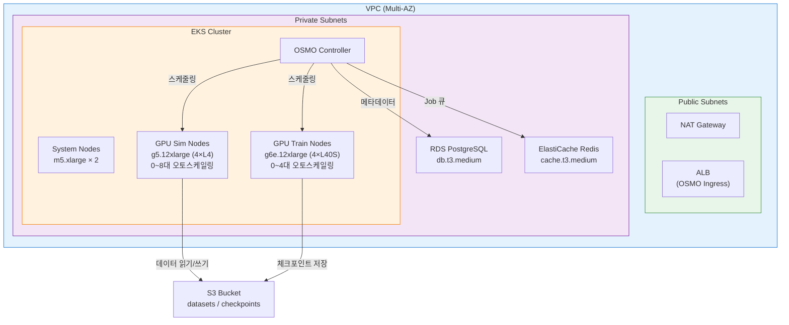
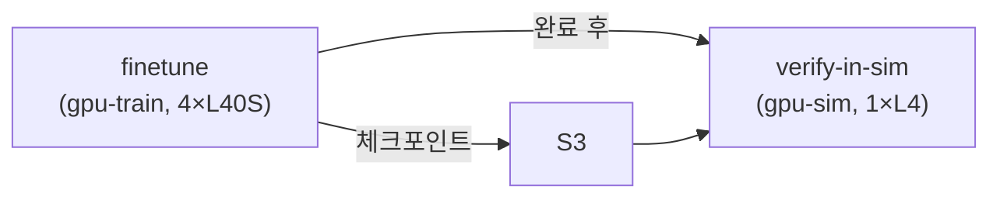
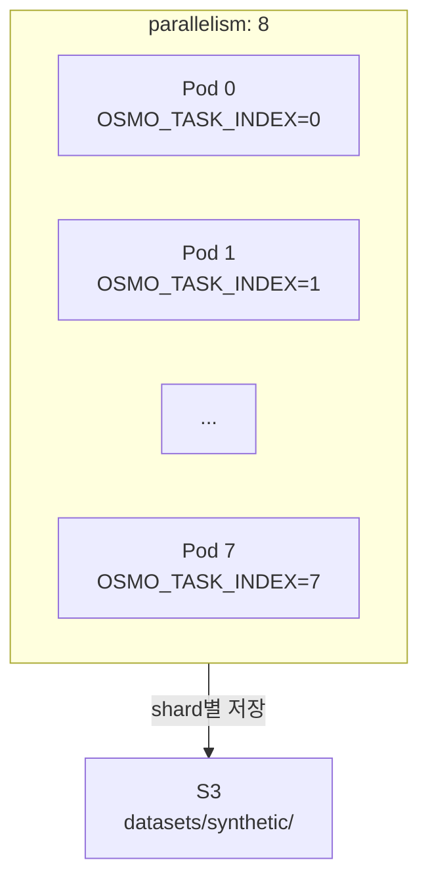

# 1. NVIDIA OSMO on AWS EKS

NVIDIA OSMO를 AWS EKS 위에 CDK로 원클릭 배포하여, Isaac Sim/GR00T 워크플로를 Kubernetes 위에서 오케스트레이션합니다. Training→Simulation→Verification 파이프라인을 단일 YAML로 정의하고, GPU 노드 오토스케일링으로 비용을 최적화합니다.

> 이 레시피는 추가 선택지입니다. 기존 [HyperPod](../training/hyperpod/) 또는 [SageMaker](../training/groot-sagemaker/) 레시피와 병행하여, Kubernetes 기반 NVIDIA 스택 오케스트레이션이 필요한 경우 사용합니다.

***

### 1.1 OSMO란?

[NVIDIA OSMO](https://github.com/NVIDIA/OSMO)는 Physical AI 워크플로 오케스트레이터입니다. Training, Simulation, Edge 세 가지 컴퓨팅 환경에서 실행되는 작업을 단일 YAML 파이프라인으로 정의하고 Kubernetes 위에서 실행합니다.

| 특징 | 설명 |
|------|------|
| Kubernetes-native | EKS, AKS, GKE 등 표준 K8s 클러스터에서 실행 |
| NVIDIA 스택 통합 | Isaac Sim, Isaac Lab, GR00T 컨테이너를 직접 오케스트레이션 |
| 파이프라인 DAG | Stage 간 의존성(`depends_on`)으로 Train→Sim→Verify 자동화 |
| 분산 실행 | `parallelism` 설정으로 동일 작업을 N개 Pod에서 병렬 수행 |
| 오픈소스 | Apache 2.0 라이선스 |

***

### 1.2 HyperPod vs OSMO — 어떤 걸 선택할까?

| | HyperPod (SLURM) | OSMO (Kubernetes) |
|---|---|---|
| 오케스트레이터 | SLURM | OSMO (K8s native) |
| 인프라 | [SageMaker HyperPod](https://docs.aws.amazon.com/sagemaker/latest/dg/sagemaker-hyperpod.html) 관리형 | Self-managed [EKS](https://docs.aws.amazon.com/eks/latest/userguide/what-is-eks.html) |
| 스케줄링 | `sbatch` / `squeue` | OSMO workflow YAML |
| 장점 | AWS 관리형, 오토스케일링 내장, 장애 자동 복구 | NVIDIA 스택 통합, 파이프라인 DAG, 멀티클라우드 이식성 |
| 적합한 경우 | 단일 학습 Job 중심, SLURM 경험자 | Train→Sim→Deploy 파이프라인, 대규모 분산 시뮬레이션 |

**선택 가이드라인:**
- AWS 관리형 인프라를 선호하고 SLURM에 익숙하다면 → **HyperPod**
- NVIDIA 스택을 통합 오케스트레이션하고 파이프라인 DAG가 필요하다면 → **OSMO**

***

### 1.3 AWS 서비스 한눈에 보기

이 레시피에서 사용하는 AWS 서비스입니다.

| 서비스 | 쉬운 비유 | 이 레시피에서의 역할 |
|--------|-----------|---------------------|
| [VPC](https://docs.aws.amazon.com/vpc/latest/userguide/what-is-amazon-vpc.html) | 나만의 격리된 사설 네트워크 | 모든 리소스의 네트워크 경계 |
| [EKS](https://docs.aws.amazon.com/eks/latest/userguide/what-is-eks.html) | 관리형 Kubernetes 서비스 | OSMO + GPU 워크로드 실행 플랫폼 |
| [EC2 (GPU)](https://docs.aws.amazon.com/AWSEC2/latest/UserGuide/accelerated-computing-instances.html) | GPU 장착 가상 서버 | 학습/시뮬레이션 실행 (g5, g6e) |
| [RDS PostgreSQL](https://docs.aws.amazon.com/AmazonRDS/latest/UserGuide/CHAP_PostgreSQL.html) | 관리형 관계형 데이터베이스 | OSMO 메타데이터, 워크플로 상태 저장 |
| [ElastiCache Redis](https://docs.aws.amazon.com/AmazonElastiCache/latest/red-ug/WhatIs.html) | 관리형 인메모리 캐시 | OSMO Job 큐, 캐싱 |
| [S3](https://docs.aws.amazon.com/AmazonS3/latest/userguide/Welcome.html) | 무제한 오브젝트 스토리지 | 데이터셋, 체크포인트, 아티팩트 저장 |
| [NAT Gateway](https://docs.aws.amazon.com/vpc/latest/userguide/vpc-nat-gateway.html) | Private 서브넷에서 인터넷으로 나가는 단방향 출구 | NGC 컨테이너 이미지 pull |

***

### 1.4 아키텍처

배포되는 전체 인프라 구성입니다:



GPU 노드는 0대로 시작하고, OSMO가 워크플로를 제출하면 Cluster Autoscaler가 자동으로 노드를 프로비저닝합니다. 워크플로 완료 후 10분간 idle 상태가 유지되면 자동으로 scale-down됩니다.

***

### 1.5 사전 요구사항

| 항목 | 버전/조건 | 확인 방법 |
|------|-----------|-----------|
| AWS CLI | v2+ | `aws --version` |
| AWS 자격 증명 | AdministratorAccess 또는 동등 권한 | `aws sts get-caller-identity` |
| Node.js | 18+ | `node --version` |
| AWS CDK | 최신 | `npm install -g aws-cdk && cdk --version` |
| kubectl | 최신 | `kubectl version --client` |
| CDK Bootstrap | 배포 리전에서 1회 실행 | `cdk bootstrap aws://ACCOUNT/REGION` |
| [OSMO CLI](https://github.com/NVIDIA/OSMO#installation) | 최신 | `osmo version` |
| NGC API Key | NGC 컨테이너 pull용 | [NGC 포털](https://ngc.nvidia.com/)에서 발급 |
| GPU 인스턴스 Quota | g5.12xlarge, g6e.12xlarge | AWS 콘솔 > Service Quotas에서 확인 |


GPU 인스턴스 할당량이 부족하면 노드가 프로비저닝되지 않습니다. 배포 전 Service Quotas에서 `Running On-Demand G and VT instances` 할당량을 확인하세요.


***

### 1.6 Quick Start (~20분)

#### 1.6.1 CDK 배포

```bash
cd osmo/cdk
npm install
cdk deploy
```

배포가 완료되면 CloudFormation Output에 EKS 클러스터 이름, S3 버킷, VPC ID가 출력됩니다.

#### 1.6.2 kubeconfig 설정

```bash
aws eks update-kubeconfig --name osmo-eks --region <region>
```

#### 1.6.3 OSMO 상태 확인

```bash
kubectl get pods -n osmo
```

정상 출력:

```
NAME                              READY   STATUS    RESTARTS   AGE
osmo-controller-xxxxx-yyyyy       1/1     Running   0          5m
osmo-scheduler-xxxxx-yyyyy        1/1     Running   0          5m
```

#### 1.6.4 Workflow 실행

```bash
# GR00T Fine-tuning → Isaac Sim 검증
osmo workflow run -f workflows/groot-train-sim.yaml

# 대규모 Sim 데이터 생성
osmo workflow run -f workflows/sim-datagen.yaml
```

***

### 1.7 Workflow 예시

#### 1.7.1 GR00T Train → Sim 검증 (`workflows/groot-train-sim.yaml`)

GR00T-N1.6-3B fine-tuning 완료 후 자동으로 Isaac Sim에서 학습된 policy를 검증하는 2-stage 파이프라인입니다.



| Stage | 이미지 | GPU | 역할 |
|-------|--------|-----|------|
| `finetune` | `nvcr.io/nvidia/gr00t:1.6.0` | 4 (gpu-train) | GR00T DDP fine-tuning |
| `verify-in-sim` | `nvcr.io/nvidia/isaac-sim:4.5.0` | 1 (gpu-sim) | Isaac Sim policy 검증 |

#### 1.7.2 Isaac Sim 대규모 데이터 생성 (`workflows/sim-datagen.yaml`)

8개 Pod를 병렬(총 32 GPU)로 실행하여 synthetic 데이터를 대량 생성합니다.



각 Pod에 `OSMO_TASK_INDEX` 환경 변수가 자동 주입되어 데이터를 shard 단위로 분할 저장합니다.

***

### 1.8 CDK Context 파라미터

배포 시 커스터마이징이 가능한 파라미터입니다.

| 파라미터 | 설명 | 기본값 | 예시 |
|----------|------|--------|------|
| `userId` | 멀티유저 격리용 식별자 | (없음) | `-c userId=alice` |
| `region` | 배포 리전 | CDK_DEFAULT_REGION | `-c region=us-west-2` |
| `vpcCidr` | VPC CIDR 블록 | `10.0.0.0/16` | `-c vpcCidr=10.1.0.0/16` |
| `gpuSimMaxNodes` | Sim 노드 최대 수 | `8` | `-c gpuSimMaxNodes=16` |
| `gpuTrainMaxNodes` | Train 노드 최대 수 | `4` | `-c gpuTrainMaxNodes=2` |

```bash
# 예: 사용자별 독립 배포
cdk deploy -c userId=alice -c region=us-west-2 -c gpuSimMaxNodes=4
```

***

### 1.9 비용 참고

| 리소스 | 사양 | 시간당 비용 (us-east-1 기준) |
|--------|------|------------------------------|
| EKS Control Plane | 관리형 | $0.10 |
| System Nodes | m5.xlarge × 2 | ~$0.38 |
| GPU Sim (실행 시) | g5.12xlarge × N | ~$5.67/대 |
| GPU Train (실행 시) | g6e.12xlarge × N | ~$4.99/대 |
| RDS | db.t3.medium | ~$0.07 |
| ElastiCache | cache.t3.medium | ~$0.07 |
| NAT Gateway | 고정 + 데이터 전송 | ~$0.05 + $0.045/GB |


GPU 노드는 0대로 시작합니다. Workflow를 실행하지 않으면 GPU 비용이 발생하지 않습니다. 최소 유지 비용(EKS + System Nodes + RDS + Redis + NAT)은 약 $0.67/hr입니다.


최신 가격은 [AWS 요금 페이지](https://aws.amazon.com/pricing/)를 참고하세요.

***

### 1.10 정리 (Cleanup)

```bash
cd osmo/cdk
cdk destroy
```


`cdk destroy`는 S3 버킷의 데이터를 삭제하지 않습니다. 데이터셋과 체크포인트를 포함한 버킷을 완전히 삭제하려면 수동으로 비운 후 삭제해야 합니다.


***

### 1.11 디렉토리 구조

```
osmo/
├── README.md                          # 이 문서
├── cdk/
│   ├── bin/app.ts                     # CDK App 엔트리포인트
│   ├── lib/
│   │   ├── osmo-stack.ts             # 메인 스택 (construct 조합)
│   │   └── constructs/
│   │       ├── networking.ts          # VPC, 멀티AZ Subnet, NAT, Endpoints
│   │       ├── eks-cluster.ts         # EKS + GPU Node Groups
│   │       ├── data-stores.ts         # RDS PostgreSQL + ElastiCache Redis + S3
│   │       └── osmo-install.ts        # OSMO Helm chart 설치
│   ├── cdk.json
│   ├── package.json
│   └── tsconfig.json
│
└── workflows/
    ├── groot-train-sim.yaml           # GR00T fine-tune → Isaac Sim 검증
    └── sim-datagen.yaml               # Isaac Sim 대규모 데이터 생성
```

***

### References

- [NVIDIA OSMO GitHub](https://github.com/NVIDIA/OSMO)
- [OSMO Terraform AWS Example](https://github.com/NVIDIA/OSMO/tree/main/deployments/terraform/aws/example)
- [Amazon EKS 공식 문서](https://docs.aws.amazon.com/eks/latest/userguide/what-is-eks.html)
- [EKS Managed Node Groups](https://docs.aws.amazon.com/eks/latest/userguide/managed-node-groups.html)
- [이 레포의 HyperPod 레시피](../training/hyperpod/) — SLURM 기반 대안
- [이 레포의 SageMaker 레시피](../training/groot-sagemaker/) — SageMaker Pipeline 기반
