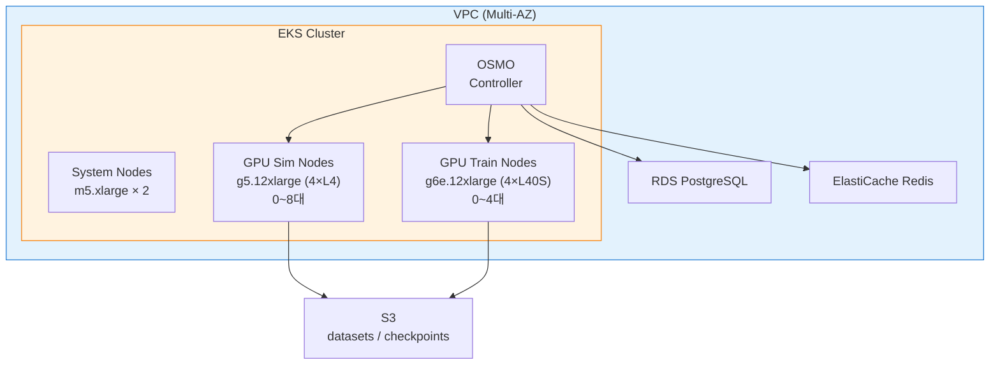

# OSMO — NVIDIA Physical AI Orchestrator on AWS

NVIDIA OSMO를 AWS EKS 위에 배포하여 Physical AI 워크플로를 Kubernetes-native로 실행하는 레시피입니다.

> **이 레시피는 추가 선택지입니다.** 기존 [HyperPod](../training/hyperpod/) 또는 [SageMaker](../training/groot-sagemaker/) 레시피와 병행하여, Kubernetes 기반 NVIDIA 스택 오케스트레이션이 필요한 경우 사용합니다.

## OSMO란?

[NVIDIA OSMO](https://github.com/NVIDIA/OSMO)는 Physical AI 워크플로 오케스트레이터입니다.
Training, Simulation, Edge 세 가지 컴퓨팅 환경을 단일 YAML로 정의하고 Kubernetes 위에서 실행합니다.

- Kubernetes-native (EKS, AKS, GKE)
- Isaac Sim, Isaac Lab, GR00T 통합 관리
- 파이프라인 DAG, 분산 실행, content-addressable 데이터셋
- Apache 2.0 오픈소스

## HyperPod vs OSMO — 어떤 걸 선택할까?

| | HyperPod (SLURM) | OSMO (Kubernetes) |
|---|---|---|
| 오케스트레이터 | SLURM | OSMO (K8s native) |
| 인프라 | SageMaker Managed | Self-managed EKS |
| 스케줄링 | sbatch / squeue | OSMO workflow YAML |
| 장점 | AWS 관리형, 오토스케일링 내장 | NVIDIA 스택 통합, 파이프라인 DAG, 멀티클라우드 |
| 적합한 경우 | 단일 학습 job 중심 | Train→Sim→Deploy 파이프라인, 대규모 분산 Sim |

**선택 가이드라인:**
- AWS 관리형 인프라를 선호하고 SLURM에 익숙하다면 → **HyperPod**
- NVIDIA 스택을 통합 오케스트레이션하고 파이프라인 DAG가 필요하다면 → **OSMO**

## Prerequisites

- AWS CLI v2+ (configured)
- Node.js 18+ & AWS CDK (`npm install -g aws-cdk`)
- kubectl
- [OSMO CLI](https://github.com/NVIDIA/OSMO#installation)
- NGC API Key (NGC 컨테이너 이미지 pull용)

## Architecture



## Quick Start

```bash
# 1. CDK 배포 (VPC + EKS + RDS + Redis + OSMO)
cd osmo/cdk
npm install
cdk deploy

# 2. kubeconfig 설정
aws eks update-kubeconfig --name osmo-eks --region <region>

# 3. OSMO 상태 확인
kubectl get pods -n osmo

# 4. Workflow 실행 — GR00T Fine-tuning → Sim 검증
osmo workflow run -f ../workflows/groot-train-sim.yaml

# 5. Workflow 실행 — 대규모 Sim 데이터 생성
osmo workflow run -f ../workflows/sim-datagen.yaml
```

## Workflow 예시

### 1. GR00T Train → Sim 검증 (`workflows/groot-train-sim.yaml`)

GR00T-N1.6-3B fine-tuning 완료 후 자동으로 Isaac Sim에서 policy를 검증하는 2-stage 파이프라인:

- **finetune**: gpu-train 노드에서 4×L40S로 학습 (torchrun DDP)
- **verify-in-sim**: finetune 완료 후 gpu-sim 노드에서 Isaac Sim 검증

### 2. Isaac Sim 대규모 데이터 생성 (`workflows/sim-datagen.yaml`)

8개 Pod 병렬(총 32 GPU)로 synthetic 데이터를 대량 생성:

- OSMO의 `parallelism` 기능으로 자동 분산
- 각 Pod에 `OSMO_TASK_INDEX` 주입하여 shard 분할 저장

## 비용 참고

| 리소스 | 사양 | 시간당 예상 비용 |
|--------|------|-----------------|
| EKS Cluster | Control Plane | ~$0.10 |
| System Nodes | m5.xlarge × 2 | ~$0.38 |
| GPU Sim (실행 시) | g5.12xlarge × N | ~$5.67/대 |
| GPU Train (실행 시) | g6e.12xlarge × N | ~$4.99/대 |
| RDS | db.t3.medium | ~$0.07 |
| ElastiCache | cache.t3.medium | ~$0.07 |
| NAT Gateway | - | ~$0.05 + 데이터 |

GPU 노드는 0대 시작이므로 workflow를 실행하지 않으면 GPU 비용이 발생하지 않습니다.

## Cleanup

```bash
cd osmo/cdk
cdk destroy
```

## 참고

- [NVIDIA OSMO GitHub](https://github.com/NVIDIA/OSMO)
- [OSMO Terraform AWS Example](https://github.com/NVIDIA/OSMO/tree/main/deployments/terraform/aws/example)
- [이 레포의 HyperPod 레시피](../training/hyperpod/) — SLURM 기반 대안
- [이 레포의 SageMaker 레시피](../training/groot-sagemaker/) — SageMaker Pipeline 기반
