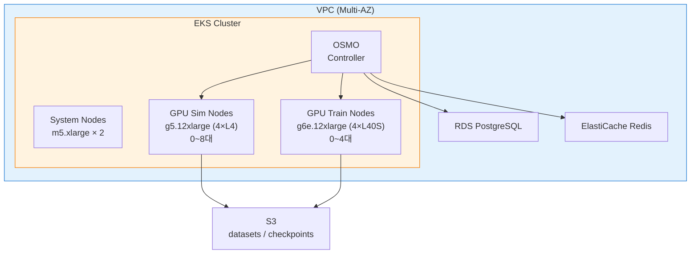

# OSMO 레시피 Implementation Plan

> **For agentic workers:** REQUIRED SUB-SKILL: Use superpowers:subagent-driven-development (recommended) or superpowers:executing-plans to implement this plan task-by-task. Steps use checkbox (`- [ ]`) syntax for tracking.

**Goal:** NVIDIA OSMO를 EKS 위에 배포하는 CDK 인프라 + workflow YAML 예시 2개 + README를 제공하여, 기존 HyperPod/SageMaker 레시피의 대안 선택지를 제공한다.

**Architecture:** CDK TypeScript로 VPC + EKS(GPU 노드그룹) + RDS + ElastiCache + S3를 프로비저닝하고, EKS 위에 OSMO Helm chart를 설치한다. 기존 `infra-multiuser-groot` 패턴(L1/L2 construct, namePrefix, 태깅)을 따른다.

**Tech Stack:** AWS CDK (TypeScript), EKS, RDS PostgreSQL, ElastiCache Redis, S3, Helm, NVIDIA OSMO

**Spec:** `osmo/docs/specs/2026-05-02-osmo-recipe-design.md`

**Validation:** `cdk synth`로 CloudFormation 템플릿 생성 확인 (인프라 코드이므로 synth 검증)

---

## File Structure

```
osmo/
├── README.md
├── cdk/
│   ├── bin/app.ts
│   ├── lib/
│   │   ├── osmo-stack.ts
│   │   └── constructs/
│   │       ├── networking.ts
│   │       ├── eks-cluster.ts
│   │       ├── data-stores.ts
│   │       └── osmo-install.ts
│   ├── cdk.json
│   ├── package.json
│   ├── tsconfig.json
│   └── .gitignore
│
└── workflows/
    ├── groot-train-sim.yaml
    └── sim-datagen.yaml
```

---

## Task 1: CDK 프로젝트 스캐폴딩

**Files:**
- Create: `osmo/cdk/package.json`
- Create: `osmo/cdk/tsconfig.json`
- Create: `osmo/cdk/cdk.json`
- Create: `osmo/cdk/.gitignore`

- [ ] **Step 1: Create package.json**

```json
{
  "name": "osmo-infra",
  "version": "1.0.0",
  "description": "NVIDIA OSMO on EKS — CDK 인프라 프로젝트",
  "scripts": {
    "cdk": "cdk",
    "build": "tsc",
    "synth": "cdk synth"
  },
  "dependencies": {
    "aws-cdk-lib": "^2.180.0",
    "constructs": "^10.4.2"
  },
  "devDependencies": {
    "aws-cdk": "^2.180.0",
    "ts-node": "^10.9.2",
    "typescript": "~5.7.3"
  }
}
```

- [ ] **Step 2: Create tsconfig.json**

```json
{
  "compilerOptions": {
    "target": "ES2020",
    "module": "commonjs",
    "lib": ["es2020"],
    "declaration": true,
    "strict": true,
    "noImplicitAny": true,
    "strictNullChecks": true,
    "noImplicitThis": true,
    "alwaysStrict": true,
    "noUnusedLocals": false,
    "noUnusedParameters": false,
    "noImplicitReturns": true,
    "noFallthroughCasesInSwitch": false,
    "inlineSourceMap": true,
    "inlineSources": true,
    "experimentalDecorators": true,
    "strictPropertyInitialization": false,
    "outDir": "./cdk.out",
    "rootDir": ".",
    "skipLibCheck": true,
    "forceConsistentCasingInFileNames": true,
    "resolveJsonModule": true,
    "esModuleInterop": true
  },
  "include": ["bin/**/*", "lib/**/*"],
  "exclude": ["node_modules", "cdk.out"]
}
```

- [ ] **Step 3: Create cdk.json**

```json
{
  "app": "npx ts-node bin/app.ts",
  "watch": {
    "include": ["**"],
    "exclude": [
      "README.md",
      "cdk*.json",
      "**/*.d.ts",
      "**/*.js",
      "tsconfig.json",
      "package*.json",
      "node_modules",
      "cdk.out"
    ]
  },
  "context": {
    "@aws-cdk/aws-lambda:recognizeLayerVersion": true,
    "@aws-cdk/core:checkSecretUsage": true,
    "@aws-cdk/core:target-partitions": ["aws", "aws-cn"]
  }
}
```

- [ ] **Step 4: Create .gitignore**

```
node_modules/
cdk.out/
*.js
*.d.ts
```

- [ ] **Step 5: Install dependencies**

```bash
cd osmo/cdk && npm install
```

- [ ] **Step 6: Commit**

```bash
git add osmo/cdk/package.json osmo/cdk/package-lock.json osmo/cdk/tsconfig.json osmo/cdk/cdk.json osmo/cdk/.gitignore
git commit -m "feat(osmo): CDK 프로젝트 스캐폴딩"
```

---

## Task 2: Networking Construct

**Files:**
- Create: `osmo/cdk/lib/constructs/networking.ts`

- [ ] **Step 1: Create networking.ts**

VPC with multi-AZ subnets, NAT, and EKS-required subnet tags.

```typescript
import * as cdk from 'aws-cdk-lib';
import * as ec2 from 'aws-cdk-lib/aws-ec2';
import * as logs from 'aws-cdk-lib/aws-logs';
import * as iam from 'aws-cdk-lib/aws-iam';
import { Construct } from 'constructs';

export interface NetworkingProps {
  namePrefix: string;
  vpcCidr?: string;
  azCount?: number;
}

export class NetworkingConstruct extends Construct {
  public readonly vpc: ec2.CfnVPC;
  public readonly publicSubnets: ec2.CfnSubnet[];
  public readonly privateSubnets: ec2.CfnSubnet[];
  public readonly privateRouteTable: ec2.CfnRouteTable;

  constructor(scope: Construct, id: string, props: NetworkingProps) {
    super(scope, id);

    const p = props.namePrefix;
    const vpcCidr = props.vpcCidr ?? '10.0.0.0/16';
    const azCount = props.azCount ?? 2;
    const cidrPrefix = vpcCidr.split('.').slice(0, 2).join('.');

    // VPC
    this.vpc = new ec2.CfnVPC(this, 'VPC', {
      cidrBlock: vpcCidr,
      enableDnsSupport: true,
      enableDnsHostnames: true,
      tags: [{ key: 'Name', value: `${p}-VPC` }],
    });

    // Internet Gateway
    const igw = new ec2.CfnInternetGateway(this, 'IGW', {
      tags: [{ key: 'Name', value: `${p}-IGW` }],
    });
    const vpcGwAttachment = new ec2.CfnVPCGatewayAttachment(this, 'VPCGwAttach', {
      vpcId: this.vpc.ref,
      internetGatewayId: igw.ref,
    });

    // Public Route Table
    const publicRT = new ec2.CfnRouteTable(this, 'PublicRT', {
      vpcId: this.vpc.ref,
      tags: [{ key: 'Name', value: `${p}-Public-RT` }],
    });
    const publicRoute = new ec2.CfnRoute(this, 'PublicRoute', {
      routeTableId: publicRT.ref,
      destinationCidrBlock: '0.0.0.0/0',
      gatewayId: igw.ref,
    });
    (publicRoute as cdk.CfnResource).addDependency(vpcGwAttachment);

    // Public Subnets (multi-AZ)
    this.publicSubnets = [];
    for (let i = 0; i < azCount; i++) {
      const subnet = new ec2.CfnSubnet(this, `PublicSubnet${i}`, {
        vpcId: this.vpc.ref,
        cidrBlock: `${cidrPrefix}.${i * 2}.0/24`,
        availabilityZone: cdk.Fn.select(i, cdk.Fn.getAzs('')),
        mapPublicIpOnLaunch: true,
        tags: [
          { key: 'Name', value: `${p}-Public-${i}` },
          { key: 'kubernetes.io/role/elb', value: '1' },
        ],
      });
      new ec2.CfnSubnetRouteTableAssociation(this, `PublicRTAssoc${i}`, {
        subnetId: subnet.ref,
        routeTableId: publicRT.ref,
      });
      this.publicSubnets.push(subnet);
    }

    // NAT Gateway (single, in first public subnet)
    const natEip = new ec2.CfnEIP(this, 'NatEIP', {
      domain: 'vpc',
      tags: [{ key: 'Name', value: `${p}-NAT-EIP` }],
    });
    const natGw = new ec2.CfnNatGateway(this, 'NatGW', {
      subnetId: this.publicSubnets[0].ref,
      allocationId: natEip.attrAllocationId,
      tags: [{ key: 'Name', value: `${p}-NAT-GW` }],
    });

    // Private Route Table
    this.privateRouteTable = new ec2.CfnRouteTable(this, 'PrivateRT', {
      vpcId: this.vpc.ref,
      tags: [{ key: 'Name', value: `${p}-Private-RT` }],
    });
    new ec2.CfnRoute(this, 'PrivateRoute', {
      routeTableId: this.privateRouteTable.ref,
      destinationCidrBlock: '0.0.0.0/0',
      natGatewayId: natGw.ref,
    });

    // Private Subnets (multi-AZ)
    this.privateSubnets = [];
    for (let i = 0; i < azCount; i++) {
      const subnet = new ec2.CfnSubnet(this, `PrivateSubnet${i}`, {
        vpcId: this.vpc.ref,
        cidrBlock: `${cidrPrefix}.${i * 2 + 1}.0/24`,
        availabilityZone: cdk.Fn.select(i, cdk.Fn.getAzs('')),
        tags: [
          { key: 'Name', value: `${p}-Private-${i}` },
          { key: 'kubernetes.io/role/internal-elb', value: '1' },
        ],
      });
      new ec2.CfnSubnetRouteTableAssociation(this, `PrivateRTAssoc${i}`, {
        subnetId: subnet.ref,
        routeTableId: this.privateRouteTable.ref,
      });
      this.privateSubnets.push(subnet);
    }

    // S3 Gateway Endpoint
    new ec2.CfnVPCEndpoint(this, 'S3Endpoint', {
      vpcId: this.vpc.ref,
      serviceName: `com.amazonaws.${cdk.Aws.REGION}.s3`,
      vpcEndpointType: 'Gateway',
      routeTableIds: [publicRT.ref, this.privateRouteTable.ref],
    });

    // ECR/STS Interface Endpoints (EKS image pull without NAT)
    const endpointSG = new ec2.CfnSecurityGroup(this, 'EndpointSG', {
      groupDescription: 'VPC Interface Endpoints',
      vpcId: this.vpc.ref,
      securityGroupIngress: [{
        ipProtocol: 'tcp',
        fromPort: 443,
        toPort: 443,
        cidrIp: vpcCidr,
        description: 'HTTPS from VPC',
      }],
      tags: [{ key: 'Name', value: `${p}-Endpoint-SG` }],
    });

    const interfaceEndpoints = ['ecr.api', 'ecr.dkr', 'sts'];
    for (const svc of interfaceEndpoints) {
      new ec2.CfnVPCEndpoint(this, `${svc.replace('.', '')}Endpoint`, {
        vpcId: this.vpc.ref,
        serviceName: `com.amazonaws.${cdk.Aws.REGION}.${svc}`,
        vpcEndpointType: 'Interface',
        subnetIds: this.privateSubnets.map(s => s.ref),
        securityGroupIds: [endpointSG.ref],
        privateDnsEnabled: true,
      });
    }

    // VPC Flow Log
    const logGroup = new logs.CfnLogGroup(this, 'FlowLogGroup', {
      retentionInDays: 7,
      tags: [{ key: 'Name', value: `${p}-FlowLog` }],
    });
    const flowLogRole = new iam.CfnRole(this, 'FlowLogRole', {
      assumeRolePolicyDocument: {
        Version: '2012-10-17',
        Statement: [{
          Effect: 'Allow',
          Principal: { Service: 'vpc-flow-logs.amazonaws.com' },
          Action: 'sts:AssumeRole',
        }],
      },
      policies: [{
        policyName: 'FlowLogPolicy',
        policyDocument: {
          Version: '2012-10-17',
          Statement: [{
            Effect: 'Allow',
            Action: ['logs:CreateLogGroup', 'logs:CreateLogStream', 'logs:PutLogEvents'],
            Resource: '*',
          }],
        },
      }],
    });
    new ec2.CfnFlowLog(this, 'FlowLog', {
      resourceId: this.vpc.ref,
      resourceType: 'VPC',
      trafficType: 'ALL',
      logDestinationType: 'cloud-watch-logs',
      logGroupName: logGroup.ref,
      deliverLogsPermissionArn: flowLogRole.attrArn,
    });
  }
}
```

- [ ] **Step 2: Verify TypeScript compiles**

```bash
cd osmo/cdk && npx tsc --noEmit
```

Expected: No errors (stub stack not yet created, so compile networking.ts alone if needed)

- [ ] **Step 3: Commit**

```bash
git add osmo/cdk/lib/constructs/networking.ts
git commit -m "feat(osmo): Networking construct (VPC, multi-AZ subnets, NAT, endpoints)"
```

---

## Task 3: EKS Cluster Construct

**Files:**
- Create: `osmo/cdk/lib/constructs/eks-cluster.ts`

- [ ] **Step 1: Create eks-cluster.ts**

EKS cluster with system + GPU node groups, OIDC provider, and NVIDIA device plugin.

```typescript
import * as cdk from 'aws-cdk-lib';
import * as ec2 from 'aws-cdk-lib/aws-ec2';
import * as eks from 'aws-cdk-lib/aws-eks';
import * as iam from 'aws-cdk-lib/aws-iam';
import { Construct } from 'constructs';

export interface EksClusterProps {
  namePrefix: string;
  vpc: ec2.CfnVPC;
  privateSubnets: ec2.CfnSubnet[];
  publicSubnets: ec2.CfnSubnet[];
  gpuSimMaxNodes?: number;
  gpuTrainMaxNodes?: number;
}

export class EksClusterConstruct extends Construct {
  public readonly cluster: eks.Cluster;
  public readonly clusterName: string;
  public readonly oidcProviderArn: string;

  constructor(scope: Construct, id: string, props: EksClusterProps) {
    super(scope, id);

    const p = props.namePrefix;
    const gpuSimMax = props.gpuSimMaxNodes ?? 8;
    const gpuTrainMax = props.gpuTrainMaxNodes ?? 4;

    // EKS Cluster (L2 construct for kubectl/Helm integration)
    // L1 CfnVPC/CfnSubnet → L2 IVpc 브릿지: fromVpcAttributes로 연결
    this.cluster = new eks.Cluster(this, 'Cluster', {
      clusterName: `${p}-eks`.toLowerCase(),
      version: eks.KubernetesVersion.V1_30,
      defaultCapacity: 0,
      vpc: ec2.Vpc.fromVpcAttributes(this, 'ImportVpc', {
        vpcId: props.vpc.ref,
        availabilityZones: props.privateSubnets.map(s => s.attrAvailabilityZone),
        privateSubnetIds: props.privateSubnets.map(s => s.ref),
        publicSubnetIds: props.publicSubnets.map(s => s.ref),
      }),
      endpointAccess: eks.EndpointAccess.PUBLIC_AND_PRIVATE,
    });

    this.clusterName = this.cluster.clusterName;
    this.oidcProviderArn = this.cluster.openIdConnectProvider.openIdConnectProviderArn;

    // --- Node Groups ---

    // System node group (OSMO control plane, ingress, etc.)
    this.cluster.addNodegroupCapacity('SystemNodes', {
      nodegroupName: 'system',
      instanceTypes: [new ec2.InstanceType('m5.xlarge')],
      minSize: 2,
      maxSize: 3,
      desiredSize: 2,
      labels: { 'node-role': 'system' },
    });

    // GPU Sim node group (g5.12xlarge, 4×L4)
    this.cluster.addNodegroupCapacity('GpuSimNodes', {
      nodegroupName: 'gpu-sim',
      instanceTypes: [new ec2.InstanceType('g5.12xlarge')],
      minSize: 0,
      maxSize: gpuSimMax,
      desiredSize: 0,
      labels: { 'node-role': 'gpu-sim', 'nvidia.com/gpu.product': 'L4' },
      taints: [{
        key: 'nvidia.com/gpu',
        value: 'present',
        effect: eks.TaintEffect.NO_SCHEDULE,
      }],
      amiType: eks.NodegroupAmiType.AL2_X86_64_GPU,
    });

    // GPU Train node group (g6e.12xlarge, 4×L40S)
    this.cluster.addNodegroupCapacity('GpuTrainNodes', {
      nodegroupName: 'gpu-train',
      instanceTypes: [new ec2.InstanceType('g6e.12xlarge')],
      minSize: 0,
      maxSize: gpuTrainMax,
      desiredSize: 0,
      labels: { 'node-role': 'gpu-train', 'nvidia.com/gpu.product': 'L40S' },
      taints: [{
        key: 'nvidia.com/gpu',
        value: 'present',
        effect: eks.TaintEffect.NO_SCHEDULE,
      }],
      amiType: eks.NodegroupAmiType.AL2_X86_64_GPU,
    });

    // NVIDIA Device Plugin DaemonSet
    this.cluster.addHelmChart('NvidiaDevicePlugin', {
      chart: 'nvidia-device-plugin',
      repository: 'https://nvidia.github.io/k8s-device-plugin',
      namespace: 'kube-system',
      values: {
        tolerations: [{
          key: 'nvidia.com/gpu',
          operator: 'Exists',
          effect: 'NoSchedule',
        }],
      },
    });

    // Cluster Autoscaler
    this.cluster.addHelmChart('ClusterAutoscaler', {
      chart: 'cluster-autoscaler',
      repository: 'https://kubernetes.github.io/autoscaler',
      namespace: 'kube-system',
      values: {
        autoDiscovery: {
          clusterName: this.cluster.clusterName,
        },
        awsRegion: cdk.Aws.REGION,
        extraArgs: {
          'scale-down-delay-after-add': '10m',
          'scale-down-unneeded-time': '10m',
        },
      },
    });
  }
}
```

- [ ] **Step 2: Verify TypeScript compiles**

```bash
cd osmo/cdk && npx tsc --noEmit
```

- [ ] **Step 3: Commit**

```bash
git add osmo/cdk/lib/constructs/eks-cluster.ts
git commit -m "feat(osmo): EKS cluster construct (system + GPU node groups)"
```

---

## Task 4: Data Stores Construct

**Files:**
- Create: `osmo/cdk/lib/constructs/data-stores.ts`

- [ ] **Step 1: Create data-stores.ts**

RDS PostgreSQL, ElastiCache Redis, and S3 bucket for OSMO.

```typescript
import * as cdk from 'aws-cdk-lib';
import * as ec2 from 'aws-cdk-lib/aws-ec2';
import * as rds from 'aws-cdk-lib/aws-rds';
import * as elasticache from 'aws-cdk-lib/aws-elasticache';
import * as s3 from 'aws-cdk-lib/aws-s3';
import { Construct } from 'constructs';

export interface DataStoresProps {
  namePrefix: string;
  vpc: ec2.CfnVPC;
  privateSubnets: ec2.CfnSubnet[];
  eksSecurityGroupId: string;
}

export class DataStoresConstruct extends Construct {
  public readonly bucket: s3.CfnBucket;
  public readonly dbEndpoint: string;
  public readonly dbPort: string;
  public readonly redisEndpoint: string;
  public readonly redisPort: string;

  constructor(scope: Construct, id: string, props: DataStoresProps) {
    super(scope, id);

    const p = props.namePrefix;

    // --- S3 Bucket ---
    this.bucket = new s3.CfnBucket(this, 'DataBucket', {
      bucketName: cdk.Fn.join('-', [
        'osmo-data',
        p.toLowerCase(),
        cdk.Aws.ACCOUNT_ID,
        cdk.Aws.REGION,
      ]),
      versioningConfiguration: { status: 'Enabled' },
      lifecycleConfiguration: {
        rules: [{
          id: 'TransitionToIA',
          status: 'Enabled',
          transitions: [{
            storageClass: 'INTELLIGENT_TIERING',
            transitionInDays: 30,
          }],
        }],
      },
      tags: [{ key: 'Name', value: `${p}-Data` }],
    });

    // --- RDS Security Group ---
    const dbSG = new ec2.CfnSecurityGroup(this, 'DbSG', {
      groupDescription: 'RDS PostgreSQL for OSMO',
      vpcId: props.vpc.ref,
      securityGroupIngress: [{
        ipProtocol: 'tcp',
        fromPort: 5432,
        toPort: 5432,
        sourceSecurityGroupId: props.eksSecurityGroupId,
        description: 'PostgreSQL from EKS',
      }],
      tags: [{ key: 'Name', value: `${p}-DB-SG` }],
    });

    // --- RDS Subnet Group ---
    const dbSubnetGroup = new rds.CfnDBSubnetGroup(this, 'DbSubnetGroup', {
      dbSubnetGroupDescription: 'OSMO RDS subnet group',
      subnetIds: props.privateSubnets.map(s => s.ref),
      tags: [{ key: 'Name', value: `${p}-DB-SubnetGroup` }],
    });

    // --- RDS PostgreSQL ---
    const dbInstance = new rds.CfnDBInstance(this, 'PostgresDB', {
      dbInstanceIdentifier: `${p}-postgres`.toLowerCase(),
      engine: 'postgres',
      engineVersion: '16.4',
      dbInstanceClass: 'db.t3.medium',
      allocatedStorage: '20',
      masterUsername: 'osmo',
      masterUserPassword: cdk.Fn.join('', [
        '{{resolve:secretsmanager:', `${p}-db-secret`.toLowerCase(), ':SecretString:password}}',
      ]),
      vpcSecurityGroups: [dbSG.ref],
      dbSubnetGroupName: dbSubnetGroup.ref,
      multiAz: false,
      storageEncrypted: true,
      publiclyAccessible: false,
      tags: [{ key: 'Name', value: `${p}-Postgres` }],
    });

    this.dbEndpoint = dbInstance.attrEndpointAddress;
    this.dbPort = dbInstance.attrEndpointPort;

    // --- ElastiCache Security Group ---
    const redisSG = new ec2.CfnSecurityGroup(this, 'RedisSG', {
      groupDescription: 'ElastiCache Redis for OSMO',
      vpcId: props.vpc.ref,
      securityGroupIngress: [{
        ipProtocol: 'tcp',
        fromPort: 6379,
        toPort: 6379,
        sourceSecurityGroupId: props.eksSecurityGroupId,
        description: 'Redis from EKS',
      }],
      tags: [{ key: 'Name', value: `${p}-Redis-SG` }],
    });

    // --- ElastiCache Subnet Group ---
    const cacheSubnetGroup = new elasticache.CfnSubnetGroup(this, 'CacheSubnetGroup', {
      description: 'OSMO Redis subnet group',
      subnetIds: props.privateSubnets.map(s => s.ref),
      cacheSubnetGroupName: `${p}-redis-subnet`.toLowerCase(),
    });

    // --- ElastiCache Redis ---
    const redisCluster = new elasticache.CfnCacheCluster(this, 'RedisCluster', {
      clusterName: `${p}-redis`.toLowerCase(),
      engine: 'redis',
      cacheNodeType: 'cache.t3.medium',
      numCacheNodes: 1,
      vpcSecurityGroupIds: [redisSG.ref],
      cacheSubnetGroupName: cacheSubnetGroup.ref,
      tags: [{ key: 'Name', value: `${p}-Redis` }],
    });

    this.redisEndpoint = redisCluster.attrRedisEndpointAddress;
    this.redisPort = redisCluster.attrRedisEndpointPort;
  }
}
```

- [ ] **Step 2: Verify TypeScript compiles**

```bash
cd osmo/cdk && npx tsc --noEmit
```

- [ ] **Step 3: Commit**

```bash
git add osmo/cdk/lib/constructs/data-stores.ts
git commit -m "feat(osmo): Data stores construct (RDS PostgreSQL, ElastiCache Redis, S3)"
```

---

## Task 5: OSMO Install Construct

**Files:**
- Create: `osmo/cdk/lib/constructs/osmo-install.ts`

- [ ] **Step 1: Create osmo-install.ts**

Installs OSMO via Helm chart on the EKS cluster.

```typescript
import * as cdk from 'aws-cdk-lib';
import * as eks from 'aws-cdk-lib/aws-eks';
import * as s3 from 'aws-cdk-lib/aws-s3';
import { Construct } from 'constructs';

export interface OsmoInstallProps {
  namePrefix: string;
  cluster: eks.Cluster;
  dbEndpoint: string;
  dbPort: string;
  redisEndpoint: string;
  redisPort: string;
  dataBucket: s3.CfnBucket;
}

export class OsmoInstallConstruct extends Construct {
  constructor(scope: Construct, id: string, props: OsmoInstallProps) {
    super(scope, id);

    const p = props.namePrefix;

    // OSMO namespace
    const namespace = props.cluster.addManifest('OsmoNamespace', {
      apiVersion: 'v1',
      kind: 'Namespace',
      metadata: { name: 'osmo' },
    });

    // OSMO Helm chart
    const osmoChart = props.cluster.addHelmChart('OsmoHelm', {
      chart: 'osmo',
      repository: 'https://helm.nvidia.com/osmo',
      namespace: 'osmo',
      values: {
        global: {
          storageClass: 'gp3',
        },
        postgresql: {
          external: {
            enabled: true,
            host: props.dbEndpoint,
            port: parseInt(props.dbPort, 10),
            database: 'osmo',
            username: 'osmo',
            existingSecret: `${p}-db-secret`.toLowerCase(),
          },
        },
        redis: {
          external: {
            enabled: true,
            host: props.redisEndpoint,
            port: parseInt(props.redisPort, 10),
          },
        },
        storage: {
          s3: {
            bucket: props.dataBucket.ref,
            region: cdk.Aws.REGION,
          },
        },
      },
    });

    osmoChart.node.addDependency(namespace);

    // Outputs
    new cdk.CfnOutput(cdk.Stack.of(this), 'OsmoNamespace', {
      value: 'osmo',
      description: 'OSMO Kubernetes namespace',
    });
  }
}
```

- [ ] **Step 2: Verify TypeScript compiles**

```bash
cd osmo/cdk && npx tsc --noEmit
```

- [ ] **Step 3: Commit**

```bash
git add osmo/cdk/lib/constructs/osmo-install.ts
git commit -m "feat(osmo): OSMO Helm chart install construct"
```

---

## Task 6: Main Stack + App Entrypoint

**Files:**
- Create: `osmo/cdk/lib/osmo-stack.ts`
- Create: `osmo/cdk/bin/app.ts`

- [ ] **Step 1: Create osmo-stack.ts**

```typescript
import * as cdk from 'aws-cdk-lib';
import { Construct } from 'constructs';
import { NetworkingConstruct } from './constructs/networking';
import { EksClusterConstruct } from './constructs/eks-cluster';
import { DataStoresConstruct } from './constructs/data-stores';
import { OsmoInstallConstruct } from './constructs/osmo-install';

export interface OsmoStackProps extends cdk.StackProps {
  userId?: string;
  vpcCidr?: string;
  gpuSimMaxNodes?: number;
  gpuTrainMaxNodes?: number;
}

export class OsmoStack extends cdk.Stack {
  constructor(scope: Construct, id: string, props: OsmoStackProps) {
    super(scope, id, props);

    const userId = props.userId ?? '';
    const userSuffix = userId ? `-${userId}` : '';
    const namePrefix = `Osmo${userSuffix}`;

    if (userId) {
      cdk.Tags.of(this).add('UserId', userId);
    }

    // 1. Networking
    const networking = new NetworkingConstruct(this, 'Networking', {
      namePrefix,
      vpcCidr: props.vpcCidr,
    });

    // 2. EKS Cluster
    const eksCluster = new EksClusterConstruct(this, 'EksCluster', {
      namePrefix,
      vpc: networking.vpc,
      privateSubnets: networking.privateSubnets,
      publicSubnets: networking.publicSubnets,
      gpuSimMaxNodes: props.gpuSimMaxNodes,
      gpuTrainMaxNodes: props.gpuTrainMaxNodes,
    });

    // 3. Data Stores
    const dataStores = new DataStoresConstruct(this, 'DataStores', {
      namePrefix,
      vpc: networking.vpc,
      privateSubnets: networking.privateSubnets,
      eksSecurityGroupId: eksCluster.cluster.clusterSecurityGroupId,
    });

    // 4. OSMO Install
    new OsmoInstallConstruct(this, 'OsmoInstall', {
      namePrefix,
      cluster: eksCluster.cluster,
      dbEndpoint: dataStores.dbEndpoint,
      dbPort: dataStores.dbPort,
      redisEndpoint: dataStores.redisEndpoint,
      redisPort: dataStores.redisPort,
      dataBucket: dataStores.bucket,
    });

    // Stack Outputs
    new cdk.CfnOutput(this, 'EksClusterName', {
      value: eksCluster.clusterName,
      description: 'EKS Cluster Name',
    });
    new cdk.CfnOutput(this, 'S3BucketName', {
      value: dataStores.bucket.ref,
      description: 'OSMO Data S3 Bucket',
    });
    new cdk.CfnOutput(this, 'VpcId', {
      value: networking.vpc.ref,
      description: 'VPC ID',
    });
  }
}
```

- [ ] **Step 2: Create bin/app.ts**

```typescript
#!/usr/bin/env node
import * as cdk from 'aws-cdk-lib';
import { OsmoStack } from '../lib/osmo-stack';

const app = new cdk.App();

const userId = app.node.tryGetContext('userId') ?? '';
const region = app.node.tryGetContext('region') ?? process.env.CDK_DEFAULT_REGION;
const vpcCidr = app.node.tryGetContext('vpcCidr') ?? '10.0.0.0/16';
const gpuSimMaxNodes = parseInt(app.node.tryGetContext('gpuSimMaxNodes') ?? '8', 10);
const gpuTrainMaxNodes = parseInt(app.node.tryGetContext('gpuTrainMaxNodes') ?? '4', 10);

if (userId && !/^[a-z0-9-]+$/.test(userId)) {
  throw new Error(`userId는 영문소문자, 숫자, 하이픈만 허용됩니다: '${userId}'`);
}

const env = {
  account: process.env.CDK_DEFAULT_ACCOUNT,
  region,
};

const userSuffix = userId ? `-${userId}` : '';
const stackName = `Osmo${userSuffix}`;

new OsmoStack(app, stackName, {
  env,
  userId,
  vpcCidr,
  gpuSimMaxNodes,
  gpuTrainMaxNodes,
});
```

- [ ] **Step 3: Run cdk synth to validate**

```bash
cd osmo/cdk && npx cdk synth --no-staging 2>&1 | head -50
```

Expected: CloudFormation template YAML output (may warn about env)

- [ ] **Step 4: Commit**

```bash
git add osmo/cdk/lib/osmo-stack.ts osmo/cdk/bin/app.ts
git commit -m "feat(osmo): main stack + app entrypoint (composes all constructs)"
```

---

## Task 7: Workflow YAML Files

**Files:**
- Create: `osmo/workflows/groot-train-sim.yaml`
- Create: `osmo/workflows/sim-datagen.yaml`

- [ ] **Step 1: Create groot-train-sim.yaml**

```yaml
# GR00T Fine-tuning → Isaac Sim 검증 파이프라인
#
# 사용법:
#   osmo workflow run -f groot-train-sim.yaml
#
# NOTE: 이 파일은 OSMO workflow YAML 예시입니다.
# 실제 OSMO 버전에 따라 스펙이 다를 수 있으므로 공식 문서를 참고하세요.
# https://github.com/NVIDIA/OSMO

name: groot-finetune-and-verify

stages:
  - name: finetune
    image: nvcr.io/nvidia/gr00t:1.6.0
    resources:
      gpu: 4
      node_pool: gpu-train
    command: |
      torchrun --nproc_per_node=4 train_groot.py \
        --dataset /data/datasets/groot/aloha \
        --output-dir /data/checkpoints/groot-aloha \
        --epochs 50
    volumes:
      - s3://bucket/datasets:/data/datasets
      - s3://bucket/checkpoints:/data/checkpoints

  - name: verify-in-sim
    depends_on: [finetune]
    image: nvcr.io/nvidia/isaac-sim:4.5.0
    resources:
      gpu: 1
      node_pool: gpu-sim
    command: |
      python verify_in_sim.py \
        --checkpoint /data/checkpoints/groot-aloha/model_final.pt \
        --env Isaac-Lift-Franka-v0 \
        --num-episodes 20
    volumes:
      - s3://bucket/checkpoints:/data/checkpoints
```

- [ ] **Step 2: Create sim-datagen.yaml**

```yaml
# Isaac Sim 대규모 Synthetic Data 생성
#
# 사용법:
#   osmo workflow run -f sim-datagen.yaml
#
# 8개 Pod 병렬 실행 (총 32 GPU)으로 synthetic 데이터를 대량 생성한다.
# 각 Pod에 OSMO_TASK_INDEX가 자동 주입되어 데이터를 shard 단위로 분할 저장한다.
#
# NOTE: 이 파일은 OSMO workflow YAML 예시입니다.
# https://github.com/NVIDIA/OSMO

name: isaac-sim-datagen

stages:
  - name: generate
    image: nvcr.io/nvidia/isaac-sim:4.5.0
    resources:
      gpu: 4
      node_pool: gpu-sim
    parallelism: 8
    command: |
      python generate_data.py \
        --env Isaac-Lift-Franka-v0 \
        --num-episodes 10000 \
        --output-dir /data/datasets/synthetic/lift-franka \
        --shard-id ${OSMO_TASK_INDEX}
    volumes:
      - s3://bucket/datasets:/data/datasets
```

- [ ] **Step 3: Commit**

```bash
git add osmo/workflows/
git commit -m "feat(osmo): workflow YAML 예시 (GR00T Train→Sim, Sim DataGen)"
```

---

## Task 8: README

**Files:**
- Create: `osmo/README.md`

- [ ] **Step 1: Create README.md**

```markdown
# OSMO — NVIDIA Physical AI Orchestrator on AWS

NVIDIA OSMO를 AWS EKS 위에 배포하여 Physical AI 워크플로를 Kubernetes-native로 실행하는 레시피입니다.

> **이 레시피는 추가 선택지입니다.** 기존 [HyperPod](../training/hyperpod/) 또는 [SageMaker](../training/groot-sagemaker/) 레시피와 병행하여, Kubernetes 기반 NVIDIA 스택 오케스트레이션이 필요한 경우 사용합니다.

## OSMO란?

[NVIDIA OSMO](https://github.com/NVIDIA/OSMO)는 Physical AI 워크플로 오케스트레이터입니다.
Training, Simulation, Edge 세 가지 컴퓨팅 환경을 단일 YAML로 정의하고 Kubernetes 위에서 실행합니다.

- Kubernetes-native (EKS, AKS, GKE)
- Isaac Sim, Isaac Lab, GR00T 통합 관리
- 파이프라인 DAG, 분산 실행, content-addressable 데이터셋
- Apache 2.0 오픈소스

## HyperPod vs OSMO — 어떤 걸 선택할까?

| | HyperPod (SLURM) | OSMO (Kubernetes) |
|---|---|---|
| 오케스트레이터 | SLURM | OSMO (K8s native) |
| 인프라 | SageMaker Managed | Self-managed EKS |
| 스케줄링 | sbatch / squeue | OSMO workflow YAML |
| 장점 | AWS 관리형, 오토스케일링 내장 | NVIDIA 스택 통합, 파이프라인 DAG, 멀티클라우드 |
| 적합한 경우 | 단일 학습 job 중심 | Train→Sim→Deploy 파이프라인, 대규모 분산 Sim |

**선택 가이드라인:**
- AWS 관리형 인프라를 선호하고 SLURM에 익숙하다면 → **HyperPod**
- NVIDIA 스택을 통합 오케스트레이션하고 파이프라인 DAG가 필요하다면 → **OSMO**

## Prerequisites

- AWS CLI v2+ (configured)
- Node.js 18+ & AWS CDK (`npm install -g aws-cdk`)
- kubectl
- [OSMO CLI](https://github.com/NVIDIA/OSMO#installation)
- NGC API Key (NGC 컨테이너 이미지 pull용)

## Architecture



## Quick Start

```bash
# 1. CDK 배포 (VPC + EKS + RDS + Redis + OSMO)
cd osmo/cdk
npm install
cdk deploy

# 2. kubeconfig 설정
aws eks update-kubeconfig --name osmo-eks --region <region>

# 3. OSMO 상태 확인
kubectl get pods -n osmo

# 4. Workflow 실행 — GR00T Fine-tuning → Sim 검증
osmo workflow run -f ../workflows/groot-train-sim.yaml

# 5. Workflow 실행 — 대규모 Sim 데이터 생성
osmo workflow run -f ../workflows/sim-datagen.yaml
```

## Workflow 예시

### 1. GR00T Train → Sim 검증 (`workflows/groot-train-sim.yaml`)

GR00T-N1.6-3B fine-tuning 완료 후 자동으로 Isaac Sim에서 policy를 검증하는 2-stage 파이프라인:

- **finetune**: gpu-train 노드에서 4×L40S로 학습 (torchrun DDP)
- **verify-in-sim**: finetune 완료 후 gpu-sim 노드에서 Isaac Sim 검증

### 2. Isaac Sim 대규모 데이터 생성 (`workflows/sim-datagen.yaml`)

8개 Pod 병렬(총 32 GPU)로 synthetic 데이터를 대량 생성:

- OSMO의 `parallelism` 기능으로 자동 분산
- 각 Pod에 `OSMO_TASK_INDEX` 주입하여 shard 분할 저장

## 비용 참고

| 리소스 | 사양 | 시간당 예상 비용 |
|--------|------|-----------------|
| EKS Cluster | Control Plane | ~$0.10 |
| System Nodes | m5.xlarge × 2 | ~$0.38 |
| GPU Sim (실행 시) | g5.12xlarge × N | ~$5.67/대 |
| GPU Train (실행 시) | g6e.12xlarge × N | ~$4.99/대 |
| RDS | db.t3.medium | ~$0.07 |
| ElastiCache | cache.t3.medium | ~$0.07 |
| NAT Gateway | - | ~$0.05 + 데이터 |

GPU 노드는 0대 시작이므로 workflow를 실행하지 않으면 GPU 비용이 발생하지 않습니다.

## Cleanup

```bash
cd osmo/cdk
cdk destroy
```

## 참고

- [NVIDIA OSMO GitHub](https://github.com/NVIDIA/OSMO)
- [OSMO Terraform AWS Example](https://github.com/NVIDIA/OSMO/tree/main/deployments/terraform/aws/example)
- [이 레포의 HyperPod 레시피](../training/hyperpod/) — SLURM 기반 대안
- [이 레포의 SageMaker 레시피](../training/groot-sagemaker/) — SageMaker Pipeline 기반
```

- [ ] **Step 2: Commit**

```bash
git add osmo/README.md
git commit -m "docs(osmo): README (개요, 비교, Quick Start, 아키텍처)"
```

---

## Task 9: 레포 최상위 README 업데이트

**Files:**
- Modify: `README.md` (root)

- [ ] **Step 1: Add OSMO row to Recipes table**

루트 README.md의 Recipes 테이블에 OSMO 행을 추가:

```markdown
| Orchestration | [osmo](./osmo/) | NVIDIA OSMO on EKS — Kubernetes 기반 Physical AI 워크플로 오케스트레이션 | EKS, RDS, ElastiCache, S3 | Available |
```

이 행을 기존 테이블의 마지막 행 뒤에 추가한다.

- [ ] **Step 2: Add to Repository Structure**

`Repository Structure` 섹션에 추가:

```
├── osmo/                              # NVIDIA OSMO on EKS 레시피
│   ├── cdk/                           #   EKS + 인프라 CDK 프로젝트
│   └── workflows/                     #   OSMO workflow YAML 예시
```

- [ ] **Step 3: Commit**

```bash
git add README.md
git commit -m "docs: README Recipes 테이블에 OSMO 레시피 추가"
```

---

## Task 10: 최종 검증

- [ ] **Step 1: Install dependencies and run cdk synth**

```bash
cd osmo/cdk && npm install && npx cdk synth --no-staging 2>&1 | tail -30
```

Expected: CloudFormation template 정상 생성

- [ ] **Step 2: Verify directory structure**

```bash
find osmo/ -type f | sort
```

Expected:
```
osmo/README.md
osmo/cdk/.gitignore
osmo/cdk/bin/app.ts
osmo/cdk/cdk.json
osmo/cdk/lib/constructs/data-stores.ts
osmo/cdk/lib/constructs/eks-cluster.ts
osmo/cdk/lib/constructs/networking.ts
osmo/cdk/lib/constructs/osmo-install.ts
osmo/cdk/lib/osmo-stack.ts
osmo/cdk/package-lock.json
osmo/cdk/package.json
osmo/cdk/tsconfig.json
osmo/docs/specs/2026-05-02-osmo-recipe-design.md
osmo/workflows/groot-train-sim.yaml
osmo/workflows/sim-datagen.yaml
```

- [ ] **Step 3: Verify TypeScript compiles clean**

```bash
cd osmo/cdk && npx tsc --noEmit
```

Expected: No errors

---

## Summary

| Task | 내용 | 예상 시간 |
|------|------|----------|
| 1 | CDK 프로젝트 스캐폴딩 | 3분 |
| 2 | Networking Construct | 5분 |
| 3 | EKS Cluster Construct | 5분 |
| 4 | Data Stores Construct | 5분 |
| 5 | OSMO Install Construct | 3분 |
| 6 | Main Stack + App Entrypoint | 5분 |
| 7 | Workflow YAML Files | 3분 |
| 8 | README | 5분 |
| 9 | 레포 최상위 README 업데이트 | 2분 |
| 10 | 최종 검증 | 3분 |

**Total: ~39분**
