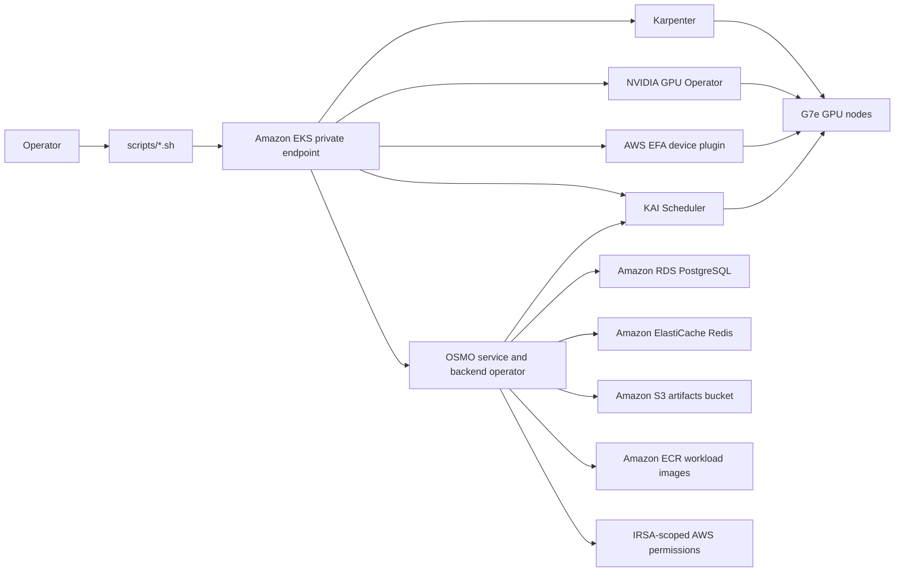

# Architecture

This repo provides a minimal AWS reference architecture for NVIDIA OSMO. It keeps OSMO external and pinned, then supplies an AWS-native deployment path around it.

## Baseline

- EKS control plane with private endpoint enabled by default.
- CPU worker nodes in private subnets, sized with enough workflow-allocatable CPU for the OSMO and KAI control planes plus the smoke workflow.
- Amazon RDS PostgreSQL for OSMO service metadata.
- Amazon ElastiCache for Redis with transit and at-rest encryption.
- Amazon S3 bucket with KMS encryption, versioning, and public access block.
- IAM role for service accounts scoped to the OSMO Kubernetes service account.
- KAI Scheduler installed from the pinned OCI Helm chart. OSMO backend scheduling is configured with `scheduler_type: kai` and `scheduler_name: kai-scheduler`.
- Karpenter controller IAM, Pod Identity, node role, and interruption queue are created by Terraform.
- The G7e NodePool uses private subnet and node security group discovery tags, On-Demand capacity, IMDSv2, encrypted gp3 root volumes, the pinned EKS AL2023 NVIDIA AMI, and underutilized consolidation so GPU nodes can be removed after workload pods exit even when only DaemonSet pods remain.
- The OSMO GPU pod template adds `karpenter.sh/do-not-disrupt=true` to active workflow pods and mounts a memory-backed `/dev/shm` volume. This prevents underutilized consolidation from evicting long-running training pods, supports NIM and TensorRT-style shared-memory needs, and preserves post-completion node cleanup.
- NVIDIA GPU Operator installs device plugin and telemetry components while leaving driver and toolkit installation disabled because they are included in the EKS AL2023 NVIDIA AMI.
- AWS EFA device plugin exposes `vpc.amazonaws.com/efa` on EFA-capable G7e nodes. Its DaemonSet tolerates `nvidia.com/gpu=true:NoSchedule`, matching the Karpenter G7e NodePool taint.

## EFA Mode

EFA is an optional node capability, not a requirement for every GPU workflow. The EFA device plugin can be installed before any EFA-capable node exists. On unsupported instance types, the DaemonSet does not schedule and the node does not expose `vpc.amazonaws.com/efa`.

The current G7e pool includes both EFA and non-EFA sizes. `g7e.2xlarge` and `g7e.4xlarge` are valid GPU-only choices, while `g7e.8xlarge`, `g7e.12xlarge`, and `g7e.24xlarge` are EFA-capable choices in the validated region. Workloads that do not request `vpc.amazonaws.com/efa` continue to run as GPU-only workloads. Workloads that request `vpc.amazonaws.com/efa` must land on an EFA-capable node with the plugin running, otherwise Kubernetes will leave them pending for insufficient EFA.

The EKS node security group includes self-referenced all-traffic ingress and
egress rules. This is required for EFA/NCCL and MPI workloads, and was validated
with the 2-node G7e NCCL benchmark in
`examples/g7e-efa-nccl-benchmark`.

## Workload Flow

OSMO owns workflow orchestration, KAI owns Kubernetes scheduling decisions, Karpenter owns EC2 capacity provisioning, the GPU Operator exposes `nvidia.com/gpu`, and the AWS EFA device plugin exposes `vpc.amazonaws.com/efa` on joined G7e nodes. The reference keeps these layers separate so AWS infrastructure can be updated without vendoring or patching OSMO.

Larger Isaac and Cosmos production workflows are intentionally outside the first GPU commit and should be added after the G7e provisioning path is reproducible.
