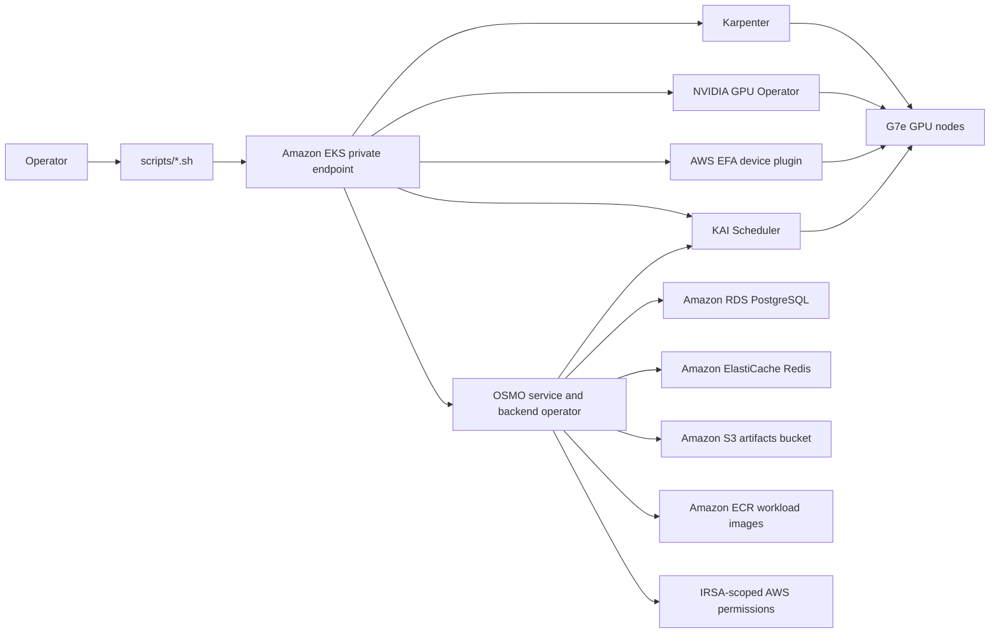
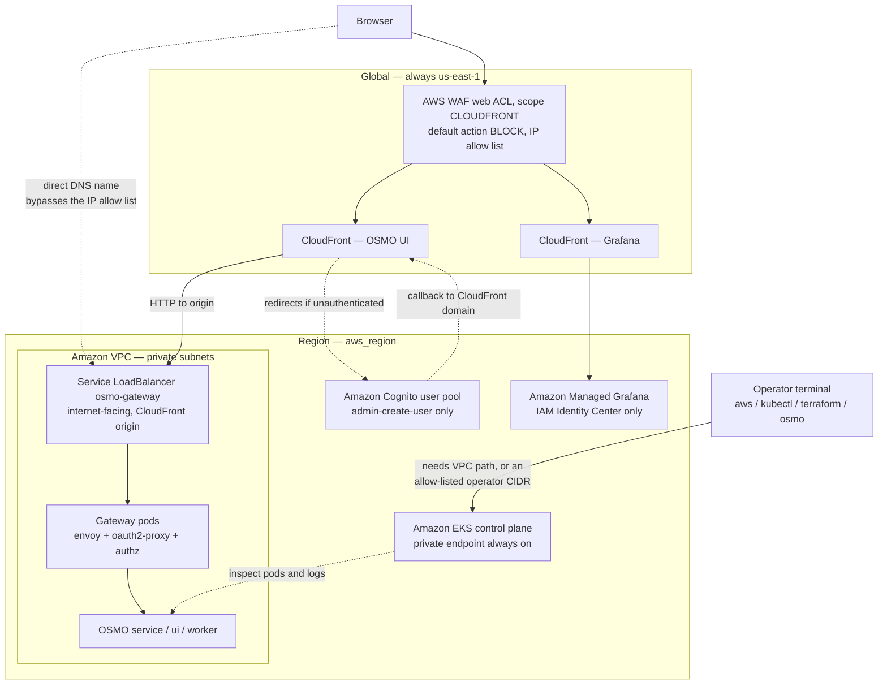
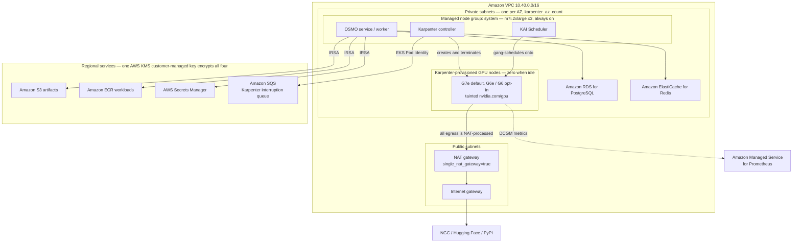

# Architecture

This repo provides a minimal AWS reference architecture for NVIDIA OSMO. It keeps OSMO external and pinned, then supplies an AWS-native deployment path around it.

## AWS Topology

The diagram above shows which component talks to which. The two below show
where those components sit in the account, which is what determines the
network, identity, and billing behaviour.

Korean-labelled variants of these two diagrams, rendered for the training deck,
live in [training/diagrams](../training/diagrams).

### Ingress and identity

### Compute, data, and GPU capacity

### What the topology implies

- **Only one internet-facing entry point exists by design**: the
  `osmo-gateway` Service load balancer, which is the CloudFront origin. Nothing
  else in the VPC accepts inbound traffic from the internet.
- **The load balancer is reachable directly, bypassing WAF.** CloudFront and
  the WAF web ACL enforce the IP allow list, but the origin load balancer has
  its own public DNS name and a `0.0.0.0/0` security group on ports 80/443.
  Requesting it directly still redirects to Cognito, so authentication holds,
  but the IP allow list does not. Treat the allow list as defence in depth, not
  as the only control. If the origin must be locked down, restrict it to the
  CloudFront managed prefix list.
- **All egress is charged through the NAT gateway.** GPU nodes live in private
  subnets, so every container image, model checkpoint, and dataset pull is
  NAT-processed data. Large model downloads show up as NAT data processing
  charges, not just instance hours. There are no VPC endpoints for S3 or ECR in
  this reference, so even in-region traffic to those services takes the NAT
  path.
- **CloudFront and its WAF web ACL are pinned to us-east-1 regardless of
  `aws_region`.** `infra/cloudfront` declares an `aws.global` provider fixed to
  us-east-1 because a `scope = "CLOUDFRONT"` web ACL can only be created there.
  Cleanup of a non-us-east-1 deployment must check us-east-1 separately.
  The Cognito user pool, by contrast, is regional and lives in `aws_region`.
- **The EKS API endpoint is private by default**
  (`cluster_endpoint_public_access_cidrs = []`), which means `kubectl` requires
  either a path into the VPC or an explicit operator CIDR. This is the most
  common cause of a working deploy that a new operator cannot inspect.
- **GPU nodes are absent from steady state.** The GPU subgraph is empty until a
  workflow requests capacity, which is why OSMO rejects GPU submissions against
  an idle cluster and why nodes must be prewarmed before submitting.

## Baseline

- EKS control plane with private endpoint enabled by default.
- CPU worker nodes in private subnets, sized with enough workflow-allocatable CPU for the OSMO and KAI control planes plus the smoke workflow.
- Amazon RDS PostgreSQL for OSMO service metadata.
- Amazon ElastiCache for Redis with transit and at-rest encryption.
- Amazon S3 bucket with KMS encryption, versioning, and public access block.
- IAM role for service accounts scoped to the OSMO Kubernetes service account.
- KAI Scheduler installed from the pinned OCI Helm chart. OSMO backend scheduling is configured with `scheduler_type: kai` and `scheduler_name: kai-scheduler`.
- Karpenter controller IAM, Pod Identity, node role, and interruption queue are created by Terraform.
- The G7e NodePool uses private subnet and node security group discovery tags, On-Demand capacity, IMDSv2, encrypted gp3 root volumes, the pinned EKS AL2023 NVIDIA AMI, and underutilized consolidation so GPU nodes can be removed after workload pods exit even when only DaemonSet pods remain.
- Optional g6e (NVIDIA L40S) / g6 (NVIDIA L4) capacity-fallback NodePools can be created alongside G7e when G7e capacity is short. g6e is the preferred fallback across the four target regions; see [docs/gpu-capacity.md](gpu-capacity.md) for per-region availability, quotas, and how to enable it.
- The OSMO GPU pod template adds `karpenter.sh/do-not-disrupt=true` to active workflow pods and mounts a memory-backed `/dev/shm` volume. This prevents underutilized consolidation from evicting long-running training pods, supports NIM and TensorRT-style shared-memory needs, and preserves post-completion node cleanup.
- NVIDIA GPU Operator installs device plugin and telemetry components while leaving driver and toolkit installation disabled because they are included in the EKS AL2023 NVIDIA AMI.
- AWS EFA device plugin exposes `vpc.amazonaws.com/efa` on EFA-capable G7e nodes. Its DaemonSet tolerates `nvidia.com/gpu=true:NoSchedule`, matching the Karpenter G7e NodePool taint.

## EFA Mode

EFA is an optional node capability, not a requirement for every GPU workflow. The EFA device plugin can be installed before any EFA-capable node exists. On unsupported instance types, the DaemonSet does not schedule and the node does not expose `vpc.amazonaws.com/efa`.

The current G7e pool includes both EFA and non-EFA sizes. `g7e.2xlarge` and `g7e.4xlarge` are valid GPU-only choices, while `g7e.8xlarge`, `g7e.12xlarge`, and `g7e.24xlarge` are EFA-capable choices in the validated region. Workloads that do not request `vpc.amazonaws.com/efa` continue to run as GPU-only workloads. Workloads that request `vpc.amazonaws.com/efa` must land on an EFA-capable node with the plugin running, otherwise Kubernetes will leave them pending for insufficient EFA.

The EKS node security group includes self-referenced all-traffic ingress and
egress rules. This is required for EFA/NCCL and MPI workloads, and was validated
with the 2-node G7e NCCL benchmark in
`examples/g7e-efa-nccl-benchmark`.

## Workload Flow

OSMO owns workflow orchestration, KAI owns Kubernetes scheduling decisions, Karpenter owns EC2 capacity provisioning, the GPU Operator exposes `nvidia.com/gpu`, and the AWS EFA device plugin exposes `vpc.amazonaws.com/efa` on joined G7e nodes. The reference keeps these layers separate so AWS infrastructure can be updated without vendoring or patching OSMO.

Larger Isaac and Cosmos production workflows are intentionally outside the first GPU commit and should be added after the G7e provisioning path is reproducible.
