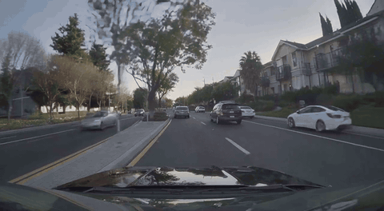
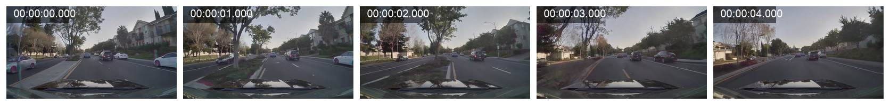

# Cosmos Reason2 NIM Validation

This file records validation for [workflow.yaml](workflow.yaml).

## 2026-05-03 Rationale Prompt Run

Status: Passed

Command:

```bash
GPU_PREWARM_INSTANCE_TYPE=g7e.4xlarge scripts/prewarm-gpu-node.sh
SMOKE_SET_NGC_CREDENTIAL=true \
  WORKFLOW_FILE=examples/cosmos-reason2-nim/workflow.yaml \
  SMOKE_TIMEOUT_ATTEMPTS=720 \
  scripts/smoke-test.sh
kubectl -n osmo-workflows delete pod aws-osmo-gpu-prewarm --ignore-not-found
scripts/wait-gpu-node-cleanup.sh
```

Observed result:

- Workflow: `aws-cosmos-reason2-nim-5`
- OSMO status: `COMPLETED`
- Wrapper runtime: `510s`
- Client manifest runtime: `257s`
- NIM image: `nvcr.io/nim/nvidia/cosmos-reason2-2b:1.7.0`
- Model: `nvidia/cosmos-reason2-2b`
- Artifact dataset: `aws-osmo/cosmos-reason2-nim-artifacts:2`
- Uploaded size: `2954B`
- Checksum: `bcfd54ce4469ac8855fccb1eb0d85b2c`
- GPU node: `g7e.4xlarge`, `NVIDIA RTX PRO 6000 Blackwell Server Edition`

The workflow sent this video to the VLM with `media_io_kwargs.video.fps=1.0`:



Representative sampled frames:



Prompt:

```text
Approve or reject this generated video for inclusion in a robotics dataset. Evaluate physical plausibility, object permanence, and obvious scene anomalies. Return a short rationale with 2-4 bullet points, then end with a final line in the form 'Decision: Approve' or 'Decision: Reject'.
```

Model output:

```text
Decision: Reject
```

Rejection rationale, summarized from [answer.txt](validation/answer.txt):

- Noticeable video discontinuity and abrupt scene changes.
- Inconsistent perspective shifts, suggesting a glitch or editing error.
- Disjointed vehicle interactions and weak motion or spatial coherence.
- Inconsistent lighting and shadows.

Run files:

- [Input MP4](validation/input-car-curb.mp4)
- [Request JSON](validation/request.json)
- [Response JSON](validation/response.json)
- [Answer text](validation/answer.txt)
- [Run manifest](validation/run-manifest.json)

Notes:

- The earlier `aws-cosmos-reason2-nim-4` validation passed with a single-line decision prompt and uploaded `aws-osmo/cosmos-reason2-nim-artifacts:1`.
- The initial local resource request used `nim_cpu_count=16`, which exceeded the visible `g7e.4xlarge` allocatable CPU. The workflow default is `nim_cpu_count=12`.
