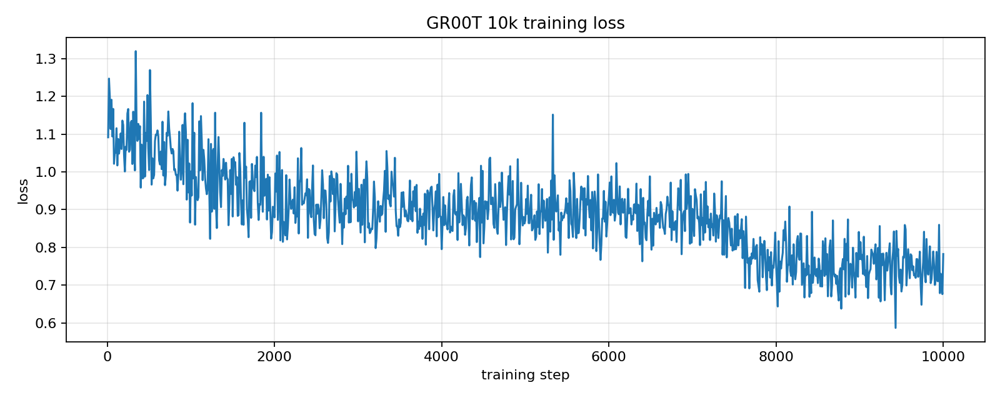
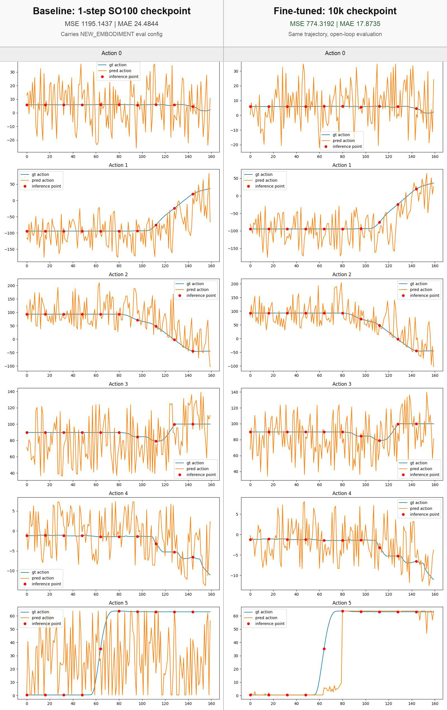
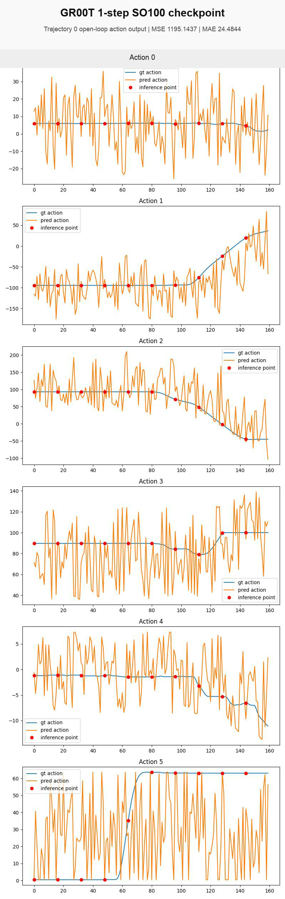
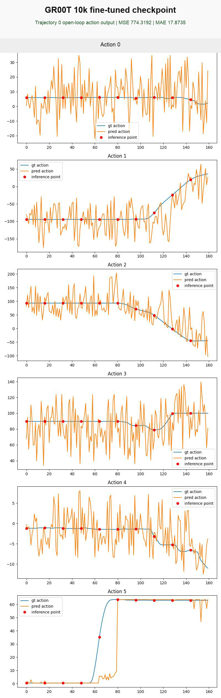

# GR00T Fine-Tune Validation

This file records validation for [workflow.yaml](workflow.yaml).

## 2026-05-03 10k Open-Loop Result

This section records the open-loop GR00T result from `aws-gr00t-10k-open-loop-visual-3`.
The run compares a 1-step SO100 checkpoint against the validated 10,000-step
checkpoint on the upstream `cube_to_bowl_5` recorded trajectory.

The raw `nvidia/GR00T-N1.6-3B` base model is not used directly as the baseline
for this result because the SO100 `NEW_EMBODIMENT` evaluation path needs the
modality config saved with a fine-tuned checkpoint. The 1-step checkpoint is the
early baseline that carries that config.

This is execution evidence only. It is not a closed-loop robot success-rate
benchmark.

## Run Summary

- Training workflow: `aws-gr00t-finetune-4`
- Result workflow: `aws-gr00t-10k-open-loop-visual-3`
- Checkpoint dataset: `aws-osmo/gr00t-finetune-10k-artifacts:1`
- Output dataset: `aws-osmo/gr00t-10k-open-loop-visual-artifacts:1`
- GR00T source: `NVIDIA/Isaac-GR00T@ead52833afbbf4243f8cd5e7664f48a94de03b19`
- Dataset: `demo_data/cube_to_bowl_5`, trajectory `0`
- Embodiment tag: `NEW_EMBODIMENT`
- Modality config: `examples/SO100/so100_config.py`
- Training steps compared: `1` and `10,000`
- Eval steps: `160`
- Action horizon: `16`
- Training workflow OSMO duration: `2818s`
- Result workflow OSMO duration: `857s`
- Result manifest runtime: `632s`

## Metrics

- Open-loop MSE: 1-step `1195.1437`, 10k fine-tuned `774.3192`, delta `-420.8245`
- Open-loop MAE: 1-step `24.4844`, 10k fine-tuned `17.8735`, delta `-6.6109`
- Training loss retained first value: `1.0918` at step `10`
- Training loss retained last value: `0.7825` at step `10,000`

The action-output comparison is open-loop: it uses recorded SO100 frames as
input and visualizes the action vectors predicted by the 1-step and 10k
checkpoints.

## Result Plots









## Result Replays

- [SO100 front input replay](validation/result/input-front-episode-000000.mp4)
- [SO100 wrist input replay](validation/result/input-wrist-episode-000000.mp4)
- [SO100 front and wrist replay](validation/result/input-front-wrist-comparison.mp4)

## Run Files

- [Run manifest](validation/result/run-manifest.json)
- [Open-loop result summary](validation/result/gr00t-10k-open-loop-summary.json)

## 2026-05-03 10k Recommended-Step Training

Status: Passed

Command:

```bash
osmo workflow submit examples/gr00t-finetune/workflow.yaml \
  --pool default \
  -t json \
  --set max_steps=10000 \
  --set save_steps=10000 \
  --set save_total_limit=1 \
  --set global_batch_size=1 \
  --set gpu_metrics_interval_seconds=10 \
  --set-string output_dataset=gr00t-finetune-10k-artifacts \
  --set-string retain_model_weights=true
```

Observed result:

- Workflow: `aws-gr00t-finetune-4`
- OSMO status: `COMPLETED`
- OSMO duration: `2817.637433s`
- Run manifest runtime: `2676s`
- Trainer global step: `10000`
- Trainer runtime: `2026.2753s`
- Trainer throughput: `4.935 steps/s`
- Trainer final `train_loss`: `0.887281654214859`
- Artifact dataset: `aws-osmo/gr00t-finetune-10k-artifacts:1`
- Dataset ID: `c2y94iH-Sx2sy6ijE7Ahfw`
- Uploaded size: `32588274933B`
- GPU node: `g7e.8xlarge`, On-Demand, `ap-northeast-2b`
- NodeClaim: `aws-osmo-g7e-xjwwj`
- EC2 instance: `i-04d0b4f85a5df4444`
- AMI: `ami-077547c4255ce967d`
- GPU: `NVIDIA RTX PRO 6000 Blackwell Server Edition`
- GPU utilization: average `62.43%`, max `99.0%`
- GPU memory: average `29.96 GiB`, max `35.35 GiB`
- GPU power: average `221.14W`, max `276.81W`

Run files:

- [GPU utilization graph](validation/gr00t-10k-gpu-utilization.png)
- [Run manifest](validation/gr00t-10k-run-manifest.json)
- [GPU metric summary](validation/gr00t-10k-gpu-metrics-summary.json)

Karpenter cleanup:

- NodeClaim `aws-osmo-g7e-xjwwj` launched at `2026-05-03T09:07:52Z`.
- Workflow completed at `2026-05-03T10:00:41Z`.
- Karpenter disrupted the empty node at `2026-05-03T10:06:05Z`.
- Karpenter deleted the NodeClaim at `2026-05-03T10:12:34Z`.

Estimated EC2 GPU compute cost:

- AWS Price List query on `2026-05-03` returned `ap-northeast-2`
  On-Demand Linux rate `$6.47703/hour` for `g7e.8xlarge`.
- GR00T 10k used `3882s` of G7e node lifetime.
- Estimated EC2 GPU compute: `1.0783h * $6.47703/hour = $6.98`.
- This excludes EKS control plane, NAT/data processing, S3, CloudWatch, and shared infrastructure.

Notes:

- The 10k step count follows the checkpoint scale in NVIDIA's SO-101 GR00T tutorial.
- GPU sampling starts near container entry, so the graph includes setup and model-load idle time.

## 2026-05-03 PASK-Aligned Smoke Validation

Status: Passed

Command:

```bash
SMOKE_SET_NGC_CREDENTIAL=true \
  SMOKE_SET_HF_CREDENTIAL=true \
  HF_TOKEN_FILE="$HOME/.huggingface/token" \
  WORKFLOW_FILE=examples/gr00t-finetune/workflow.yaml \
  SMOKE_TIMEOUT_ATTEMPTS=720 \
  scripts/smoke-test.sh
```

Observed result:

- Workflow: `aws-gr00t-finetune-3`
- Wrapper runtime: `812s`
- Source: `NVIDIA/Isaac-GR00T@ead52833afbbf4243f8cd5e7664f48a94de03b19`
- Base model: `nvidia/GR00T-N1.6-3B`
- Dataset: `demo_data/cube_to_bowl_5`
- Modality config: `examples/SO100/so100_config.py`
- Dataset conversion generated `4` shards and reported `4073` total steps.
- Training result: `max_steps=2`, `global_batch_size=1`,
  `train_runtime=102.7579s`, `train_loss=1.073656678199768`
- Artifact dataset: `aws-osmo/gr00t-finetune-artifacts:2`
- Uploaded size: `1265352B`
- Checksum: `e012a86d0b032b86ab15cc9738440278`

Expected completion time:

- Observed `812s` with visible G7e capacity.
- Budget `20-30 min` for a cold run including Karpenter provisioning, image pull,
  source clone, dependency install, training steps, artifact upload, and cleanup.

## 2026-05-02 Superseded Source-Fetched Smoke

Status: Superseded by the 2026-05-03 PASK-aligned validation

Observed result:

- Prewarm NodeClaim: `aws-osmo-g7e-mk94w`
- Prewarm node: `ip-10-40-15-160.ap-northeast-2.compute.internal`
- Instance type: `g7e.8xlarge` in `ap-northeast-2a`
- AMI: `ami-077547c4255ce967d`
- GPU: `NVIDIA RTX PRO 6000 Blackwell Server Edition`
- Driver/CUDA: `580.126.09` / `13.0`
- Workflow: `aws-gr00t-finetune-2`
- Wrapper runtime: `431s`
- Source: `NVIDIA/Isaac-GR00T@db107f03d165060998df166292578f1d7fb3c79a`
- Training result: `max_steps=1`, `batch_size=1`,
  `train_runtime=41.988s`, `train_loss=0.669692873954773`
- Artifact dataset: `aws-osmo/gr00t-finetune-artifacts:1`
- Uploaded size: `286002B`
- Checksum: `12eb0d2497d285f3bc5d43802edaf947`

Compatibility note:

- This older source-fetched workflow used a local PyTorch3D import shim because
  NGC PyTorch `25.03-py3` runs Python 3.12 and `pipablepytorch3d` did not provide
  a compatible wheel.
