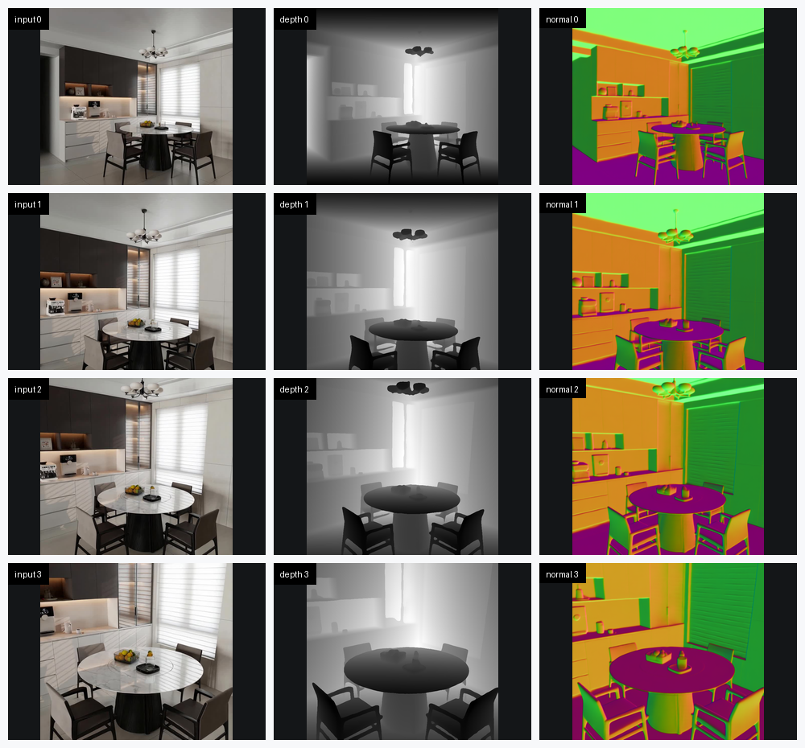
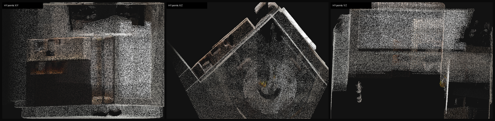

# HY-World 2.0 WorldMirror Validation

This file records validation for [workflow.yaml](workflow.yaml).

## 2026-05-03 Dining Table Reconstruction

Status: Passed

Command:

```bash
GPU_PREWARM_INSTANCE_TYPE=g7e.4xlarge scripts/prewarm-gpu-node.sh
SMOKE_SET_NGC_CREDENTIAL=true \
  WORKFLOW_FILE=examples/hyworld2-worldmirror-recon/workflow.yaml \
  SMOKE_TIMEOUT_ATTEMPTS=720 \
  scripts/smoke-test.sh
kubectl -n osmo-workflows delete pod aws-osmo-gpu-prewarm --ignore-not-found
scripts/wait-gpu-node-cleanup.sh
```

Observed result:

- Workflow: `aws-hyworld2-worldmirror-recon-1`
- OSMO status: `COMPLETED`
- Source: `Tencent-Hunyuan/HY-World-2.0@49c1ab648b251814e984cdfb6eb8707705375920`
- Model: `tencent/HY-World-2.0`, subfolder `HY-WorldMirror-2.0`
- Input path: `examples/worldrecon/realistic/Dining_Table`
- Case: `dining_table_4v_952`
- Target size: `952`
- Run manifest runtime: `737s`
- Pipeline case runtime: `7.2829s`
- Artifact dataset: `aws-osmo/hyworld2-worldmirror-recon-artifacts:1`
- Uploaded size: `69.9MiB`
- Checksum: `6f2c1bfe69f6b608396b7792377bde41`
- GPU node: `g7e.4xlarge`, `NVIDIA RTX PRO 6000 Blackwell Server Edition`
- Runtime: `torch 2.7.1+cu128`, `gsplat 1.5.3`

Input views from the pinned upstream sample:


Input, depth, and normal outputs from the OSMO artifact dataset:



Point-cloud preview rendered locally from the uploaded `points.ply` artifact:



Run files:

- [Run manifest](validation/run-manifest.json)
- [Pipeline timing](validation/pipeline_timing.json)

Notes:

- The workflow applies a runtime patch that makes FlashAttention optional and falls back to PyTorch scaled-dot-product attention on the Blackwell runtime path.
- The case processed the four-view Dining Table sample with adaptive resolution `756` and max target size `952`.
- Gaussian pruning reduced the uploaded Gaussian cloud from `2,032,685` candidates to `789,130` retained points.
- Large PLY files are intentionally not committed here. They remain in the OSMO artifact dataset.
