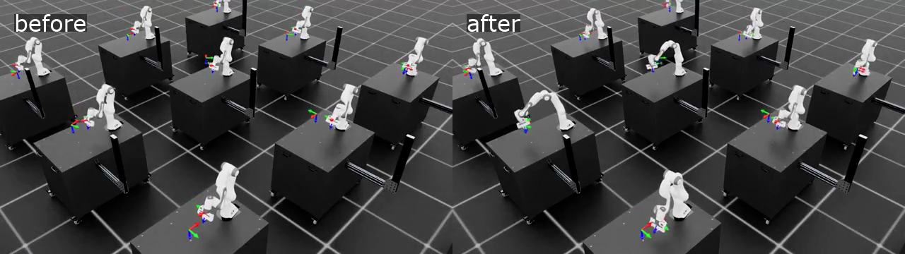

# Isaac Lab RSL-RL Video Validation

This file records validation for [workflow.yaml](workflow.yaml).

## Result

This is execution evidence for a bounded RSL-RL run. It shows that the OSMO
workflow trains, records videos, exports scalar summaries, uploads artifacts,
and cleans up GPU capacity. It is not a full Isaac Lab benchmark.



Result videos:

- [Before/after comparison](validation/result/videos/before-after-comparison.mp4)
- [Before training](validation/result/videos/before-training.mp4)
- [After training](validation/result/videos/after-training.mp4)

Result files:

- [Run manifest](validation/result/run-manifest.json)
- [Metrics summary](validation/result/metrics-summary.json)

Key scalar endpoints:

- End-effector orientation error: `1.7616` at step `0` to `0.3522` at step `199`
- End-effector position error: `0.3634` at step `0` to `0.2721` at step `199`
- Value-function loss: `0.004252` at step `0` to `0.000143` at step `199`
- Mean episode length: `14.78` at step `0` to `360.0` at step `199`

## 2026-05-02 Fresh Run

Status: Passed

Commands:

```bash
GPU_PREWARM_INSTANCE_TYPE=g7e.2xlarge scripts/prewarm-gpu-node.sh
SMOKE_SET_NGC_CREDENTIAL=true \
  WORKFLOW_FILE=examples/isaaclab-rsl-rl-video/workflow.yaml \
  SMOKE_TIMEOUT_ATTEMPTS=720 \
  scripts/smoke-test.sh
kubectl -n osmo-workflows delete pod aws-osmo-gpu-prewarm --ignore-not-found
scripts/wait-gpu-node-cleanup.sh
```

Observed result:

- Workflow: `aws-isaaclab-rsl-rl-video-9`
- Wrapper runtime: `976s` after prewarm
- G7e NodeClaim: `aws-osmo-g7e-dd59r`
- Instance type: `g7e.2xlarge`
- Node: `ip-10-40-14-77.ap-northeast-2.compute.internal`
- Task: `Isaac-Reach-Franka-v0`
- Training completed `200` RSL-RL iterations and produced `model_199.pt`.
- Artifact dataset: `aws-osmo/aws-isaaclab-rsl-rl-video-artifacts:4`
- Artifact size: `2273949B`
- Artifact checksum: `eb6b23bf451dfa353354a90327076d25`
- Artifacts included `before-training.mp4`, `after-training.mp4`,
  TensorBoard scalar CSVs, `metrics-summary.json`, and the final checkpoint.
- Karpenter logged an `Empty` delete decision at `2026-05-02T14:04:11Z`.
- G7e cleanup completed at `2026-05-02T14:11:09Z`.
- EC2 instance `i-0382949d2df08e5b7` reached `terminated`.
- Final check showed no G7e NodeClaims, no G7e nodes, and no pods in `osmo-workflows`.

Expected completion time:

- Observed `976s` after prewarm
- Budget `30-35 min` including G7e provisioning and cleanup

Notes:

- The example uses `Isaac-Reach-Franka-v0` because it ships in the pinned Isaac Lab image and produces visible artifacts quickly.
