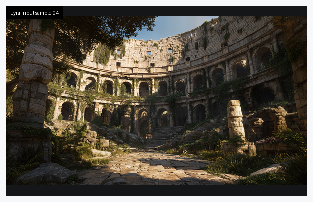
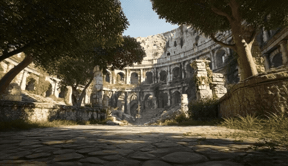
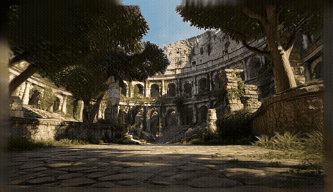
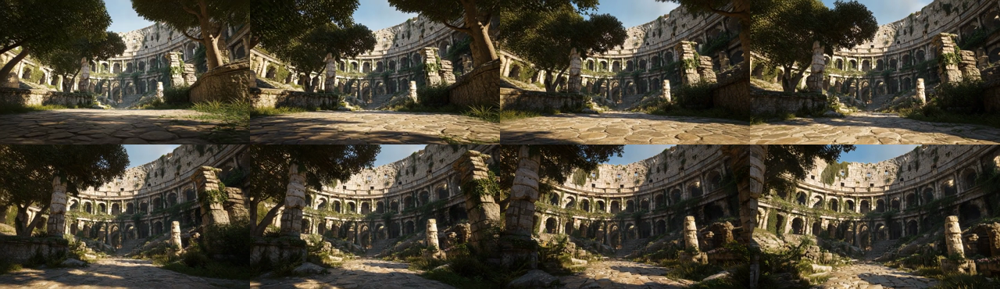
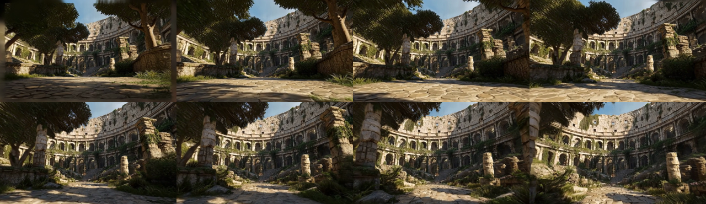

# Lyra-2.0 DMD Single-Sample Validation

This file records validation for [workflow.yaml](workflow.yaml).

## 2026-05-03 Sample 04 DMD Run

Status: Passed

Command:

```bash
GPU_PREWARM_INSTANCE_TYPE=g7e.4xlarge scripts/prewarm-gpu-node.sh
SMOKE_SET_NGC_CREDENTIAL=true \
  SMOKE_SET_HF_CREDENTIAL=true \
  HF_TOKEN_FILE="$HOME/.huggingface/token" \
  WORKFLOW_FILE=examples/lyra2-dmd-single/workflow.yaml \
  SMOKE_TIMEOUT_ATTEMPTS=1440 \
  scripts/smoke-test.sh
kubectl -n osmo-workflows delete pod aws-osmo-gpu-prewarm --ignore-not-found
scripts/wait-gpu-node-cleanup.sh
```

Observed result:

- Workflow: `aws-lyra2-dmd-single-5`
- OSMO status: `COMPLETED`
- Source: `nv-tlabs/lyra@52e507988ebcccb9bd5e039f31d2b985adc310c7`
- Model: `nvidia/Lyra-2.0`
- Sample ID: `4`
- Mode: `dmd`
- Frames: `81` zoom-in, `241` zoom-out
- Stage 1 runtime: `677s`
- Stage 2 runtime: `142s`
- Run manifest runtime: `5058s`
- Artifact dataset: `aws-osmo/lyra2-dmd-single-artifacts:1`
- Uploaded size: `14.4MiB`
- Checksum: `6e7fc9e508f08eefacff2e68a01f61fa`
- GPU node: `g7e.4xlarge`, `NVIDIA RTX PRO 6000 Blackwell Server Edition`
- Peak observed VRAM: approximately `74.8GiB` of `97.9GiB`

Input sample and prompt:



Prompt file: [input-prompt-04.txt](validation/input-prompt-04.txt)

Generated zoom-in/zoom-out combined video preview:



Generated Gaussian-scene trajectory preview:



Contact sheets:





Run files:

- [Input image](validation/input-sample-04.png)
- [Combined MP4](validation/output-combined.mp4)
- [Gaussian trajectory MP4](validation/output-gs-trajectory.mp4)
- [Run manifest](validation/run-manifest.json)

Notes:

- The workflow patches Lyra's attention path at runtime to use PyTorch scaled-dot-product attention on the validated Blackwell setup.
- The previous `aws-lyra2-dmd-single-4` attempt reached model execution but failed with a TransformerEngine unfused-attention allocation around `108.98GiB`. The committed workflow uses the Flash SDPA patch validated by `aws-lyra2-dmd-single-5`.
- The stage-2 VIPE/DA3 reconstruction path installs the pinned `microsoft/MoGe` dependency before running Gaussian-scene reconstruction.
- PLY and model checkpoint files are intentionally not committed here. They remain outside the repository; the validation keeps MP4 outputs and lightweight previews.
