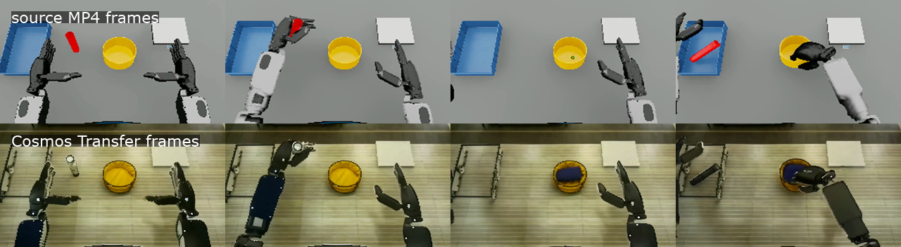
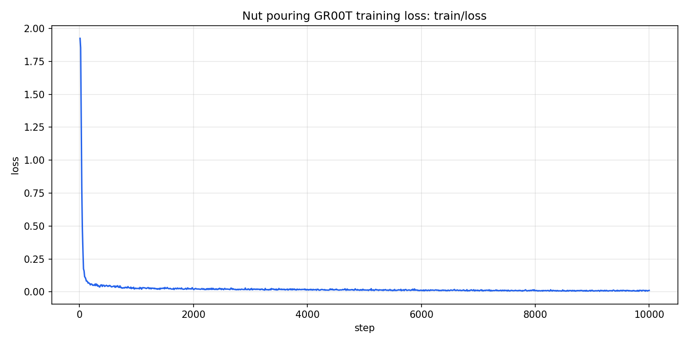
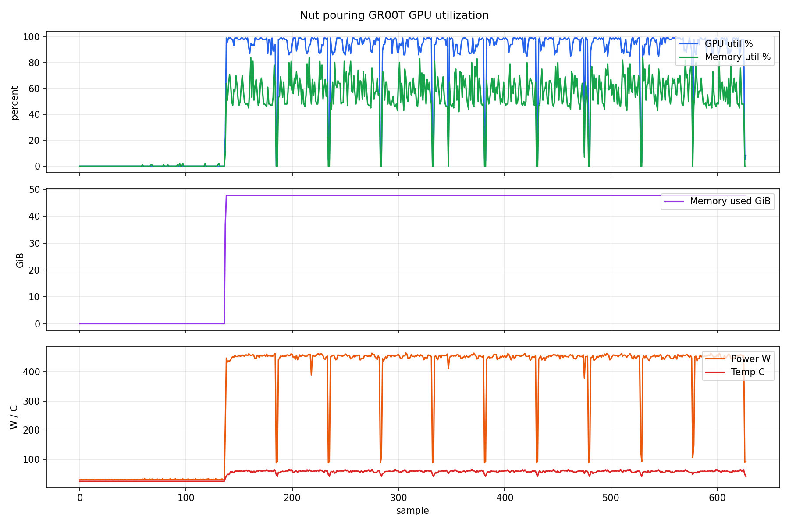

# Nut Pouring Pipeline Validation

This file records validation for the six workflow files under
[workflows/](workflows/).

## 2026-05-04 G7e Multistage Reproduction

Status: Passed

Scope:

- Reused the existing `ap-northeast-2` OSMO deployment with G7e Karpenter
  capacity, GPU Operator, KAI, and OSMO already installed.
- Reproduced NVIDIA OSMO's upstream `cookbook/nut_pouring` workflow set from
  `NVIDIA/OSMO@c2c30e55f84969fff55d51cd2044a03d40d6a1a5`.
- Preserved the upstream six-stage shape: MimicGen, HDF5 to MP4, Cosmos
  Transfer augmentation, MP4 to HDF5, LeRobot conversion, and GR00T-N1.5
  fine-tuning.
- Reused completed stage 1-3 datasets from the same upstream pipeline, then ran
  stage 4-6 on `g7e.24xlarge`.
- Captured GR00T wall-clock runtime, TensorBoard train loss, GPU utilization,
  a run manifest, and retained checkpoints in the final OSMO dataset.

Commands:

```bash
TF_OUTPUT_AWS_REGION=ap-northeast-2 \
TF_OUTPUT_CLUSTER_NAME=aws-osmo-dev-repro-eks \
TF_OUTPUT_OSMO_NAMESPACE=osmo \
TF_OUTPUT_OSMO_WORKLOAD_NAMESPACE=osmo-workflows \
TF_OUTPUT_OSMO_RUNTIME_SECRET_ARN='aws-osmo-dev-repro/osmo/runtime' \
NUT_POURING_WORK_DIR=/tmp/nut-pouring-run-20260503T175610Z \
NUT_POURING_KEEP_WORK_DIR=true \
NUT_POURING_SKIP_DATASET_UPLOAD=true \
NUT_POURING_START_STEP=4 \
NUT_POURING_PREWARM_INSTANCE_TYPE=g7e.24xlarge \
NUT_POURING_WAIT_ATTEMPTS=4320 \
NUT_POURING_WAIT_SECONDS=60 \
NUT_POURING_LOG_LINES=260 \
NUT_POURING_GPU_METRICS_INTERVAL_SECONDS=10 \
HF_TOKEN_FILE="$HOME/.huggingface/token" \
scripts/run-nut-pouring.sh

TF_OUTPUT_AWS_REGION=ap-northeast-2 \
TF_OUTPUT_CLUSTER_NAME=aws-osmo-dev-repro-eks \
TF_OUTPUT_OSMO_NAMESPACE=osmo \
TF_OUTPUT_OSMO_WORKLOAD_NAMESPACE=osmo-workflows \
TF_OUTPUT_OSMO_RUNTIME_SECRET_ARN='aws-osmo-dev-repro/osmo/runtime' \
NUT_POURING_WORK_DIR=/tmp/nut-pouring-run-20260504T123700Z \
NUT_POURING_KEEP_WORK_DIR=true \
NUT_POURING_SKIP_DATASET_UPLOAD=true \
NUT_POURING_START_STEP=6 \
NUT_POURING_PREWARM_INSTANCE_TYPE=g7e.24xlarge \
NUT_POURING_WAIT_ATTEMPTS=4320 \
NUT_POURING_WAIT_SECONDS=60 \
NUT_POURING_LOG_LINES=460 \
NUT_POURING_GPU_METRICS_INTERVAL_SECONDS=10 \
HF_TOKEN_FILE="$HOME/.huggingface/token" \
scripts/run-nut-pouring.sh
```

Workflow results:

| Stage | Workflow ID | Output dataset | Runtime |
| --- | --- | --- | --- |
| 1 MimicGen | `isaac_mimic_25-8` | `PhysAI-MimicGen:1` | 13,613s |
| 2 HDF5 to MP4 | `hdf5_to_mp4_conversion-1` | `PhysAI-MP4Videos:1` | 24,545s |
| 3 Cosmos Transfer | `cosmos_transfer_augmentation-7` | `PhysAI-CosmosAugmentedMP4:1` | 2,591s |
| 4 MP4 to HDF5 | `mp4_to_hdf5_conversion-4` | `PhysAI-CosmosAugmentedHDF5:3` | 1,168s |
| 5 LeRobot conversion | `dataset_conversion_augmented-4` | `PhysAI-LeRobotDataset:1` | 1,661s |
| 6 GR00T fine-tune | `groot_finetune_nut_pouring-7` | `PhysAI-GR00T-Finetuned:7` | 6,749s |

Stage 3 was bounded to one Cosmos-augmented replay for this PR artifact run.
Stage 4 appended the augmented replay back into the GR1 HDF5 dataset, producing
1001 total demonstrations before LeRobot conversion.

Dataset evidence:

| Dataset | Size | Checksum | Notes |
| --- | ---: | --- | --- |
| `PhysAI-CosmosAugmentedHDF5:3` | 50,668,217,533B | `2cdb8489744607214b37618b12aea6b9` | GR1 HDF5 with one augmented replay appended. |
| `PhysAI-LeRobotDataset:1` | 2,062,353,565B | `27aaaa65615244a3b22230ef1b80a608` | Converted dataset consumed by GR00T. |
| `PhysAI-GR00T-Finetuned:7` | 149,955,237,237B | `b758e76f7935927900dfcd425ec6b1ba` | Final model plus retained checkpoints. |

The final dataset is READY in OSMO as `PhysAI-GR00T-Finetuned:7` and has the
`latest` tag. It retains the final model files plus checkpoint directories
`checkpoint-3000` through `checkpoint-10000`.

GR00T training evidence:

- Trainer summary: `train_runtime=4918.3282s`,
  `train_samples_per_second=65.063`, `train_steps_per_second=2.033`,
  `train_loss=0.024766849683970214`.
- TensorBoard `train/loss`: 1000 points, first value `1.9253` at step 10, last
  value `0.0111` at step 10000, minimum `0.0048`.
- GPU metrics: 628 samples at 10s cadence on
  `NVIDIA RTX PRO 6000 Blackwell Server Edition`; average GPU utilization
  `71.61%`, maximum GPU utilization `99%`, average memory `38122 MiB`, maximum
  memory `48843 MiB`, average power `348.47W`, maximum power `464.06W`.

Visual artifacts:







- [Source vs Cosmos replay](validation/demo0-source-vs-cosmos.mp4)
- [Raw train loss CSV](validation/groot-train-loss.csv)
- [Raw GPU metrics CSV](validation/groot-nvidia-smi.csv)
- [GR00T run manifest](validation/groot-run-manifest.json)

The source-vs-Cosmos artifacts compare `PhysAI-MP4Videos:1`
`demo_0_robot_pov_cam.mp4` against `PhysAI-CosmosAugmentedMP4:1`
`demo_0_robot_pov_cam/robot_depth.mp4`.

Compatibility changes applied by the AWS wrapper:

- Add the `g7e-rtx-pro-6000` OSMO platform and 200Gi ephemeral storage.
- Normalize OSMO 6.2 dataset shorthand and mounted dataset paths.
- Avoid printing Hugging Face tokens while logging into the Cosmos container.
- Pin the Cosmos Transfer checkout and Cosmos Predict tokenizer revision.
- Flatten Cosmos output MP4s to Isaac Lab's expected `demo_{id}_*.mp4`
  convention.
- Use a GR1-aware MP4-to-HDF5 helper because the upstream converter expects
  `obs/eef_pos`, while the GR1 dataset stores `left_eef_pos` and
  `right_eef_pos`.
- Repair the Isaac Lab environment's `pip` installation after GR00T dependency
  installation for LeRobot conversion.
- On Blackwell/G7e, install the CUDA 12.8 PyTorch wheels and force GR00T/Eagle
  attention to SDPA instead of FlashAttention.
- Collect GPU metrics, TensorBoard loss plots, and a run manifest in the GR00T
  output dataset without removing checkpoints.

Local workflow checks:

- `bash -n scripts/run-nut-pouring.sh`
- `shellcheck scripts/run-nut-pouring.sh`
- `python -m py_compile scripts/nut-pouring-artifacts.py scripts/nut-pouring-gr1-mp4-to-hdf5.py`
- Parsed the six prepared workflow YAML files after substituting OSMO template
  placeholders and ran `bash -n` on each embedded `/tmp/entry.sh`.
- Submitted all six prepared workflow YAML files to the live OSMO service with
  `osmo workflow submit --dry-run --pool default`.
- `git diff --check`
