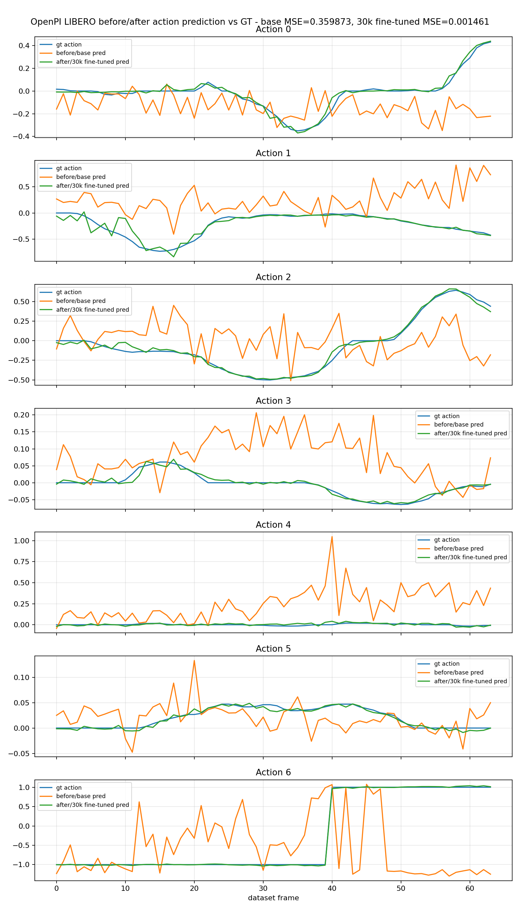
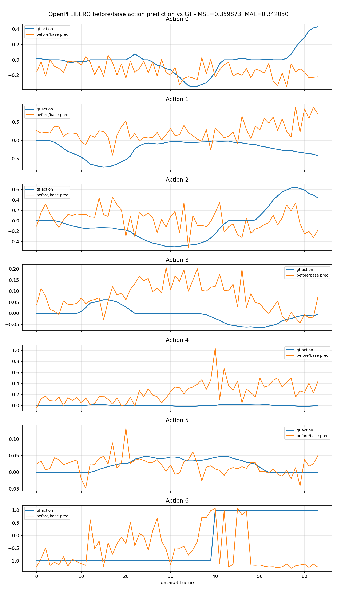
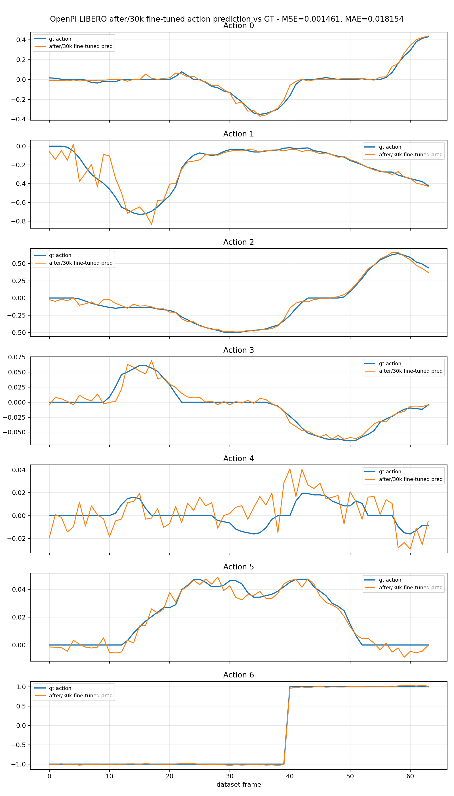
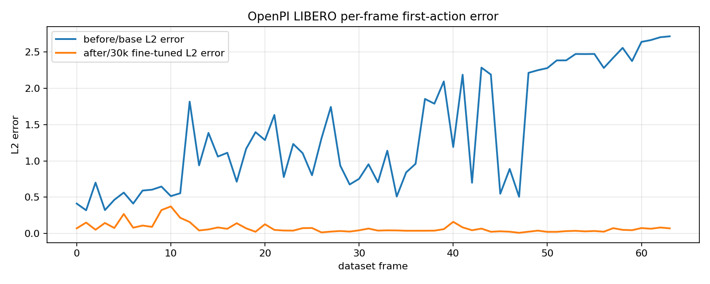

# OpenPI LIBERO LoRA Validation

This file records validation for [workflow.yaml](workflow.yaml).

## 2026-05-03 30k Offline Result

This section records the offline result from `aws-openpi-libero-30k-visual-eval-1`.
The evaluation reuses the validated 30k-step OpenPI/LIBERO LoRA checkpoint from
`aws-openpi-libero-lora-7`, then compares base policy outputs against the
fine-tuned checkpoint on recorded LIBERO episode frames.

This is execution evidence only. It is not a policy-quality benchmark and it is not a closed-loop LIBERO success-rate evaluation.

## Run Summary

- Training workflow: `aws-openpi-libero-lora-7`
- Result workflow: `aws-openpi-libero-30k-visual-eval-1`
- Checkpoint dataset: `aws-osmo/openpi-libero-lora-30k-artifacts:1`
- Output dataset: `aws-osmo/openpi-libero-30k-visual-artifacts:1`
- OpenPI source: `Physical-Intelligence/openpi@650c5b0283a49c42784fb5055a0507da2c6d347d`
- Config: `pi0_libero_low_mem_finetune`
- Dataset: `physical-intelligence/libero`, episode `0`
- Training steps: `30,000`
- Evaluated checkpoint step: `29,999`
- Eval frames: `64`
- Training workflow OSMO duration: `5020s`
- Result workflow OSMO duration: `572s`
- Result manifest runtime: `531s`
- First prompt: `put the white mug on the left plate and put the yellow and white mug on the right plate`

## Metrics

- First-action MSE: base `0.3599`, 30k fine-tuned `0.0015`, delta `-0.3584`
- First-action MAE: base `0.3420`, 30k fine-tuned `0.0182`, delta `-0.3239`

The action-output replay is open-loop: it uses recorded LIBERO frames as input
and visualizes the action vectors predicted by the base and fine-tuned policies.

## Result Plots









## Result Replays

- [LIBERO recorded input replay](validation/result/libero-input-replay.mp4)
- [OpenPI action output replay](validation/result/openpi-action-output-replay.mp4)

## Run Files

- [Run manifest](validation/result/run-manifest.json)
- [Offline eval summary](validation/result/offline-eval-summary.json)

## 2026-05-03 30k Recommended-Step Training

Status: Passed

Command:

```bash
osmo workflow submit examples/openpi-libero-lora/workflow.yaml \
  --pool default \
  -t json \
  --set num_train_steps=30000 \
  --set save_interval=30000 \
  --set norm_stats_max_frames=1024 \
  --set batch_size=1 \
  --set gpu_metrics_interval_seconds=10 \
  --set-string output_dataset=openpi-libero-lora-30k-artifacts \
  --set-string experiment_name=aws-osmo-libero-lora-30k \
  --set-string retain_checkpoint_arrays=true
```

Observed result:

- Workflow: `aws-openpi-libero-lora-7`
- OSMO status: `COMPLETED`
- OSMO duration: `5019.503692s`
- Run manifest runtime: `4947s`
- OpenPI config: `pi0_libero_low_mem_finetune`
- Dataset: `physical-intelligence/libero`, episode subset `0`
- Training steps: `30000`
- Base checkpoint: `gs://openpi-assets/checkpoints/pi0_base/params`, `11.2GiB`
- Artifact dataset: `aws-osmo/openpi-libero-lora-30k-artifacts:1`
- Dataset ID: `xTJMfj8rQ96JiCesh4VaMQ`
- Uploaded size: `8945624336B`
- GPU node: `g7e.4xlarge`, On-Demand, `ap-northeast-2b`
- NodeClaim: `aws-osmo-g7e-5c2qt`
- EC2 instance: `i-048c0e072e9190b08`
- AMI: `ami-077547c4255ce967d`
- GPU: `NVIDIA RTX PRO 6000 Blackwell Server Edition`
- GPU utilization: average `77.72%`, max `100.0%`
- GPU memory: average `64.83 GiB`, max `67.14 GiB`
- GPU power: average `326.89W`, max `384.23W`

Run files:

- [GPU utilization graph](validation/openpi-30k-gpu-utilization.png)
- [Run manifest](validation/openpi-30k-run-manifest.json)
- [GPU metric summary](validation/openpi-30k-gpu-metrics-summary.json)

Karpenter cleanup:

- NodeClaim `aws-osmo-g7e-5c2qt` launched at `2026-05-03T08:50:11Z`.
- Workflow completed at `2026-05-03T10:22:55Z`.
- NodeClaim became `Consolidatable` at `2026-05-03T10:27:55Z`.
- Karpenter disrupted it as `Empty` at `2026-05-03T10:28:12Z`.
- Karpenter deleted the NodeClaim at `2026-05-03T10:34:36Z`.
- `scripts/wait-gpu-node-cleanup.sh` completed at `2026-05-03T10:34:51Z`.

Estimated EC2 GPU compute cost:

- AWS Price List query on `2026-05-03` returned `ap-northeast-2`
  On-Demand Linux rate `$4.91553/hour` for `g7e.4xlarge`.
- OpenPI 30k used `6265s` of G7e node lifetime.
- Estimated EC2 GPU compute: `1.7403h * $4.91553/hour = $8.56`.
- This excludes EKS control plane, NAT/data processing, S3, CloudWatch, and shared infrastructure.

Notes:

- The 30k step count follows upstream OpenPI config and LIBERO README signals.
- This validation is still the repo's single-GPU `pi0_libero_low_mem_finetune`
  path, not a full pi0.5 benchmark reproduction.
- GPU sampling starts near container entry, so the graph includes setup and model-load idle time.

## 2026-05-03 PASK-Aligned Smoke Validation

Status: Passed

Command:

```bash
SMOKE_SET_NGC_CREDENTIAL=true \
  SMOKE_SET_HF_CREDENTIAL=true \
  HF_TOKEN_FILE="$HOME/.huggingface/token" \
  WORKFLOW_FILE=examples/openpi-libero-lora/workflow.yaml \
  SMOKE_TIMEOUT_ATTEMPTS=720 \
  scripts/smoke-test.sh
```

Observed result:

- Workflow: `aws-openpi-libero-lora-4`
- Wrapper runtime: `811s`
- Source: `Physical-Intelligence/openpi@650c5b0283a49c42784fb5055a0507da2c6d347d`
- Config: `pi0_libero_low_mem_finetune`
- Dataset: `physical-intelligence/libero`, episode `0`
- LeRobot fell back from missing `v2.1` revision to dataset format `v2.0`.
- Bounded norm stats fetched `1` episode parquet file.
- Train split contained `214` examples and `4` bounded batches.
- Base checkpoint: `gs://openpi-assets/checkpoints/pi0_base/params`, `11.2GiB`
- Training result: `num_train_steps=2`, `batch_size=1`; step `0` loss `0.3295`,
  step `1` loss `0.3496`
- Artifact dataset: `aws-osmo/openpi-libero-lora-artifacts:1`
- Uploaded size: `178589B`
- Checksum: `bdba2fbfcc587752c790c4bd08e941e0`
- Validated on `g7e.4xlarge`
- GPU: `NVIDIA RTX PRO 6000 Blackwell Server Edition`
- Driver/CUDA: `580.126.09` / `13.0`
- Workflow pod annotation: `karpenter.sh/do-not-disrupt=true`

Expected completion time:

- Observed `811s` on `g7e.4xlarge`.
- Budget `20-30 min` for a cold run including Karpenter provisioning, image pull,
  source clone, `uv sync`, LIBERO episode fetch, base checkpoint download,
  training steps, artifact upload, and cleanup.

Notes:

- The workflow explicitly constructs `LeRobotDataset(..., episodes=[0])` for both
  norm stats and smoke training.
- The run proves the AWS OSMO path can run the PASK-style OpenPI config on
  original LIBERO data, load the real base checkpoint, execute training steps,
  upload artifacts, and clean up GPU capacity.

## 2026-05-02 Superseded Source-Fetched Smoke

Status: Superseded by the 2026-05-03 PASK-aligned validation

Observed result:

- Workflow: `aws-openpi-debug-train-1`
- Wrapper runtime: `318s`
- Source: `Physical-Intelligence/openpi@650c5b0283a49c42784fb5055a0507da2c6d347d`
- Training result: upstream `debug` config, fake data, `num_train_steps=2`,
  `batch_size=2`, `num_workers=0`
- Step losses: step `0` loss `2.6068`, step `1` loss `2.6387`
- Artifact dataset: `aws-osmo/openpi-debug-train-artifacts:1`
- Uploaded size: `191249B`
- Checksum: `4747244307b51eb6ebd26bb2e45a3820`

Compatibility notes:

- This older debug workflow removed an unsupported XLA flag for the pinned JAX runtime.
- It used `num_workers=0` and a Python `__main__` guard to avoid multiprocessing
  spawn issues inside the generated OSMO task script.
