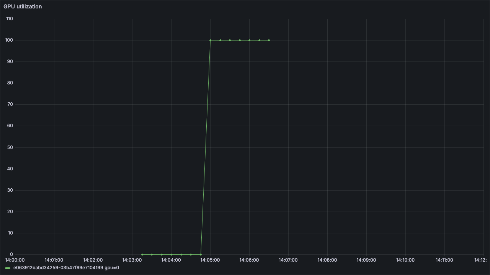
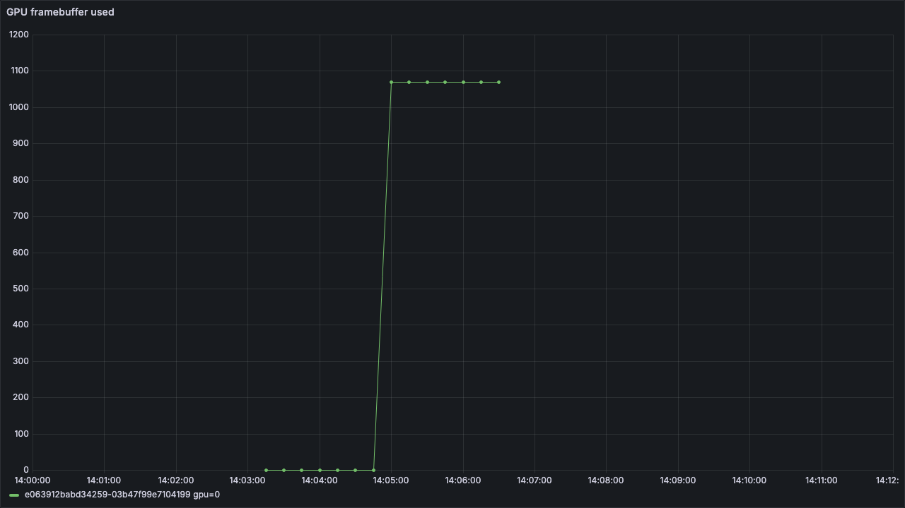
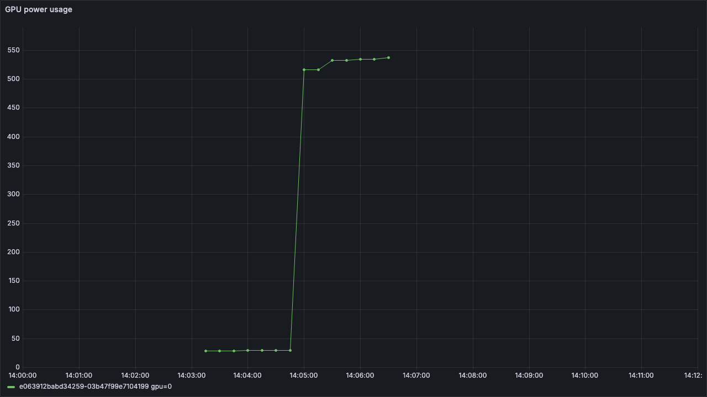
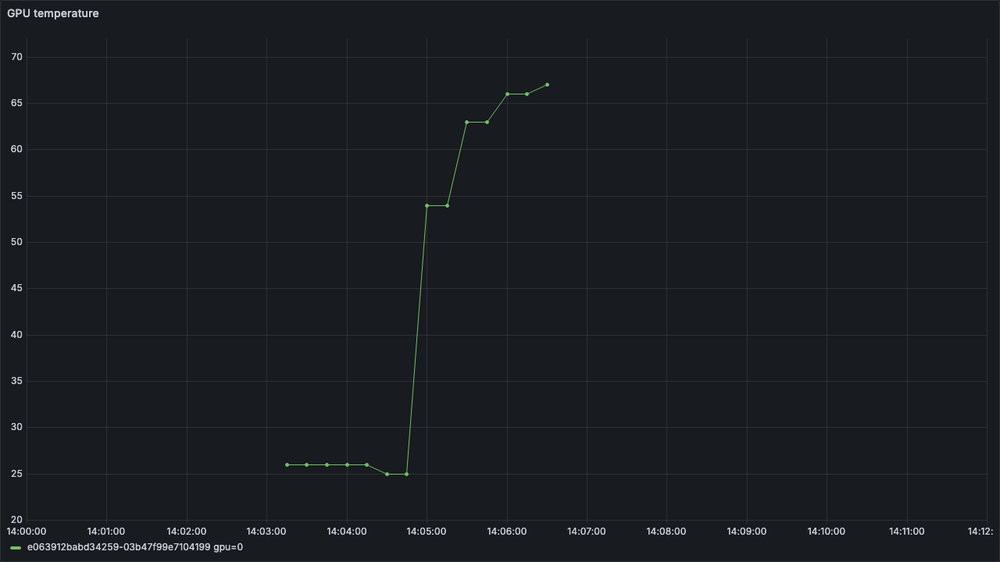

# AWS Managed Observability

This optional Terraform root deploys the AWS managed observability path for OSMO:

- Amazon Managed Service for Prometheus (AMP) workspace.
- IRSA role that allows in-cluster Prometheus to `remote_write` metrics to AMP.
- `prometheus-community/kube-prometheus-stack` configured with short local retention and AMP SigV4 `remote_write`.
- Amazon Managed Grafana (AMG) workspace using AWS IAM Identity Center (`AWS_SSO`).
- AMG service account used by `scripts/deploy-observability.sh` to provision the AMP data source and dashboards.

AMG does not create a local Grafana username or password. Browser access requires IAM Identity Center user or group IDs through `admin_user_ids`, `admin_group_ids`, `editor_group_ids`, or `viewer_group_ids`.

## Browser Login

Do not create an IAM user or an IAM password for Grafana browser login. With `AWS_SSO`, AMG uses AWS IAM Identity Center users and groups. Terraform grants those identities a Grafana role through `aws_grafana_role_association`.

If IAM Identity Center is already enabled, find the identity store and user or group IDs:

```bash
IDENTITY_CENTER_REGION="us-east-1"

aws sso-admin list-instances \
  --region "${IDENTITY_CENTER_REGION}" \
  --query 'Instances[].{InstanceArn:InstanceArn,IdentityStoreId:IdentityStoreId}' \
  --output table

IDENTITY_STORE_ID="d-xxxxxxxxxx"

aws identitystore list-users \
  --identity-store-id "${IDENTITY_STORE_ID}" \
  --region "${IDENTITY_CENTER_REGION}" \
  --query 'Users[].{UserName:UserName,DisplayName:DisplayName,UserId:UserId}' \
  --output table

aws identitystore list-groups \
  --identity-store-id "${IDENTITY_STORE_ID}" \
  --region "${IDENTITY_CENTER_REGION}" \
  --query 'Groups[].{DisplayName:DisplayName,GroupId:GroupId}' \
  --output table
```

Then put the selected IDs into `infra/observability/terraform.tfvars`:

```hcl
admin_user_ids = [
  "11111111-2222-3333-4444-555555555555"
]

admin_group_ids = [
  "aaaaaaaa-bbbb-cccc-dddd-eeeeeeeeeeee"
]
```

Because `admin_user_ids` is consumed by `aws_grafana_role_association`, granting access this way is managed by Terraform state. It survives an observability `destroy`/`recreate`, unlike a one-off `aws grafana update-permissions` CLI grant, which is not tracked and is lost on recreate. Set the IDs in `terraform.tfvars` for durable access. (`*.tfvars` is gitignored, so real IDs stay out of the repo.)

After `scripts/deploy-observability.sh` completes, open the `amg_workspace_url` output. The browser login goes through IAM Identity Center. The service account token created by the deploy wrapper is only for API provisioning of the data source and dashboards; it is not a human login credential and is intentionally short-lived.

```bash
cp infra/observability/terraform.tfvars.example infra/observability/terraform.tfvars

terraform -chdir=infra/core output -raw cluster_name
terraform -chdir=infra/core output -raw cluster_oidc_issuer_url
terraform -chdir=infra/core output -raw cluster_oidc_provider_arn

scripts/deploy-observability.sh -auto-approve
```

The deploy wrapper applies this Terraform root, enables OSMO PodMonitor resources on the existing OSMO Helm releases, creates a short-lived AMG service account token, provisions an AMP data source, imports the pinned OSMO dashboards from `dashboards/`, creates an `AWS OSMO Overview` dashboard, and updates the OSMO backend `grafana_url`.

The dashboard JSON files in `dashboards/` are copied from NVIDIA OSMO `c2c30e55f84969fff55d51cd2044a03d40d6a1a5` under `docs/deployment_guide/dashboards/`.

The upstream dashboard JSONs expect a `cluster` label and use Prometheus Operator exported labels for workload DCGM metrics, for example `exported_namespace`, `exported_pod`, and `exported_container`. This Terraform root sets Prometheus `externalLabels.cluster` to `cluster_name` before AMP remote write. The deploy wrapper leaves the DCGM ServiceMonitor on the Prometheus Operator default `honorLabels: false` behavior so exporter-provided workload labels are exposed as `exported_*` labels instead of replacing target labels.

## Dashboards

The deploy wrapper provisions four dashboards into the AMG workspace. Find them by title in the Grafana dashboards list; the URL shows a per-dashboard uid as `${amg_workspace_url}/d/<uid>`.

### AWS OSMO Overview (`uid=aws-osmo-overview`)

The AWS-facing operations dashboard, created directly by `scripts/deploy-observability.sh` (not imported from upstream). It is the dashboard to watch for GPU model training.

- Scrape health: `up{namespace="osmo"}` (healthy target count + per-pod timeseries). Shows data immediately after deployment.
- Recent workflow pods: `count_over_time(kube_pod_info{namespace="osmo-workflows"}[24h])`.
- GPU panels (populated once a GPU workflow runs in `osmo-workflows`):
  - `DCGM_FI_DEV_GPU_UTIL{exported_namespace="osmo-workflows"}` — GPU utilization
  - `DCGM_FI_DEV_FB_USED{exported_namespace="osmo-workflows"}` — GPU framebuffer (VRAM) used
  - `DCGM_FI_DEV_POWER_USAGE{exported_namespace="osmo-workflows"}` — GPU power
  - `DCGM_FI_DEV_GPU_TEMP{exported_namespace="osmo-workflows"}` — GPU temperature

When you allocate a GPU and run model training, this is the dashboard to open. Training jobs run as pods in the `osmo-workflows` namespace, and the DCGM exporter (installed by the GPU Operator) publishes per-pod GPU metrics under the `exported_namespace="osmo-workflows"` label, which is exactly what these panels filter on. The GPU panels only show data while a GPU job is actually running; they are empty otherwise. The deploy wrapper creates the `nvidia-dcgm-exporter` ServiceMonitor only when the GPU Operator namespace exists.

### Workflow Resources (imported from upstream)

Resource and GPU metrics for active workflow pods, normally in `osmo-workflows`. Expected to be empty when no workflow pods are running. This is a per-workflow drill-down; `AWS OSMO Overview` is the higher-level GPU view.

### Backend Operator (imported from upstream)

Sections: `Backend Operator Status`, `Backend Agent Metrics`. Shows backend operator pod resources plus queue, event, and job metrics. Backend resource panels populate when the OSMO backend pods are scraped; queue and job panels only populate after backend activity emits those metrics.

### Observability Dashboard (imported from upstream)

The upstream OSMO service dashboard, and the most detailed component view. Sections: `Envoy`, `Service`, `Logger`, `Router`, `Agent`, `Queues`, `Worker`, `Job Monitor` (~22 timeseries panels covering CPU, memory, latency, connections, and queue depth per OSMO component). All panels reference the AMP data source.

Namespace rewrite: the pinned upstream JSON hardcodes `namespace="default"` in its CPU and memory panel queries, but OSMO runs in the `osmo` namespace. `scripts/deploy-observability.sh` rewrites `namespace="default"` to the deployed OSMO namespace at import time, so these panels populate against this deployment. The pinned JSON in `dashboards/` is left unmodified. Panels without a namespace filter (Envoy `envoy_cluster_*` metrics, queue metrics such as `osmo_service_worker_job_queue_length`) are unaffected by the rewrite.

## Runtime Validation

Status: Passed manually on 2026-05-05 before this Terraform root was added, then revalidated with GPU metrics on 2026-05-06.

Scope validated:

- AMP workspace `ws-41a61aa8-e5cb-4196-aa2f-12abae537904` in `ap-northeast-2`.
- In-cluster Prometheus `remoteWrite` configured to the AMP workspace endpoint with SigV4.
- OSMO PodMonitor resources `otel-monitor` and `osmo-backend-otel-monitor`.
- DCGM exporter ServiceMonitor `nvidia-dcgm-exporter`.
- Direct AMP query for `up{namespace="osmo"}` returned five healthy OSMO targets.
- AMG workspace `g-9d381a8099` with an AMP Prometheus data source.
- AMG data source proxy query for `up{namespace="osmo"}` returned the same five healthy OSMO targets.
- Submitted post-observability workflow `aws-osmo-smoke-9`; AMG data source proxy returned 21 `osmo-workflows` pod series over 24h, including `aws-osmo-smoke-9`.
- Submitted post-observability GPU workflow `aws-osmo-gpu-smoke-3`; the workflow ran a 120 second CUDA burn on `NVIDIA RTX PRO 6000 Blackwell Server Edition` and completed in 219 seconds.
- AMG data source proxy queries against AMP returned max-over-1h DCGM values: `DCGM_FI_DEV_GPU_UTIL=100`, `DCGM_FI_DEV_FB_USED=1070`, `DCGM_FI_DEV_POWER_USAGE=537.003`, and `DCGM_FI_DEV_GPU_TEMP=67`.
- Revalidated the upstream dashboard label shape after removing DCGM `honorLabels`: AMP returned `cluster="aws-osmo-dev-repro-eks"` on Kubernetes metrics and `exported_namespace="osmo-workflows"`, `exported_pod`, and `exported_container` on DCGM metrics for a GPU pod in `osmo-workflows`.
- Imported OSMO `Workflow Resources` and `Backend Operator` dashboards plus the `AWS OSMO Overview` dashboard.
- OSMO backend `default` configured with `grafana_url` set to the AMG workspace URL.

The live validation used `AWS_SSO` for AMG authentication and a short-lived service account token for API provisioning. No local AMG id/password exists.

## GPU Visual Validation

The following AMG panel captures were taken from the `AWS OSMO Overview` dashboard after `aws-osmo-gpu-smoke-3` completed. The same values are recorded in [gpu-smoke-observability.json](validation/gpu-smoke-observability.json).

To reproduce the view manually:

- Open AMG workspace `g-9d381a8099` and select the `AWS OSMO Overview` dashboard.
- Set the time range to `Last 1 hour` shortly after a GPU smoke run, or use the absolute range around `2026-05-06 14:04:27-14:06:28 KST` for `aws-osmo-gpu-smoke-3`.
- The GPU panels query DCGM metrics with `exported_namespace="osmo-workflows"` so they show workload pod metrics rather than the exporter pod itself.
- In Grafana Explore, the equivalent filter is `DCGM_FI_DEV_GPU_UTIL{exported_namespace="osmo-workflows"}` against the AMP data source.








