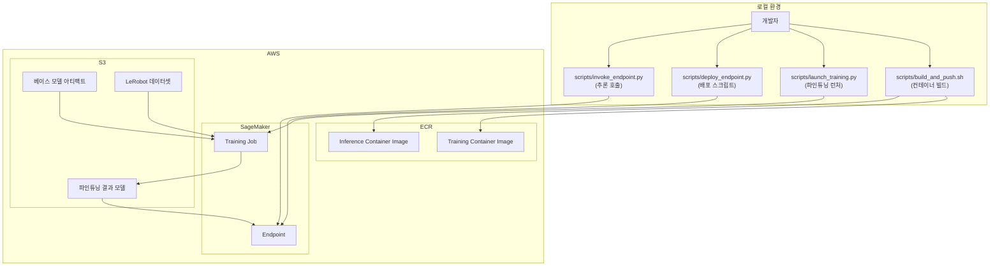

# GR00T-N1.6-3B SageMaker 파인튜닝 및 배포 가이드

## 1. 개요

이 가이드는 NVIDIA GR00T-N1.6-3B Vision-Language-Action(VLA) 모델을 AWS SageMaker에서 파인튜닝하고 추론 엔드포인트로 배포하는 전체 워크플로우를 설명합니다.

GR00T-N1.6-3B는 멀티모달 입력(RGB 이미지, 자연어 지시, 로봇 고유수용감각 벡터)을 받아 연속 액션 벡터를 출력하는 3B 파라미터 로봇 제어 모델입니다. 이 가이드를 통해 커스텀 Docker 컨테이너 빌드, SageMaker Training Job 실행, SageMaker Endpoint 배포까지 단계별로 진행할 수 있습니다.

---

## 2. 사전 요구사항

### 2.1 로컬 환경

- **AWS CLI** v2 이상 설치 및 자격증명 구성 (`aws configure`)
- **Docker** 설치 및 실행 중 (NVIDIA Container Toolkit 권장)
- **Python** 3.10 이상
- **Git LFS** 설치 (모델 다운로드용)

### 2.2 AWS IAM 권한

SageMaker 파인튜닝 및 배포를 위해 다음 IAM 권한이 필요합니다:

| 서비스 | 필요 권한 | 용도 |
|--------|----------|------|
| **SageMaker** | `CreateTrainingJob`, `DescribeTrainingJob`, `CreateModel`, `CreateEndpointConfig`, `CreateEndpoint`, `DeleteEndpoint`, `DeleteEndpointConfig`, `DeleteModel`, `InvokeEndpoint` | 학습 작업 실행, 엔드포인트 배포/삭제/호출 |
| **ECR** | `CreateRepository`, `GetAuthorizationToken`, `BatchCheckLayerAvailability`, `PutImage`, `InitiateLayerUpload`, `UploadLayerPart`, `CompleteLayerUpload` | 컨테이너 이미지 저장소 관리 및 이미지 푸시 |
| **S3** | `GetObject`, `PutObject`, `ListBucket`, `GetBucketLocation` | 모델 아티팩트, 데이터셋, 학습 결과 저장/조회 |
| **IAM** | `PassRole` | SageMaker 실행 역할 전달 |

### 2.3 SageMaker 실행 역할

SageMaker Training Job과 Endpoint가 S3, ECR 등 AWS 리소스에 접근하기 위한 IAM 역할(Role ARN)이 필요합니다. 역할에는 `AmazonSageMakerFullAccess` 정책과 S3/ECR 접근 권한이 포함되어야 합니다.

---

## 3. 인스턴스 추천

### 3.1 학습용 인스턴스

최소 요구사항: **총 48GB 이상 GPU VRAM**

| 티어 | 인스턴스 타입 | GPU | VRAM | 예상 비용 (시간당) | 비고 |
|------|-------------|-----|------|-------------------|------|
| 추천 | `ml.p4d.24xlarge` | 8x A100 40GB | 320GB | ~$32.77 | 최적 성능 |
| 고성능 | `ml.p5.48xlarge` | 8x H100 80GB | 640GB | ~$98.32 | 최고 성능 |
| 예산 | `ml.g5.12xlarge` | 4x A10G 24GB | 96GB | ~$7.09 | 모델 병렬화 필요 |

### 3.2 추론용 인스턴스

최소 요구사항: **24GB 이상 GPU VRAM**

| 티어 | 인스턴스 타입 | GPU | VRAM | 예상 비용 (시간당) | 비고 |
|------|-------------|-----|------|-------------------|------|
| 추천 | `ml.g5.2xlarge` | 1x A10G 24GB | 24GB | ~$1.52 | 비용 효율적 |
| 고성능 | `ml.p4d.24xlarge` | 8x A100 40GB | 320GB | ~$32.77 | 대규모 배치 |
| 예산 | `ml.g5.xlarge` | 1x A10G 24GB | 24GB | ~$1.01 | 최소 사양 |

---

## 4. 아키텍처

아래 다이어그램은 전체 워크플로우를 보여줍니다:



### 워크플로우 요약

1. 학습/추론용 Docker 컨테이너를 빌드하고 ECR에 푸시
2. 베이스 모델과 LeRobot 데이터셋을 S3에 업로드
3. `launch_training.py`로 SageMaker Training Job 실행
4. 학습 완료 후 파인튜닝된 모델이 S3에 자동 저장
5. `deploy_endpoint.py`로 SageMaker Endpoint 생성
6. `invoke_endpoint.py`로 추론 요청 전송
7. 사용 완료 후 엔드포인트 삭제로 리소스 정리

---

## 5. 단계별 워크플로우

### Step 1: 컨테이너 빌드 및 ECR 푸시

학습용 Docker 컨테이너를 빌드하고 Amazon ECR에 푸시합니다.

```bash
# sagemaker-vla/ 디렉토리에서 실행
# account-id와 region은 aws configure 설정에서 자동 감지됩니다
bash scripts/build_and_push.sh --type training

# 특정 리전이나 계정을 지정하려면:
# bash scripts/build_and_push.sh --type training --account-id <YOUR_ACCOUNT_ID> --region ap-northeast-2
```

스크립트가 수행하는 작업:
1. ECR에 Docker 인증
2. ECR 리포지토리 생성 (없으면 자동 생성)
3. `docker/Dockerfile.training` 기반으로 이미지 빌드
4. 이미지를 ECR에 태그 및 푸시

빌드 완료 후 출력되는 **Image URI**를 기록해 두세요. 이후 학습 실행 시 사용합니다.

```
# 출력 예시
Image URI (use this in SageMaker scripts):
  123456789012.dkr.ecr.us-east-1.amazonaws.com/groot-n16-training:latest
```

### Step 2: 데이터 준비 및 S3 업로드

GR00T-N1.6 파인튜닝에는 **LeRobot v2 호환 형식**의 데이터셋이 필요합니다.

```bash
# 로컬 데이터셋을 S3에 업로드
aws s3 cp --recursive \
    ./my-dataset \                              # 로컬 데이터셋 경로
    s3://my-bucket/datasets/my-robot-data/      # S3 대상 경로
```

데이터셋 형식에 대한 자세한 내용은 [6. LeRobot v2 데이터셋 준비 가이드](#6-lerobot-v2-데이터셋-준비-가이드) 섹션을 참고하세요.

### Step 3: 베이스 모델 S3 업로드

HuggingFace에서 GR00T-N1.6-3B 모델을 다운로드하고 S3에 업로드합니다.

```bash
# Git LFS 설치 (대용량 파일 다운로드에 필요)
git lfs install

# HuggingFace에서 모델 다운로드
git clone https://huggingface.co/nvidia/GR00T-N1.6-3B

# S3에 모델 아티팩트 업로드
aws s3 cp --recursive \
    ./GR00T-N1.6-3B \                    # 다운로드한 모델 디렉토리
    s3://my-bucket/models/groot-n16/     # S3 대상 경로
```

### Step 4: 파인튜닝 실행

SageMaker Training Job을 시작하여 모델을 파인튜닝합니다.

```bash
python scripts/launch_training.py \
    --base-model-s3-uri s3://my-bucket/models/groot-n16 \       # 베이스 모델 S3 경로
    --dataset-s3-uri s3://my-bucket/datasets/my-robot-data \    # 데이터셋 S3 경로
    --output-s3-uri s3://my-bucket/output/finetuned \           # 학습 결과 저장 S3 경로
    --embodiment-tag my_robot \                                 # 로봇 embodiment 식별자
    --container-image-uri <ECR_IMAGE_URI> \                     # Step 1에서 얻은 ECR 이미지 URI
    --role-arn <SAGEMAKER_ROLE_ARN> \                           # SageMaker 실행 역할 ARN
    --instance-type ml.p4d.24xlarge \                           # 학습 인스턴스 타입 (최소 48GB VRAM)
    --max-steps 10000 \                                         # 최대 학습 스텝 수
    --global-batch-size 32                                      # 글로벌 배치 크기
```

선택적 파라미터:

| 파라미터 | 기본값 | 설명 |
|---------|--------|------|
| `--instance-count` | 1 | 학습 인스턴스 수 |
| `--save-steps` | 2000 | 체크포인트 저장 간격 |
| `--num-gpus` | 1 | 인스턴스당 GPU 수 |
| `--wandb-api-key` | None | Weights & Biases API 키 (실험 추적용) |

스크립트는 실행 전에 인스턴스 VRAM 요구사항과 S3 URI 형식을 자동으로 검증합니다. 학습이 완료되면 파인튜닝된 모델이 `--output-s3-uri` 경로에 저장됩니다.

### Step 5: 추론 엔드포인트 배포

먼저 추론용 컨테이너를 빌드하고, 이어서 SageMaker Endpoint를 생성합니다.

```bash
# 추론용 컨테이너 빌드 및 ECR 푸시
bash scripts/build_and_push.sh --type inference
```

```bash
# SageMaker Endpoint 배포
python scripts/deploy_endpoint.py \
    --action deploy \                                           # 배포 액션
    --model-s3-uri s3://my-bucket/output/finetuned/model.tar.gz \  # 파인튜닝된 모델 S3 경로
    --instance-type ml.g5.2xlarge \                             # 추론 인스턴스 타입 (최소 24GB VRAM)
    --endpoint-name groot-inference \                           # 엔드포인트 이름
    --container-image-uri <ECR_INFERENCE_IMAGE_URI> \           # 추론용 ECR 이미지 URI
    --role-arn <SAGEMAKER_ROLE_ARN>                             # SageMaker 실행 역할 ARN
```

배포가 완료되면 엔드포인트 이름과 호출 URL이 출력됩니다. 엔드포인트 생성에는 수 분이 소요될 수 있습니다.

### Step 6: 엔드포인트 호출

배포된 엔드포인트에 추론 요청을 전송합니다.

```bash
python scripts/invoke_endpoint.py \
    --endpoint-name groot-inference \                    # 배포된 엔드포인트 이름
    --image-path ./test_image.png \                     # RGB 이미지 파일 경로
    --proprioception 0.1,0.2,0.3,0.4,0.5,0.6,0.7 \    # 로봇 고유수용감각 벡터 (쉼표 구분)
    --instruction "pick up the red block" \             # 자연어 작업 지시
    --region us-east-1                                  # 엔드포인트가 배포된 리전
```

요청 형식 (JSON):
```json
{
    "image": "<base64 인코딩된 RGB 이미지>",
    "proprioception": [0.1, 0.2, 0.3, 0.4, 0.5, 0.6, 0.7],
    "instruction": "pick up the red block"
}
```

응답 형식 (JSON):
```json
{
    "actions": [[0.05, -0.12, 0.33, 0.01, 0.0, -0.08, 0.15]],
    "timestamp": "2025-01-15T10:30:00+00:00"
}
```

### Step 7: 리소스 정리

사용이 끝나면 엔드포인트를 삭제하여 불필요한 비용 발생을 방지합니다.

```bash
python scripts/deploy_endpoint.py \
    --action delete \                   # 삭제 액션
    --endpoint-name groot-inference \   # 삭제할 엔드포인트 이름
    --region us-east-1                  # 엔드포인트가 배포된 리전
```

이 명령은 엔드포인트, 엔드포인트 설정, 연결된 모델을 모두 정리합니다.

---

## 6. LeRobot v2 데이터셋 준비 가이드

GR00T-N1.6 파인튜닝에는 LeRobot v2 호환 형식의 데이터셋이 필요합니다.

### 6.1 데이터셋 형식 개요

LeRobot v2 데이터셋은 로봇 조작 에피소드를 구조화된 형식으로 저장합니다. 각 에피소드에는 RGB 이미지 관측, 로봇 상태(고유수용감각), 액션 시퀀스가 포함됩니다.

### 6.2 필요한 데이터 구조

```
my-dataset/
├── meta/
│   ├── info.json           # 데이터셋 메타데이터 (로봇 타입, 액션 공간 등)
│   ├── episodes.jsonl      # 에피소드 목록
│   └── stats.json          # 데이터 통계
├── data/
│   ├── chunk-000/
│   │   ├── episode_000000.parquet   # 에피소드 데이터 (상태, 액션)
│   │   └── ...
└── videos/                 # (선택) 비디오 관측 데이터
    └── chunk-000/
        ├── episode_000000.mp4
        └── ...
```

### 6.3 참고 자료

데이터셋 준비에 대한 자세한 내용은 아래 문서를 참고하세요:

- [Isaac-GR00T 공식 문서](https://github.com/NVIDIA/Isaac-GR00T) — 데이터셋 형식 및 변환 도구
- [LeRobot 프로젝트](https://github.com/huggingface/lerobot) — LeRobot v2 데이터셋 사양

---

## 7. 트러블슈팅

### ECR 인증 실패

```
Error: An error occurred (AuthorizationException)
```

- AWS CLI 자격증명이 올바르게 구성되었는지 확인: `aws sts get-caller-identity`
- ECR 관련 IAM 권한(`GetAuthorizationToken`, `CreateRepository`)이 있는지 확인
- 리전 설정이 올바른지 확인: `aws configure get region`

### Docker 빌드 실패

```
Error: CUDA driver version is insufficient
```

- Dockerfile의 CUDA 버전(12.4)과 호스트 드라이버 호환성 확인
- 메모리 부족 시 Docker 빌드 병렬 작업 수 줄이기: `MAX_JOBS=2 docker build ...`
- Docker 데몬에 충분한 메모리가 할당되었는지 확인 (최소 16GB 권장)

### SageMaker Training Job 실패

```
Error: ResourceLimitExceeded / InternalServerError
```

- **CloudWatch 로그 확인**: SageMaker 콘솔 → Training Jobs → 해당 작업 → View logs
- **VRAM 부족**: 더 큰 인스턴스로 업그레이드 (예: `ml.g5.12xlarge` → `ml.p4d.24xlarge`)
- **서비스 쿼터 초과**: AWS 콘솔에서 SageMaker 서비스 쿼터 확인 및 증가 요청
- **S3 접근 오류**: SageMaker 실행 역할에 S3 읽기/쓰기 권한이 있는지 확인

### 엔드포인트 생성 실패

```
Error: ResourceLimitExceeded
```

- **서비스 쿼터 확인**: AWS 콘솔 → Service Quotas → SageMaker에서 엔드포인트 인스턴스 쿼터 확인
- **인스턴스 가용성**: 해당 리전에서 선택한 인스턴스 타입이 사용 가능한지 확인
- 다른 리전이나 인스턴스 타입으로 시도

### 추론 에러

```
Error: ModelError / ValidationError
```

- **입력 형식 확인**: `image`는 유효한 base64 문자열, `proprioception`은 숫자 배열, `instruction`은 비어있지 않은 문자열이어야 합니다
- **base64 인코딩 확인**: 이미지 파일을 올바르게 base64 인코딩했는지 확인
- **모델 아티팩트 확인**: S3에 모델 파일이 정상적으로 업로드되었는지 확인

### wandb 연결 실패

```
Error: wandb.errors.CommError
```

- `--wandb-api-key` 값이 올바른지 확인
- 학습 컨테이너에서 외부 네트워크 접근이 가능한지 확인 (VPC 설정)
- wandb 연결 실패 시에도 학습은 계속 진행됩니다 (경고 로그만 출력)

---

## 8. 프로젝트 구조

```
sagemaker-vla/
├── docker/
│   ├── Dockerfile.training        # 학습용 컨테이너 (CUDA 12.4, PyTorch, Isaac-GR00T)
│   └── Dockerfile.inference       # 추론용 컨테이너 (경량 런타임)
├── scripts/
│   ├── build_and_push.sh          # ECR 빌드/푸시 스크립트
│   ├── launch_training.py         # SageMaker Training Job 런처
│   ├── deploy_endpoint.py         # SageMaker Endpoint 배포/삭제
│   └── invoke_endpoint.py         # 엔드포인트 호출 예제
├── src/
│   ├── train_entry.py             # 컨테이너 내 학습 엔트리포인트
│   ├── inference_handler.py       # 추론 핸들러 (model_fn, input_fn, predict_fn, output_fn)
│   └── config.py                  # 설정, 인스턴스 추천, 유효성 검증
├── guide/
│   └── GUIDE.md                   # 이 가이드 문서
└── tests/
    ├── test_config.py             # config 모듈 테스트
    ├── test_inference_handler.py  # 추론 핸들러 테스트
    └── test_train_entry.py        # 학습 엔트리포인트 테스트
```
