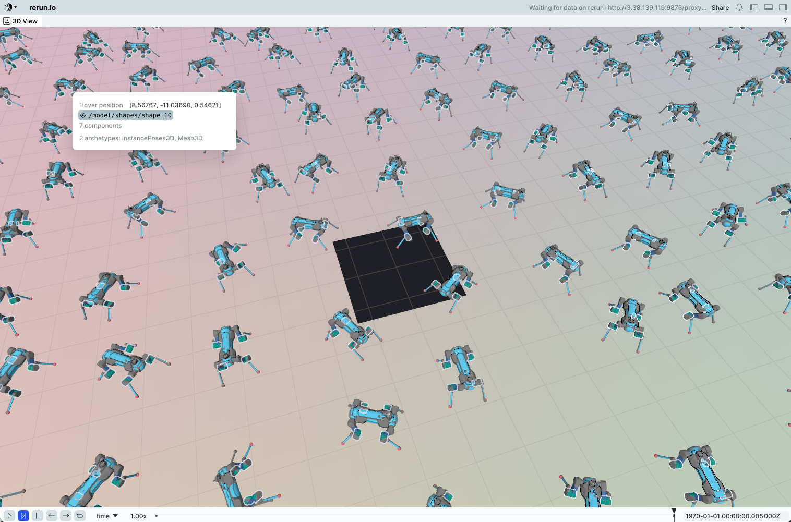

# Isaac Lab on AWS

NVIDIA Isaac Lab 강화학습 시뮬레이션 환경을 AWS에서 구축하고 운영하기 위한 레시피입니다.

## 구성 요소

```
isaac-lab/
├── infra-multiuser-groot/     # CDK 인프라 — 멀티유저 GPU 환경 원클릭 배포
├── mlops-dashboard/           # RL 학습 Fleet 모니터링 대시보드 (Next.js)
└── newton-setup/              # 수동 셋업 — Newton 물리엔진 직접 설치
    ├── README.md              #   셋업 가이드
    ├── setup.sh               #   원클릭 설치 스크립트
    └── requirements.txt       #   Python 의존성 고정 파일
```

## 두 가지 접근 방식

사용 목적에 따라 선택합니다.

### Option A. CDK 인프라 배포 (멀티유저 / 워크숍)

> **언제**: 팀원 여러 명이 각자 GPU 환경이 필요하거나, 워크숍/데모를 운영할 때

AWS CDK로 VPC, GPU EC2 (DCV 원격 데스크탑), EFS, Batch를 한 번에 배포합니다. Isaac Sim + Isaac Lab이 DLAMI에 사전 설치되어 있어 별도 환경 셋업 없이 DCV 접속 후 바로 학습을 시작할 수 있습니다.

**주요 특징:**
- GPU 인스턴스 타입 자동 탐색 (g6.12xlarge → g5.12xlarge → fallback)
- AZ별 GPU 가용량 자동 탐지 + 리전 12개 지원
- NICE DCV 원격 데스크탑 (`https://<IP>:8443`)
- AWS Batch 분산 학습 인프라 포함
- 사용자별 격리된 VPC/EFS/IAM

```bash
cd infra-multiuser-groot/
cat README.md          # 상세 배포 가이드
```

| 버전 프로파일 | OS | Isaac Sim | Isaac Lab |
|---------------|-----|-----------|-----------|
| stable | Ubuntu 22.04 | 4.5.0 | 2.3.2 |
| latest | Ubuntu 24.04 | 5.1.0 | 2.3.2 |

### Option B. 수동 셋업 (Newton 물리엔진)

> **언제**: 이미 GPU EC2 인스턴스가 있고, Isaac Lab `feature/newton` 브랜치에서 Newton 물리엔진으로 학습할 때

기존 EC2 인스턴스에 git clone + 스크립트로 환경을 직접 구성합니다. Newton 물리엔진(경량 시뮬레이터)을 사용하므로 Isaac Sim 전체 스택 없이도 빠르게 RL 학습을 돌릴 수 있습니다.

**주요 특징:**
- `setup.sh` 원클릭 설치 (Python 3.11 + venv + 의존성)
- Isaac Sim 5.1.0 + Newton 물리엔진 (`beta-0.2.1`)
- 3가지 시각화 백엔드 (Omniverse / Newton / Rerun)
- DCV 없이 Rerun 웹 뷰어로 원격 모니터링 가능

```bash
# 빠른 시작
cd newton-setup
bash setup.sh
source ~/.bashrc
cd ~/environment/IsaacLab
python scripts/reinforcement_learning/skrl/train.py --task=Isaac-Ant-v0
```

상세 가이드: **[newton-setup/](./newton-setup/)**

## 시각화 옵션

학습 중 시뮬레이션을 시각화하는 3가지 방법을 제공합니다.

| Visualizer | 특징 | 접속 방식 | 적합한 상황 |
|------------|------|-----------|-------------|
| **Omniverse** | High-fidelity USD 렌더링 | Isaac Sim UI / `--livestream` | 고품질 시각화, 데모 |
| **Newton** | 경량 OpenGL 뷰어 | DCV 등 원격 데스크탑 | 빠른 반복 학습 |
| **Rerun** | 웹 브라우저 뷰어, 타임라인 리플레이 | `http://<IP>:9090` | 원격 모니터링 (DCV 불필요) |

```bash
# 시각화 백엔드 선택
python scripts/reinforcement_learning/rsl_rl/train.py \
  --task Isaac-Humanoid-v0 \
  --visualizer newton    # newton | rerun | omniverse
```

| Newton Visualizer | Rerun Visualizer |
|:-:|:-:|
|  |  |

## MLOps Dashboard

분산 학습 Fleet의 상태를 실시간으로 모니터링하는 Next.js 대시보드입니다. Rerun 뷰어와 TensorBoard를 통합하여 학습 진행 상황을 한 곳에서 확인할 수 있습니다.

```bash
cd mlops-dashboard/
cat README.md
```

## 환경 요약

| 항목 | Option A (CDK) | Option B (수동 셋업) |
|------|----------------|----------------------|
| 배포 방식 | `cdk deploy` | `bash setup.sh` |
| OS | Ubuntu 22.04 / 24.04 (DLAMI) | Ubuntu 22.04 |
| Python | AMI 내장 | 3.11 (deadsnakes PPA) |
| Isaac Sim | 4.5.0 또는 5.1.0 | 5.1.0 |
| 물리 엔진 | Isaac Sim 기본 | Newton (beta-0.2.1) |
| GPU | g6/g5 자동 탐색 | 기존 인스턴스 활용 |
| 원격 접속 | DCV (포트 8443) | DCV 또는 Rerun 웹 뷰어 |
| 멀티유저 | userId별 격리 배포 | 단일 사용자 |
