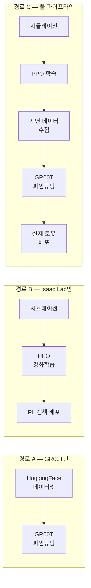
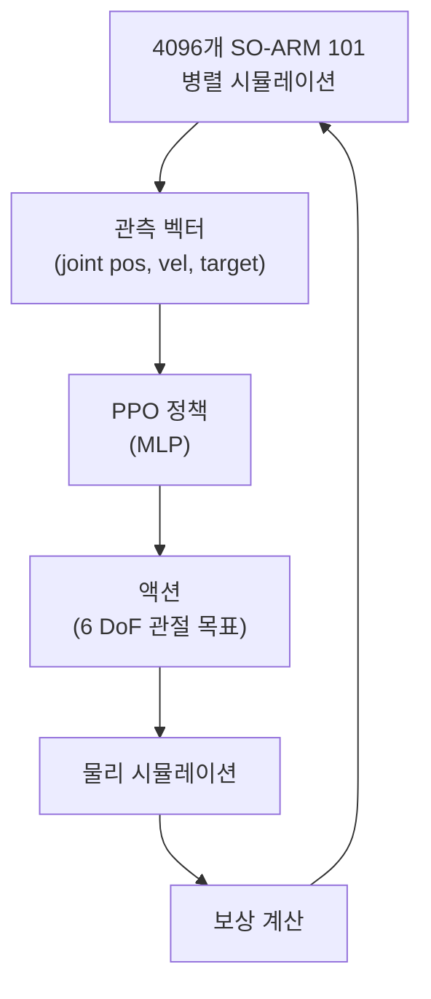
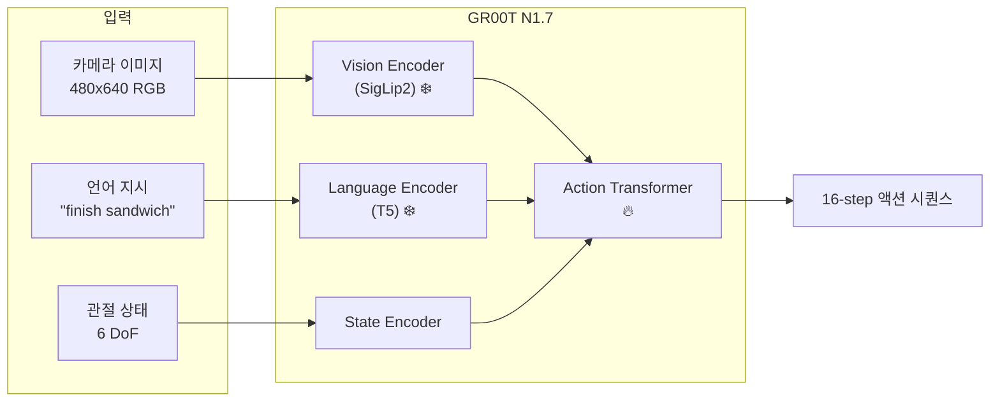
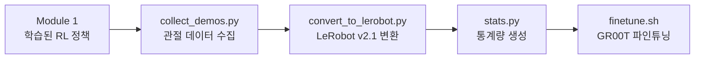
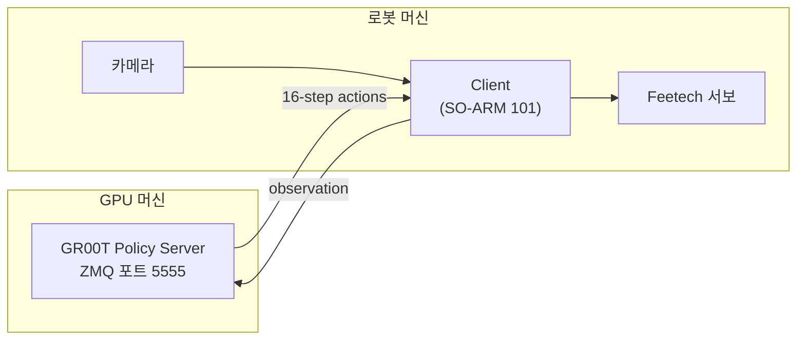

# GR00T + SO-ARM 101 Workshop

> Isaac Lab 시뮬레이션에서 SO-ARM 101 로봇 팔의 RL 정책을 학습하고, NVIDIA GR00T N1.7 파운데이션 모델을 파인튜닝하여 실제 로봇에 배포하는 핸즈온 워크숍

## 워크숍 개요

- **소요 시간**: 약 2시간
- **난이도**: Level 300 (Advanced)
- **대상**: Isaac Lab 기본 사용 경험자, Python 중급 이상
- **사전 요구**: CDK로 배포된 GPU EC2 인스턴스 ([infra-multiuser-groot](../../isaac-lab-workshop/infra-multiuser-groot/))
- **GPU**: g6.12xlarge (4x L40S, 192 GiB) 권장

## 무엇을 학습하는가?

이 워크숍은 3가지 경로를 모두 다룹니다:



### Isaac Lab vs GR00T — 차이점

| 항목 | Isaac Lab (RL 정책) | GR00T N1.7 (VLA 모델) |
|------|---------------------|----------------------|
| **학습 방식** | 강화학습 (PPO) | 모방학습 (시연 데이터) |
| **입력** | 관절 센서 데이터 (벡터) | 카메라 이미지 + 언어 명령 |
| **출력** | 관절 목표 위치 (6 DoF) | 16-step 액션 시퀀스 |
| **모델 크기** | 수 MB (MLP) | 3B 파라미터 (Transformer) |
| **태스크 범위** | 단일 태스크 (Reach, Lift) | 멀티 태스크 (언어로 지시) |
| **GPU 요구** | 12GB+ | 40GB+ (파인튜닝) |

### 왜 둘 다 필요한가?

GR00T 파인튜닝 자체는 Isaac Lab 없이도 가능합니다 (경로 A). 하지만 실제 로봇으로 시연 데이터를 모으는 건 느리고 비쌉니다. Isaac Lab에서 RL 정책을 먼저 학습한 뒤, 그 정책으로 시뮬레이션에서 시연 데이터를 대량 생성하면 — 이를 GR00T에 먹여서 **언어 명령까지 이해하는 범용 모델**로 만들 수 있습니다 (경로 C).

## 프로젝트 구조

```
workshop-groot-so101/
├── README.md                              # 이 문서
├── setup.sh                               # 원클릭 환경 셋업
├── pyproject.toml                         # Python 패키지 설정
├── configs/
│   ├── so101_modality_config.py           # GR00T 파인튜닝용 모달리티 설정
│   └── modality.json                      # 데이터 모달리티 매핑
└── src/workshop_groot_so101/
    ├── robots/
    │   ├── so_arm101.py                   # ArticulationCfg (로봇 정의)
    │   └── urdf/                          # URDF + STL 메시 (setup.sh가 다운로드)
    ├── tasks/
    │   ├── reach/                         # Reach 태스크 (엔드이펙터 위치 추적)
    │   └── lift/                          # Lift 태스크 (큐브 들어올리기)
    └── scripts/
        ├── train.py                       # RL 학습
        ├── play.py                        # 학습된 정책 시각화
        ├── collect_demos.py               # 시연 데이터 수집
        ├── convert_to_lerobot.py          # LeRobot v2.1 형식 변환
        └── list_envs.py                   # 등록된 환경 목록
```

## SO-ARM 101 로봇

[The Robot Studio](https://github.com/TheRobotStudio/SO-ARM100)가 설계한 오픈소스 3D 프린트 로봇 팔입니다.

| 항목 | 사양 |
|------|------|
| DOF | 5 (팔) + 1 (그리퍼) = 6 |
| 관절 | shoulder_pan, shoulder_lift, elbow_flex, wrist_flex, wrist_roll, gripper |
| 액추에이터 | Feetech STS3215 서보 x6 |
| 도달 거리 | ~600mm |
| 가격 | ~$230 (리더+팔로워 세트) |
| 생태계 | HuggingFace LeRobot 공식 지원 |

## 워크숍 모듈

| 모듈 | 내용 | 소요 시간 |
|------|------|-----------|
| **Module 0** | [환경 셋업](#module-0-환경-셋업) | ~10분 |
| **Module 1** | [Isaac Lab에서 SO-ARM 101 RL 학습](#module-1-isaac-lab-rl-학습) | ~30분 |
| **Module 2** | [HuggingFace 데이터셋으로 GR00T 파인튜닝](#module-2-huggingface-데이터셋으로-groot-파인튜닝) | ~40분 |
| **Module 3** | [시뮬레이션 데이터 수집 + GR00T 파인튜닝](#module-3-시뮬레이션-데이터-수집--groot-파인튜닝) | ~30분 |
| **Module 4** | [평가 및 배포](#module-4-평가-및-배포) | ~10분 |

---

## Module 0: 환경 셋업

CDK로 배포된 EC2 인스턴스에 DCV로 접속한 상태에서 시작합니다.

### 0-1. GR00T N1.7 클론 (NVIDIA 공식)

```bash
cd ~/environment
git clone https://github.com/NVIDIA/Isaac-GR00T.git
cd Isaac-GR00T
uv sync --all-extras
```

### 0-2. 워크숍 프로젝트 셋업

```bash
cd <워크숍 디렉토리>/workshop-groot-so101

# 원클릭 셋업: URDF 다운로드 + 의존성 설치 + 환경 검증
bash setup.sh
```

### 0-3. 환경 검증

```bash
uv run list_envs
```

예상 출력:
```
Registered workshop environments (4):

  Workshop-SO-ARM101-Lift-Cube-Play-v0
  Workshop-SO-ARM101-Lift-Cube-v0
  Workshop-SO-ARM101-Reach-Play-v0
  Workshop-SO-ARM101-Reach-v0
```

---

## Module 1: Isaac Lab RL 학습

SO-ARM 101 로봇을 Isaac Lab 시뮬레이션에서 PPO 강화학습으로 학습합니다.

### 학습 파이프라인



### 1-1. Reach 태스크 학습

엔드이펙터가 목표 위치에 도달하는 태스크입니다.

```bash
# 헤드리스 학습 (~1000 iterations)
uv run train --task Workshop-SO-ARM101-Reach-v0 --headless

# TensorBoard 모니터링 (새 터미널)
tensorboard --logdir logs/rsl_rl/reach_so101/ --port 6006
```

| 하이퍼파라미터 | 값 | 설명 |
|---------------|-----|------|
| Algorithm | PPO | Proximal Policy Optimization |
| Num Envs | 4096 | 병렬 환경 수 |
| Max Iterations | 1000 | |
| Network | MLP [64, 64] | Actor/Critic |
| Learning Rate | 1e-3 | |
| Episode Length | 12.0s | |

### 1-2. Lift Cube 태스크 학습

큐브를 집어 목표 높이로 들어올리는 태스크입니다.

```bash
uv run train --task Workshop-SO-ARM101-Lift-Cube-v0 --headless
```

| 하이퍼파라미터 | 값 | 설명 |
|---------------|-----|------|
| Max Iterations | 1500 | |
| Network | MLP [256, 128, 64] | 더 큰 네트워크 |
| Learning Rate | 1e-4 | |

### 1-3. 학습 결과 확인

```bash
# 시각화 모드로 실행
uv run play --task Workshop-SO-ARM101-Reach-Play-v0

# 특정 체크포인트
uv run play --task Workshop-SO-ARM101-Reach-Play-v0 \
    --checkpoint logs/rsl_rl/reach_so101/<timestamp>/checkpoints/best_agent.pt

# 비디오 녹화
uv run play --task Workshop-SO-ARM101-Reach-Play-v0 --video --video_length 200
```

---

## Module 2: HuggingFace 데이터셋으로 GR00T 파인튜닝

실제 SO-100 로봇의 텔레오퍼레이션 데이터를 사용하여 GR00T을 파인튜닝합니다. Isaac Lab 없이 동작하는 **경로 A** 입니다.

### GR00T 데이터 형식 이해

GR00T N1.7은 LeRobot v2.1 형식을 사용합니다:

```
dataset/
├── meta/
│   ├── info.json               # 데이터셋 메타 (FPS, feature 스키마)
│   ├── episodes.jsonl          # 에피소드 목록
│   ├── tasks.jsonl             # 태스크 설명 (언어 지시)
│   ├── modality.json           # 모달리티 매핑 (state/action 인덱스)
│   ├── stats.json              # 정규화 통계량
│   └── relative_stats.json     # 상대 액션 통계량
├── data/chunk-000/
│   └── episode_XXXXXX.parquet  # 관절 상태 + 액션
└── videos/chunk-000/           # (선택) 카메라 영상
```

SO-101의 `modality.json` — state/action 배열에서 각 관절의 인덱스를 정의:

```json
{
    "state": {
        "single_arm": {"start": 0, "end": 5},
        "gripper": {"start": 5, "end": 6}
    },
    "action": {
        "single_arm": {"start": 0, "end": 5},
        "gripper": {"start": 5, "end": 6}
    }
}
```

### 2-1. 데이터셋 다운로드 및 변환

```bash
cd ~/environment/Isaac-GR00T

# HuggingFace SO-100 데이터 다운로드 → LeRobot v2 변환
uv run --project scripts/lerobot_conversion \
  python scripts/lerobot_conversion/convert_v3_to_v2.py \
  --repo-id izuluaga/finish_sandwich \
  --root /tmp/so100_data

# modality.json 복사
cp examples/SO100/modality.json \
   /tmp/so100_data/izuluaga/finish_sandwich/meta/modality.json
```

### 2-2. GR00T 파인튜닝 실행

```bash
# 단일 GPU
CUDA_VISIBLE_DEVICES=0 NUM_GPUS=1 uv run bash examples/finetune.sh \
  --base-model-path nvidia/GR00T-N1.7-3B \
  --dataset-path /tmp/so100_data/izuluaga/finish_sandwich \
  --modality-config-path examples/SO100/so100_config.py \
  --embodiment-tag NEW_EMBODIMENT \
  --output-dir /tmp/so100_finetune

# 멀티 GPU (g6.12xlarge — 4x L40S)
NUM_GPUS=4 uv run bash examples/finetune.sh \
  --base-model-path nvidia/GR00T-N1.7-3B \
  --dataset-path /tmp/so100_data/izuluaga/finish_sandwich \
  --modality-config-path examples/SO100/so100_config.py \
  --embodiment-tag NEW_EMBODIMENT \
  --output-dir /tmp/so100_finetune
```

| 파라미터 | 기본값 | 설명 |
|---------|--------|------|
| `MAX_STEPS` | 10000 | 총 학습 스텝 |
| `GLOBAL_BATCH_SIZE` | 32 | 배치 크기 |
| `SAVE_STEPS` | 1000 | 체크포인트 간격 |
| Learning Rate | 1e-4 | |
| Warmup Ratio | 0.05 | 5% 워밍업 |

### 2-3. 파인튜닝 중 무엇이 학습되는가

GR00T N1.7 (3B 파라미터) 구조:



| 컴포넌트 | 튜닝 여부 | 설명 |
|---------|----------|------|
| Vision Encoder (SigLip2) | ❄️ 동결 | 범용 시각 특징 유지 |
| Language Encoder (T5) | ❄️ 동결 | 범용 언어 이해 유지 |
| Multimodal Projector | 🔥 튜닝 | 새 로봇에 맞게 적응 |
| Action Transformer | 🔥 튜닝 | 새 모터 제어 학습 |

---

## Module 3: 시뮬레이션 데이터 수집 + GR00T 파인튜닝

Module 1에서 학습한 RL 정책으로 시연 데이터를 수집하고, GR00T 파인튜닝에 사용합니다. **경로 C (풀 파이프라인)** 입니다.

### 전체 흐름



### 3-1. 데이터 수집

학습된 RL 정책을 실행하면서 관절 상태 + 액션을 레코딩합니다.

```bash
cd <워크숍 디렉토리>/workshop-groot-so101

uv run collect \
    --task Workshop-SO-ARM101-Lift-Cube-Play-v0 \
    --checkpoint logs/rsl_rl/lift_so101/<timestamp>/checkpoints/best_agent.pt \
    --num_episodes 200 \
    --output_dir /tmp/so101_sim_demos
```

### 3-2. LeRobot v2.1 형식으로 변환

```bash
uv run convert \
    --input_dir /tmp/so101_sim_demos \
    --output_dir /tmp/so101_lerobot_dataset \
    --task_description "lift cube to target height"
```

### 3-3. 통계량 생성

```bash
cd ~/environment/Isaac-GR00T

python gr00t/data/stats.py \
    --dataset-path /tmp/so101_lerobot_dataset \
    --embodiment-tag NEW_EMBODIMENT \
    --modality-config-path <워크숍 디렉토리>/workshop-groot-so101/configs/so101_modality_config.py
```

### 3-4. GR00T 파인튜닝

```bash
CUDA_VISIBLE_DEVICES=0 NUM_GPUS=1 uv run bash examples/finetune.sh \
    --base-model-path nvidia/GR00T-N1.7-3B \
    --dataset-path /tmp/so101_lerobot_dataset \
    --modality-config-path <워크숍 디렉토리>/workshop-groot-so101/configs/so101_modality_config.py \
    --embodiment-tag NEW_EMBODIMENT \
    --output-dir /tmp/so101_sim_finetune
```

---

## Module 4: 평가 및 배포

### 4-1. Open-Loop 평가

파인튜닝된 모델의 예측 액션을 Ground Truth와 비교합니다.

```bash
cd ~/environment/Isaac-GR00T

uv run python gr00t/eval/open_loop_eval.py \
    --dataset-path /tmp/so101_lerobot_dataset \
    --embodiment-tag NEW_EMBODIMENT \
    --model-path /tmp/so101_sim_finetune/checkpoint-10000 \
    --modality-config-path <워크숍 디렉토리>/workshop-groot-so101/configs/so101_modality_config.py \
    --traj-ids 0 1 2 \
    --action-horizon 16 \
    --steps 400
```

### 4-2. 정책 서버 (실제 로봇 배포)

GR00T은 Server-Client 아키텍처로 추론합니다:



**서버 시작:**

```bash
cd ~/environment/Isaac-GR00T

uv run python gr00t/eval/run_gr00t_server.py \
    --model-path /tmp/so101_sim_finetune/checkpoint-10000 \
    --embodiment-tag NEW_EMBODIMENT \
    --modality-config-path <워크숍 디렉토리>/workshop-groot-so101/configs/so101_modality_config.py \
    --host 0.0.0.0 --port 5555
```

**클라이언트 (로봇 측):**

```bash
uv run python gr00t/eval/real_robot/SO100/eval_so100.py \
    --robot.type=so101_follower \
    --robot.port=/dev/ttyACM2 \
    --robot.id=follower \
    --robot.cameras="{ front: {type: opencv, index_or_path: 0, width: 640, height: 480, fps: 30} }" \
    --policy-host=<GPU_IP> --policy-port=5555 \
    --lang-instruction="lift the cube"
```

---

## GPU 요구사항

| 작업 | 최소 VRAM | 권장 인스턴스 |
|------|----------|--------------|
| Isaac Lab RL 학습 | 12GB+ | g5.xlarge (1x A10G) |
| GR00T 추론 | 16GB+ | g5.xlarge |
| GR00T 파인튜닝 (1 GPU) | 40GB+ | g6.4xlarge (1x L40S) |
| GR00T 파인튜닝 (4 GPU) | 4x 48GB | g6.12xlarge (4x L40S) |
| 풀 파이프라인 | 4x 48GB | g6.12xlarge |

## 트러블슈팅

### Isaac Lab

| 증상 | 원인 | 해결 |
|------|------|------|
| `ModuleNotFoundError: isaacsim` | 의존성 미설치 | `uv sync` 재실행 |
| `CUDA out of memory` | 환경 수 과다 | `--num_envs 1024` |
| 학습 미수렴 | 반복 횟수 부족 | `--max_iterations 3000` |

### GR00T

| 증상 | 원인 | 해결 |
|------|------|------|
| `IndexError` 학습 중 | stats.json 미생성 | `stats.py` 실행 |
| VRAM 부족 | 배치 과다 | `GLOBAL_BATCH_SIZE=16` |
| `modality.json` 오류 | 인덱스 불일치 | start/end 범위 확인 |

## 참고 자료

- [NVIDIA Isaac Lab](https://github.com/isaac-sim/IsaacLab) — GPU 가속 로봇 시뮬레이션
- [NVIDIA GR00T N1.7](https://github.com/NVIDIA/Isaac-GR00T) — VLA 파운데이션 모델
- [GR00T Models (HuggingFace)](https://huggingface.co/collections/nvidia/gr00t-n17)
- [SO-ARM 100 (TheRobotStudio)](https://github.com/TheRobotStudio/SO-ARM100) — 로봇 공식 설계
- [HuggingFace LeRobot](https://github.com/huggingface/lerobot) — 로봇 학습 프레임워크
- [NVIDIA Sim-to-Real SO-101 Workshop](https://github.com/isaac-sim/Sim-to-Real-SO-101-Workshop)
