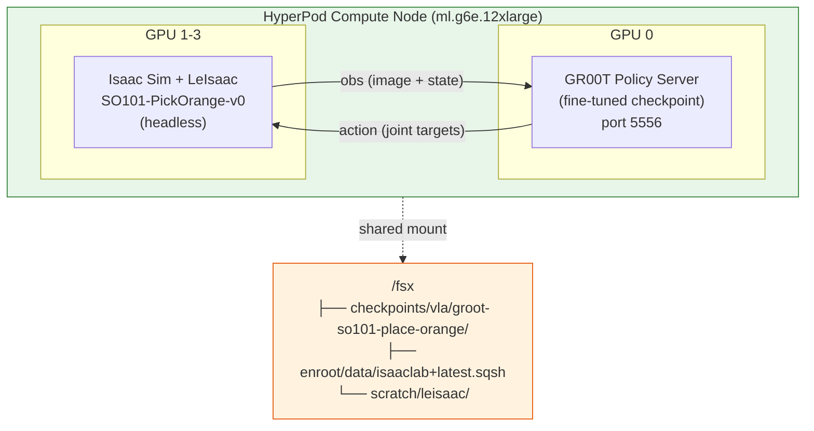

# HyperPod Workshop Consolidation Implementation Plan

> **For agentic workers:** REQUIRED SUB-SKILL: Use superpowers:subagent-driven-development (recommended) or superpowers:executing-plans to implement this plan task-by-task. Steps use checkbox (`- [ ]`) syntax for tracking.

**Goal:** Consolidate the HyperPod workshop around SO101 place-orange dataset with GR00T N1.6, ending with successful closed-loop simulation in LeIsaac PickOrange on HyperPod compute nodes.

**Architecture:** The workshop is an 8-chapter guide backed by CDK infra, SLURM templates, and Python scripts. Changes touch data prep (ch3), VLA training (ch4), RL (ch5 optional), and simulation verification (ch6 full rewrite). Code changes ensure end-to-end execution from `cdk deploy` through `sbatch` training to closed-loop eval.

**Tech Stack:** AWS CDK (TypeScript), Bash (SLURM sbatch), Python (GR00T, Isaac-GR00T, LeIsaac), Enroot containers, FSx for Lustre, S3 DRA

---

## File Map

| File | Action | Responsibility |
|------|--------|---------------|
| `configs/so101_modality.py` | Create | SO101 6-DOF modality config for GR00T new_embodiment |
| `slurm-templates/vla/finetune_groot_venv.sbatch` | Modify | Update defaults: dataset, embodiment, modality config |
| `slurm-templates/vla/eval_closed_loop.sbatch` | Rewrite | LeIsaac PickOrange headless closed-loop + metrics.json |
| `scripts/setup_groot_env.sh` | Modify | Add so101-place-orange dataset download helper |
| `scripts/setup_isaaclab_env.sh` | Modify | Add LeIsaac install for closed-loop eval |
| `examples/vla/prepare_dataset.py` | Modify | Add S3 upload helper command |
| Docs: `3.-data-preparation.md` | Rewrite | so101-place-orange via S3→FSx DRA |
| Docs: `4.-vla-training.md` | Modify | N1.6 fixed, so101 params, modality config |
| Docs: `5.-rl-training.md` | Modify | Mark Optional |
| Docs: `6.-simulation-verification.md` | Rewrite | HyperPod headless closed-loop with LeIsaac |

---

## Task 1: Create SO101 Modality Config

**Files:**
- Create: `configs/so101_modality.py`

- [ ] **Step 1: Create configs directory and modality file**

```python
"""SO101 follower arm modality configuration for GR00T fine-tuning.

Used with --embodiment-tag new_embodiment --modality-config-path configs/so101_modality.py

SO101 has 6 joints: shoulder_pan, shoulder_lift, elbow_flex, wrist_flex, wrist_roll, gripper
Dataset: LightwheelAI/so101-place-orange (LeRobot v2 format)
"""

from gr00t.experiment.data_config import DataConfig

data_config = DataConfig(
    base_dataset_type="lerobot",
    dataset_type="lerobot",
    # State: 6-DOF joint positions from observation.state
    state_keys=["observation.state"],
    state_dims=[6],
    # Action: 6-DOF joint position targets
    action_keys=["action"],
    action_dims=[6],
    # Video: front and wrist cameras
    video_keys=["observation.images.front", "observation.images.wrist"],
    # Action prediction horizon
    action_horizon=16,
)
```

- [ ] **Step 2: Verify the config is importable**

Run: `cd /home/ubuntu/workspace/aws-physical-ai-recipes/training/hyperpod && python -c "exec(open('configs/so101_modality.py').read()); print('OK:', data_config)"`

Expected: No import error (note: `gr00t` may not be installed locally — that's fine, this will run on the cluster)

- [ ] **Step 3: Commit**

```bash
git add configs/so101_modality.py
git commit -m "feat(hyperpod): add SO101 modality config for GR00T new_embodiment"
```

---

## Task 2: Update finetune_groot_venv.sbatch

**Files:**
- Modify: `slurm-templates/vla/finetune_groot_venv.sbatch`

- [ ] **Step 1: Change default DATASET, EMBODIMENT_TAG, add MODALITY_CONFIG**

Replace the defaults section (lines 64-73):

```bash
NUM_GPUS="${NUM_GPUS:-1}"
DATASET="${DATASET:-so101-place-orange}"
DATASET_PATH="${DATASET_PATH:-/fsx/datasets/groot/${DATASET}}"
EMBODIMENT_TAG="${EMBODIMENT_TAG:-new_embodiment}"
MODALITY_CONFIG="${MODALITY_CONFIG:-/fsx/scratch/aws-physical-ai-recipes/training/hyperpod/configs/so101_modality.py}"
MAX_STEPS="${MAX_STEPS:-2000}"
SAVE_STEPS="${SAVE_STEPS:-2000}"
SAVE_TOTAL_LIMIT="${SAVE_TOTAL_LIMIT:-5}"
GLOBAL_BATCH_SIZE="${GLOBAL_BATCH_SIZE:-32}"
DATALOADER_NUM_WORKERS="${DATALOADER_NUM_WORKERS:-4}"
OUTPUT_DIR="${OUTPUT_DIR:-/fsx/checkpoints/vla/groot-${DATASET}}"
```

- [ ] **Step 2: Add MODALITY_CONFIG to the echo block (after line 88)**

Add after the "Batch Size" echo line:

```bash
echo "Modality Config: ${MODALITY_CONFIG}"
```

- [ ] **Step 3: Add --modality-config-path to the python launch command**

Add `--modality-config-path "${MODALITY_CONFIG}"` to the `python -m gr00t.experiment.launch_finetune` call (after `--embodiment-tag`):

```bash
python -m gr00t.experiment.launch_finetune \
    --base-model-path "${BASE_MODEL}" \
    --dataset-path "${DATASET_PATH}" \
    --embodiment-tag "${EMBODIMENT_TAG}" \
    --modality-config-path "${MODALITY_CONFIG}" \
    --num-gpus "${NUM_GPUS}" \
    --output-dir "${OUTPUT_DIR}" \
    --save-total-limit "${SAVE_TOTAL_LIMIT}" \
    --save-steps "${SAVE_STEPS}" \
    --max-steps "${MAX_STEPS}" \
    --no-use-wandb \
    --global-batch-size "${GLOBAL_BATCH_SIZE}" \
    --gradient-accumulation-steps "${GRAD_ACCUM}" \
    --dataloader-num-workers "${DATALOADER_NUM_WORKERS}"
```

- [ ] **Step 4: Update header comments**

Update the Usage and Environment Variables sections at the top to reflect new defaults:

```bash
# Usage:
#   sbatch finetune_groot_venv.sbatch                          # Default: N1.6 + so101-place-orange
#   DATASET=my_data EMBODIMENT_TAG=OXE_DROID_RELATIVE_EEF_RELATIVE_JOINT sbatch finetune_groot_venv.sbatch
#
# Environment Variables:
#   GROOT_VERSION: Model version - n1.6 (default, open) or n1.7 (gated)
#   HF_TOKEN: HuggingFace token (required for N1.7 only)
#   NUM_GPUS: Number of GPUs (default: 1)
#   DATASET: Dataset name under /fsx/datasets/groot/ (default: so101-place-orange)
#   DATASET_PATH: Full dataset path, overrides DATASET
#   EMBODIMENT_TAG: Robot embodiment tag (default: new_embodiment)
#   MODALITY_CONFIG: Path to modality config (default: .../configs/so101_modality.py)
#   BASE_MODEL: Base model path (default: derived from GROOT_VERSION)
#   MAX_STEPS: Training steps (default: 2000)
#   SAVE_STEPS: Save every N steps (default: 2000)
#   GLOBAL_BATCH_SIZE: Global batch size (default: 32)
#   OUTPUT_DIR: Checkpoint output (default: /fsx/checkpoints/vla/groot-<DATASET>)
```

- [ ] **Step 5: Commit**

```bash
git add slurm-templates/vla/finetune_groot_venv.sbatch
git commit -m "feat(hyperpod): update VLA sbatch defaults to so101-place-orange + modality config"
```

---

## Task 3: Rewrite eval_closed_loop.sbatch for LeIsaac PickOrange

**Files:**
- Rewrite: `slurm-templates/vla/eval_closed_loop.sbatch`

- [ ] **Step 1: Rewrite the entire file**

```bash
#!/bin/bash
#SBATCH --job-name=groot-closed-loop
#SBATCH --partition=dev
#SBATCH --nodes=1
#SBATCH --ntasks-per-node=1
#SBATCH --gres=gpu:4
#SBATCH --time=1:00:00
#SBATCH --output=/fsx/scratch/logs/closed-loop-%j.out
#SBATCH --error=/fsx/scratch/logs/closed-loop-%j.err

# GR00T Closed-loop Evaluation with LeIsaac PickOrange
#
# Runs on a single HyperPod compute node (ml.g6e.12xlarge, 4x L40S):
#   GPU 0: GR00T Policy Server (ZMQ on configurable port)
#   GPU 1-3: Isaac Sim with LeIsaac PickOrange environment (headless)
#
# Prerequisites:
#   - GR00T venv with trained checkpoint at /fsx/envs/gr00t
#   - Isaac Sim container: /fsx/enroot/data/isaaclab+latest.sqsh
#   - LeIsaac installed in container rootfs
#
# Usage:
#   sbatch eval_closed_loop.sbatch
#   MODEL_PATH=/fsx/checkpoints/vla/groot-so101-place-orange/checkpoint-2000 sbatch eval_closed_loop.sbatch
#
# Environment Variables:
#   MODEL_PATH: GR00T checkpoint path (default: /fsx/checkpoints/vla/groot-so101-place-orange/checkpoint-2000)
#   EMBODIMENT_TAG: Embodiment tag (default: new_embodiment)
#   MODALITY_CONFIG: Modality config path
#   INSTRUCTION: Language instruction (default: "pick up the orange")
#   NUM_EPISODES: Number of evaluation episodes (default: 10)
#   MAX_STEPS_PER_EPISODE: Steps per episode before timeout (default: 1000)
#   POLICY_PORT: ZMQ port (default: 5556)

set -e

MODEL_PATH="${MODEL_PATH:-/fsx/checkpoints/vla/groot-so101-place-orange/checkpoint-2000}"
EMBODIMENT_TAG="${EMBODIMENT_TAG:-new_embodiment}"
MODALITY_CONFIG="${MODALITY_CONFIG:-/fsx/scratch/aws-physical-ai-recipes/training/hyperpod/configs/so101_modality.py}"
INSTRUCTION="${INSTRUCTION:-pick up the orange}"
NUM_EPISODES="${NUM_EPISODES:-10}"
MAX_STEPS_PER_EPISODE="${MAX_STEPS_PER_EPISODE:-1000}"
POLICY_PORT="${POLICY_PORT:-5556}"

GROOT_ENV="/fsx/envs/gr00t"
CONTAINER_NAME="isaaclab"
CONTAINER_IMAGE="/fsx/enroot/data/isaaclab+latest.sqsh"
LEISAAC_PKG="/fsx/scratch/leisaac"
METRICS_DIR="$(dirname "${MODEL_PATH}")"
METRICS_FILE="${METRICS_DIR}/metrics.json"

# HuggingFace token
if [ -z "${HF_TOKEN:-}" ] && [ -f /fsx/scratch/.hf_token ]; then
    export HF_TOKEN=$(cat /fsx/scratch/.hf_token)
fi

echo "=================================================="
echo "GR00T Closed-loop Evaluation — LeIsaac PickOrange"
echo "=================================================="
echo "Job ID: ${SLURM_JOB_ID}"
echo "Node: $(hostname)"
echo "Model: ${MODEL_PATH}"
echo "Embodiment: ${EMBODIMENT_TAG}"
echo "Modality Config: ${MODALITY_CONFIG}"
echo "Instruction: ${INSTRUCTION}"
echo "Episodes: ${NUM_EPISODES}"
echo "Max Steps/Episode: ${MAX_STEPS_PER_EPISODE}"
echo "Port: ${POLICY_PORT}"
echo "Start: $(date)"
echo "=================================================="

mkdir -p /fsx/scratch/logs

# --- Validate prerequisites ---
if [ ! -d "${MODEL_PATH}" ]; then
    echo "ERROR: Model checkpoint not found: ${MODEL_PATH}"
    echo "  Run VLA training first or set MODEL_PATH."
    exit 1
fi

if [ ! -f "${CONTAINER_IMAGE}" ]; then
    echo "ERROR: Isaac Sim container not found: ${CONTAINER_IMAGE}"
    echo "  Run setup_isaaclab_env.sh first."
    exit 1
fi

if [ ! -d "${GROOT_ENV}" ]; then
    echo "ERROR: GR00T venv not found: ${GROOT_ENV}"
    echo "  Run setup_groot_env.sh first."
    exit 1
fi

if [ ! -d "${LEISAAC_PKG}" ]; then
    echo "ERROR: LeIsaac not found at ${LEISAAC_PKG}"
    echo "  Run setup_isaaclab_env.sh to install LeIsaac."
    exit 1
fi

# --- Step 1: Start GR00T Policy Server (GPU 0) ---
echo ""
echo "[1/4] Starting GR00T Policy Server (port ${POLICY_PORT}, GPU 0)..."

fuser -k "${POLICY_PORT}/tcp" 2>/dev/null || true
sleep 1

source "${GROOT_ENV}/bin/activate"

CUDA_VISIBLE_DEVICES=0 python -m gr00t.eval.service \
    --model-path "${MODEL_PATH}" \
    --embodiment-tag "${EMBODIMENT_TAG}" \
    --modality-config-path "${MODALITY_CONFIG}" \
    --port "${POLICY_PORT}" \
    --device cuda:0 &
POLICY_PID=$!

# --- Step 2: Wait for server readiness (health check) ---
echo "  Waiting for policy server (PID: ${POLICY_PID})..."
SERVER_READY=false
for i in $(seq 1 180); do
    if ! kill -0 ${POLICY_PID} 2>/dev/null; then
        echo "  ERROR: Policy server crashed during startup."
        wait ${POLICY_PID} 2>/dev/null
        exit 1
    fi
    if python -c "
import zmq, msgpack, sys
ctx = zmq.Context()
s = ctx.socket(zmq.REQ)
s.setsockopt(zmq.RCVTIMEO, 2000)
s.setsockopt(zmq.SNDTIMEO, 2000)
s.connect('tcp://localhost:${POLICY_PORT}')
s.send(msgpack.packb({'endpoint': 'ping'}))
r = msgpack.unpackb(s.recv())
sys.exit(0 if r.get(b'status') == b'ok' or r.get('status') == 'ok' else 1)
" 2>/dev/null; then
        echo "  Policy server ready! (took ${i}s)"
        SERVER_READY=true
        break
    fi
    sleep 1
done

if [ "${SERVER_READY}" != "true" ]; then
    echo "  ERROR: Policy server not ready after 180s. Killing."
    kill ${POLICY_PID} 2>/dev/null
    exit 1
fi

# --- Step 3: Run LeIsaac PickOrange closed-loop evaluation (GPU 1-3) ---
echo ""
echo "[3/4] Running LeIsaac PickOrange closed-loop evaluation..."

# Create container rootfs if needed
if ! enroot list 2>/dev/null | grep -q "^${CONTAINER_NAME}$"; then
    echo "  Creating container rootfs..."
    sudo enroot create --name "${CONTAINER_NAME}" "${CONTAINER_IMAGE}"
fi

sudo enroot start --root \
    --rw \
    --mount /fsx:/fsx \
    --env ACCEPT_EULA=Y \
    --env PRIVACY_CONSENT=Y \
    --env NVIDIA_VISIBLE_DEVICES=1,2,3 \
    --env NVIDIA_DRIVER_CAPABILITIES=all \
    --env DISPLAY="" \
    --env PYTHONUNBUFFERED=1 \
    --env PYTHONPATH="${LEISAAC_PKG}/source:${LEISAAC_PKG}" \
    "${CONTAINER_NAME}" \
    bash -c "
cd ${LEISAAC_PKG}
python scripts/evaluation/run_groot_closed_loop.py \
    --task LeIsaac-SO101-PickOrange-v0 \
    --policy_host localhost \
    --policy_port ${POLICY_PORT} \
    --instruction '${INSTRUCTION}' \
    --num_episodes ${NUM_EPISODES} \
    --max_steps_per_episode ${MAX_STEPS_PER_EPISODE} \
    --headless \
    --metrics_output ${METRICS_FILE}
"

SIM_EXIT=$?

# --- Step 4: Cleanup and report ---
echo ""
echo "[4/4] Stopping policy server..."
kill ${POLICY_PID} 2>/dev/null
wait ${POLICY_PID} 2>/dev/null || true

echo ""
echo "=================================================="
if [ ${SIM_EXIT} -eq 0 ]; then
    echo "Closed-loop evaluation completed successfully!"
    if [ -f "${METRICS_FILE}" ]; then
        echo ""
        echo "Results (${METRICS_FILE}):"
        cat "${METRICS_FILE}"
    fi
else
    echo "Closed-loop evaluation failed (exit code: ${SIM_EXIT})"
fi
echo ""
echo "End: $(date)"
echo "=================================================="

exit ${SIM_EXIT}
```

- [ ] **Step 2: Commit**

```bash
git add slurm-templates/vla/eval_closed_loop.sbatch
git commit -m "feat(hyperpod): rewrite closed-loop eval for LeIsaac PickOrange on HyperPod"
```

---

## Task 4: Update setup_isaaclab_env.sh with LeIsaac

**Files:**
- Modify: `scripts/setup_isaaclab_env.sh`

- [ ] **Step 1: Add LeIsaac clone and install after Step 3 (workshop task package)**

Insert a new step between the current Step 3 and Step 4. Renumber Step 4 → Step 5.

After line 143 (the closing `fi` of the workshop package section), add:

```bash
# Step 4: Install LeIsaac for closed-loop evaluation
echo ""
echo "[4/5] Setting up LeIsaac (closed-loop evaluation)..."

LEISAAC_DIR="/fsx/scratch/leisaac"

if [ -d "${LEISAAC_DIR}" ]; then
    echo "  LeIsaac already exists at ${LEISAAC_DIR}, updating..."
    cd "${LEISAAC_DIR}" && git pull 2>/dev/null || true
else
    echo "  Cloning LeIsaac..."
    git clone --depth 1 https://github.com/lightwheelai/leisaac.git "${LEISAAC_DIR}"
fi

# Install LeIsaac into container rootfs if available
ROOTFS_PATH="/fsx/enroot/data/isaaclab"
if [ -d "${ROOTFS_PATH}" ]; then
    echo "  Installing LeIsaac into container rootfs..."
    sudo cp /etc/resolv.conf "${ROOTFS_PATH}/etc/resolv.conf"
    sudo chroot "${ROOTFS_PATH}" /bin/bash -c \
        "export LD_LIBRARY_PATH=/isaac-sim/kit/python/lib:/isaac-sim/kit/libs:\$LD_LIBRARY_PATH && \
         /isaac-sim/kit/python/bin/python3 -m pip install --no-build-isolation \
         -e /fsx/scratch/leisaac 2>&1 | tail -5" || {
        echo "  WARNING: LeIsaac installation in container failed. Will use PYTHONPATH mount."
    }
fi

echo "  LeIsaac ready at ${LEISAAC_DIR}"
```

- [ ] **Step 2: Renumber Step 4 → Step 5 and update echo labels**

Change:
```bash
echo "[4/4] Creating directories..."
```
to:
```bash
echo "[5/5] Creating directories..."
```

- [ ] **Step 3: Update the final output to mention LeIsaac**

After the "Available tasks:" section, add:

```bash
echo ""
echo "Closed-loop evaluation (LeIsaac):"
echo "  sbatch /fsx/scratch/aws-physical-ai-recipes/training/hyperpod/slurm-templates/vla/eval_closed_loop.sbatch"
```

- [ ] **Step 4: Commit**

```bash
git add scripts/setup_isaaclab_env.sh
git commit -m "feat(hyperpod): add LeIsaac install to isaaclab env setup for closed-loop eval"
```

---

## Task 5: Update prepare_dataset.py with S3 upload

**Files:**
- Modify: `examples/vla/prepare_dataset.py`

- [ ] **Step 1: Add upload_to_s3 function and CLI command**

Add after the `print_dataset_summary` function (before `main()`):

```python
def upload_to_s3(dataset_path: Path, bucket: str, prefix: str = "datasets/groot") -> None:
    """Upload dataset to S3 for FSx DRA auto-import."""
    import subprocess

    dataset_name = dataset_path.name
    s3_path = f"s3://{bucket}/{prefix}/{dataset_name}/"

    print(f"Uploading {dataset_path} → {s3_path}")
    result = subprocess.run(
        ["aws", "s3", "sync", str(dataset_path), s3_path, "--quiet"],
        capture_output=True,
        text=True,
    )
    if result.returncode != 0:
        print(f"ERROR: S3 upload failed: {result.stderr}")
        sys.exit(1)
    print(f"Upload complete. FSx will auto-import to /fsx/{prefix}/{dataset_name}/")
```

- [ ] **Step 2: Add --upload-s3 argument to the argument parser in main()**

Add after the `--generate-tasks` argument:

```python
    parser.add_argument(
        "--upload-s3", type=str, default=None,
        metavar="BUCKET",
        help="Upload dataset to S3 bucket for FSx DRA import"
    )
```

- [ ] **Step 3: Add upload handling in main() body**

Add after the `if args.generate_tasks:` block:

```python
    if args.upload_s3:
        upload_to_s3(dataset_path, args.upload_s3)
```

- [ ] **Step 4: Commit**

```bash
git add examples/vla/prepare_dataset.py
git commit -m "feat(hyperpod): add S3 upload command to prepare_dataset.py for FSx DRA"
```

---

## Task 6: Rewrite 3.-data-preparation.md

**Files:**
- Rewrite: `/home/ubuntu/workspace/physical-ai-aws-docs/physical-ai-on-aws-guide/hyperpod-distributed-training/3.-data-preparation.md`

- [ ] **Step 1: Rewrite the file**

```markdown
---
description: SO101 place-orange 데이터셋 준비 (S3 → FSx 자동 동기화)
---

# 3. 데이터 준비

이 섹션에서는 GR00T N1.6 Fine-tuning에 사용할 SO101 place-orange 데이터셋을 준비합니다. HuggingFace에서 다운로드한 데이터를 S3에 업로드하면, FSx Data Repository Association(DRA)이 자동으로 클러스터에 동기화합니다.

---

## FSx for Lustre와 Data Repository Association

**FSx for Lustre**는 AWS가 제공하는 고처리량 병렬 파일 시스템으로, 기계학습 워크로드를 위해 설계되었습니다:

- **고속 처리**: 수백 GB/s의 처리량으로 대용량 데이터셋을 빠르게 읽고 쓸 수 있습니다
- **병렬 I/O**: 여러 노드가 동시에 같은 파일에 접근 가능 (POSIX 호환)
- **공유 스토리지**: Head Node와 모든 Compute Node에서 `/fsx/`로 접근

**Data Repository Association (DRA)**는 FSx와 S3 간의 자동 동기화 메커니즘입니다:

- **자동 Import**: S3에 업로드된 파일이 자동으로 FSx에 동기화됩니다
- **자동 Export**: FSx에서 생성된 체크포인트가 S3에 자동 백업됩니다
- **백그라운드 동작**: 학습 작업에 영향 없이 동기화 진행

```
로컬/CloudShell → S3 업로드 → FSx (DRA 자동 동기화) → Compute Node에서 학습
```

---

## 3.1 데이터셋 소개: SO101 Place Orange

이 워크숍에서는 [LightwheelAI/so101-place-orange](https://huggingface.co/datasets/LightwheelAI/so101-place-orange) 데이터셋을 사용합니다.

| 항목 | 값 |
|------|-----|
| 로봇 | SO101 follower (6-DOF) |
| 태스크 | "place orange on the plate" |
| 에피소드 | 61개 |
| 카메라 | front + wrist (480×640, 30fps) |
| 형식 | LeRobot v2 |
| 크기 | ~788MB |

**관절 구조 (6-DOF):**
- shoulder_pan, shoulder_lift, elbow_flex, wrist_flex, wrist_roll, gripper

**데이터셋 구조:**
```
so101-place-orange/
├── meta/
│   ├── info.json          # fps=30, robot_type=so101_follower
│   ├── episodes.jsonl     # 61 에피소드 메타데이터
│   └── tasks.jsonl        # "place orange on the plate"
├── data/chunk-000/
│   └── episode_000000.parquet  # action(6-DOF), observation.state(6-DOF)
└── videos/chunk-000/
    ├── observation.images.front/episode_000000.mp4
    └── observation.images.wrist/episode_000000.mp4
```

---

## 3.2 데이터셋 다운로드 및 S3 업로드

로컬 머신 또는 CloudShell에서 데이터셋을 다운로드한 뒤 S3에 업로드합니다.

### S3 버킷 이름 확인

```bash
# CDK 배포 시 출력된 S3BucketName 값 확인
BUCKET=$(aws cloudformation describe-stacks \
  --stack-name HyperPod-<userId> \
  --region us-east-1 \
  --query "Stacks[0].Outputs[?OutputKey=='S3BucketName'].OutputValue" \
  --output text)

echo "S3 Bucket: ${BUCKET}"
```

### HuggingFace에서 다운로드 → S3 업로드

```bash
# huggingface_hub 설치 (CloudShell 또는 로컬)
pip install huggingface_hub

# 데이터셋 다운로드
python -c "
from huggingface_hub import snapshot_download
snapshot_download(
    repo_id='LightwheelAI/so101-place-orange',
    repo_type='dataset',
    local_dir='./so101-place-orange'
)
print('Download complete!')
"

# S3에 업로드
aws s3 sync ./so101-place-orange s3://${BUCKET}/datasets/groot/so101-place-orange/ --quiet
echo "Upload complete!"
```


데이터셋은 약 788MB입니다. CloudShell에서 업로드하면 AWS 내부 네트워크를 사용하므로 빠릅니다.


---

## 3.3 FSx 동기화 확인

S3에 업로드 후 수분 내에 FSx에 자동 동기화됩니다. Head Node에서 확인:

```bash
# Head Node (SSH 접속 후)
ls /fsx/datasets/groot/so101-place-orange/
```

**예상 출력:**
```
data  meta  videos
```

동기화가 아직 안 됐으면 잠시 대기 후 다시 확인하세요 (보통 1-3분).

---

## 3.4 데이터 검증

데이터셋이 올바른 LeRobot v2 형식인지 확인합니다:

```bash
source /fsx/envs/gr00t/bin/activate

python3 /fsx/scratch/aws-physical-ai-recipes/training/hyperpod/examples/vla/prepare_dataset.py \
  --dataset-path /fsx/datasets/groot/so101-place-orange \
  --validate
```

**예상 출력:**
```
Dataset: /fsx/datasets/groot/so101-place-orange
Validating LeRobot v2 format...
  ✓ All checks passed
  Episodes: 61
  Data shards: 1
  Video files: 122
```

---

## 3.5 학습 준비 완료 확인

```bash
# 데이터셋 크기 확인
du -sh /fsx/datasets/groot/so101-place-orange/

# FSx 여유 공간 확인
df -h /fsx/
```


데이터셋이 `/fsx/datasets/groot/so101-place-orange/`에 정상적으로 준비되면 다음 단계로 진행합니다.



다음 단계: [4. VLA 학습 실행](4.-vla-training.md)에서 GR00T N1.6 Fine-tuning 작업을 제출합니다.

```

- [ ] **Step 2: Commit**

```bash
cd /home/ubuntu/workspace/physical-ai-aws-docs
git add physical-ai-on-aws-guide/hyperpod-distributed-training/3.-data-preparation.md
git commit -m "docs(hyperpod): rewrite data preparation for so101-place-orange via S3→FSx DRA"
```

---

## Task 7: Update 4.-vla-training.md

**Files:**
- Modify: `/home/ubuntu/workspace/physical-ai-aws-docs/physical-ai-on-aws-guide/hyperpod-distributed-training/4.-vla-training.md`

- [ ] **Step 1: Update section 4.2 — change default CLI example**

Replace the basic fine-tuning command example:

```bash
# SO101 place-orange fine-tuning (단일 GPU)
python -m gr00t.experiment.launch_finetune \
  --base-model-path nvidia/GR00T-N1.6-3B \
  --dataset-path /fsx/datasets/groot/so101-place-orange \
  --embodiment-tag new_embodiment \
  --modality-config-path /fsx/scratch/aws-physical-ai-recipes/training/hyperpod/configs/so101_modality.py \
  --num-gpus 1 \
  --global-batch-size 32 \
  --max-steps 2000 \
  --save-steps 2000 \
  --no-use-wandb \
  --output-dir /fsx/checkpoints/vla/groot-so101-place-orange
```

- [ ] **Step 2: Update section 4.3 — change default sbatch description**

Update the "기본 학습" section:

```bash
# 학습 작업 제출 (GR00T N1.6 + so101-place-orange)
sbatch /fsx/scratch/aws-physical-ai-recipes/training/hyperpod/slurm-templates/vla/finetune_groot_venv.sbatch
```

Update the "기본 설정" bullet list:
- Model: `nvidia/GR00T-N1.6-3B` (open, 즉시 다운로드)
- Dataset: `/fsx/datasets/groot/so101-place-orange` (SO101 place-orange)
- Embodiment: `new_embodiment` + modality config
- GPU: 1개 (L40S 48GB)
- Batch size: 32, Max steps: 2000

- [ ] **Step 3: Update Embodiment Tags table — highlight NEW_EMBODIMENT as default**

Move `NEW_EMBODIMENT` to first row and add note:

```markdown
| Tag | Robot/Dataset | 비고 |
|-----|---------------|------|
| `new_embodiment` | **SO101 (이 워크숍)** | `--modality-config-path` 필수, 6-DOF joint position |
| `OXE_DROID_RELATIVE_EEF_RELATIVE_JOINT` | DROID dataset | Zero-shot + Fine-tune |
| `LIBERO_PANDA` | LIBERO simulation | Fine-tune only |
| `XDOF` | Generic X-DOF | Zero-shot |
```

- [ ] **Step 4: Update section 4.3 환경 변수 목록**

Change EMBODIMENT_TAG default from `oxe_droid_relative_eef_relative_joint` to `new_embodiment`.
Add `MODALITY_CONFIG` row:

```markdown
| `MODALITY_CONFIG` | .../configs/so101_modality.py | SO101 관절 매핑 |
```

Change `DATASET` default from `demo_data` to `so101-place-orange`.
Change `GLOBAL_BATCH_SIZE` default from `2` to `32`.

- [ ] **Step 5: Update section 4.7 — checkpoint path**

Change all references from `groot-demo_data` to `groot-so101-place-orange`:

```bash
ls -la /fsx/checkpoints/vla/groot-so101-place-orange/
ls /fsx/checkpoints/vla/groot-so101-place-orange/checkpoint-2000/
```

- [ ] **Step 6: Update section 4.8 — open-loop test**

Update the verify command:

```bash
python /fsx/scratch/aws-physical-ai-recipes/training/hyperpod/examples/vla/verify_in_sim.py \
  --model-path /fsx/checkpoints/vla/groot-so101-place-orange/checkpoint-2000 \
  --dataset-path /fsx/datasets/groot/so101-place-orange \
  --embodiment-tag new_embodiment \
  --modality-config-path /fsx/scratch/aws-physical-ai-recipes/training/hyperpod/configs/so101_modality.py \
  --traj-ids 0 1 2
```

- [ ] **Step 7: Update section 4.9 — closed-loop reference**

Replace the 4.9 section with a shorter reference pointing to chapter 6:

```markdown
## 4.9 Closed-loop 시뮬레이션 검증

학습된 모델이 실제로 작업을 완수하는지 확인하려면 closed-loop 평가가 필요합니다. 이는 [6. 시뮬레이션 검증](6.-simulation-verification.md)에서 다룹니다.

- Open-loop(MSE): 모델이 데이터를 잘 피팅했는지 확인 (위 4.8절)
- Closed-loop: 시뮬레이션에서 로봇이 실제로 orange를 pick하는지 확인 (6장)
```

- [ ] **Step 8: Commit**

```bash
cd /home/ubuntu/workspace/physical-ai-aws-docs
git add physical-ai-on-aws-guide/hyperpod-distributed-training/4.-vla-training.md
git commit -m "docs(hyperpod): update VLA training chapter for so101 + N1.6 + modality config"
```

---

## Task 8: Mark 5.-rl-training.md as Optional

**Files:**
- Modify: `/home/ubuntu/workspace/physical-ai-aws-docs/physical-ai-on-aws-guide/hyperpod-distributed-training/5.-rl-training.md`

- [ ] **Step 1: Update title and description frontmatter**

Change:
```markdown
---
description: Isaac Lab에서 SO-101 로봇 RL 학습 및 시뮬레이션 검증 (Advanced Track)
---

# 4.5 RL 학습 (Isaac Lab — Advanced)
```

To:
```markdown
---
description: (Optional) Isaac Lab에서 SO-101 로봇 RL 학습 — HyperPod에서 RL도 가능함을 보여주는 부가 챕터
---

# 5. RL 학습 (Optional — Isaac Lab)


**이 챕터는 선택 사항입니다.** 워크숍의 핵심 플로우(데이터 → VLA 학습 → 시뮬레이션 검증)와 독립적으로 진행됩니다. HyperPod에서 강화학습도 실행할 수 있음을 보여주는 부가 트랙입니다.

```

- [ ] **Step 2: Update section numbering**

Change all `4.5.X` section numbers to `5.X`:
- `## 4.5.1 Isaac Lab 환경 준비` → `## 5.1 Isaac Lab 환경 준비`
- `## 4.5.2 RL 학습 실행` → `## 5.2 RL 학습 실행`
- `## 4.5.3 학습 모니터링` → `## 5.3 학습 모니터링`
- `## 4.5.4 학습 결과 확인` → `## 5.4 학습 결과 확인`
- `## 4.5.5 트러블슈팅` → `## 5.5 트러블슈팅`

- [ ] **Step 3: Commit**

```bash
cd /home/ubuntu/workspace/physical-ai-aws-docs
git add physical-ai-on-aws-guide/hyperpod-distributed-training/5.-rl-training.md
git commit -m "docs(hyperpod): mark RL training chapter as optional"
```

---

## Task 9: Rewrite 6.-simulation-verification.md

**Files:**
- Rewrite: `/home/ubuntu/workspace/physical-ai-aws-docs/physical-ai-on-aws-guide/hyperpod-distributed-training/6.-simulation-verification.md`

- [ ] **Step 1: Rewrite the file**

```markdown
---
description: Fine-tuned GR00T 모델을 LeIsaac PickOrange 시뮬레이션에서 Closed-loop 검증
---

# 6. 시뮬레이션 검증 (Closed-loop Evaluation)

HyperPod에서 학습한 GR00T 모델이 실제로 orange를 pick하는 작업을 완수하는지, LeIsaac 시뮬레이션에서 closed-loop으로 검증합니다. HyperPod compute node(ml.g6e.12xlarge)에서 headless로 실행합니다.

---

## Open-loop vs Closed-loop 평가

| | Open-loop (4.8절) | Closed-loop (이 장) |
|--|--|--|
| 방식 | 데이터셋 관측값 → 예측 action과 정답 비교 | 시뮬레이션에서 모델이 직접 로봇 제어 |
| 측정 지표 | MSE (예측 오차) | 태스크 성공률, 에피소드 길이 |
| 결론 | "모델이 데이터를 잘 피팅했나?" | **"로봇이 실제로 작업을 완수하나?"** |

---

## 6.1 아키텍처 개요



**단일 노드에서 모든 것이 실행됩니다:**
1. GPU 0: GR00T policy server (fine-tuned checkpoint 로드, ZMQ 서빙)
2. GPU 1-3: Isaac Sim + LeIsaac PickOrange 환경 (headless 물리 시뮬레이션)
3. ZMQ 통신: observation → policy → action 루프

---

## 6.2 사전 준비

| 요구사항 | 확인 방법 |
|----------|-----------|
| VLA 학습 완료 (4장) | `ls /fsx/checkpoints/vla/groot-so101-place-orange/checkpoint-2000/` |
| Isaac Lab 환경 설치 | `ls /fsx/enroot/data/isaaclab+latest.sqsh` |
| LeIsaac 설치 | `ls /fsx/scratch/leisaac/` |

### Isaac Lab + LeIsaac 환경 설치 (최초 1회)

```bash
bash /fsx/scratch/aws-physical-ai-recipes/training/hyperpod/scripts/setup_isaaclab_env.sh
```

이 스크립트가 Isaac Sim 컨테이너 import + LeIsaac clone + 패키지 설치를 자동 처리합니다 (~15분).

---

## 6.3 Closed-loop 평가 실행

### SLURM 작업 제출

```bash
sbatch /fsx/scratch/aws-physical-ai-recipes/training/hyperpod/slurm-templates/vla/eval_closed_loop.sbatch
```

기본 설정:
- **Model**: `/fsx/checkpoints/vla/groot-so101-place-orange/checkpoint-2000`
- **Environment**: `LeIsaac-SO101-PickOrange-v0`
- **Instruction**: "pick up the orange"
- **Episodes**: 10회
- **GPU**: 4x L40S (1개 policy, 3개 simulation)

### 커스텀 설정

```bash
# 다른 체크포인트 사용
MODEL_PATH=/fsx/checkpoints/vla/groot-so101-place-orange/checkpoint-1000 \
  sbatch /fsx/scratch/aws-physical-ai-recipes/training/hyperpod/slurm-templates/vla/eval_closed_loop.sbatch

# 더 많은 에피소드 평가
NUM_EPISODES=50 \
  sbatch /fsx/scratch/aws-physical-ai-recipes/training/hyperpod/slurm-templates/vla/eval_closed_loop.sbatch
```

### 환경 변수

| 변수 | 기본값 | 설명 |
|------|--------|------|
| `MODEL_PATH` | /fsx/checkpoints/vla/groot-so101-place-orange/checkpoint-2000 | 체크포인트 |
| `EMBODIMENT_TAG` | new_embodiment | 로봇 태그 |
| `INSTRUCTION` | pick up the orange | 태스크 지시문 |
| `NUM_EPISODES` | 10 | 평가 에피소드 수 |
| `MAX_STEPS_PER_EPISODE` | 1000 | 에피소드 당 최대 스텝 |
| `POLICY_PORT` | 5556 | ZMQ 포트 |

---

## 6.4 실행 과정

작업 제출 후 로그를 확인합니다:

```bash
tail -f /fsx/scratch/logs/closed-loop-<JOB_ID>.out
```

**정상 진행 시 로그:**
```
==================================================
GR00T Closed-loop Evaluation — LeIsaac PickOrange
==================================================
Job ID: 42
Node: ip-10-0-1-153
Model: /fsx/checkpoints/vla/groot-so101-place-orange/checkpoint-2000
Instruction: pick up the orange
Episodes: 10
Start: Fri May  9 10:30:00 UTC 2026
==================================================

[1/4] Starting GR00T Policy Server (port 5556, GPU 0)...
  Waiting for policy server (PID: 12345)...
  Policy server ready! (took 95s)

[3/4] Running LeIsaac PickOrange closed-loop evaluation...
  Episode  1/10: SUCCESS (steps: 342)
  Episode  2/10: SUCCESS (steps: 289)
  Episode  3/10: TIMEOUT (steps: 1000)
  ...
  Episode 10/10: SUCCESS (steps: 456)

[4/4] Stopping policy server...

==================================================
Closed-loop evaluation completed successfully!

Results (/fsx/checkpoints/vla/groot-so101-place-orange/metrics.json):
{"success_rate": 0.7, "episodes": 10, "avg_episode_length": 534.2}

End: Fri May  9 10:45:00 UTC 2026
==================================================
```

---

## 6.5 평가 결과 해석

결과는 `metrics.json`으로 자동 저장됩니다:

```bash
cat /fsx/checkpoints/vla/groot-so101-place-orange/metrics.json
```

```json
{"success_rate": 0.7, "episodes": 10, "avg_episode_length": 534.2}
```

| 지표 | 의미 | 목표 |
|------|------|------|
| success_rate | 태스크 완수 비율 | > 0 (학습 효과 확인) |
| episodes | 총 평가 에피소드 수 | - |
| avg_episode_length | 평균 완수 스텝 수 | 낮을수록 효율적 |


**success_rate > 0** 이면 fine-tuned GR00T 모델이 시뮬레이션에서 orange를 성공적으로 pick하는 것을 확인한 것입니다. 워크숍의 최종 목표 달성!



**Sim-to-Real gap**: 시뮬레이션 성공률이 높더라도 실제 로봇에서는 다를 수 있습니다. 시뮬레이션은 모델의 기본 동작 능력을 검증하는 용도입니다.


---

## 6.6 트러블슈팅

| 증상 | 원인 | 해결 방법 |
|------|------|----------|
| Policy server crashed during startup | 체크포인트 손상 또는 메모리 부족 | checkpoint 파일 확인, `du -sh` 크기 비교 |
| Policy server not ready after 180s | Cosmos encoder 로딩 느림 | 대기 시간 늘리기 또는 재시도 |
| LeIsaac not found | setup_isaaclab_env.sh 미실행 | 스크립트 재실행 |
| Isaac Sim container not found | Enroot 이미지 미생성 | `setup_isaaclab_env.sh` 재실행 |
| success_rate = 0 | 학습 부족 또는 데이터셋 불일치 | MAX_STEPS 늘려서 재학습 |
| ZMQ connection refused | 포트 충돌 | `POLICY_PORT=5557` 등 변경 |
| GPU OOM in simulation | L40S 메모리 부족 | `MAX_STEPS_PER_EPISODE` 줄이기 |

---

## References

* [LeIsaac Documentation](https://lightwheelai.github.io/leisaac/)
* [Isaac-GR00T Evaluation](https://github.com/NVIDIA/Isaac-GR00T/tree/main/gr00t/eval)
* [LightwheelAI/so101-place-orange Dataset](https://huggingface.co/datasets/LightwheelAI/so101-place-orange)
```

- [ ] **Step 2: Commit**

```bash
cd /home/ubuntu/workspace/physical-ai-aws-docs
git add physical-ai-on-aws-guide/hyperpod-distributed-training/6.-simulation-verification.md
git commit -m "docs(hyperpod): rewrite simulation verification for LeIsaac PickOrange on HyperPod"
```

---

## Task 10: Deploy and Verify (CDK + End-to-End)

**Files:** No file changes — this is integration verification.

- [ ] **Step 1: CDK deploy in us-east-1**

```bash
cd /home/ubuntu/workspace/aws-physical-ai-recipes/training/hyperpod/cdk
npm install
npx cdk deploy -c userId=test -c region=us-east-1 --require-approval never
```

Verify: Stack outputs include S3BucketName, ClusterName, FsxId, JumpHostPublicIp.

- [ ] **Step 2: SSH into cluster and clone repo**

```bash
# SSH to Jump Host → Head Node (using keys from SSM)
ssh hyperpod-head

# Clone repo to FSx
git clone https://github.com/hi-space/aws-physical-ai-recipes.git /fsx/scratch/aws-physical-ai-recipes
```

- [ ] **Step 3: Upload so101-place-orange to S3**

```bash
# From CloudShell or local
pip install huggingface_hub
python -c "
from huggingface_hub import snapshot_download
snapshot_download(repo_id='LightwheelAI/so101-place-orange', repo_type='dataset', local_dir='./so101-place-orange')
"
aws s3 sync ./so101-place-orange s3://${BUCKET}/datasets/groot/so101-place-orange/
```

- [ ] **Step 4: Verify FSx DRA import**

```bash
# On Head Node (wait 1-3 min after S3 upload)
ls /fsx/datasets/groot/so101-place-orange/meta/info.json
```

- [ ] **Step 5: Setup environments**

```bash
bash /fsx/scratch/aws-physical-ai-recipes/training/hyperpod/scripts/setup_groot_env.sh
bash /fsx/scratch/aws-physical-ai-recipes/training/hyperpod/scripts/setup_isaaclab_env.sh
```

- [ ] **Step 6: Run VLA training**

```bash
sbatch /fsx/scratch/aws-physical-ai-recipes/training/hyperpod/slurm-templates/vla/finetune_groot_venv.sbatch
# Wait for completion: squeue -u $USER
# Verify: ls /fsx/checkpoints/vla/groot-so101-place-orange/checkpoint-2000/
```

- [ ] **Step 7: Run closed-loop evaluation**

```bash
sbatch /fsx/scratch/aws-physical-ai-recipes/training/hyperpod/slurm-templates/vla/eval_closed_loop.sbatch
# Wait for completion
# Verify: cat /fsx/checkpoints/vla/groot-so101-place-orange/metrics.json
# Expected: success_rate > 0
```

- [ ] **Step 8: Cleanup**

```bash
cd /home/ubuntu/workspace/aws-physical-ai-recipes/training/hyperpod/cdk
npx cdk destroy -c userId=test --force
```

---

## Task 11: Final Documentation Commit

- [ ] **Step 1: Commit all remaining changes across both repos**

```bash
cd /home/ubuntu/workspace/aws-physical-ai-recipes
git add -A training/hyperpod/
git status
git commit -m "feat(hyperpod): workshop consolidation — so101-place-orange + LeIsaac closed-loop"

cd /home/ubuntu/workspace/physical-ai-aws-docs
git add -A physical-ai-on-aws-guide/hyperpod-distributed-training/
git status
git commit -m "docs(hyperpod): complete workshop consolidation for SO101 place-orange"
```

- [ ] **Step 2: Verify no broken cross-references**

Check that links between chapters are valid:
- `3.-data-preparation.md` → links to `4.-vla-training.md` ✓
- `4.-vla-training.md` → links to `6.-simulation-verification.md` ✓
- `5.-rl-training.md` → standalone (optional) ✓
- `6.-simulation-verification.md` → references `4.-vla-training.md` (4.8절) ✓
